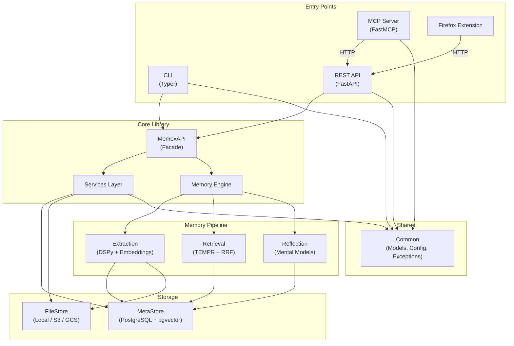
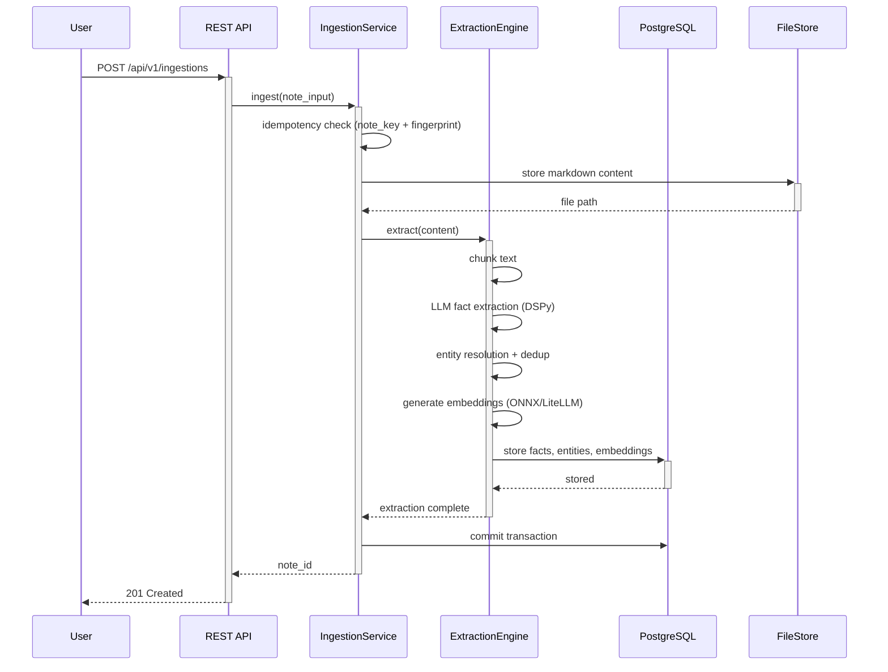
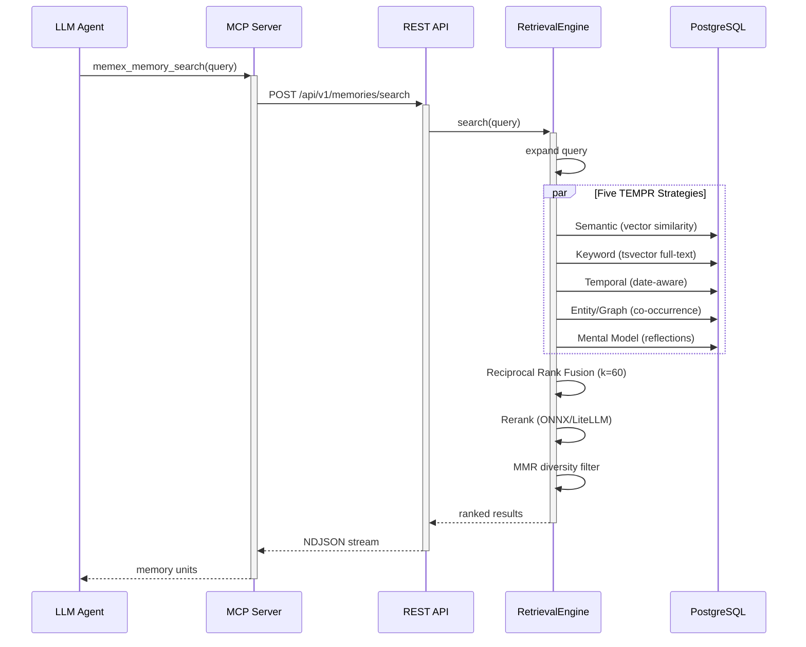
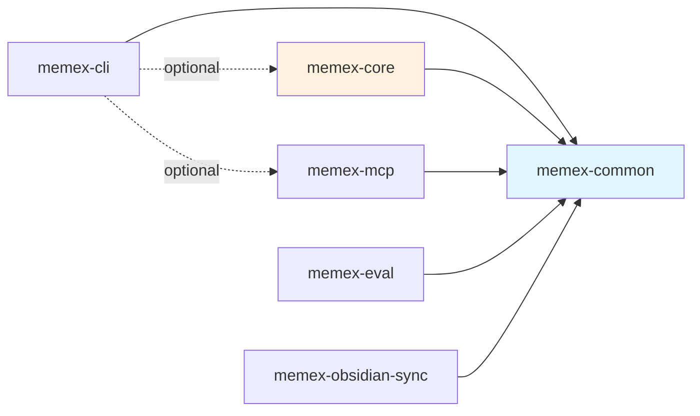

# Architectural Blueprint: Memex

> Generated on 2026-03-29 | Scanned by Claude Code `/blueprint`

## Technology Stack

| Category | Technology |
|----------|-----------|
| Language(s) | Python 3.12+ (core), TypeScript (Firefox extension) |
| Framework(s) | FastAPI (REST), Typer (CLI), FastMCP (MCP server) |
| Package Manager | uv (Python monorepo), npm (Firefox extension) |
| Build System | hatchling + hatch-vcs, esbuild (Firefox extension), justfile (task runner) |
| Database | PostgreSQL 18 + pgvector |
| Testing | pytest, pytest-asyncio, testcontainers, hypothesis, vitest + Playwright (Firefox extension) |
| CI/CD | GitHub Actions (ci, release, docker, firefox-extension-release) |
| Deployment | Docker (granian ASGI server), uv tool install |

## System Overview

Memex is a long-term memory system for LLMs. It ingests content from multiple sources (text, URLs, PDFs, DOCX, PPTX, XLSX), extracts structured facts, entities, and observations using LLM pipelines, stores them with vector embeddings, and retrieves relevant knowledge using a five-strategy fusion approach called TEMPR. Over time, it synthesizes extracted facts into higher-level mental models through a reflection process. The system is designed for AI agents (Claude Code, MCP-compatible clients) and human users via CLI.

The project is organized as a Python monorepo with 8 packages, each with a clear responsibility. The core package follows a layered architecture (FastAPI routes -> Services -> Engines -> Storage), while peripheral packages (CLI, MCP, eval) consume the core via HTTP or direct import. A shared `common` package provides Pydantic models, configuration, and exceptions used across all packages.

The primary architectural style is a **layered monorepo with a pipeline-oriented memory subsystem**. The layered design keeps API concerns separate from domain logic and storage, while the memory pipeline (Extraction -> Retrieval -> Reflection) implements the "Hindsight Framework" as three independent engines coordinated by a central `MemoryEngine`.

## Directory Structure

```
memex/
├── packages/                  # Monorepo packages (8 total)
│   ├── core/                  #   Core library: storage, memory, API, FastAPI server
│   ├── cli/                   #   Typer CLI (memex command)
│   ├── common/                #   Shared Pydantic models, config, exceptions
│   ├── mcp/                   #   FastMCP server (31 LLM tools)
│   ├── eval/                  #   Evaluation framework + LoCoMo benchmark
│   ├── obsidian-sync/         #   Watchdog-based Obsidian vault sync daemon
│   ├── claude-code-plugin/    #   Claude Code plugin (hooks, skills, scripts)
│   └── firefox-extension/     #   Save to Memex browser extension (TypeScript)
├── tests/                     #   Root-level E2E integration tests
├── docs/                      #   Documentation site (zensical/mkdocs, Diataxis)
├── docker/                    #   Dockerfiles for API and MCP servers
├── scripts/                   #   Utility scripts (ONNX models, embeddings)
├── pyproject.toml             #   Root workspace config (uv)
├── justfile                   #   Task runner (setup, test, prek, release, db)
└── docker-compose.yaml        #   PostgreSQL (pgvector) for local dev
```

The monorepo follows a **package-per-concern** organization. Each package is independently versioned (via git tags + hatch-vcs), has its own `pyproject.toml`, and can be installed standalone. The `common` package is the shared foundation with zero internal dependencies.

## Component Map



### Component Details

#### Core Library (`packages/core`)
- **Location**: `packages/core/src/memex_core/`
- **Responsibility**: The heart of the system — contains all domain logic, storage engines, the memory pipeline, and the FastAPI server. Exposes `MemexAPI` as the main programmatic interface.
- **Key files**: `api.py` (facade), `memory/engine.py` (pipeline coordinator), `server/__init__.py` (FastAPI app)
- **Depends on**: common

#### CLI (`packages/cli`)
- **Location**: `packages/cli/src/memex_cli/`
- **Responsibility**: User-facing command-line interface with 11 command groups. Can run standalone (HTTP client mode) or embedded (with core as optional dependency).
- **Key files**: `__init__.py` (app entry), `notes.py`, `memory.py`, `server.py`
- **Depends on**: common; optionally core, mcp

#### MCP Server (`packages/mcp`)
- **Location**: `packages/mcp/src/memex_mcp/`
- **Responsibility**: Thin MCP protocol adapter exposing 31 tools for LLM integration. Communicates with the REST API via HTTP — does not import core directly.
- **Key files**: `server.py` (tool definitions + MCP instance)
- **Depends on**: common

#### Common (`packages/common`)
- **Location**: `packages/common/src/memex_common/`
- **Responsibility**: Shared foundation — Pydantic schemas, hierarchical YAML config, exception hierarchy, HTTP client mixins, template system.
- **Key files**: `schemas.py`, `config.py`, `exceptions.py`, `templates.py`
- **Depends on**: nothing (leaf dependency)

#### Extraction Engine
- **Location**: `packages/core/src/memex_core/memory/extraction/`
- **Responsibility**: Ingests content and extracts structured facts, entities, and observations using DSPy LLM pipelines. Handles chunking, entity resolution, embedding generation, and deduplication.
- **Key files**: `engine.py`, `core.py`, `signatures.py`, `pipeline/`

#### Retrieval Engine
- **Location**: `packages/core/src/memex_core/memory/retrieval/`
- **Responsibility**: Implements TEMPR — five retrieval strategies (Temporal, Entity/Graph, Mental Model, Keyword, Semantic) fused via Reciprocal Rank Fusion with MMR diversity filtering.
- **Key files**: `engine.py`, `strategies.py`, `document_search.py`

#### Reflection Engine
- **Location**: `packages/core/src/memex_core/memory/reflect/`
- **Responsibility**: Synthesizes extracted facts into higher-level mental models through a multi-phase LLM reflection process. Uses a PostgreSQL-backed distributed queue for task management.
- **Key files**: `reflection.py`, `queue_service.py`, `trends.py`

## Data Flow

### Note Ingestion



### Memory Retrieval



Content flows through three phases: **Ingestion** extracts and stores structured knowledge, **Retrieval** fuses multiple search strategies to find relevant memories, and **Reflection** (triggered asynchronously) synthesizes facts into mental models over time.

## API Surface

### REST API (55 endpoints)

Key endpoint groups under `/api/v1`:

| Group | Endpoints | Key Operations |
|-------|-----------|---------------|
| Ingestion | 7 | `POST /ingestions` (inline, URL, file, upload, webhook, batch), `GET /ingestions/{job_id}` |
| Retrieval | 4 | `POST /memories/search`, `POST /memories/summary`, `POST /notes/search`, `GET /notes/find` |
| Notes | 13 | CRUD, metadata, page-index, nodes, status, rename, migrate, assets, lineage |
| Entities | 8 | List, search, co-occurrences, mentions, batch get, delete, mental model delete |
| Reflection | 5 | Trigger, batch, list queue, claim, dead-letter queue admin |
| Vaults | 6 | List, create, get, delete, set read/write permissions |
| KV Store | 5 | Write, get, search, list, delete |
| Health | 5 | `/health`, `/ready`, stats, audit, metrics (Prometheus) |

### CLI (57 commands across 11 groups)

| Group | Commands | Description |
|-------|----------|-------------|
| `note` | 24 | Full note lifecycle + templates + sync |
| `memory` | 6 | Search, view, add, delete, reflect, lineage |
| `entity` | 6 | List, view, delete, mentions, related, mental model |
| `vault` | 3 | Create, list, delete |
| `kv` | 5 | Write, get, search, list, delete |
| `server` | 3 | Start, stop, status |
| `database` | 7 | Migrations (upgrade, downgrade, revision, etc.) |
| `config` | 2 | Show, init |
| `mcp` | 1 | Run MCP server |
| `setup` | 1 | Claude Code integration setup |
| `stats` | 1 | System statistics |

### MCP Tools (31 tools)

All prefixed with `memex_`. 22 read-only, 9 write operations. Cover note management, memory search, entity exploration, KV store, vault management, templates, and lineage.

## Dependencies

### External (key dependencies)

| Dependency | Category | Purpose |
|-----------|----------|---------|
| fastapi + granian | Framework | REST API server (granian is a Rust-based ASGI server) |
| typer + rich | Framework | CLI with terminal formatting |
| fastmcp | Framework | MCP protocol server |
| dspy | AI/ML | Structured LLM pipelines (fact extraction, reflection) |
| litellm (pinned 1.80.16) | AI/ML | Multi-provider LLM gateway |
| onnxruntime | AI/ML | Local embedding + reranking inference |
| asyncpg + pgvector + sqlmodel | Database | PostgreSQL async driver, vector similarity, ORM |
| alembic | Database | Schema migrations |
| fsspec | Storage | Backend-agnostic file storage (local, S3, GCS) |
| pydantic + pydantic-settings | Serialization | Models, validation, layered config |
| trafilatura + cloudscraper | Processing | Web content extraction |
| markitdown + pymupdf4llm | Processing | Multi-format document conversion |
| structlog + prometheus | Observability | Structured logging + metrics |

### Internal Module Dependencies



`memex-common` is the shared foundation with zero internal dependencies. All other packages depend on it. The CLI communicates with the server via HTTP by default; `core` and `mcp` are optional extras for embedded mode. The Firefox extension and Claude Code plugin are standalone (not Python packages).

## Architecture Patterns

- **Primary pattern**: Layered monorepo with pipeline-oriented memory subsystem. FastAPI routes -> Services -> Engines -> Storage, with the Hindsight Framework (Extraction -> Retrieval -> Reflection) as the core domain pipeline.
- **Key abstractions**:
  - `MemexAPI` — God-object facade wiring all services and engines
  - `EmbeddingsModel` / `RerankerModel` — Protocols (structural subtyping) for pluggable ML backends
  - `RetrievalStrategy` — Protocol for pluggable search strategies combined via RRF
  - `AsyncBaseMetaStoreEngine` / `BaseAsyncFileStore` — ABCs for storage backend agnosticism
  - `AsyncTransaction` — Two-phase commit across DB + filesystem
- **Error handling**: Hierarchical custom exceptions (`MemexError` -> `ResourceNotFoundError`, `DuplicateResourceError`, `AmbiguousResourceError`). Centralized HTTP error mapping in server layer. Circuit breaker for LLM call resilience.
- **Testing strategy**: Three tiers — unit tests (mocked deps), integration tests (real PostgreSQL via testcontainers), LLM tests (real API calls). Property-based testing with Hypothesis. `uuid4()` in content to prevent idempotency collisions.

## Key Design Decisions

1. **PostgreSQL as both relational DB and vector store** — pgvector provides vector similarity search without a separate vector database, reducing operational complexity.
2. **Append-only notes** — Notes are immutable; updates create new entries. Enables content-addressed idempotency and auditable history.
3. **fsspec for storage abstraction** — The same code works with local filesystem, S3, and GCS without changes. Backend selected by config.
4. **Protocols over inheritance for ML models** — ONNX and LiteLLM backends have fundamentally different implementations; `@runtime_checkable` Protocols allow duck-typing without forcing a common base class.
5. **Reciprocal Rank Fusion for retrieval** — Combines 5 independent strategies into a single ranked list without requiring score normalization. Each strategy contributes independently.
6. **PostgreSQL advisory locks for leader election** — Only one server instance runs background reflection at a time. No external coordination service needed.
7. **`SELECT ... FOR UPDATE SKIP LOCKED` for reflection queue** — Atomic task claiming without blocking. Enables horizontal scaling of background processing.
8. **Two-phase commit (DB + files)** — Files are staged, then committed only after DB commit succeeds. Ensures atomicity across storage backends.
9. **LiteLLM pinned to specific version** — Stability concerns with newer versions led to pinning and installing from a direct wheel URL.

## Entry Points

| Entry Point | Type | Location | Description |
|------------|------|----------|-------------|
| Memex CLI | CLI (Typer) | `packages/cli/src/memex_cli/__init__.py` | Primary user interface — `memex` command |
| FastAPI Server | HTTP | `packages/core/src/memex_core/server/__init__.py` | REST API server (started via `memex server start`) |
| MCP Server | MCP (stdio/SSE) | `packages/mcp/src/memex_mcp/server.py` | 31-tool MCP server for LLM integration |
| MemexAPI | Library | `packages/core/src/memex_core/api.py` | Programmatic Python API (facade) |
| Eval CLI | CLI (Typer) | `packages/eval/src/memex_eval/cli.py` | Benchmark evaluation — `memex-eval` command |
| Obsidian Sync | CLI (Typer) | `packages/obsidian-sync/src/memex_obsidian_sync/cli.py` | Vault sync daemon — `obsidian-memex-sync` command |
| Firefox Extension | Browser | `packages/firefox-extension/background.js` | Save to Memex browser extension |
