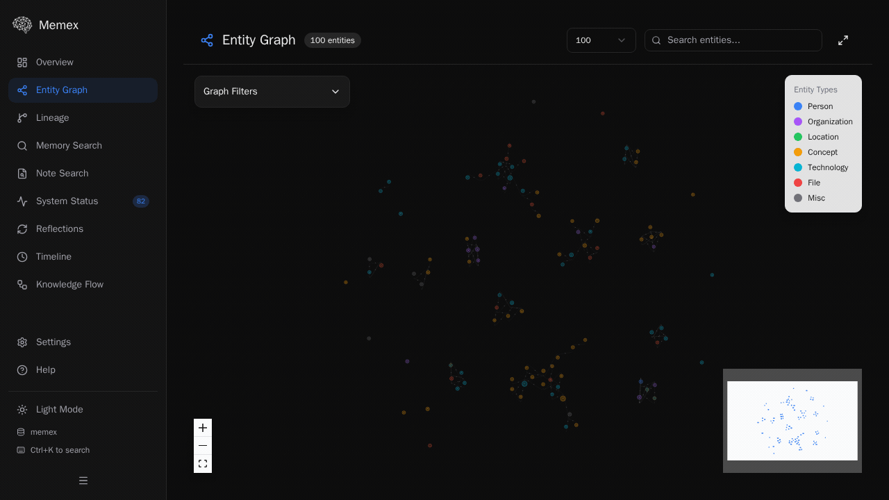
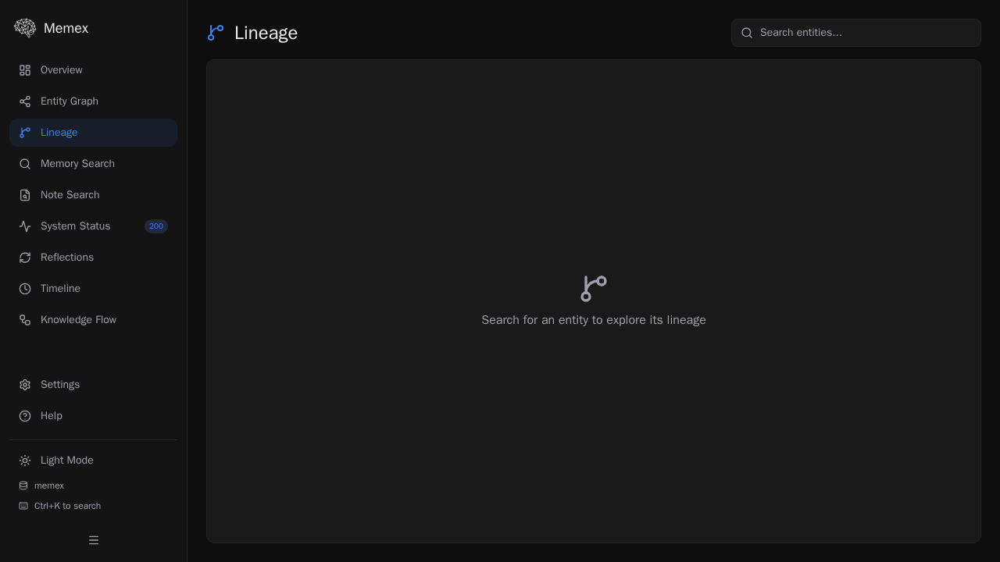
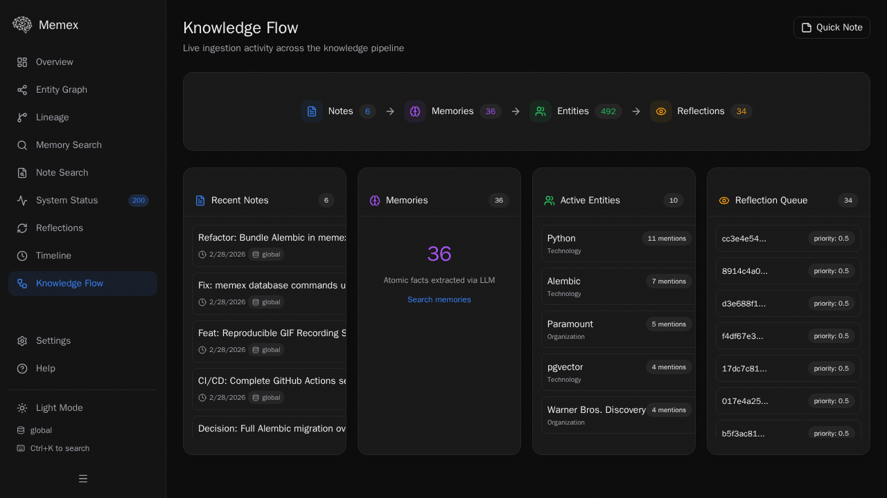
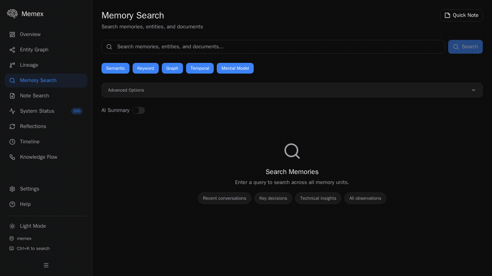

<p align="center">
  
</p>

Memex is a long-term memory system designed to give LLMs persistent, evolving knowledge. It captures unstructured data (notes, docs, chats), extracts structured facts, and synthesizes high-level mental models over time.

## Requirements

1. UV
2. Postgres with pgvector

## 🚀 Quick Start

### 1. Set up postgres

Download e.g. the postgres app, or use docker (see `docker-compose.yaml` in this repository).

### 2. Install and initialize

### 1. Install
Requires Python 3.12+ and `uv`.

```bash
uv tool install --refresh "memex-cli[mcp,server] @ git+https://github.com/JasperHG90/memex.git@latest#subdirectory=packages/cli"
```

It's easiest to just alias the `uv tool` command: `alias memex="uv tool run --from memex-cli memex"`

> The dashboard is a separate React+Vite application. See [Using the Dashboard](./docs/tutorials/using-the-dashboard.md) for setup instructions.

> [!WARNING]
> The dashboard is currently under construction and does not work with the latest version.

### 2. Initialize
Sets up your local storage and configuration.

```bash
memex config init
```

### 3. Start the Server
Memex requires a running API server for all operations.

```bash
# In a separate terminal
memex server start -d
```

### 4. Ingest
Feed it knowledge.

```bash
# Isolate notes with vaults
memex vault create notes --description "Notes about things"

# Inline note
memex note add -v notes "Memex provides long-term memory that evolves."

# Capture a webpage
# Goes to the 'global' vault
memex note add --url "https://docs.python.org/3/tutorial/"

# Point it to local files
# Supports: MD, PDF, docx, xlsx, outlook, pptx
memex note add --file /path/to/file.md --vault notes
```

### 5. Search
Ask questions.

```bash
memex memory search "How does Python handle memory management?"
```

## See it in action

> [!NOTE]
> Features like AI-generated answers, fact extraction, and reflection require an LLM API key. By default, Memex uses Gemini and needs `GEMINI_API_KEY` set in your environment. See [Configure Memex](./docs/how-to/configure-memex.md) for other model providers.

### Claude Code Plugin

Give Claude Code persistent memory across all projects — no per-project setup needed.

```bash
# Add the Memex marketplace
claude plugin marketplace add JasperHG90/memex

# Install the plugin
claude plugin install memex@memex
```

Or from inside Claude Code: `/plugin marketplace add JasperHG90/memex` then `/plugin install memex@memex`.

The plugin provides `/remember` and `/recall` slash commands, session lifecycle hooks, behavioral instructions, and the Memex MCP server. See [packages/claude-code-plugin](./packages/claude-code-plugin/) for details.


### Memory Search
Search across your knowledge base with TEMPR multi-strategy retrieval.


### Memory Search with AI Answer
Get synthesized answers from your memories using `--answer`.


### Note Search with Reasoning
Find relevant documents with LLM-powered relevance reasoning using `--reason`.


### Entity Explorer
Browse and explore entities extracted from your knowledge base.


### System Stats
Monitor your Memex instance at a glance.


### URL Ingestion
Capture web content directly into your knowledge base.


### Dashboard
Explore your knowledge graph through the web UI.


### Entity Graph
Visualize entity relationships and co-occurrences.



### Lineage
Trace the provenance chain from notes to memories, observations, and mental models.



### Knowledge Flow
Monitor live ingestion activity across the knowledge pipeline.



### Memory Search (Dashboard)
Search memories with multi-strategy retrieval and AI summaries.



## Features

### Ingest anything

Feed Memex from any source — plain text, Markdown, PDFs, Word docs, PowerPoint, Excel, Outlook emails, web pages, or entire directories. File conversion is handled automatically via [MarkItDown](https://github.com/microsoft/markitdown) and [PyMuPDF](https://pymupdf.readthedocs.io/). Background and batch ingestion modes let you import large document collections without blocking.

```bash
memex note add "Quick inline note"
memex note add --file ./research-papers/        # directory of PDFs
memex note add --url https://example.com/article
memex note add --file report.md --asset diagram.png --background
```

### Five-strategy retrieval (TEMPR)

Every search runs five independent retrieval strategies in parallel and fuses them with Reciprocal Rank Fusion — no single strategy has to be "right":

| Strategy | What it finds |
|:---------|:--------------|
| **Semantic** | Conceptually similar facts via pgvector cosine distance |
| **Keyword** | Exact term matches via PostgreSQL full-text search |
| **Graph** | Entity-linked facts via NER, phonetic matching, and co-occurrence traversal |
| **Temporal** | Recent facts via exponential time-decay scoring |
| **Mental Model** | High-level synthesized insights from the reflection engine |

Post-fusion, MMR diversity filtering prunes near-duplicates using a hybrid cosine + entity Jaccard kernel. Optional `after`/`before` date bounds and `tags` filters let you scope any search.

### Hierarchical page index

Long documents are split into a structured table of contents with section-level summaries, token estimates, and unique node IDs. Read a 50-page PDF section by section instead of dumping the entire document into context. The page index powers skeleton-tree reasoning (`--reason`) and targeted answer synthesis (`--summarize`).

### Incremental extraction

When you update a note (via `note_key`), Memex diffs the content against the previous version and only re-extracts changed blocks. Unchanged facts, entities, and embeddings are preserved — saving LLM calls and keeping ingestion fast for living documents.

### Contradiction detection

New facts are automatically triaged for corrections and updates. When a newer note contradicts or supersedes an older one, confidence scores are adjusted and supersession links are recorded. Retrieval naturally favors the most current information without manual cleanup.

### Reflection and mental models

A background reflection loop periodically reviews entities with new evidence, synthesizes observations, and builds versioned mental models. Over time, Memex evolves from a collection of raw facts into structured understanding — "The team consistently prioritizes performance over feature velocity" emerges from dozens of individual meeting notes.

### Vaults

Isolate knowledge by project, team, or topic. Each vault is a self-contained scope for notes, memories, entities, and mental models. Attach multiple vaults as read-only for cross-project search, or keep them strictly separate.

### Cloud-native storage

The file store uses [fsspec](https://filesystem-spec.readthedocs.io/) for backend-agnostic storage. Swap between local disk, Amazon S3, and Google Cloud Storage with a config change:

```yaml
server:
  file_store:
    type: s3            # or 'gcs', 'local'
    root: my-bucket/memex
```

### AI agent integration

First-class support for Claude Code, Claude Desktop, Cursor, and any MCP-compatible client. Install the [Claude Code plugin](#claude-code-plugin) for one-step setup across all projects, or use `memex setup claude-code` for per-project configuration. 26 MCP tools cover the full API surface.

### REST API and webhooks

A full FastAPI server with NDJSON streaming, OpenAPI docs, API key auth, rate limiting, and outgoing webhook subscriptions for event-driven integrations (`ingestion.completed`, `reflection.completed`).

### Dashboard

A React + Vite web UI for exploring your knowledge graph — entity relationships, lineage trees, live ingestion activity, and memory search with AI summaries.

## 📚 Documentation

Comprehensive guides and references are available in [`docs/`](./docs/index.md).

### Tutorials
- [Getting Started](./docs/tutorials/getting-started.md): Install, configure, ingest, and search.
- [Using the Dashboard](./docs/tutorials/using-the-dashboard.md): Explore the web UI.
- [AI Agent Memory](./docs/tutorials/ai-agent-memory.md): Build a Python agent with persistent memory.

### How-To Guides
- [Set Up Claude Code](./docs/how-to/setup-claude-code.md): Give Claude Code long-term memory via the plugin or setup command.
- [Configure Memex](./docs/how-to/configure-memex.md): YAML config, environment variables, model providers.
- [Using MCP](./docs/how-to/using-mcp.md): Connect to Claude Desktop, Cursor, and other MCP clients.
- [Organize with Vaults](./docs/how-to/organize-with-vaults.md): Isolate project knowledge.
- [Batch Ingestion](./docs/how-to/batch-ingestion.md): Import existing documents and notes.
- [Doc Search vs Memory Search](./docs/how-to/doc-search-vs-memory-search.md): Choose the right retrieval strategy.
- [Database Migrations](./docs/how-to/database-migrations.md): Manage schema with `memex db`.
- [OpenClaw Integration](./docs/how-to/openclaw-integration.md): Memex memory plugin for OpenClaw agents.
- [Delete and Archival](./docs/how-to/delete-archival.md): Manage data lifecycle.

### Reference
- [CLI Commands](./docs/reference/cli-commands.md)
- [REST API](./docs/reference/rest-api.md)
- [MCP Tools](./docs/reference/mcp-tools.md)
- [Configuration](./docs/reference/configuration.md)
- [Evaluation Report](./docs/reference/evaluation-report.md): LoCoMo benchmark results, retrieval efficiency, and per-question analysis.

### Explanation
- [Hindsight Framework](./docs/explanation/hindsight-framework.md): How Memex "thinks" and remembers.
- [Extraction Pipeline](./docs/explanation/extraction-pipeline.md): Fact extraction and entity resolution.
- [Retrieval Strategies](./docs/explanation/retrieval-strategies.md): TEMPR — five strategies fused via RRF.
- [Reflection and Mental Models](./docs/explanation/reflection-and-mental-models.md): Background synthesis of observations.
- [Dashboard Architecture](./docs/explanation/dashboard-architecture.md): React+Vite design and data flow.
- [OpenClaw Plugin](./docs/explanation/openclaw-plugin.md): Plugin lifecycle and circuit breaker.

> **Found a bug?** Run `memex report-bug` to open a pre-filled GitHub issue.

## Releasing

Memex uses [semver](https://semver.org/) with unified versions across all Python packages. TypeScript packages are bumped alongside.

### How to determine the version bump

Look at the conventional commits since the last tag:

| Commit type | Bump | Example |
|---|---|---|
| `fix:` | **patch** (0.0.x) | `fix(core): handle null embeddings` |
| `feat:` | **minor** (0.x.0) | `feat(dashboard): add entity graph` |
| `feat!:` or `BREAKING CHANGE:` | **major** (x.0.0) | `feat!: change API response format` |

### Release workflow

```bash
# 1. Check what changed since last tag
git log --oneline $(git describe --tags --abbrev=0 2>/dev/null || echo HEAD~10)..HEAD

# 2. Bump all versions, commit, and tag
just release 0.1.0

# 3. Push (triggers the release workflow)
git push && git push --tags
```

The `release.yaml` GitHub Action automatically builds all artifacts (Python, dashboard, OpenClaw) and creates a GitHub Release with auto-generated release notes.

## Evaluation

Memex is benchmarked against [LoCoMo](https://arxiv.org/abs/2402.17753), an academic benchmark for long-term conversational memory. The benchmark tests fact recall, temporal reasoning, multi-hop inference, and adversarial robustness across 19-session dialogues. Memex is evaluated on a subset of 60 QA pairs from the first conversation only (out of 50 conversations in the full dataset).

### LoCoMo results

| Category | Count | Mean Score |
|---|---|---|
| Single-Hop | 10 | 0.900 |
| Multi-Hop | 14 | 1.000 |
| Open Domain | 3 | 1.000 |
| Temporal | 18 | 1.000 |
| **Non-adversarial** | **45** | **0.978** |
| Adversarial (unweighted) | 12 | 0.667 |

Answering model: Claude Opus 4 via Claude Code. Judging model: Gemini 3 Flash. Scores are on a 0-1 graded scale after manual review of judge assessments. 3 image-dependent questions excluded. Adversarial scores reported separately — see [full evaluation report](./docs/reference/evaluation-report.md) for methodology, retrieval efficiency analysis, and per-question details. See [`packages/eval`](./packages/eval/README.md) for the evaluation framework and reproduction instructions.

### Retrieval efficiency

Memex retrieval adds minimal overhead to agent workflows. Across the 60-question benchmark:

| Metric | Value |
|---|---|
| Retrieval tokens per question (median) | **3,440** |
| Retrieval tokens per question (mean) | 5,495 |
| Retrieval as % of total tokens | **4.6%** |
| Median response time | 27.8s |
| Median turns per question | 4 |
| Memex tool calls per question (median) | 2 |
| Cost per question (median) | ~$0.08 |

95% of token usage is agent overhead (system prompt, tool definitions, conversation history). The Memex MCP tools themselves return compact results — a typical question needs just one `memory_search` call (~2.4K tokens) or a two-stage `memory_search` + `note_search` (~3.4K tokens). Complex multi-hop questions that drill into specific note sections via the page index cost ~6K retrieval tokens.

## 🏗️ Architecture

Memex is built as a monorepo:
- **`packages/core`**: The brain. Extraction, Retrieval (TEMPR), Reflection, services, FastAPI server.
- **`packages/cli`**: The interface. Typer CLI commands.
- **`packages/mcp`**: The bridge. FastMCP server for AI agent integration.
- **`packages/common`**: The foundation. Shared models, config, and exceptions.
- **`packages/dashboard`**: The view. React + Vite web UI for exploring your knowledge graph.
- **`packages/claude-code-plugin`**: The plugin. Claude Code plugin for cross-project memory integration.
- **`packages/openclaw`**: The plugin. Memex memory integration for OpenClaw agents.

## Acknowledgements

Memex builds on ideas and code from these projects:

- **[Hindsight](https://github.com/vectorize-io/hindsight)** — the Hindsight retention engine formed the basis for Memex's memory system (extraction, retrieval, and reflection).
- **[PageIndex](https://github.com/VectifyAI/PageIndex)** — inspired the hierarchical page index used for structured note retrieval.

## License

[MIT](LICENSE.txt). See [NOTICES](NOTICES) for third-party attributions.
