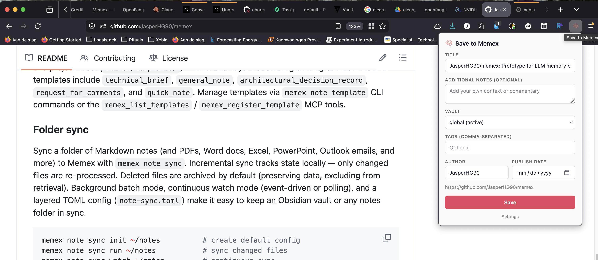
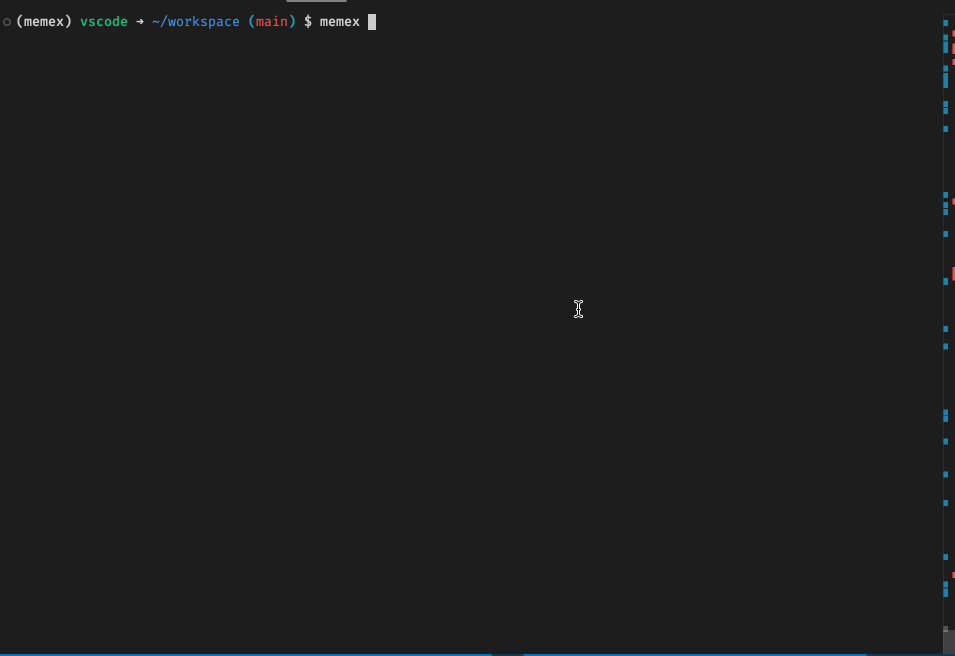

<p align="center">
  
</p>

<h1 align="center">Memex</h1>
<h3 align="center">Long-Term Memory for LLMs</h3>

<p align="center">
  The knowledge layer your AI agents are missing.<br/>
  <strong>Ingest anything. Remember everything. Retrieve what matters.</strong>
</p>

<p align="center">
  <a href="./docs/index.md">Documentation</a> &bull;
  <a href="./docs/tutorials/getting-started.md">Quick Start</a> &bull;
  <a href="#claude-code-plugin">Claude Code Plugin</a> &bull;
  <a href="./FAQ.md">FAQ</a>
</p>

<p align="center">
  
  
  
  
  
</p>

> [!IMPORTANT]
> **Memex is in beta.** It is functional and actively used, but expect rough edges, breaking changes between versions, and incomplete documentation. Feedback and bug reports are welcome — run `memex report-bug` or open an issue.

---

**[Requirements](#requirements)** · **[Features](#features)** · **[Quick Start](#-quick-start)** · **[Claude Code Plugin](#claude-code-plugin)** · **[See it in action](#see-it-in-action)** · **[Documentation](#-documentation)** · **[Releasing](#releasing)** · **[FAQ](./FAQ.md)**

---

## Requirements

1. Python 3.12+ (3.13 tested in CI)
2. [uv](https://docs.astral.sh/uv/) >= 0.10.0
3. PostgreSQL with pgvector

## Features

<table>
<tr>
<td width="33%" valign="top">
<p>📥 <strong>Ingest Anything</strong><br>
<sub>Markdown, PDF, Word, PowerPoint, Excel, Outlook emails, web pages, or entire directories. Conversion via MarkItDown &amp; PyMuPDF. Pluggable note templates, asset management, and batch CLI operations.</sub></p>
</td>
<td width="33%" valign="top">
<p>🧠 <strong>Five-Strategy Retrieval (TEMPR)</strong><br>
<sub>Semantic, Keyword, Graph, Temporal, and Mental Model — five strategies run in parallel, fused via Reciprocal Rank Fusion. MMR diversity filtering prunes near-duplicates.</sub></p>
</td>
<td width="33%" valign="top">
<p>🌳 <strong>Hierarchical Page Index</strong><br>
<sub>Documents are split into a structured TOC with section summaries, token estimates, and node IDs. Read a 50-page PDF section by section instead of dumping everything into context.</sub></p>
</td>
</tr>
<tr>
<td valign="top">
<p>🔄 <strong>Incremental Extraction</strong><br>
<sub>Update a note and Memex diffs the content, only re-extracting changed blocks. Unchanged facts, entities, and embeddings are preserved — fast for living documents.</sub></p>
</td>
<td valign="top">
<p>⚔️ <strong>Contradiction Detection</strong><br>
<sub>New facts are triaged for corrections. When a newer note contradicts an older one, confidence is adjusted and supersession links are recorded. Retrieval favors current information.</sub></p>
</td>
<td valign="top">
<p>🪞 <strong>Reflection &amp; Mental Models</strong><br>
<sub>Background reflection synthesizes observations and builds versioned mental models. Memex evolves from raw facts into structured understanding over time.</sub></p>
</td>
</tr>
<tr>
<td valign="top">
<p>🏦 <strong>Vaults</strong><br>
<sub>Isolate knowledge by project, team, or topic. Policy-based ACL (reader/writer/admin) with vault-scoped API keys. Cross-vault read access for shared knowledge. Auto-generated vault summaries with 3-tier regeneration.</sub></p>
</td>
<td valign="top">
<p>☁️ <strong>Cloud-Native Storage &amp; Assets</strong><br>
<sub>Notes and file assets (images, PDFs, audio) stored via fsspec — swap between local disk, S3, and GCS with a config change. PostgreSQL + pgvector for metadata and vector search.</sub></p>
</td>
<td valign="top">
<p>🤖 <strong>AI Agent Integration</strong><br>
<sub>First-class MCP support for Claude Code, Claude Desktop, and Cursor. 35 MCP tools with progressive disclosure, staleness flags on search results, note relation links, survey-based query decomposition, stdio/HTTP/SSE transports, slim Docker image decoupled from core.</sub></p>
</td>
</tr>
<tr>
<td valign="top">
<p>🌐 <strong>REST API &amp; Webhooks</strong><br>
<sub>FastAPI server with NDJSON streaming, OpenAPI docs, policy-based auth, vault-scoped API keys, rate limiting, and CORS extension support.</sub></p>
</td>
<td valign="top">
<p>🧬 <strong>Lineage &amp; Provenance</strong><br>
<sub>Trace any mental model back through observations to the original source document. Full bidirectional provenance traversal with depth control.</sub></p>
</td>
<td valign="top">
<p>🦊 <strong>Firefox Extension</strong><br>
<sub>One-click save of articles, PDFs &amp; web pages. Readability extraction, Markdown conversion, inline image capture. AES-GCM encrypted API key storage.</sub></p>
</td>
</tr>
<tr>
<td valign="top">
<p>📂 <strong>Folder Sync</strong><br>
<sub>Sync Obsidian vaults or any local folder to Memex. Multi-format support, asset upload, frontmatter skip markers, SQLite state tracking, watchdog/polling watch modes, archive-on-delete.</sub></p>
</td>
<td valign="top">
<p>🐦‍🔥 <strong>Pluggable Inference Backends</strong><br>
<sub>Swap built-in ONNX embedding &amp; reranking models for any LiteLLM provider — OpenAI, Gemini, Cohere, Ollama. Inverse-sigmoid logit transform preserves retrieval scoring.</sub></p>
</td>
<td valign="top">
<p>🔭 <strong>OpenTelemetry Observability</strong><br>
<sub>Distributed tracing with Arize Phoenix — session IDs on spans, operation names on DSPy LLM calls, background reflection jobs tracked across tracing sessions.</sub></p>
</td>
</tr>
<tr>
<td valign="top">
<p>🔑 <strong>KV Store</strong><br>
<sub>Namespaced key-value store for structured facts, preferences, and conventions. Semantic search via embeddings, exact key lookup, namespace filtering (global, user, project, app).</sub></p>
</td>
<td valign="top">
<p>🧩 <strong>Claude Code Plugin</strong><br>
<sub>One-step persistent memory across all projects. Token-budgeted session briefing, /remember, /recall, and /retro skills, data-driven session hooks, progressive session notes, and Memex MCP server — bundled as a Claude Code plugin.</sub></p>
</td>
<td valign="top">
<p>📋 <strong>Audit Logging</strong><br>
<sub>Append-only audit trail tracking actions, actors, resource IDs, and session IDs. Non-blocking background dispatch backed by the metastore.</sub></p>
</td>
</tr>
</table>

<details>
<summary><strong>Feature details</strong></summary>

### Ingest anything

Feed Memex from any source — plain text, Markdown, PDFs, Word docs, PowerPoint, Excel, Outlook emails, web pages, or entire directories. File conversion is handled automatically via [MarkItDown](https://github.com/microsoft/markitdown) and [PyMuPDF](https://pymupdf.readthedocs.io/). Background and batch ingestion modes let you import large document collections without blocking. Pluggable note templates (built-in, global, and project-local `.toml` files) provide consistent structure for different note types.

```bash
memex note add "Quick inline note"
memex note add --file ./research-papers/        # directory of PDFs
memex note add --url https://example.com/article
memex note add --file report.md --asset diagram.png --background
```

#### Firefox extension

A [Firefox extension](./packages/firefox-extension/) for one-click capture of articles, PDFs, and web pages directly into your Memex vaults. Content is extracted client-side via Mozilla Readability and converted to Markdown — bypassing bot detection and paywalled content that server-side scraping can't reach. API keys are encrypted at rest with AES-GCM.



### Five-strategy retrieval (TEMPR)

Every search runs five independent retrieval strategies in parallel and fuses them with Reciprocal Rank Fusion — no single strategy has to be "right":

| Strategy | What it finds |
|:---------|:--------------|
| **Semantic** | Conceptually similar facts via pgvector cosine distance |
| **Keyword** | Exact term matches via PostgreSQL full-text search |
| **Graph** | Entity-linked facts via NER, phonetic matching, and co-occurrence traversal |
| **Temporal** | Recent facts via exponential time-decay scoring |
| **Mental Model** | High-level synthesized insights from the reflection engine |

Post-fusion, MMR diversity filtering prunes near-duplicates using a hybrid cosine + entity Jaccard kernel. Optional `after`/`before` date bounds and `tags` filters let you scope any search.

### Hierarchical page index

Long documents are split into a structured table of contents with section-level summaries, token estimates, and unique node IDs. Read a 50-page PDF section by section instead of dumping the entire document into context. The page index powers skeleton-tree reasoning (`--reason`) and targeted answer synthesis (`--summarize`).

### Incremental extraction

When you update a note (via `note_key`), Memex diffs the content against the previous version and only re-extracts changed blocks. Unchanged facts, entities, and embeddings are preserved — saving LLM calls and keeping ingestion fast for living documents.

### Contradiction detection and note relations

New facts are automatically triaged for corrections and updates. When a newer note contradicts or supersedes an older one, confidence scores are adjusted and supersession links are recorded. Retrieval naturally favors the most current information without manual cleanup. Search results include inline `related_notes` (notes sharing entities) and typed `links` (contradicts, reinforces, temporal, causes) for relationship discovery without additional queries.

### Reflection and mental models

A background reflection loop periodically reviews entities with new evidence, synthesizes observations, and builds versioned mental models. Over time, Memex evolves from a collection of raw facts into structured understanding — "The team consistently prioritizes performance over feature velocity" emerges from dozens of individual meeting notes.

### Vaults

Isolate knowledge by project, team, or topic. Each vault is a self-contained scope for notes, memories, entities, and mental models. Policy-based access control (reader/writer/admin) with vault-scoped API keys lets you grant fine-grained permissions. Use `read_vault_ids` for cross-vault read access without write permissions.

Each vault includes an auto-generated natural language summary describing topics, themes, and statistics. Summaries regenerate automatically via a 3-tier strategy (on ingestion after cooldown, periodic background refresh, and on-demand via CLI or API). Use `memex vault summary` to view or regenerate a vault's summary.

### Cloud-native storage and assets

The file store uses [fsspec](https://filesystem-spec.readthedocs.io/) for backend-agnostic storage. Swap between local disk, Amazon S3, and Google Cloud Storage with a config change. File assets (images, PDFs, audio) are stored alongside notes and served through MCP as native content types (Image, Audio, File). The CLI and MCP tools support listing, retrieving, adding, and deleting assets per note.

```yaml
server:
  file_store:
    type: s3            # or 'gcs', 'local'
    root: my-bucket/memex
```

### AI agent integration

First-class support for Claude Code, Claude Desktop, Cursor, and any MCP-compatible client. Install the [Claude Code plugin](#claude-code-plugin) for one-step setup across all projects, or use `memex setup claude-code` for per-project configuration. 35 MCP tools with progressive disclosure (3-stage tool discovery by default) cover the full API surface. Search results include staleness flags (fresh/aging/stale/contested) and inline note relation links for relationship discovery. A slim Docker image (`docker/mcp/Dockerfile`) enables containerized MCP deployment with HTTP transport.

### REST API and webhooks

A full FastAPI server with NDJSON streaming, OpenAPI docs, policy-based auth (reader/writer/admin) with vault-scoped API keys, rate limiting, and outgoing webhook subscriptions for event-driven integrations (`ingestion.completed`, `reflection.completed`).

### Lineage and provenance

Trace any mental model back through observations to the original source document. Full bidirectional provenance traversal (`upstream`, `downstream`, `both`) with configurable depth and child limits.

### Folder sync

Sync a folder of Markdown notes (and PDFs, Word docs, Excel, PowerPoint, Outlook emails, and more) to Memex with `memex note sync`. Incremental sync tracks state locally — only changed files are re-processed. Deleted files are archived by default (preserving data, excluding from retrieval). Background batch mode, continuous watch mode (event-driven or polling), and a layered TOML config (`note-sync.toml`) make it easy to keep an Obsidian vault or any notes folder in sync.

```bash
memex note sync init ~/notes          # create default config
memex note sync run ~/notes           # sync changed files
memex note sync watch ~/notes         # continuous sync
```

### Pluggable inference backends

Swap the built-in ONNX embedding and reranking models for any LiteLLM-supported provider (OpenAI, Gemini, Cohere, Ollama, etc.) via config. An inverse-sigmoid logit transform on LiteLLM reranker scores preserves the retrieval engine's scoring semantics.

### OpenTelemetry observability

Distributed tracing via Arize Phoenix. Session IDs propagate across spans, DSPy LLM calls get operation names, and background reflection jobs are tracked across tracing sessions.

### KV store

A lightweight namespaced key-value store for structured facts, preferences, and conventions. Keys use namespace prefixes (`global:`, `user:`, `project:<id>:`, `app:<id>:`) for scoping. Each entry gets an embedding for semantic search, enabling fuzzy lookup alongside exact key access. Ideal for storing agent preferences, project conventions, and user facts that persist across sessions.

### Claude Code plugin

Give Claude Code persistent memory across all projects with a single plugin install. The plugin bundles the Memex MCP server, `/remember`, `/recall`, and `/retro` slash commands, and session lifecycle hooks with intelligent context injection. A token-budgeted session briefing (`memex session`) replaces raw data dumps with a curated knowledge index — KV facts, vault summary, top entities with trend indicators, and available vaults — all within a configurable 1000 or 2000 token budget. Data-driven pre-compact nudges reference actual session stats (write counts, edit spirals, commits), and a progressive session note persists context across compaction boundaries via `note_key`. No per-project configuration needed.

### Audit logging

An append-only audit trail backed by the metastore. Every significant action (ingestion, deletion, status change, reflection) is logged with the actor, resource ID, action type, and session ID. Dispatch is non-blocking — audit writes happen in the background without impacting request latency.

</details>

## 🚀 Quick Start

> [!NOTE]
> Features like AI-generated answers, fact extraction, and reflection require an LLM API key. By default, Memex uses Gemini and needs `GEMINI_API_KEY` set in your environment. See [Configure Memex](./docs/how-to/configure-memex.md) for other model providers.

### 1. Set up postgres

Download e.g. the [Postgres app](https://postgresapp.com/), or use docker for just the database: `docker compose up -d postgres` (see `docker-compose.yaml` in this repository).

### 2. Install
Requires Python 3.12+ and [uv](https://docs.astral.sh/uv/) (>= 0.10.0).

```bash
uv tool install --refresh "memex-cli[server] @ git+https://github.com/JasperHG90/memex.git@latest#subdirectory=packages/cli"
```

It's easiest to just alias the `uv tool` command: `alias memex="uv tool run --from memex-cli memex"`

### 3. Initialize
Sets up your local storage and configuration.

```bash
memex config init
```

### 4. Start the Server
Memex requires a running API server for all operations.

```bash
# In a separate terminal
memex server start -d
```

### 5. Ingest
Feed it knowledge.

```bash
# Isolate notes with vaults
memex vault create notes --description "Notes about things"

# Inline note
memex note add -v notes "Memex provides long-term memory that evolves."

# Capture a webpage
# Goes to the 'global' vault
memex note add --url "https://docs.python.org/3/tutorial/"

# Point it to local files
# Supports: MD, PDF, docx, xlsx, outlook, pptx
memex note add --file /path/to/file.md --vault notes
```

### 6. Search
Ask questions.

```bash
memex memory search "How does Python handle memory management?"
```

## See it in action

### Claude Code Plugin

Give Claude Code persistent memory across all projects — no per-project setup needed.

```bash
# Add the Memex marketplace
claude plugin marketplace add JasperHG90/memex

# Install the plugin
claude plugin install memex@memex
```

Or from inside Claude Code: `/plugin marketplace add JasperHG90/memex` then `/plugin install memex@memex`.

The plugin provides `/remember`, `/recall`, and `/retro` slash commands, token-budgeted session briefing, data-driven lifecycle hooks, and the Memex MCP server. See [packages/claude-code-plugin](./packages/claude-code-plugin/) for details.

#### Updating the claude code plugin

To update the claude code plugin, first execute `claude plugin marketplace update`, then `claude plugin update memex@memex` to update the claude code plugin.

#### Overriding defaults

- By default, the claude code plugin uses the MCP server from tag `latest`. To override this, you can specify a project-level memex MCP server in your project's `.mcp.json`.
- To override individual memex settings (e.g. MEMEX_BASE_URL), add these to './claude/settings.json', e.g.

```json
{
  "env": {
    "MEMEX_SERVER_URL": "http://host.docker.internal:8000"
  }
}
```


### Memory Search
Search across your knowledge base with TEMPR multi-strategy retrieval.


### Memory Search with AI Answer
Get synthesized answers from your memories using `--answer`.


### Note Search with Reasoning
Find relevant documents with LLM-powered relevance reasoning using `--reason`.



### Entity Explorer
Browse and explore entities extracted from your knowledge base.


### System Stats
Monitor your Memex instance at a glance.


### URL Ingestion
Capture web content directly into your knowledge base.


## 📚 Documentation

Comprehensive guides and references are available in [`docs/`](./docs/index.md).

### Tutorials
- [Getting Started](./docs/tutorials/getting-started.md): Install, configure, ingest, and search.
- [AI Agent Memory](./docs/tutorials/ai-agent-memory.md): Build a Python agent with persistent memory.

### How-To Guides
- [Set Up Claude Code](./docs/how-to/setup-claude-code.md): Give Claude Code long-term memory via the plugin or setup command.
- [Configure Memex](./docs/how-to/configure-memex.md): YAML config, environment variables, model providers.
- [Using MCP](./docs/how-to/using-mcp.md): Connect to Claude Desktop, Cursor, and other MCP clients.
- [Organize with Vaults](./docs/how-to/organize-with-vaults.md): Isolate project knowledge.
- [Batch Ingestion](./docs/how-to/batch-ingestion.md): Import existing documents and notes.
- [Doc Search vs Memory Search](./docs/how-to/doc-search-vs-memory-search.md): Choose the right retrieval strategy.
- [Database Migrations](./docs/how-to/database-migrations.md): Manage schema with `memex db`.
- [Delete and Archival](./docs/how-to/delete-archival.md): Manage data lifecycle.
- [Note Templates](./docs/how-to/note-templates.md): Create and use note templates.
- [Sync Notes](./docs/how-to/sync-notes.md): Sync a folder of notes to Memex.
- [Firefox Extension](./docs/how-to/firefox-extension.md): Capture web content from Firefox.

### Reference
- [CLI Commands](./docs/reference/cli-commands.md)
- [REST API](./docs/reference/rest-api.md)
- [MCP Tools](./docs/reference/mcp-tools.md)
- [MemexAPI](./docs/reference/memexapi-reference.md): Python API class — 60+ public methods.
- [Configuration](./docs/reference/configuration.md)
- [Evaluation Report](./docs/reference/evaluation-report.md): LoCoMo benchmark results, retrieval efficiency, and per-question analysis.

### Explanation
- [Architecture Overview](./docs/explanation/architecture-overview.md): System layers, package dependency graph, and database schema.
- [Hindsight Framework](./docs/explanation/hindsight-framework.md): How Memex "thinks" and remembers.
- [Extraction Pipeline](./docs/explanation/extraction-pipeline.md): Fact extraction and entity resolution.
- [Retrieval Strategies](./docs/explanation/retrieval-strategies.md): TEMPR — five strategies fused via RRF.
- [Reflection and Mental Models](./docs/explanation/reflection-and-mental-models.md): Background synthesis of observations.
- [Inference Model Backends](./docs/explanation/inference-model-backends.md): Embedding and reranking model architecture: built-in ONNX models and LiteLLM provider support.
> **Found a bug?** Run `memex report-bug` to open a pre-filled GitHub issue.

## Releasing

Memex uses [semver](https://semver.org/) with unified versions across all Python packages. TypeScript packages are bumped alongside.

### How to determine the version bump

Look at the conventional commits since the last tag:

| Commit type | Bump | Example |
|---|---|---|
| `fix:` | **patch** (0.0.x) | `fix(core): handle null embeddings` |
| `feat:` | **minor** (0.x.0) | `feat(core): add entity graph` |
| `feat!:` or `BREAKING CHANGE:` | **major** (x.0.0) | `feat!: change API response format` |

### Release workflow

```bash
# 1. Check what changed since last tag
git log --oneline $(git describe --tags --abbrev=0 2>/dev/null || echo HEAD~10)..HEAD

# 2. Bump all versions, commit, and tag
just release 0.1.0

# 3. Push (triggers the release workflow)
git push && git push --tags
```

The `release.yaml` GitHub Action automatically builds all artifacts and creates a GitHub Release with auto-generated release notes.

## Evaluation

Memex is benchmarked against [LoCoMo](https://arxiv.org/abs/2402.17753), an academic benchmark for long-term conversational memory. The benchmark tests fact recall, temporal reasoning, multi-hop inference, and adversarial robustness across 19-session dialogues. Memex is evaluated on a subset of 47 QA pairs from the first conversation only (out of 50 conversations in the full dataset).

### LoCoMo results

| Category | Count | Mean Score |
|---|---|---|
| Single-Hop | 9 | 0.944 |
| Multi-Hop | 9 | 1.000 |
| Open Domain | 3 | 1.000 |
| Temporal | 15 | 1.000 |
| **Non-adversarial** | **36** | **0.986** |
| Adversarial (unweighted) | 11 | 0.773 |

Answering model: Claude Opus 4 via Claude Code. Judging model: Gemini 3 Flash. Scores are on a 0-1 graded scale after manual review of judge assessments. 3 image-dependent questions excluded. Adversarial scores reported separately — see [full evaluation report](./docs/reference/evaluation-report.md) for methodology, retrieval efficiency analysis, and per-question details. See [`packages/eval`](./packages/eval/README.md) for the evaluation framework and reproduction instructions.

### Retrieval efficiency

Memex retrieval adds minimal overhead to agent workflows. Across the 47-question benchmark:

| Metric | Value |
|---|---|
| Retrieval tokens per question (median) | **4,609** |
| Retrieval tokens per question (mean) | 7,592 |
| Retrieval as % of total tokens | **4.5%** |

95% of token usage is agent overhead (system prompt, tool definitions, conversation history). The Memex MCP tools themselves return compact results — a typical question needs just one `memory_search` call (~2.4K tokens) or a two-stage `memory_search` + `note_search` (~3.4K tokens). Complex multi-hop questions that drill into specific note sections via the page index cost ~6K retrieval tokens.

## 🏗️ Architecture

Memex is built as a monorepo:
- **`packages/core`**: The brain. Extraction, Retrieval (TEMPR), Reflection, services, FastAPI server.
- **`packages/cli`**: The interface. Typer CLI commands, including `memex note sync` for folder-based note synchronization.
- **`packages/mcp`**: The bridge. FastMCP server for AI agent integration.
- **`packages/common`**: The foundation. Shared models, config, and exceptions.
- **`packages/eval`**: The benchmark. LoCoMo evaluation framework and retrieval analysis.
- **`packages/claude-code-plugin`**: The plugin. Claude Code plugin for cross-project memory integration.
- **`packages/firefox-extension`**: The capture. Firefox extension for web content ingestion.

## Acknowledgements

Memex builds on ideas and code from these projects:

- **[Hindsight](https://github.com/vectorize-io/hindsight)** — the Hindsight retention engine formed the basis for Memex's memory system (extraction, retrieval, and reflection).
- **[PageIndex](https://github.com/VectifyAI/PageIndex)** — inspired the hierarchical page index used for structured note retrieval.

## License

[Apache 2.0](LICENSE.txt). See [NOTICES](NOTICES) for third-party attributions.
