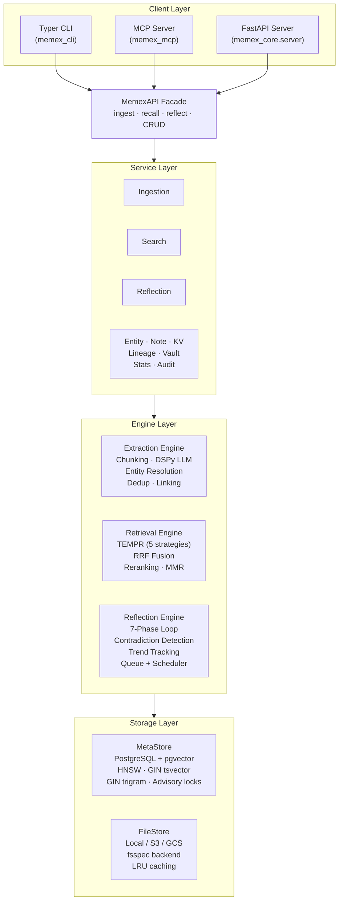
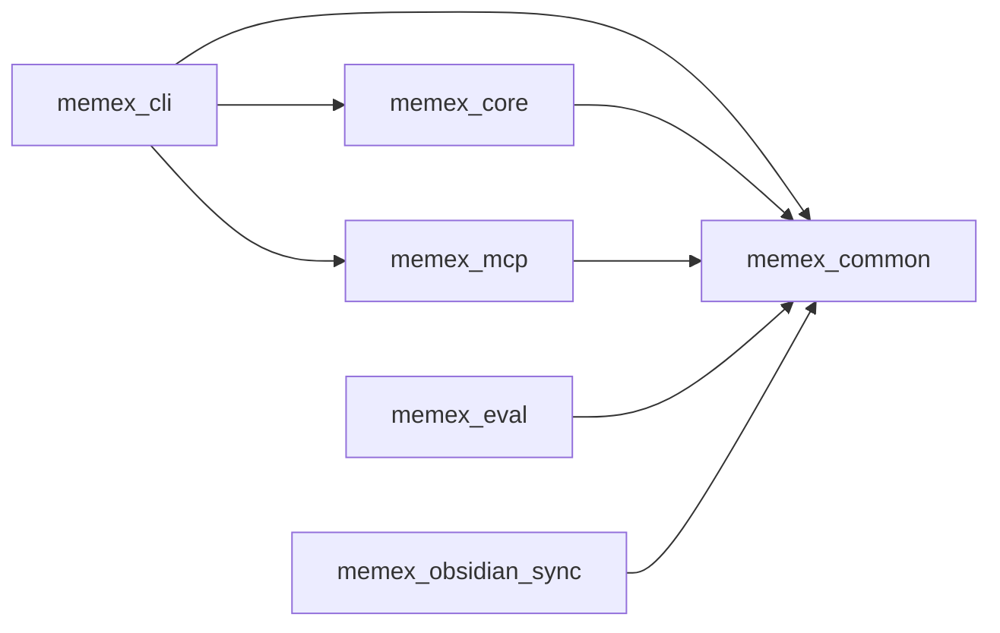
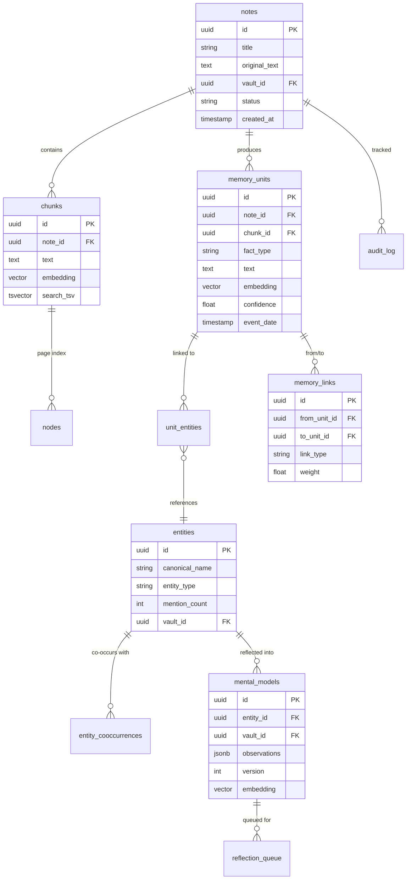

# Architecture Overview

This document describes Memex's system architecture, package structure, and database schema. For detailed explanations of each subsystem, see the linked pages.

## System Architecture

Memex uses a four-layer design: client interfaces delegate to a facade API, which routes through domain services and memory engines, all backed by a unified storage layer.

## Package Dependency Graph

Memex is a Python monorepo with 8 packages managed by `uv`.

| Package | Import | Purpose |
|---------|--------|---------|
| `packages/core` | `memex_core` | Storage, memory engine (extraction/retrieval/reflection), services, MemexAPI facade, FastAPI server |
| `packages/cli` | `memex_cli` | Typer CLI (`memex` command) — 12 command groups |
| `packages/mcp` | `memex_mcp` | FastMCP server — 31+ tools for LLM integration |
| `packages/common` | `memex_common` | Shared Pydantic models, hierarchical YAML config, HTTP client, exceptions |
| `packages/eval` | `memex_eval` | Evaluation: synthetic benchmarks + LoCoMo benchmark with LLM-as-judge |
| `packages/obsidian-sync` | `memex_obsidian_sync` | Watchdog-based Obsidian vault synchronization |
| `packages/firefox-extension` | — | TypeScript WebExtension for saving pages to Memex |
| `packages/claude-code-plugin` | — | Claude Code plugin: `/remember` and `/recall` skills, session hooks |

## Database Schema

The core data model centers on notes, memory units, entities, and mental models, connected through link and junction tables.

### Index Strategy

| Type | Target | Purpose |
|------|--------|---------|
| HNSW (pgvector) | `chunks.embedding`, `memory_units.embedding`, `mental_models.embedding` | Cosine distance for semantic search |
| GIN (tsvector) | `chunks.search_tsv`, `memory_units.search_text` | Full-text keyword search |
| GIN (trigram) | `notes.title`, `entities.canonical_name` | Fuzzy matching |
| B-tree | Foreign keys, status columns, dates | Standard lookups and joins |

### Key Link Types

Memory links (`memory_links.link_type`) encode relationships between memory units:

| Link Type | Description |
|-----------|-------------|
| `causal` | X caused Y (LLM-extracted) |
| `temporal` | Sequential time ordering |
| `semantic` | Embedding similarity > threshold |
| `reinforces` | X supports/strengthens Y |
| `contradicts` | X conflicts with Y |
| `weakens` | X undermines Y |
| `enables` | X makes Y possible |
| `prevents` | X blocks Y |

## See Also

* [About the Hindsight Framework](hindsight-framework.md) — the three processing loops
* [About the Extraction Pipeline](extraction-pipeline.md) — how documents become structured memory
* [About Retrieval Strategies](retrieval-strategies.md) — TEMPR multi-strategy retrieval
* [About Reflection and Mental Models](reflection-and-mental-models.md) — background synthesis
