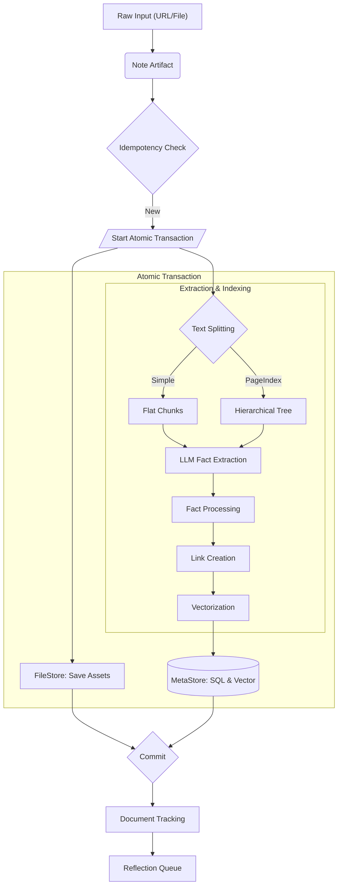

# About the Extraction Pipeline

The extraction pipeline is the "Retention" path of the Hindsight Framework. It converts raw, unstructured text (Markdown, PDFs, web pages) into structured memory units that can be searched, linked, and reflected upon.

## Context

LLMs work best with structured, atomic pieces of information rather than long documents. The extraction pipeline bridges this gap — it takes a document and produces facts, entities, relationships, and embeddings that power Memex's retrieval and reflection systems.

## Pipeline Overview

The pipeline is a linear sequence of stages, all within a single atomic transaction. If any stage fails, the entire transaction rolls back, ensuring no partial data enters the system.

## Text Splitting Strategies

The first decision in the pipeline is how to break a document into processable chunks. Memex supports two strategies, selected in configuration.

### Simple Splitting

A traditional flat chunking approach that splits text into fixed-size windows with overlap.

- Splits text into chunks of `chunk_size_tokens` (default: 1000) with `chunk_overlap_tokens` overlap (default: 50)
- Ignores document structure (headers, sections)
- Fast and predictable

Simple splitting works well for short, unstructured notes or when latency is the primary concern. The downside is that it can split a paragraph across two chunks, losing context.

### PageIndex (Hierarchical)

A semantic indexing algorithm that preserves document structure by building a tree of sections.

**Algorithm:**

1. **Short document bypass**: Documents below `short_doc_threshold_tokens` (default: 500) with no Markdown headers are treated as a single root node — no tree building needed.

2. **Initial scan**: Memex detects the document's structure:
   - *Fast path*: If the document uses Markdown headers (`#`, `##`, etc.), regex extraction builds the tree immediately.
   - *LLM path*: For documents without clear headers, an LLM scans the text in chunks of `scan_chunk_size_tokens` (default: 6000) and infers a logical table of contents.

3. **Recursive refinement**: Sections exceeding `max_node_length_tokens` (default: 1250) are recursively subdivided using the LLM until they fit within `block_token_target` (default: 2000).

4. **Summarization**: Each node receives a summary, providing hierarchical context that is passed to child nodes during fact extraction. Nodes below `min_node_tokens` are skipped to filter noise.

The reason PageIndex exists is to preserve semantic scope. When a fact is extracted from "Section 3.2: Database Migration", Memex knows the context is database migration, not the entire document. This enables features like skeleton-tree search (`--reason` flag) and section-level retrieval via `memex_get_page_index` and `memex_get_node`.

### Incremental Updates (Diffing)

When a document is re-ingested, Memex does not re-process the entire document. The `diffing` module computes a hash-based diff between old and new content:

- **Simple diff**: Classifies blocks as `retained` (hash unchanged), `added` (new hash), or `removed` (hash gone).
- **PageIndex diff**: Adds finer classification — `boundary-shift` (nodes unchanged but block boundaries moved) vs. `content-changed` (actual content modifications). Boundary-shift blocks reuse existing extractions, avoiding unnecessary LLM calls.

This reduces cost and latency significantly for large documents that receive frequent updates.

## Pipeline Modules

After text splitting, the extracted facts pass through a series of processing stages, each implemented as a separate module in `packages/core/src/memex_core/memory/extraction/pipeline/`:

### Fact Processing (`fact_processing.py`)

Handles two tasks:

- **Temporal offset assignment**: Facts within the same chunk receive slight time offsets (default: 10 seconds per fact) to preserve ordering. This ensures that "event A happened before event B" is reflected in the timestamps even when both come from the same chunk.
- **Embedding generation**: Each fact's text is formatted with date context and embedded using the vector model.

### Link Creation (`linking.py`)

Creates four types of relationships between memory units:

1. **Causal links**: Derived from LLM-extracted causal relations ("X caused Y").
2. **Temporal links**: Intra-document ordering by event date.
3. **Semantic links**: Based on embedding cosine similarity between facts.
4. **Cross-document temporal links**: Connect new facts to the existing timeline in the database, enabling temporal retrieval across documents.

### Document Tracking (`tracking.py`)

Updates the document tracking record in the MetaStore, recording metadata, tags, and assets. This is the authoritative record of what has been ingested and enables the idempotency check for future ingestions.

### Reflection Queue Enqueue (`tracking.py`)

After extraction, all entities that were "touched" (newly created or linked to new facts) are enqueued in the reflection queue. This triggers the reflection engine to review those entities in its next cycle.

## Extraction Output

For a single ingested note, the pipeline produces:

| Output | Description |
| :--- | :--- |
| **Note record** | Metadata, content hash, vault assignment |
| **Chunks** | Text blocks with position and hash information |
| **PageIndex nodes** | Hierarchical tree of sections (PageIndex only) |
| **Memory units** | Atomic facts (type: fact, experience, opinion) with timestamps |
| **Entities** | Named entities with canonical names, aliases, phonetic codes |
| **Entity links** | Connections between memory units and entities |
| **Memory links** | Causal, temporal, and semantic relationships between units |
| **Embeddings** | Vector representations for semantic search |
| **Reflection queue entries** | Entities flagged for reflection processing |

## Idempotency

The pipeline computes a content fingerprint (hash of content + metadata) before processing. If the fingerprint matches an existing note, ingestion is skipped entirely. This makes it safe to re-ingest the same directory multiple times — only new or changed content is processed.

## See Also

* [About the Hindsight Framework](hindsight-framework.md) — the overall architecture
* [About Retrieval Strategies](retrieval-strategies.md) — how extracted data is searched
* [How to Ingest Documents in Batch](../how-to/batch-ingestion.md) — practical ingestion instructions
