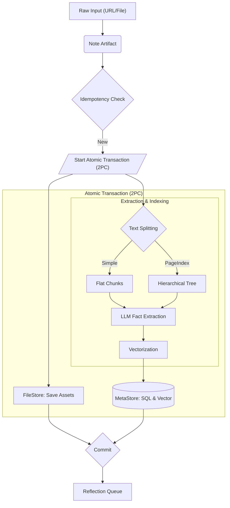

# Extraction Pipeline

The extraction pipeline converts raw unstructured text into structured memory units.

## Text Splitting Strategies

Memex supports two primary strategies for breaking down documents:

### 1. Simple Splitting (`simple`)
A traditional flat chunking approach.
- **Method**: Splits text into fixed-size chunks (e.g., 1000 tokens) with overlap.
- **Use Case**: Best for short, unstructured notes or when low latency is critical.
- **Pros**: Fast, predictable.
- **Cons**: Losses context between chunks; header hierarchy is ignored.

### 2. PageIndex (`page_index`)
A hierarchical, semantic indexing algorithm designed for long documents. It converts documents into a "slim tree" structure.

**Algorithm Steps:**
1. **Short Document Bypass**: If a document is below the `short_doc_threshold_tokens` (e.g., 500 tokens) and lacks Markdown headers, it bypasses the tree building and is treated as a single root node.
2. **Initial Scan**:
   - **Fast Path**: Uses Regex to detect Markdown headers (e.g., `#`, `##`) in well-structured documents.
   - **LLM Path**: For messy documents without clear headers, an LLM scans the text in chunks (`scan_chunk_size_tokens`) to infer a logical Table of Contents (TOC).
3. **Recursive Refinement**: Any section exceeding the `max_node_length_tokens` is recursively broken down using the LLM until it fits the `block_token_target`.
4. **Summarization**: Each node in the tree is summarized (producing a "what" summary), providing high-level context that is appended to child nodes during extraction. Nodes below `min_node_tokens` are skipped to filter out noise.

**Why PageIndex?**
It allows Memex to answer questions like "What does section 3 say about X?" and preserves the semantic scope of information.

> **Incremental Updates**: On re-ingestion, Memex computes a hash of each block. Blocks whose content has not changed are reused without re-running LLM extraction, reducing cost and latency significantly for large documents.

## Pipeline Steps

1.  **Ingestion**: Raw content is wrapped in a `Note` object with metadata.
2.  **Idempotency Check**: The system checks if the document content or metadata has changed. If unchanged, ingestion is skipped.
3.  **Atomic Transaction (2PC)**:
    - **Persistence (FileStore)**: Auxiliary files (assets like images or PDFs) are staged in blob storage.
    - **Extraction & Indexing**:
        - **Chunking**: Content is processed using the active strategy (Simple or PageIndex).
        - **LLM Processing**: An LLM extracts atomic facts, entities, and relationships from each block.
        - **Embedding**: Text and facts are vectorized.
        - **Persistence (MetaStore)**: Extraction results, chunks, and embeddings are staged in the SQL and Vector database.
    - **Commit**: Both FileStore and MetaStore changes are committed atomically.
4.  **Reflection Trigger**: Touched entities are queued for the "Hindsight" reflection loop.
