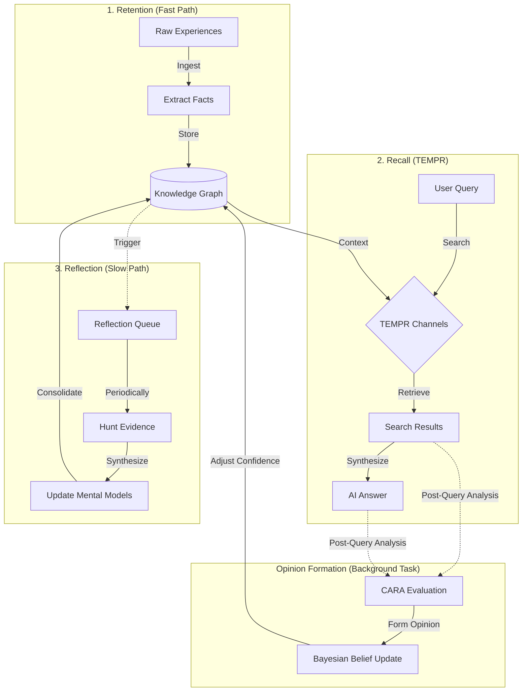

# The Hindsight Framework

Memex is built on the **Hindsight** framework, designed to mimic human memory consolidation.

## Core Philosophy

> "Hindsight is 20/20."

Raw experiences (logs, notes, chats) are noisy. True understanding comes from **Reflection**—looking back at past events to synthesize high-level models.

## Architecture

The system consists of three main loops and a background opinion formation process:

### 1. Retention (Fast Path)
- **Goal**: Capture everything, lose nothing.
- **Action**: Ingest -> Extract Facts -> Store.
- **Latency**: Low.

### 2. Recall (TEMPR)
A 4-channel retrieval system inspired by human associative memory.

- **T**emporal: "When did this happen?" (Time-decay scoring).
- **E**ntity: "Who/What is involved?" (Graph traversal).
- **M**ental Model: "What is the big picture?" (High-level concepts).
- **P**robabilistic **R**anking: (Semantic/Keyword fusion).

### 3. Reflection (Slow Path)
- **Goal**: Make sense of the noise.
- **Action**: Periodically review entities with new information.
- **Process**:
    1.  **Hunt**: Gather evidence.
    2.  **Synthesize**: Update the "Mental Model" (summary of the entity).
    3.  **Consolidate**: Archive redundant facts.

## CARA (Context, Action, Result, Analysis)
*Note: This is part of the Opinion Formation module.*

When Memex observes an interaction (e.g., you correcting it), it uses CARA to form an **Opinion**.
- **Context**: What was the situation?
- **Action**: What did the agent do?
- **Result**: What was the user's feedback?
- **Analysis**: What should be learned?

This allows Memex to "learn" from its mistakes without retraining the model.
