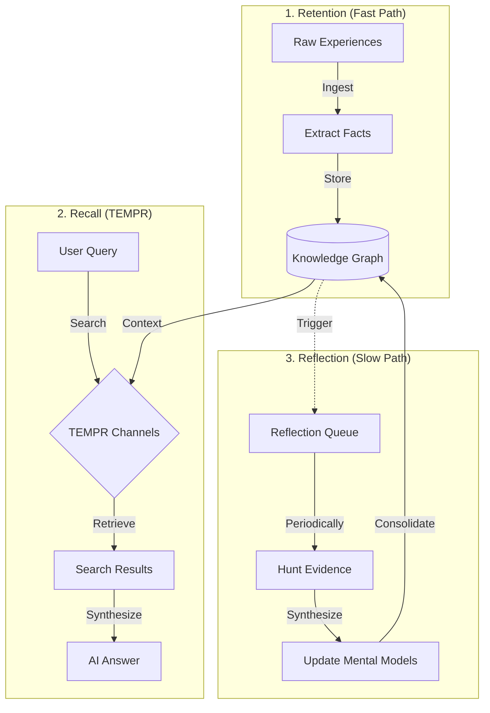

# About the Hindsight Framework

The Hindsight Framework is Memex's architecture for turning raw, noisy information into structured, retrievable knowledge. It models the way human memory works: experiences are captured quickly, recalled associatively, and consolidated into understanding over time.

## Context

LLMs have no persistent memory. Every conversation starts from scratch. Memex solves this by providing a memory system that captures, organizes, and retrieves knowledge across sessions. The Hindsight Framework is the design that makes this work.

The name comes from the observation that *hindsight is 20/20* — true understanding comes not from the raw experience itself, but from looking back and synthesizing patterns.

## The Three Loops

The framework consists of three distinct processing loops, each operating at a different speed:



### 1. Retention (Fast Path)

The retention loop captures raw information as quickly as possible. When a user ingests a note, URL, or file, Memex:

1. Stores the original content in the FileStore
2. Splits the text into chunks (using Simple or PageIndex strategies)
3. Extracts atomic facts, entities, and relationships via an LLM
4. Generates vector embeddings for semantic search
5. Persists everything atomically in the MetaStore

The design principle is *capture everything, lose nothing*. Speed matters here — the fast path should never block the user. That is why batch and background ingestion modes exist.

**Practical example:** When an AI agent ingests meeting notes, the retention loop extracts facts like "The team decided to migrate to Kubernetes by Q2" and entities like "Kubernetes", "Q2", linking them together in the knowledge graph.

### 2. Recall (TEMPR)

When a user or AI agent queries Memex, the recall loop retrieves relevant information using **TEMPR** — five independent retrieval strategies that run in parallel and are fused using Reciprocal Rank Fusion (RRF):

- **T**emporal — "When did this happen?" Recent information scores higher through exponential time-decay.
- **E**ntity (Graph) — "Who or what is involved?" Traverses the entity graph using NER extraction, phonetic matching, and co-occurrence relationships.
- **M**ental Model — "What is the big picture?" Searches the synthesized mental models produced by the reflection loop.
- **P**robabilistic — Semantic vector similarity (dense retrieval via cosine distance).
- **R**anking — Keyword matching (sparse retrieval via PostgreSQL full-text search with ts_rank_cd).

Each strategy contributes candidates, and RRF combines them into a single ranked list. After fusion, results pass through MMR diversity filtering (near-duplicate results are pruned using a hybrid cosine + entity Jaccard similarity kernel). The reason for multiple strategies is that no single retrieval method works best for all queries — entity-centric questions benefit from graph traversal, while conceptual questions benefit from semantic search.

**Practical example:** The query "What deployment decisions did we make?" triggers:
- *Temporal* surfaces recent deployment-related facts
- *Entity/Graph* finds facts linked to "deployment" and related entities
- *Mental Model* retrieves the high-level deployment mental model
- *Semantic* finds facts whose embeddings are close to the query
- *Keyword* matches the word "deployment" directly

### 3. Reflection (Slow Path)

The reflection loop is the most distinctive part of Hindsight. It runs periodically in the background, reviewing entities that have accumulated new evidence and synthesizing higher-level understanding.

The process has five phases:

1. **Phase 0 — Update Existing**: Re-evaluate existing observations against new evidence. Compute trend direction (strengthening, weakening, stable, stale, new).
2. **Phase 1 — Seed**: The LLM reads recent memories and proposes candidate observations — higher-level insights that connect multiple facts.
3. **Phase 2 — Hunt**: For each candidate observation, Memex searches the knowledge graph for supporting and contradicting evidence using vector similarity.
4. **Phase 3 — Validate**: The LLM evaluates each candidate against the gathered evidence, citing specific memory units.
5. **Phase 4 — Compare**: The LLM merges validated observations with existing ones, resolving duplicates and contradictions.
6. **Phase 5 — Finalize**: Observations are embedded and stored in the mental model, which is versioned and timestamped.

**Practical example:** After ingesting 10 meeting notes, the reflection loop might synthesize the observation "The team consistently prioritizes performance over feature velocity" — an insight that no single meeting note contains but that emerges from the pattern across all of them.

Reflection is triggered when entities accumulate evidence during extraction. The priority formula determines which entities reflect first:

```
Priority = (weight_urgency * accumulated_evidence)
         + (weight_importance * log10(mention_count))
         + (weight_resonance * log10(retrieval_count))
```

Entities with more new evidence, more global mentions, and more user queries are reflected upon first.

## Design Principles

**Append-only**: Notes are immutable. New versions create new entries rather than modifying existing ones. This preserves the full history and enables lineage tracing.

**Distributed reflection**: The reflection queue uses PostgreSQL `SELECT ... FOR UPDATE SKIP LOCKED` for atomic task claiming, allowing multiple workers to process reflection tasks concurrently without conflicts.

**Strategy independence**: Each TEMPR retrieval strategy runs independently. If one fails (e.g., NER model unavailable), the others still contribute results. This makes the system resilient to partial failures.

**Vault isolation**: Reflection operates within vault scope. Mental models in "Project A" vault are not influenced by evidence from "Project B" unless both vaults are attached.

## See Also

* [About the Extraction Pipeline](extraction-pipeline.md) — how retention works in detail
* [About Retrieval Strategies](retrieval-strategies.md) — TEMPR strategies in depth
* [About Reflection and Mental Models](reflection-and-mental-models.md) — the reflection loop and mental model lifecycle
