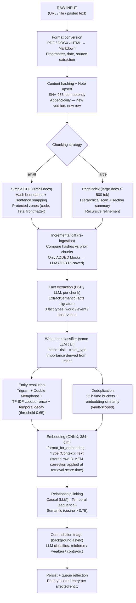

# About extraction

You paste a 30-page handover doc into Memex. A minute later you ask *"who's on call for payments rotation?"* and the agent returns three sentences from page 18, one paragraph from a Slack export you fed it last month, and a citation back to the handover. Between the paste and the answer, extraction is the work that turned the document into things the retrieval engine can actually find.

This page is about how that work happens. It is the **Retain** side of the Hindsight Framework — the half of Memex that converts raw text into structured memory. The other halves (recall, reflect, curate) are about reading; this page is about writing.

## Context

Extraction sits between two things you can see and one thing you mostly cannot. **Above** it: the moment you call `memex note add --file handover.md` from the CLI, or an agent calls `memex_add_note` over MCP, or your client posts to `/api/v1/notes`. **Below** it: the database, where each fact lands as a row in the `memory_units` table — with an embedding vector, entity links, an importance score, a confidence score, and a content hash you can trace back to the source paragraph.

The thing you mostly cannot see is the work in the middle. Memex doesn't store your document and run extraction at query time. It runs extraction once, on write, and stores the result as facts. Retrieval (the next page) reads those facts; reflection (the page after that) consolidates them into mental models. If extraction misses a fact or mis-attributes an entity, every downstream system inherits the error. So the design question for this page is: *what does Memex do at write time to make sure the rest of the system has good material to work with?*

A naive answer would be: chunk the document, embed each chunk, store the embeddings. That gets you a working semantic search, but it gives you nothing else. You cannot ask *"what changed about our deploy policy?"* without facts the system understood as state-changes. You cannot trust the answer to *"who did Bob work with last quarter?"* without an entity graph the system built deliberately. You cannot avoid recomputing the whole document when you fix a typo without a way to know what changed. And you cannot return a thirty-percent-cheaper answer next time the same query runs, because every query is starting from raw text.

Memex does the work up front, in a single linear pipeline, so the storage layer carries the meaning — not just the text. The cost is a slower write. The benefit is faster, sharper, cheaper reads — and a vault that knows things about itself that the bare embeddings never could.

## Model

Here is the Retain pipeline. One input enters at the top; a set of persisted memory units exits at the bottom. The reflection queue gets a priority-scored entry for every entity the document touched, so background reflection can pick up where extraction left off.



Each box is a real module under `packages/core/src/memex_core/memory/extraction/`. Each step is small. The shape — chunk, diff, extract, classify, resolve, dedup, embed, link, triage — is what makes the pipeline robust to the failure modes a naive single-pass extractor cannot handle.

A few things to notice in the diagram. The diff stage gates the whole LLM-heavy section: extraction, classification, entity resolution, and dedup only run on what changed. The entity-resolution and dedup steps are independent of each other and run against the same set of facts; both feed into the embed step. Linking and contradiction triage run after embeddings are in place because both depend on similarity comparisons. And the reflection queue is the last action before extraction returns — every other downstream cognition flows out of that handoff.

What the diagram does *not* show: persistence at every step. Most stages produce data that gets written to the database in the same transaction as the others. If any stage fails, the whole batch rolls back. There are no half-extracted documents in the data model.

## Mechanism

To show the pipeline in action, follow one paragraph through it. Suppose your handover doc contains this passage:

> The payments rotation now sits with Maria's team. Sam used to own it but rolled off in March 2026. We decided on Tuesday that on-call escalations should page Maria directly.

That short paragraph is three facts about the same entity (the payments rotation), one of which corrects an earlier claim (Sam no longer owns it). It mentions two people, a team, a date, and a standing rule. Some of those people are already in the vault from earlier handovers; some may not be. The contradiction with Sam's prior ownership is the kind of update a vault should notice and surface; the standing rule is the kind of durable fact that should still be relevant in six months.

Watch what Memex does with it.

### Format and content hash

Before extraction starts, the format converter normalises whatever you uploaded into Markdown. A PDF becomes paragraphs; a DOCX becomes sections; an HTML page becomes prose with the boilerplate stripped. The result is text. Memex then takes a SHA-256 hash of that text — with leading and trailing whitespace stripped and runs of spaces collapsed — and uses it for idempotency. Re-uploading the same content produces the same hash and short-circuits the pipeline before any LLM call. <code-ref path="packages/core/src/memex_core/memory/extraction/core.py" lines="240-247" />

The whitespace normalisation is a deliberate trade. A paste that smuggles in a trailing newline shouldn't trigger a full re-extract; neither should a document whose author retabbed it overnight. So the hash is computed over the substantive text, not the byte stream. The cost is a few CPU microseconds per ingest. The benefit is that idempotency works the way humans expect it to.

Notes themselves are versioned, not edited in place. When you reupload a slightly changed document with the same `note_key`, Memex creates a new note row and walks the incremental diff path below. The old version stays around as historical evidence; nothing about extraction destroys what came before.

### Chunking — CDC or PageIndex

A paragraph isn't useful on its own. The extraction LLM needs a chunk: enough context to disambiguate a sentence, small enough to fit a single LLM call. Memex chooses one of two chunking strategies, configured per server (the default is PageIndex). <code-ref path="packages/common/src/memex_common/config.py" lines="763-779" />

**Simple CDC** (content-defined chunking) is the small-doc path. It walks the text picking hash boundaries at roughly the configured block size, then snaps each boundary forward to the next sentence end. Crucially, it detects *protected zones* — fenced code blocks, list items, YAML frontmatter — and keeps them atomic when it can, so a single code block doesn't get sliced in half. <code-ref path="packages/core/src/memex_core/memory/extraction/core.py" lines="596-695" />

**PageIndex** is the large-doc path. Instead of running CDC blindly, it scans for headers (regex first, then an LLM fallback if the markdown is too unstructured), builds a table-of-contents tree, and chunks along the tree. Each leaf section gets a short summary. The output is hierarchical: blocks contain nodes, nodes contain text. That hierarchy is what makes the next step — the diff — useful on a re-ingest. <code-ref path="packages/core/src/memex_core/memory/extraction/core.py" lines="926-984" />

For our paragraph, either chunker would put it in one block alongside its surrounding context.

### Incremental diff — only changed blocks reach the LLM

Imagine you reupload the handover doc tomorrow with one typo fixed in a different section. Without diffing, Memex would re-extract every chunk, burn every LLM call, and produce a near-identical fact set. That's wasteful and unreliable — the same text re-extracted by a stochastic LLM doesn't always produce the same facts.

So Memex diffs first. Each chunk carries a content hash. The diff stage compares the new chunks against the chunks already stored for this note. Hashes that match are *retained* — their facts stay put. Hashes that disappear are *removed* — their facts get marked stale. Only *added* hashes go through to the LLM. <code-ref path="packages/core/src/memex_core/memory/extraction/pipeline/diffing.py" lines="68-98" />

For a one-typo edit on a 65-block document, that's one LLM call instead of sixty-five. The design doc puts the typical saving at 60–80%, and for incremental edits it lands there.

For the PageIndex chunker the diff is more careful still. A boundary shift — a header moved a paragraph earlier — would change a block's hash even though every node inside was identical. So the PageIndex diff separates *boundary-shift* blocks (constituent nodes unchanged) from *content-changed* blocks (new or changed nodes), and migrates the facts from the old chunk to the new one without re-extracting. <code-ref path="packages/core/src/memex_core/memory/extraction/pipeline/diffing.py" lines="46-66" />

For our handover paragraph — the first ingest of a brand-new note — there is no prior version. Every block is "added". All of them go to the LLM.

### Fact extraction — one DSPy signature

The extraction call itself is a DSPy signature called `ExtractSemanticFacts`. Each chunk becomes one LLM call. The signature asks for a structured output: a list of facts, each typed as `world` (durable knowledge), `event` (something that happened on a date), or `observation` (something noticed about the user or the conversation). Each fact carries the five Ws — who, what, where, when, why — and, optionally, a causal relation pointing at another fact in the same chunk. <code-ref path="packages/core/src/memex_core/memory/extraction/core.py" lines="58-111" />

For our paragraph, the LLM should produce three facts, one per sentence. Roughly:

- `event`: "Maria's team now owns the payments rotation" (occurred Tuesday)
- `event`: "Sam rolled off the payments rotation" (occurred March 2026)
- `world`: "On-call escalations page Maria directly"

The signature is typed end-to-end with Pydantic. If the LLM returns malformed output, the Pydantic validators raise before anything reaches the database. That matters for the next step — the classifier rides on the same call, and if the extraction half is invalid, the classification half goes with it.

Why DSPy and not a hand-rolled prompt? The signature is the contract: input fields, output fields, type-checked at both ends. A future maintainer can re-tune the prompt without renegotiating the schema downstream, and DSPy's optimisers can be pointed at the signature when there's an evaluation corpus to optimise against. The framework's value here is the typed boundary, not the prompt engineering.

### Write-time classification — intent, risk, claim type

Same LLM call, more output fields. Each fact also carries an `intent_class` (`permanent` / `durable` / `ephemeral`), a `risk_class` (`none` / `sensitive` / `private` / `safety`), and optionally a `claim_type` (`resolution` / `contradiction`) when the LLM detects the fact explicitly overrides a prior claim. <code-ref path="packages/core/src/memex_core/memory/extraction/core.py" lines="58-95" />

The classifier *isn't* a separate DSPy signature any more — the fields ride on the extraction signature itself, and a single config flag turns the whole feature off. <code-ref path="packages/common/src/memex_common/config.py" lines="795-808" /> Earlier versions of Memex did run a second classifier call; folding the output fields into `ExtractSemanticFacts` cut the per-chunk LLM count in half without measurably degrading classification quality, because the chunk context the classifier needs is the same chunk context the extractor is already reading.

Intent is the load-bearing classification. It asks: *will this still be true in four weeks?* "Maria's team owns the rotation" is a durable claim. "I prefer Neovim" is permanent. "By EOD I need the metrics chart" is ephemeral. Memex uses intent to derive `importance` — `permanent → 1.0`, `durable → 0.7`, `ephemeral → 0.3` — which the retrieval-time decay boost reads to decide how much an old fact should still surface. <code-ref path="packages/core/src/memex_core/memory/retrieval/constants.py" lines="21-25" /> The same intent value derives `stability` (the half-life in days the decay term uses): permanent units have no decay; durable units decay over 180 days; ephemeral units decay over 14. <code-ref path="packages/core/src/memex_core/memory/retrieval/constants.py" lines="15-19" />

Note the distinction the intent prompt insists on: *durability is not the same as importance*. A user's birthday is permanent but rarely the most important fact in a query. An ephemeral blocker may be the single most important thing to surface today. Intent says how long the fact stays relevant; the rest of the scoring chain decides how much it matters in a given moment.

Risk does two jobs. Facts marked `safety` are recorded with a counter but currently pass through — blocking is deferred to a pre-flight risk assessment that isn't shipped yet. Facts marked `private` are excluded from default retrieval queries, so a vault that ingests medical or PII content can hold it without it leaking into routine searches. Facts marked `sensitive` are flagged for the linter to review, not filtered. <code-ref path="packages/core/src/memex_core/memory/extraction/classifier.py" lines="33-52" />

`claim_type` is the corrective-claim signal — set only when the LLM sees the fact explicitly negate or resolve a prior claim. For our handover paragraph, the fact "Sam rolled off the payments rotation" should carry `claim_type='contradiction'` with a `claim_target.target_topic` like "payments rotation owner". That signal feeds the contradiction engine a few steps later, narrowing its candidate search to the right prior unit instead of the whole vault. <code-ref path="packages/core/src/memex_core/memory/contradiction/engine.py" lines="30-51" />

### Entity resolution — same person, two spellings

Each fact mentions entities. The LLM tags them with names. Memex needs to decide whether "Maria's team" in this paragraph and "the Maria team" five pages later are the same entity — or whether they're different teams that happen to share a lead. Get this wrong and the entity graph fragments into a hundred ghost duplicates; get it too aggressive and unrelated people with the same first name collapse into one.

The resolver is multi-factor. For each new entity, it pulls candidates from the database and scores each one on three dimensions:

- **Name similarity** (50%) — character trigram overlap (Jaccard ratio), with a floor boost when Double Metaphone (a phonetic algorithm) matches. Phonetic match lets *Catherine* and *Katharine* resolve to the same person; the floor prevents a phonetic-only match from being rejected for low character overlap when the spellings differ enough to drag the trigram score under 0.5.
- **Cooccurrence** (30%) — how many of the names appearing near this mention also appear near the candidate, weighted TF-IDF style so rare neighbours count more than common ones. A match on "Bob" is weak; a match on "the Sycamore RFC" is strong.
- **Temporal proximity** (20%) — exponential decay on the time difference between this mention and the candidate's most recent appearance, with a 30-day half-life. An entity nobody has mentioned in eighteen months is less likely to be the same person than one mentioned last week.

If the weighted sum clears 0.65, Memex resolves to the existing entity. Below the threshold, it creates a new one. The threshold is tunable per server. <code-ref path="packages/core/src/memex_core/memory/entity_resolver.py" lines="135-191" />

For our paragraph, "Maria" probably resolves to the existing Person entity from the prior reference. "Sam" likewise. "The payments rotation" resolves to an existing Topic entity if one is there, or creates a new one. The cooccurrence dimension is doing real work here: "Maria" and "Sam" appear together in the same paragraph, and if they already appear together in earlier handover notes, that shared context boosts both resolution scores.

### Deduplication — twelve-hour buckets, twenty-four-hour window

A handover doc often repeats itself. The same fact stated three different ways in three different sections shouldn't produce three memory units. Dedup catches near-duplicates by grouping new facts into 12-hour buckets (based on event date, falling back to mention time) and running an embedding-similarity check inside each bucket against the existing memory units in the same vault, over a 24-hour comparison window centred on the bucket. <code-ref path="packages/core/src/memex_core/memory/extraction/deduplication.py" lines="20-87" />

The bucketing is the optimisation. Without it, dedup would compare every new fact against every existing fact in the vault. With it, dedup compares only against facts from the same time window, which is where genuine duplicates actually cluster — the same meeting summarised twice in two different docs uploaded the same afternoon, for example.

Dedup is vault-scoped on purpose. A fact about "the standup" in your personal vault is a different fact from "the standup" in your team-shared vault, even if the embeddings would otherwise cosine-match. The vault is the boundary of "the same context".

### Embedding — raw, with the correction deferred

Memex generates a 384-dimensional embedding for each fact using an ONNX-backed embedding model running in a thread pool. The vector is computed from a standardised string format — `"Type (Context): Text"` — so the embedding sees structure the bare fact wouldn't expose. <code-ref path="packages/core/src/memex_core/memory/formatting.py" lines="4-25" />

There's a subtlety worth pausing on. Modern high-dimensional embeddings suffer from anisotropy: all the vectors cluster in a narrow cone, so even unrelated texts end up with cosine similarities above 0.7. The D-MEM paper (arXiv:2603.14597) proposes a sliding-window Z-score normaliser that corrects for this — but the correction is applied to *similarity scores at retrieval time*, not to the embeddings themselves. Memex stores embeddings raw and applies the correction at score time in the reranker. <code-ref path="packages/core/src/memex_core/memory/models/anisotropy.py" lines="1-46" />

Storing raw embeddings means you can swap the correction algorithm without re-indexing the vault.

### Relationship linking

After the facts and their embeddings land, Memex creates edges between them. Three kinds, in this order:

- **Causal** — if the LLM's extraction output declared a causal relation between two facts in the same batch, Memex writes a directed `caused` or `caused_by` link with the LLM-supplied strength. Causal links are sparse: only what the extractor explicitly identified, never inferred after the fact.
- **Temporal** — same-document facts get linked sequentially in event-date order. Cross-document temporal links connect the new batch to its closest predecessor and successor in the existing timeline, so a query for "what happened before X?" can walk the graph backward without a date-range filter.
- **Semantic** — for each new fact, Memex runs a similarity search against existing units in the same vault (excluding the batch itself) and writes a `semantic` link to any neighbour above cosine 0.75, capped at 5 neighbours per fact. <code-ref path="packages/core/src/memex_core/memory/extraction/pipeline/linking.py" lines="98-125" />

For our paragraph, the three new facts get temporal links to each other (March 2026 → Tuesday's decision → the standing rule), plus semantic links to whatever earlier handover facts they resemble. The cooccurrence graph that the entity resolver consulted at resolution time gets updated as a side effect of persisting the new entity mentions, so later queries about Maria and Sam pick up the new evidence.

### Contradiction triage — background, narrow, LLM-classified

Persisting the new units is not the last step. Memex spawns a background task that walks the new units looking for contradictions with what's already in the vault. The work runs outside the foreground request so the user's `note add` returns quickly, but it commits in the same vault before the next retrieval reads it.

The triage runs in two stages.

First, a `TriageNewUnits` DSPy call flags which of the new units look like *corrections* — units that update, revise, or supersede prior information rather than adding net-new claims. Most units aren't corrections, so the triage filter does most of its work cheaply: one LLM call screens a batch of units, returning only the IDs that warrant deeper inspection. <code-ref path="packages/core/src/memex_core/memory/contradiction/signatures.py" lines="46-59" />

Second, for each flagged unit, Memex pulls a candidate set from the database — narrowed by the unit's `claim_target` entity IDs if it has one — and asks a `ClassifyRelationships` call to label each (new, candidate) pair as `reinforce`, `weaken`, `contradict`, or neutral. Non-neutral relationships become typed memory links; the engine bumps the affected units' confidence scores by a signed alpha-step delta with SQL-level clamping so concurrent ingests don't race. <code-ref path="packages/core/src/memex_core/memory/contradiction/engine.py" lines="88-225" />

For our paragraph, "Sam rolled off the payments rotation" should flag in triage. The candidate set should include the older fact "Sam owns the payments rotation". The classifier should label the pair `contradict` with the new unit authoritative. Memex writes the link, decrements the old unit's confidence, and — because contradiction detection contributed negative evidence — bumps the old unit's `failure_co_count` by one. From the retrieval side, the old fact is still there as audit history, but ranks lower the next time someone searches for the payments rotation owner.

### Queue reflection

After the units are persisted, Memex enqueues a reflection task per touched entity. Reflection is a separate background loop covered on its own page; for extraction, the relevant point is that the queue is *priority-scored* — entities with more new evidence get reflected sooner — and the enqueue is the last thing extraction does before the request returns. <code-ref path="packages/core/src/memex_core/memory/extraction/engine.py" lines="477-482" />

The queue isolation is what lets extraction return in seconds even when downstream reflection takes minutes. The agent gets its acknowledgement; the entity mental models get updated when the scheduler picks them up. Two systems, one transaction boundary at the unit persist, no foreground penalty for the slow work.

### What extraction does *not* do

It is as useful to name the boundaries as the inclusions. Extraction does not:

- **Decide what to remember and what to forget.** Forgetting is the curate workflow's job, driven by deprioritization scoring and the retrieval-time decay boost. Extraction persists everything (modulo the safety-class filter described below) and leaves the choice of what surfaces to the read path.
- **Build mental models.** Synthesising facts into per-entity narratives is reflection's job. Extraction feeds reflection by enqueueing entities; it does not run the reflection loop itself.
- **Rank facts for a query.** Retrieval ranks. Extraction stores. The two are independent, and the things extraction stores (intent, importance, confidence) are inputs the ranker consumes — not rankings themselves.
- **Block unsafe content.** Today, facts marked `risk_class='safety'` are recorded with a counter and passed through. Pre-flight blocking is on the backlog but is not the extraction pipeline's responsibility.
- **Update old facts in place.** Memory units are append-only. When a new fact supersedes an old one, the new one lands and the old one is demoted via the contradiction engine — never overwritten, never deleted.

Each of these omissions is deliberate. They keep the extraction pipeline small enough to reason about and small enough to test exhaustively.

### A reference for the paragraph's journey

Pulling it all together, here is what landed in the database from our three-sentence paragraph:

| Artifact | Where | What you can do with it |
|---|---|---|
| 1 Note row | `notes` table | `memex note find "handover"` returns it by title fragment |
| 1 Chunk row | `chunks` table | The block hash anchors the diff on re-ingest |
| 3 MemoryUnit rows | `memory_units` table | Searchable via `memex memory search`, viewable via `memex memory view` |
| 3 Entity rows (or resolutions) | `entities` table | `memex entity view`, `memex entity related` |
| Several MemoryLink rows | `memory_links` table | `memex memory links <unit-id>` walks the graph |
| 1+ Reflection queue rows | `reflection_queue` table | Picked up asynchronously by the scheduler |
| Optional 1 contradiction link | `memory_links` table | Decrements the prior unit's confidence |

Three sentences of text became a half-dozen kinds of structured record. That is the trade extraction makes: a few seconds of work on the way in, in exchange for everything you can query about that paragraph from then on.

## Trade-offs and alternatives

### Why classify at write time, not read time?

A read-time alternative would skip the classifier on the way in and decide intent / risk / importance at query time. That has surface appeal — fewer LLM calls per ingest, more flexibility to change the classifier later, no need to settle the schema before you understand your corpus.

It loses on three counts. First, the cost moves from a one-time write-time call to a recurring read-time call, and reads are far more frequent than writes. A vault that ingests one document a day but serves a hundred queries against it would do a hundred times the classifier work under the read-time model. Second, the classifier needs the surrounding chunk for context; at read time you have only the persisted fact text, which is shorter and thinner. The full chunk is gone by the time the query runs. Third, importance is what the decay boost reads to decide which units to suppress with age — a read-time classifier would need to re-derive importance on every query for every unit returned, which is exactly the work write-time classification amortises away.

Memex picks the write-time path: pay once, store the verdict, read for free. The trade is that changing the classifier means re-extracting the corpus, which is why the change cost is real and the schema is conservative.

### Why incremental diffing?

You can imagine a simpler design: re-extract every chunk on every reupload, accept the LLM cost, accept the fact churn. That fails practically. Re-extraction of a 500 KB document is around 133 LLM calls and 310,000 tokens. Doing that every time you fix a typo turns a one-second edit into a thirty-second batch job and costs serious money on a frontier model.

Worse, repeated extraction is non-deterministic. The same chunk re-extracted by the same LLM produces slightly different facts run-to-run — slightly different phrasing, slightly different entity boundaries, sometimes a fact split where there was previously a fact merged. So even an "identical" reupload churns the fact set, breaks links, and orphans confidence scores attached to specific unit IDs. An outcome counter saying "this fact was useful seven times" is worth a great deal — and worth nothing if the next reupload re-extracts it as a structurally different fact with a different UUID.

Diffing solves both problems. Unchanged chunks have unchanged hashes, so their facts stay put — same UUIDs, same links, same accumulated outcome counters. Only the chunks that actually changed get new facts. The 60–80% saving is the typical cost reduction on a real-world re-ingest, and the bigger win is the stability of the unit identifiers across edits.

### Why apply D-MEM at retrieval, not write?

The anisotropy correction is a similarity-score normaliser, not an embedding transform. You could imagine baking it into the embedding itself — applying the Z-score / sigmoid to every dimension at write time and storing the corrected vector.

That would lock the vault to one correction algorithm forever. Switching algorithms — or tuning the window size, or disabling the correction during an A/B — would require re-embedding every fact in the vault. For a vault with hundreds of thousands of units, that's a multi-hour migration with no rollback once it starts. Applying the correction at score time costs a constant-factor per query and leaves the stored vectors algorithm-neutral. You can change your mind about the correction without touching what's on disk.

### Why claim-typed extraction?

Without `claim_type`, the contradiction engine has to consider every new unit as a potential corrector and search the whole vault for candidates. That's expensive — both in the candidate query and in the LLM calls that classify each pair. Most new units aren't corrections, so most of that work is wasted.

With `claim_type`, the LLM tells you up front which units are corrective and what they're correcting; the engine narrows the candidate search by `claim_target` entity IDs and skips the rest. The signal rides the existing extraction signature with no extra LLM call, so the cost is essentially zero. The benefit is higher-precision contradiction detection and fewer wasted LLM tokens chasing non-existent corrections.

The same idea sits behind several Memex design choices: when the LLM is already running, ask it for everything you need on that one call. The marginal cost of an extra output field is far smaller than the cost of a second call.

## Implications

### Re-ingesting a slightly-edited document is cheap

The combination of stable chunk hashes, the incremental diff, and append-only fact storage means a small edit to a large document costs the LLM time of a small document. Memex re-chunks the whole file, hashes each chunk, walks the diff, finds that one chunk's hash changed, and runs the LLM on that one chunk. Every other fact in the document keeps its unit ID, its embedding, its links, and its accumulated outcome counters. Re-ingest is a typo fix, not a rebuild.

The same logic applies when an agent uses `memex_append_note` to extend an existing note: Memex routes the addition through the same diff path so only the new content reaches the LLM. From the outside, it looks like the agent "added a paragraph" — but from extraction's point of view, that paragraph is just an added block in the diff. Every other chunk is retained, no LLM call is needed for them, and the agent's outcome counters on prior facts in that note stay intact.

The practical version of this property is that operators can leave the same Markdown file in their `--file` directory and re-run `memex note add` daily without burning the LLM budget. Memex will only do work where the file actually changed.

### Stale facts are kept, not deleted

When the diff finds removed blocks, the facts that came from those blocks are marked *stale*, not deleted. They drop out of default retrieval (filtered by the stale flag) but remain queryable for audit. The same applies to facts that the contradiction engine demotes: the old fact stays, with a `contradicts` link pointing at its successor, so historical context survives even after the truth changed.

This is the right default for a memory system. A research assistant that forgets every superseded fact has no answer to *"what did we believe before?"* — and that question turns out to come up a lot.

### How to debug an extraction issue

When an agent says *"I cannot find that"* about something you know you ingested, the question is usually one of three: was the fact extracted, was it linked correctly, or is it just out-ranked?

Start at the note:

```bash
memex note find "handover"          # locate the note_key
memex memory search "payments rotation owner" --limit 20
```

If the search returns nothing, the fact may not have been extracted. Check whether the chunk it should have come from made it into the database — `memex memory view <unit-id>` on any nearby unit will show the `chunk_id` it was extracted from, and `memex memory lineage memory_unit <unit-id> --direction upstream` will walk back to the note and tell you which note version the unit belongs to.

If the search returns the fact but at a low rank, the question shifts to scoring — covered on the retrieval page. The `memex memory links <unit-id>` command shows what's linked to it: a `contradicts` link from a newer unit will explain why an older fact is being suppressed.

If the fact is in the right shape but tagged with the wrong entity, the entity resolver picked the wrong canonical ID. `memex entity view <entity-id>` and the cooccurrence view from `memex entity related <entity-id>` will tell you which neighbours the resolver weighed when it made the call. If two entities that should be one are still split, the resolution threshold is the dial to turn; if two that should be split have collapsed, the dial goes the other way.

The trace span emitted around extraction (`memex.extraction` with `extraction.note_id` and `extraction.vault_id` attributes) is the single best signal for production debugging. <code-ref path="packages/core/src/memex_core/memory/extraction/engine.py" lines="339-346" /> If you're running with OpenTelemetry, the span will show you which chunks were sent to the LLM, how long extraction took, and where it failed. The contradiction-engine span (`memex.contradiction`) is the second; it shows you triage decisions and which pairs the classifier ran on.

### Which chunking strategy to pick

Two strategies, one practical recommendation: leave the default unless you have a reason. The default is PageIndex, which is the right call for almost every real corpus — handovers, RFCs, meeting notes, scraped pages, books. Simple CDC exists for two cases:

1. Streams of short, unstructured text where there are no headers to anchor a hierarchy (chat exports, log lines, Twitter-style threads).
2. Workloads where the LLM call overhead of PageIndex's tree scan isn't worth it because the documents are tiny anyway (one-paragraph notes, command-line `memex note add "..."` snippets).

If you're not sure which you have, PageIndex is the safer default. CDC will run on the same input but won't produce the hierarchical block summaries PageIndex does, which retrieval uses to keep large documents legible.

### What this means for the documents you ingest

Two practical implications for users who write the documents Memex extracts from.

First, write paragraphs that the LLM can extract as discrete facts. A paragraph that buries three claims under a single topic sentence tends to come out as one vague fact; three short paragraphs with explicit subjects come out as three sharp ones. The extractor is good at finding the boundaries the writer marked, and worse at inventing boundaries that aren't there. Short, declarative paragraphs cost you nothing as a writer and pay back at every future query.

Second, when you want a fact to supersede a prior one, say so explicitly. *"We no longer page Sam; Maria's team now owns escalations"* is more useful than *"Maria's team owns escalations"* alone, because the `claim_type='contradiction'` signal fires only when the LLM sees the corrective language. Without it, the contradiction engine still works — but it has to discover the contradiction the slow way, against a wider candidate set, with a higher chance of missing it.

You don't need to do either of these things for extraction to work. They are the small adjustments that make the difference between a useful memory and a sharp one.

### A second worked example — append-only edits

To close the loop on a different shape of input, consider this case. You ran `memex note add --file handover.md` last week. Today you open the same file, add one new paragraph at the end about a new on-call tool, and re-run the same command.

What happens:

1. The format converter normalises the file. The hash is different from last week's, so idempotency does not short-circuit.
2. Chunking produces the same blocks as last week for every paragraph except the new one at the end, which lives in its own new block (or extends the last block, depending on size).
3. The diff finds every block hash retained except the new one. `added_blocks = 1`, `removed_hashes = 0`.
4. Extraction runs on that one block. One LLM call. One classification. One round of entity resolution against the vault. One dedup check. One round of linking.
5. The new facts get persisted. The reflection queue gets one entry for the touched entity (the on-call tool).
6. Contradiction triage runs on the new units. The new on-call tool doesn't supersede a prior tool, so no contradictions get written.

Total LLM cost: one extraction call, plus the contradiction triage call. For a 30-page document, that's the cost the diff is meant to deliver. Every other unit ID, link, and outcome counter in the document is untouched.

Compare that to the cost of the first ingest of the same file last week: a chunk per section, an LLM extraction call per chunk, classification on every fact, entity resolution against a much smaller candidate pool, and triage across every new unit. The first ingest is the expensive one. Every subsequent edit costs only what changed — and across weeks of small edits, that adds up to most of the value the diff delivers.

### Operating extraction in production

A small set of operational knobs and metrics matter most:

- **`max_concurrency`** — the cap on parallel LLM calls during fact extraction. Default 5. Raise it when your LLM provider rate limits are generous and your latency budget is tight; lower it when you see rate-limit errors in the logs.
- **`intent_risk_classifier_enabled`** — the kill switch for the classifier. With it off, every fact is forced to `intent='durable'` and `risk='none'`. Use this when bootstrapping a vault, or when debugging whether the classifier is causing scoring weirdness downstream.
- **`short_doc_threshold_tokens`** — the size below which PageIndex skips its hierarchical scan and treats the document as one block. Raise it if you ingest many short notes and want to skip the scan overhead; lower it if you want even small docs to get the hierarchical treatment.
- **The `memex.extraction` and `memex.contradiction` trace spans** — the two telemetry signals that tell you whether extraction is healthy. Span latency, error rate, and per-stage breakdown are the early indicators when something starts misbehaving under load.
- **The `memex_classifier_blocked_total` and `memex_claim_typed_units_total` Prometheus counters** — early signals that risk classification or claim typing is shifting in production. A sudden change in either is worth investigating before users notice the downstream effects on retrieval.

Nothing here is exotic. Extraction is observable and tunable from a small surface; the rest is the same Python-with-Postgres operational story as the rest of Memex.

A short list of failure modes worth knowing about:

- **LLM timeouts during extraction.** The circuit breaker degrades the next batch rather than failing the request synchronously. Look for the breaker-open metric in your dashboards.
- **Embedding model load failures.** ONNX startup is eager; if the model file is missing or corrupt, the server refuses to start rather than running with semantic search broken silently.
- **Entity resolver explosion.** A vault with many similar names (lots of Sams) can produce candidate sets in the hundreds. The trigram pre-filter caps the candidate count before the multi-factor scoring runs; if you see resolution latency spike, that pre-filter is the right place to look first.
- **Contradiction engine stalls.** The triage call is the expensive one. If it falls behind, new contradictions arrive late but never break the foreground ingest path — the background queue catches up over the next few minutes.

### Closing thought

Extraction is the work you pay for once so you do not pay for it on every query. Every design choice on this page — write-time classification, incremental diffing, raw embeddings, claim-typed extraction, narrow contradiction triage — is a version of that same trade. Spend the LLM call now, save the LLM calls later. Store the structure now, query the structure later. Be careful about identity now (note keys, unit UUIDs, entity canonical IDs), and the read path gets the stability it needs to do interesting things on top.

The pipeline is one of Memex's busiest surfaces. It is also one of the most boring to use: you call `memex note add`, you wait a few seconds, you get an acknowledgement. Everything described on this page happens in the gap between those two moments. The rest of Memex — retrieval, reflection, curation — is built on what landed in the database during that gap.

## See also

- [Tutorial: Getting started](../../tutorials/getting-started.md)
- [How-to: Ingest documents in batch](../../how-to/ingesting-data.md)
- [Reference: Configuration options](../../reference/configuration-options.md)
- [Explanation: About retrieval](retrieval.md)
