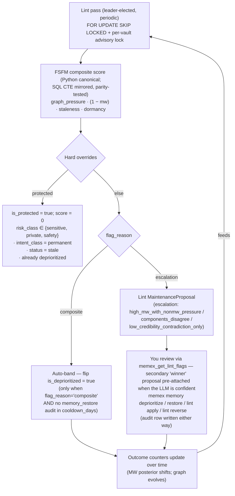

# About feedback and curation

A note about your authentication setup lands in the vault today. Six months from now, the same note is still there, but the team rotated the secret manager, the linked entity has gone quiet, and a fresher note contradicts the original. The vault has not noticed. Without a feedback loop, every memory keeps its first-day weight forever, and search keeps surfacing the stale claim ahead of the fresh one.

Memex's curation loop is the part of the system that fixes this. It watches outcome signals from agents and users, lets time and graph evidence accumulate against each memory, and acts on what it learns — quietly when the signal is clear, with a human in the loop when it is not. This page explains how the loop is wired together: the inputs it consumes, the score that drives action, and the rules that decide who pulls the trigger.

## Context

A long-running memory store has the same problem a long-running codebase has. Fresh code is high-signal; old code is uneven. Some old code is load-bearing and timeless. Some is dead. Some is actively misleading. You cannot tell which is which without watching how the code performs over time, and you cannot afford to delete anything that turned out to matter.

Memex makes the same bargain with its memory units. Every retrieval is an opportunity for signal: did the agent find this useful? Did it surface but never get used? Did a fresher fact contradict it? Did the entity it talks about go dormant? The curation loop collects these signals across days and weeks, scores each memory along four axes, and either acts (when the case is clear) or files a finding for a human to triage (when it is not).

Two design principles run through the loop. The first is **P1 — non-destructive by default**. Curation degrades visibility; it does not delete. A memory that gets curated stays on disk, in Postgres, in the lineage graph, with its outcome counters intact. The retrieval pipeline filters it out of default-scope results, and that is the whole effect. The second is **P5 — write-time labels are immutable**. The vault never goes back and edits what was originally extracted. Curation is layered on top.

Together these mean curation is cheap to apply and cheap to undo. The system can act freely without burning bridges.

The rest of the page is structured around three questions. First, what does the loop *measure*? That is the model — Memory Worth, the FSFM composite, and the four signals each one consumes. Second, how does the loop *act* on those measurements? That is the mechanism — the leader-elected linter, the auto-band, the escalation ledger, the LLM winner proposal. Third, what should you carry away from the loop's design? That is the implications section at the end, where the trade-offs and the practical consequences land.

## The model

Curation runs on two scoring primitives. The first is per-unit; the second is per-unit-pair-time.

### Memory Worth

Each memory unit carries three integer counters: `success_co_count`, `failure_co_count`, and `unused_co_count`. They are incremented when an agent calls `memex_record_outcome` with the matching verb (`helpful`, `not_helpful`, `not_used`) and when retain-time contradiction detection commits a negative-evidence link against a prior version of the unit.

Memory Worth is the posterior mean of a Beta-Bernoulli with a uniform Beta(1, 1) prior over the two credit-bearing counters:

```
mw_score = (success_co_count + 1) / (success_co_count + failure_co_count + 2)
```

A cold-start unit (zero outcomes) lands at 0.5 — neutral, no boost, no penalty. A unit with five helpful outcomes and zero failures lands at about 0.86. A unit with three helpful and three not-helpful sits at 0.50. The Beta(1, 1) prior is uniform so cold-start does not have to mean "untrusted" — it means "we have not learned anything yet". The system is willing to let a new unit retrieve at parity with old ones until evidence builds.

<code-ref path="packages/core/src/memex_core/services/outcomes.py" lines="76-83" />

By default Memex computes Memory Worth in **EMA mode**: the counters are decayed by an exponential at read time, half-life 60 days, so old evidence fades toward the prior mean.

```
decay_factor  = exp(-elapsed_days * ln(2) / half_life_days)
mw_ema_score  = (success * decay_factor + 1) / ((success + failure) * decay_factor + 2)
```

The half-life is global; per-vault overrides preserve the older `stationary` mode for operators who prefer raw lifetime sums. Cold-start under EMA still returns 0.5 — `last_outcome_at = None` is the trigger for the prior-mean fallback, so an EMA vault treats brand-new units identically to a stationary vault until the first outcome lands.

<code-ref path="packages/core/src/memex_core/memory/retrieval/mw_ema.py" lines="24-43" />

The `unused_co_count` counter is engagement-only — it does NOT enter the posterior. A unit that retrieves often without being used does not get punished for it; the count is recorded raw for diagnostics rather than folded into any score. Folding unused into the posterior would have amounted to declaring un-engagement as failure — a category error: a unit can be correctly retrieved (it is relevant to the query) and still not be load-bearing for the answer (the agent had enough signal elsewhere). The three-verb taxonomy preserves the distinction. (Defaults are literature-precedent; not fine-tuned.)

### The FSFM composite

Memory Worth tells you what the agent's outcome counters say about a unit in isolation. It is a per-unit, opinion-only signal: useful for ranking but indifferent to whether the unit is connected to anything else in the graph, whether time has eroded the claim, or whether the entity the unit is about has gone dormant. The FSFM composite — Forgetting Selectively, the Fast Mode, after the 2026 paper of the same name — adds three more signals and squeezes them into one `[0, 1]` score per unit:

| Component               | Plain English                                                                  | Default weight |
|-------------------------|---------------------------------------------------------------------------------|----------------|
| `graph_pressure`        | What do the inbound links say? `contradicts` and `weakens` push up; `reinforces` and the four causal link types pull down. | 0.50           |
| `memory_worth_complement` | `1 − mw_score`. Low Memory Worth pushes up; cold-start units contribute 0.5 (neutral). | 0.25           |
| `temporal_staleness`    | `1 − exp(-age_days / stability)`. Old + not-permanent pushes up. `stability` is a per-class baseline (permanent = NULL, no contribution; durable, ephemeral get tighter horizons). | 0.15           |
| `entity_dormancy`       | `1 − exp(-mu × age_of_freshest_entity_mention)`. Stale-topic pushes up. Driven by `entities.last_seen` joined via `unit_entities`; units with no linked entities contribute 0. | 0.10           |

The composite is a weighted sum, multiplied by `(1 − importance)` so high-importance units get suppressed naturally. The result is clamped to `[0, 1]`.

<code-ref path="packages/core/src/memex_core/services/deprioritize_score.py" lines="191-244" />

The four components were chosen to be *orthogonal* — they catch different failure modes and rarely all push in the same direction at the same time. `graph_pressure` catches units that have been contradicted by something the system trusts. `memory_worth_complement` catches units the agent has tagged unhelpful. `temporal_staleness` catches units that have just been around too long without an outcome touch (a unit that nobody has interacted with for nine months, on a non-permanent intent class, is probably no longer relevant even if no fresh evidence has come in against it). `entity_dormancy` catches units whose subject area has gone quiet — if the team has not mentioned the on-call rotation in 90 days, a unit about on-call is less likely to be load-bearing for new questions.

The sum is weighted heavily toward `graph_pressure` (0.5) because graph evidence is the highest-fidelity signal — it is grounded in actual extracted facts that disagree, not in time-since or activity-of. Memory Worth comes next (0.25) because outcome evidence, while noisier than graph evidence, is still grounded in an explicit signal. Temporal and entity decay come last (0.15 and 0.10) because they are the weakest signals — a unit can be old and still correct, and an entity can be dormant without invalidating what we know about it. The weights add to 1.0; the multiplier by `(1 − importance)` is the protective scaling that keeps durable items in the safe range.

Four hard overrides short-circuit the math. A unit is **protected** — score pinned to 0, no further action — when its `risk_class` is in `{sensitive, private, safety}`, its `intent_class = permanent`, its `status = stale`, or it is already deprioritized. Protected units are read-only inputs to the loop; they never auto-band.

<code-ref path="packages/core/src/memex_core/services/deprioritize_score.py" lines="206-214" />

The four protections are deliberately different in shape. `risk_class` is a write-time decision by the classifier; `intent_class = permanent` is a write-time decision (either by the classifier or by an explicit override on the note); `status = stale` is a lifecycle state set by supersession; `is_deprioritized = true` is the curate-time state set by the auto-band or a human. The protections cascade in increasing specificity — risk first (the unit is sensitive content that should never be touched by an automated tier), then intent (the user said this fact should outlive curation), then status (the supersede pipeline already retired this unit), then the surface flag itself (no point re-banding what is already banded). The short-circuit returns BEFORE reading any counters, so a stale unit's preserved `success_co_count` does not interact with the protection — it never enters the math.

(All FSFM weights, decay rates, and thresholds shipped as defaults are literature-precedent; not fine-tuned.)

### Why `intent_class` is load-bearing

Two of the four FSFM components — `temporal_staleness` and the final `(1 − importance)` multiplier — read off the unit's `intent_class`, which is set at extraction time by the write-time classifier. The three values matter:

- **`permanent`** — user preferences, conventions, settings that should outlive any retrieval cycle. The unit's `stability` is `NULL`, so `temporal_staleness` returns 0. The hard override at the top of `compute_composite` also pins `is_protected=True`, so the score never rises above 0 at all. These units are immune to the auto-band by design.
- **`durable`** — the default. A high importance baseline (about 0.7) holds the `(1 − importance)` multiplier near 0.3, which compresses the composite hard. Durable units effectively never trip the auto-band threshold of 0.55 — even with full pressure across every component, the math caps them well below.
- **`ephemeral`** — transient context that should drain quickly. A low importance baseline (about 0.3) lets the `(1 − importance)` multiplier reach 0.7, so the composite can reach the auto-band range.

This is what lets the loop be aggressive without being dangerous. The auto-deprioritize threshold of 0.55 is calibrated against the ephemeral ceiling (~0.63), so ephemeral units can reach it and durable ones cannot. A user who intends a fact to outlive curation marks it `permanent` at write time; the loop respects that by construction.

### Where the components come from

The four components are not invented from nothing — they trace back to specific papers in the cognitive-memory literature. Memory Worth is a Beta-Bernoulli posterior in the shape of Simsek 2026's *When to Forget* (the paper recommends the α=β=1 uniform prior Memex ships). The FSFM composite is from Gu et al. 2026's *A Biologically-Inspired Framework for Selective Forgetting of Agent Memory* — the four components, the importance multiplier, and the basic structure of the pressure score. The Ebbinghaus forgetting curve is the temporal-staleness shape. The dopamine-gated routing literature informed the contradiction-link weighting. The point is that the design has academic provenance — but the *defaults* shipped today are literature-precedent values, not tuned to any specific vault.

### Memory Worth and FSFM, side by side

It is tempting to read Memory Worth as "Memex's quality score" and FSFM as "Memex's deprioritization score" — but they are doing different jobs.

Memory Worth is a *per-unit ranking signal*. It feeds back into retrieval at search time (as a small additive boost on the unit's rank — the `mw_boost` factor in the retrieval composition) and it contributes one of the four components of FSFM. It answers the question "how often has this unit earned its place?" — and only that.

FSFM is a *per-unit pressure score*. It runs on a schedule, batched across the whole vault, and it answers a different question: "given everything we know about this unit — its outcome history, its graph neighbours, its age, and the activity around its entities — is the system being pressured to remove it from default retrieval?". Memory Worth is one of four inputs. The other three — graph pressure, temporal staleness, entity dormancy — let FSFM catch units that retrieve well *in isolation* but should not survive review *in context*.

A unit with five `helpful` outcomes and a high Memory Worth posterior can still trip the FSFM auto-band if the graph has subsequently filled with `contradicts` links pointing at it, and the units doing the contradicting are high-credibility, and the unit's intent class is ephemeral, and so on. That is a feature: the system is allowed to change its mind in light of new evidence, even when the unit's individual outcome history looked good. Memory Worth grades outcomes; FSFM grades fitness.

### The flow

The two scoring primitives flow into a small state machine. The whole curation loop fits in one diagram:



The next section walks one trip around it.

Note one thing about the diagram before moving on: the bottom edge feeds back into the top edge. Outcome signal — counter bumps from `memex_record_outcome` calls, failure bumps from the contradiction engine, restores from human triage — is what changes the inputs the *next* tick sees. The loop is closed by the passage of time and the agent's daily work, not by anything internal to one tick.

### The three outcome verbs, in plain English

`memex_record_outcome` takes a list of per-unit verb classifications. The verb is the load-bearing field — the rest is metadata. The three verbs map to three meanings:

- **`helpful`** — this unit contributed to a successful outcome. Bumps `success_co_count`. Reason required (free text, ≤ 200 chars) so the audit log carries enough signal to catch rich-get-richer dynamics later.
- **`not_helpful`** — this unit was misleading, wrong, or actively unhelpful. Bumps `failure_co_count`. Reason required.
- **`not_used`** — this unit was retrieved but the agent did not lean on it. Bumps `unused_co_count`. Reason optional. Engagement-only — does not enter Memory Worth.

<code-ref path="packages/core/src/memex_core/services/outcomes.py" lines="42-68" />

The schema enforces the contract: a `helpful` or `not_helpful` without a reason raises `ValueError` before the audit row is even attempted. This is deliberate — the older `(unit_ids, success)` shape let agents pass any subset and claim full coverage, with no per-unit reason and no way to detect rich-get-richer. The per-unit verb-plus-reason shape replaces that. Partial coverage is now visible as `coverage_ratio < 1.0` on the audit log; the rejected `coverage_check_mode='strict'` configuration refuses partial reports outright. (The legacy shape still works behind a one-release `FutureWarning` shim — bare `success=True` on the MCP boundary returns HTTP 400 if you skip the `units` parameter altogether.)

A concrete call looks like this. Imagine the agent retrieved four units for a "how do we rotate database credentials?" query and three of them carried the load:

```json
{
  "units": [
    {"unit_id": "5a…", "verb": "helpful",     "reason": "named the rotation cadence"},
    {"unit_id": "8b…", "verb": "helpful",     "reason": "linked the runbook URL"},
    {"unit_id": "c1…", "verb": "helpful",     "reason": "confirmed the secrets manager"},
    {"unit_id": "0d…", "verb": "not_used",    "reason": null}
  ],
  "retrieved_set_size": 4
}
```

The handler bumps `success_co_count` on the first three units and `unused_co_count` on the fourth, writes one audit row with `coverage_ratio = 4/4 = 1.0`, and returns. The reason strings are what the audit log will surface later if you ask the dashboard "why does this unit have a high Memory Worth?" — without them, the posterior is a number without a story.

### The `unused_co_count` signal

`not_used` is tracked on its own counter, `unused_co_count`, and it is deliberately kept out of the Memory Worth posterior. Bumping it does not reset the Beta-Bernoulli decay clock — only `helpful` and `not_helpful` do that — so a unit that surfaces often but rarely earns its place in an answer does not have its score dragged down by the engagement signal alone. <code-ref path="packages/core/src/memex_core/services/outcomes.py" lines="292-298" />

The count is recorded raw. Memex does not derive a ratio from it today, and the FSFM composite does not read it. It exists so the audit trail can distinguish "this unit was retrieved and ignored" from "this unit was never retrieved" — a distinction a future tuning pass could weight into the composite, but the current default is to keep the count visible-only.

## Mechanism: one composite, end to end

The model section above lays out the moving parts. This section walks one unit through the whole loop, so you can see how the parts compose. The example is chosen to land *just below* the propose threshold — it does not auto-band, it does not get flagged, it simply continues to be retrievable. That is the common case for most units, most of the time; the loop is meant to be a quiet partner.

Consider a unit that landed nine months ago: a claim that the team's deploy pipeline runs on CircleCI. Three retrievals tagged it helpful in the first quarter. Two months ago someone wrote a new note explaining the migration to GitHub Actions, and the contradiction engine wired a `contradicts` link between the new unit and this one. The pipeline-related entity has not been mentioned in 45 days. Nobody has marked the original unit not-helpful explicitly. Here is what each part of the loop sees.

### Outcome signal accumulates first

When an agent or user reports an outcome, the system records it via the `memex_record_outcome` MCP tool. The contract is per-unit: the caller supplies a list of `{unit_id, verb, reason}` objects, where `verb` is `helpful`, `not_helpful`, or `not_used`, and `reason` is required for the two credit-bearing verbs. The handler increments the matching counter on the memory unit (and on the entity-link and mental-model rows that reference it) and writes one audit row. No LLM is involved.

<code-ref path="packages/mcp/src/memex_mcp/server.py" lines="3647-3725" />

For the CircleCI unit, three `helpful` calls earlier in the year took its raw counters to `(3, 0)`. Under stationary Memory Worth that posterior is 0.80. Under EMA with a 60-day half-life, those events have decayed by a factor of roughly 0.06 across the last nine months — the EMA posterior pulls down toward the prior, landing somewhere near 0.55.

The contradiction engine adds a second source of failure signal. When extraction detects that a fresh unit `contradicts` or `weakens` a prior unit, it commits a `MemoryLink` AND bumps `failure_co_count` on the prior unit. The bump is one per negative-evidence link by default, controlled by `OutcomesConfig.contradiction_failure_weight` (default 0.5, half-up rounded). So the CircleCI unit's counters now read `(3, 1)`, and the EMA posterior — with that failure as the most recent event — drops further. (Defaults are literature-precedent; not fine-tuned.)

<code-ref path="packages/core/src/memex_core/memory/contradiction/engine.py" lines="188-217" />

This is a deliberate change of stance. In an earlier version of the system, failure could only be recorded by an agent explicitly tagging a retrieved unit as wrong. Most agents never bothered: failure was invisible, and Memory Worth drifted upward over time because only successes were ever recorded. Wiring the contradiction engine to bump `failure_co_count` closes that gap. Failure signal now accumulates from extraction-time evidence (a fresh fact disagreed with you) AND from retrieval-time feedback (an agent said the unit was wrong). The two signals reinforce each other; neither is sufficient on its own.

The half-up rounding matters because `failure_co_count` is an integer. A configured weight of 0.5 maps to a per-link bump of 1; 0.0 disables the wiring entirely; anything between rounds half-up so the default behaviour is predictable. Banker's rounding would have silently mapped the 0.5 default to 0 — a quiet zero — so the rounding rule is explicit.

### The linter scans

The maintenance linter runs on a periodic schedule under a leader-elected scheduler. Per vault, it acquires a non-blocking advisory lock — a second leader on the same vault skips the tick rather than queueing behind the first — and selects candidate units with `FOR UPDATE SKIP LOCKED`. This is how two parallel ticks (or two leaders mid-failover) cannot double-band the same unit.

<code-ref path="packages/core/src/memex_core/api.py" lines="719-742" />

The linter's `composite_deprioritize_candidate` rule is a single SQL CTE that mirrors the Python composite over every eligible unit in one batch query. A SQL-vs-Python parity test asserts that the two implementations agree to a tight tolerance — drift between them is a CI failure. Two paths, one truth: the canonical Python implementation in `services/deprioritize_score.py` is the explainer and the parity oracle; the SQL CTE is the batch path that lets the linter score a whole vault without N round-trips.

<code-ref path="packages/core/src/memex_core/services/lint.py" lines="324-336" />

FSFM is not the only rule the linter runs. The deterministic rule set also includes near-duplicate clusters (cosine similarity above 0.94 within the same entity and a tight time window), orphan mental models (no active linked units for 30+ days), sensitive-unreviewed units (a `risk_class='sensitive'` unit that hasn't been touched in 30 days), dangling entity references, `cold_low_mw_unit` (5+ outcomes, low Memory Worth, 30+ days inactive — a direct deprioritize suggestion), and `orphan_contradicts_links_post_stale` (active source with outbound `contradicts` edges to stale targets). Each rule writes its own `MaintenanceProposal` with a distinct `rule_name`. FSFM is the most expressive of these because it scores rather than threshold-classifies, but the rule machinery is uniform — your lint dashboard surfaces all of them together.

Above the deterministic rule set sits the **surprise-gated LLM lint**. After the rules have run, a cheap heuristic — low Memory Worth, high contradiction density, high decay — picks units that look *surprising* (in the information-theoretic sense: their state is harder to predict from the rest of the graph than baseline). Those units get sent to one of the LLM lint signatures for a deeper check: a `CheckSemanticContradiction` pass that confirms a sentence-level inversion, a `CheckSchemaDrift` pass that catches date-format / id-style / structure drift between supposedly-equivalent units, and the `propose_contradiction_winner` pass already covered. The whole layer is gated by a per-vault `cost_cap_per_24h`; if the cap is exceeded, the LLM tier degrades to rule-only and the tick still completes. Cheap, capped, and never on the synchronous request path.

For the CircleCI unit, the CTE computes:

- `graph_pressure`: one inbound `contradicts` link weighted by the source unit's confidence × Memory Worth and a recency decay. The signed raw value goes positive and squashes through a sigmoid to about 0.62 — clear contradiction pressure.
- `memory_worth_complement`: `1 − 0.55 ≈ 0.45` under EMA.
- `temporal_staleness`: nine months of age against a `durable` baseline stability — perhaps 0.45.
- `entity_dormancy`: `1 − exp(-0.005 × 45)` ≈ 0.20.

Weighted sum: `0.5 × 0.62 + 0.25 × 0.45 + 0.15 × 0.45 + 0.10 × 0.20 ≈ 0.51`. Multiplied by `(1 − 0.7)` for a durable item, the final composite is about 0.15 — below the propose threshold of 0.30. The pipeline-fact survives this round; its `importance` baseline holds the score down. A pure-ephemeral unit with `importance = 0.3` and the same component breakdown would have landed at 0.36, comfortably above the propose threshold, and a proposal would have been written.

This is what the `importance` multiplier is for. Durable items effectively never trip the auto-band; ephemeral items can. The threshold band (`propose = 0.30`, `auto_deprioritize = 0.55`) is calibrated against the ephemeral-max ceiling — with `importance = 0.3` the composite caps at ~0.63, so the gap between propose and auto-deprioritize gives the linter room to flag a unit (for diagnostics, dashboards, surprise-gated LLM lint) before the auto-band acts. (Both thresholds are literature-precedent defaults; not fine-tuned.)

<code-ref path="packages/common/src/memex_common/config.py" lines="1843-1869" />

For contrast: an ephemeral unit on the same graph — say, a `note_used` reminder that the team is hiring an SRE — that has gone unhelpful twice in the last month, hasn't been mentioned in 90 days, and carries one inbound `contradicts` link from a "we paused the hire" note, lands at composite ≈ 0.58 with `flag_reason = 'composite'`. That one auto-bands.

<code-ref path="packages/core/src/memex_core/services/lint.py" lines="500-536" />

(All FSFM weights and thresholds quoted above are literature-precedent defaults; not fine-tuned.)

### A short detour: the `MaintenanceProposal` table

Before walking the rest of the flow it is worth stopping for a paragraph on the data structure everything writes into and reads back from. The mechanism is more legible once you have seen the row shape.

Everything the linter writes lands in one Postgres table called `maintenance_proposals`. Each row carries a `rule_name` (which deterministic rule fired), a `target_id` (the unit, mental model, or other resource the rule is about), a `target_type` (one of `memory_unit`, `mental_model`, `unit_entity`, etc.), a `lint_type` (the broad category: `structural`, `quality`, `governance`, `schema`), a `status` (`pending`, `resolved`, `dismissed`), an `evidence` JSONB blob (rule-specific payload — for FSFM, the four component scores plus the flag_reason), and an `actor` stamp on resolution.

A partial unique index keys on `(rule_name, target_id, vault_id) WHERE status='pending'`, so the same rule cannot emit two pending findings against the same target — re-running the linter coalesces. Secondary proposals from the LLM winner check use a different `rule_name` (`propose_contradiction_winner`), so they can coexist with their parent FSFM finding without violating the index, and they reference back through `evidence.linked_to_finding`.

This is the substrate everything else reads. `memex_get_lint_flags`, `memex lint findings`, `memex lint apply`, the dashboards under `diagnostics/lint_dashboard.py` — all of them are queries against this one table.

### Composite vs escalation: who routes where

When a unit does cross the propose threshold, the rule writes a `MaintenanceProposal` row. Its `evidence.flag_reason` decides what happens next. The CTE checks the reasons in order of specificity:

1. `low_credibility_contradiction_only` — the unit is contradicted, but the sum of source-credibility over the inbound `contradicts` links is below `contradicted_low_credibility_max` (default 0.3). One untrusted source said the unit was wrong; the rest of the graph is silent. Escalation only.
2. `components_disagree` — all four components have data, but the range between the largest and smallest component exceeds `disagreement_range` (default 0.45). The composite says "deprioritize" but the four signals disagree about why. Maybe graph pressure is pushing hard while temporal staleness says the unit is fresh; maybe Memory Worth is low but the entity is still hot. Either way, the system cannot give you a one-line reason. Escalation only.
3. `high_mw_with_nonmw_pressure` — the unit's Memory Worth posterior is above 0.7 with at least 5 outcomes, yet the non-MW components push the composite over the propose threshold. A previously-trusted unit under fresh pressure: the most likely diagnosis is either a regression worth investigating or a false positive worth dismissing. Escalation only.
4. `composite` — none of the above. The components agree, the credibility is not asymmetric, the Memory Worth is not anomalously high. Eligible for auto-band.

<code-ref path="packages/core/src/memex_core/services/lint.py" lines="493-535" />

Only the fourth reason auto-bands. The first three land in the lint ledger for human review. That separation is the load-bearing safety: anything weird-shaped never gets automated. The system errs on the side of asking. (The escalation thresholds — 0.3, 0.45, 0.7, 5 outcomes — are literature-precedent defaults; not fine-tuned.)

### Auto-band, gated by cooldown

The auto-band runs after the linter has written its proposals. It re-reads the pending `composite_deprioritize_candidate` rows, filters to those whose `evidence.flag_reason = 'composite'`, and applies one further check: the cooldown.

For each candidate unit, the auto-band queries `audit_logs` for any `memory_restore` action against the unit within the last `cooldown_days` (default 14). If one exists, the unit is skipped — a user has recently restored it, and re-banding would start a flap. Otherwise the auto-band calls `set_unit_deprioritized` with `actor='fsfm_auto'` and a reason string that records the composite score.

<code-ref path="packages/core/src/memex_core/api.py" lines="680-857" />

The cooldown is a hard bound on user-restore ↔ auto-band oscillation. A user restoring a unit is an explicit signal that the unit matters; the auto-band waits two weeks before reconsidering. (The default of 14 days is literature-precedent; not fine-tuned.)

Three more pieces of state interact with the auto-band quietly. First, the auto-band's actor stamp on the audit row is always `fsfm_auto` — a single canonical actor — so downstream queries can cleanly separate system-driven bands from human-driven ones. Second, the auto-band is idempotent on reruns: a candidate whose unit is already deprioritized resolves the pending proposal without re-acting (no double audit row, no metric noise). Third, the candidate-fetch query joins against `memory_units` and checks the live `is_deprioritized` column, so a stale pending row that lingered from an earlier failed run does not cause a duplicate flip — the unit's current state wins.

The summary returned from the auto-band call carries one list per skip reason: `skipped_escalation` for non-composite flag_reasons, `skipped_below_threshold` for composites that did not clear `auto_deprioritize` (the linter wrote the row at `propose` threshold; the band uses the higher `auto_deprioritize` threshold), and `skipped_cooldown` for the user-restore window. Metrics line up too: `memex_fsfm_auto_band_skipped_total` is labelled by reason so a dashboard can show which gates are firing most. (All threshold defaults are literature-precedent; not fine-tuned.)

The cooldown is worth a beat more, because it changes the shape of the loop in a subtle way. Without it, the system could ping-pong: auto-band drops a unit, user restores it, next tick auto-band drops it again. The user's restore would feel performative; the system would feel adversarial. With a 14-day cooldown, the user's restore is binding for two weeks — long enough for the user to either confirm the unit really belongs in the vault (by interacting with it again, which bumps recent outcome counters) or to forget about it (in which case the auto-band's next look will reach the same conclusion, but on fresh evidence rather than the same evidence as before). The cooldown is what turns the user's intervention from a temporary override into a durable signal.

### Escalation: the lint ledger

Proposals with an escalation `flag_reason` stay pending in the `MaintenanceProposal` table. You read them with `memex_get_lint_flags` (or the equivalent CLI: `memex lint findings`). The MCP tool is scope-locked to your active write vault — passing no `vault_id` does NOT fall through to a global all-vault view (a deliberate change to close a cross-tenant leak).

<code-ref path="packages/mcp/src/memex_mcp/server.py" lines="3966-4036" />

The `memex_get_lint_flags` call paginates: a default page of 20 findings, an opaque `cursor` for the next page, optional `lint_type` (`structural` / `quality` / `governance` / `schema`) and `status` (`pending` / `resolved` / `dismissed`) filters. The CLI equivalent is `memex lint findings` which prints a formatted table; under the hood it calls the same HTTP route. Treat the ledger as a queue: review at your own pace, dismiss what looks like a false positive, apply what looks correct, leave the ambiguous ones for later.

For the harder escalation classes — `low_credibility_contradiction_only` and `components_disagree` — a second LLM pass adds a *secondary proposal* keyed to the originating FSFM finding. The check is named `propose_contradiction_winner`. It loads the two contradicting units along with their source-note `created_at`, source credibility (`source.confidence × source.mw_score`), and source authority, and asks the LLM to nominate a winner with a confidence score and a chosen action: `mark_loser_stale`, `supersede_loser_note`, `refine_not_contradict`, or `inconclusive`.

<code-ref path="packages/core/src/memex_core/memory/lint_llm/checks.py" lines="366-516" />

This is the layer that distinguishes Memex's curation from a simple deprioritize-by-rule. The FSFM composite finds the unit; the LLM proposes a *resolution* — which unit should win, and how the loser should be retired. The four action values map to four real situations:

- **`mark_loser_stale`** — the loser is wrong; bump it out of default retrieval and let the audit log carry the prior posterior. Use when one unit clearly supersedes the other and the loser's source note is still authoritative for other facts.
- **`supersede_loser_note`** — the loser's source note is itself outdated. Mark the entire note as superseded by the winner's source note, cascading staleness to every unit the loser-note extracted. Use when one note replaced another wholesale (a renamed runbook, a v2 of a policy doc).
- **`refine_not_contradict`** — the units only appear to disagree. Downgrade the `contradicts` link to a `refines` link (which contributes no FSFM pressure) and leave both units active. Use when the contradiction was a polarity false-positive: the two units are compatible facts that the extractor mistook for opposites.
- **`inconclusive`** — the LLM cannot tell. The proposal lands so the audit log records the attempt, but the apply path refuses to mutate anything.

The LLM nominates one of these alongside its winner verdict. The human's job at review time is to read the rationale, check the two units, and confirm or reject the action.

A definitive verdict with confidence below `propose_winner_min_confidence` (default 0.6) is downgraded to `inconclusive`. The proposal still lands so the audit trail records that the LLM ran, but the apply path is blocked. This means the LLM can shrug — it does not have to choose — and the audit log preserves the shrug.

<code-ref path="packages/common/src/memex_common/config.py" lines="1792-1803" />

You approve a confident winner with `memex_lint_apply_winner` (CLI: `memex lint apply <finding_id>`), reject it with `memex lint dismiss`, or back out an applied finding with `memex_lint_reverse_winner` (CLI: `memex lint reverse <finding_id>`). The apply path is reversible by design — `prior_state` and `applied_state` are captured atomically with the mutation, and `reverse` uses compare-and-swap to refuse the rollback if the current state has diverged.

<code-ref path="packages/mcp/src/memex_mcp/server.py" lines="4039-4060" />

The pairing — confident-winner pre-attached to the human's review queue, with one-click apply and one-click reverse — replaces the older "user looks up two units and manually decides" workflow. The LLM does the reading; you make the call. (The `propose_winner_min_confidence` default of 0.6 is literature-precedent; not fine-tuned.)

### A second worked example: an escalation that resolves

Imagine a different unit. Six months ago, an agent extracted "the platform team's on-call rotation runs in two-week shifts" from a Slack export. Five `helpful` retrievals across the year took its Memory Worth posterior to 0.83. Last week, a fresh note announced that on-call moved to a one-week cycle. The contradiction engine wired a `contradicts` link, but the source of the new note was a low-credibility scrape from a third-party dashboard — its source confidence is 0.4, its source Memory Worth is the cold-start 0.5, and the combined credibility lands at 0.2.

The FSFM CTE runs and computes:

- `graph_pressure`: one inbound `contradicts` link, but weighted by the low source credibility. The sigmoid lands at about 0.54.
- `memory_worth_complement`: `1 − 0.83 = 0.17`.
- `temporal_staleness`: six months against a durable baseline — roughly 0.36.
- `entity_dormancy`: the on-call entity is still active — about 0.05.

Weighted sum: `0.5 × 0.54 + 0.25 × 0.17 + 0.15 × 0.36 + 0.10 × 0.05 ≈ 0.37`. Multiplied by `(1 − 0.7)` for durable, the final composite is about 0.11.

A composite of 0.11 is below the propose threshold of 0.30, so the on-call unit survives this tick — the rule does not even write a row. Now adjust the scenario: assume one more low-credibility contradicting source lands, the `graph_pressure` sigmoid climbs to about 0.68 and the composite clears the threshold at 0.31. The CTE picks the flag_reason in order of specificity: `low_credibility_contradiction_only` matches (sum of source-credibility 0.2 < 0.3 threshold), so that is the reason it writes — even though the high-MW pattern also matches and could have been picked under a different rule order.

Auto-band sees the non-`composite` reason and routes it to escalation. The LLM lint check fires on the next tick: it loads the on-call unit (high-credibility, six months old), loads the contradicting unit (low-credibility, recent), reads both source notes' authority metadata, and proposes `winner_id=unit_a` with confidence 0.78 and action `mark_loser_stale` — telling you the original unit is fine and the new low-credibility unit should be retired.

You see the secondary proposal pre-attached to the original finding. You read both units. You either approve (`memex lint apply <finding_id>`) — and the loser is marked stale, with an audit row capturing the prior state — or you reject (`memex lint dismiss`), in which case the audit log records the rejection and the original finding stays pending until you triage it directly. If the LLM had been less confident — confidence 0.55, below the 0.6 minimum — the proposal would have landed with `action='inconclusive'`, the audit log would still record that the LLM ran, but the apply path would refuse.

The shape of this is what makes the loop trustworthy. The system never deletes a high-MW unit on its own; it always asks. The LLM proposes; you decide. The mutation is reversible.

### The outcome feeds back

Whether the auto-band fires or you approve a winner, the same downstream happens: the unit's `is_deprioritized` flag flips, an audit row is written, and the loop's input data shifts. On the next tick the deprioritized unit is short-circuited (`already_deprioritized`, score 0). On the tick after a user restores the unit, the cooldown gate keeps auto-band off it for two weeks. The graph evolves. The outcome counters keep moving. The next pass scores a slightly different vault.

### Three statuses, three behaviours

There are three ways a unit can drop out of default retrieval, and they live on different columns:

- **`is_deprioritized = true`** — the curate-time soft-filter. Set by the auto-band (`actor='fsfm_auto'`) or by a human (`memex_memory_deprioritize`). Reversed with `memex_memory_restore`. The unit stays `status='active'`; only the retrieval default-filter hides it.
- **`status = 'stale'`** — the supersede-time hard-filter. Set when a note is superseded (`Notes.set_note_status(note_id, 'superseded')`). Cascades from the note to its units. Counter values preserved (P6); FSFM short-circuits to score 0. Reactivation via `set_note_status('active')` flips the unit back.
- **`Note.archived_at` is not NULL** — the archive-time cascade. Set when a note is archived. Sets the unit's `is_deprioritized = true` via a `_deprioritize_note_units` helper, and the note row carries `archived_at`. Default reads filter `WHERE archived_at IS NULL` so archived notes stay off the agent's default surface without touching status. Reactivation clears `archived_at` and re-activates the units.

The three columns are deliberately orthogonal. A unit can be active and deprioritized (curate-time call). A unit can be stale and not deprioritized (superseded but the note itself was not curated). A unit can be archived (note-level cascade) without ever having been individually deprioritized. The memory-unit default-filter applies two predicates — `status = 'active' AND is_deprioritized = false`. <code-ref path="packages/core/src/memex_core/memory/retrieval/strategies.py" lines="113-132" /> Archive doesn't need a third predicate on the unit query: the archive cascade sets `is_deprioritized = true` on each unit, so the same `is_deprioritized = false` clause hides it. (The `archived_at IS NULL` clause lives on note and mental-model reads, not on the unit filter.) Each state can be reversed by its own paired tool. (The orthogonality is what makes the audit trail readable: you can always tell whether a unit dropped out because of curation, supersession, or archive.)

## Trade-offs and alternatives

The loop's design pinned a few specific choices when other defensible choices were on the table. Each trade-off below names what the system does, what the alternative would have been, and why the chosen path matched the system's principles better. None of these is a closed question — a future tuning pass could revisit any of them with more data.

**Why non-destructive by default.** The cheap thing would be to delete low-MW units. Memex deprioritizes instead. The cost is a flag, an audit row, and a default-filter clause in every retrieval. The benefit is that nothing the system learned about a memory is ever lost — counters survive, lineage survives, the markdown source survives. A user who realises the auto-band was wrong runs `memex_memory_restore` and the unit is back in the index immediately, with its counters intact and a 14-day grace period before the auto-band re-evaluates it. Delete-by-default would have made the loop irreversible and the safety budget tiny. Non-destructive curation is the operationalization of P1.

There is a second consequence: the loop can be tuned aggressively. A propose threshold of 0.30 and an auto-deprioritize threshold of 0.55 would be terrifying in a delete-by-default world; in a deprioritize-by-default world, they are conservative. The worst case for a wrong band is a `memex_memory_restore` call. The worst case for a wrong delete would be losing context the user did not realise the system had.

**Why Memory Worth is a ranking signal but not a probability.** The Beta-Bernoulli posterior reads like a confidence interval over "this unit is helpful". It is not. The denominator is the count of credit-bearing outcomes the agent chose to attribute to this unit, not a random sample of all retrievals. Rich-get-richer is real: a unit that retrieves often accumulates `helpful` counts in proportion to its opportunity, not its quality. The EMA mode partially fixes this by decaying old evidence with a 60-day half-life, so a unit's posterior tracks recent retrieval performance rather than its lifetime sum. But the EMA does not turn Memory Worth into a calibrated probability — treat it as a Bayesian-flavoured ranking signal. (The 60-day half-life is literature-precedent; not fine-tuned.)

**Why EMA over lifetime sum.** Earlier versions of Memex defaulted to stationary mode (raw lifetime counters). It made cold-start units behave intuitively but it punished long-lived units that had been useful once and then stopped being useful. EMA matches the cognitive-science intuition that recent evidence should dominate. The trade-off is a small cost at read time (one `exp()` per posterior) and slightly more complex backfills when the half-life is retuned. Per-vault `Vault.mw_mode` lets operators pin stationary mode where they need it.

**Why the LLM tier is capped, not unbounded.** The surprise-gated LLM lint could in principle run on every unit, every tick — modern models would happily oblige. The design caps it for two reasons. First, the LLM is a check, not a primary signal — the deterministic rules already catch the structural problems, and the LLM only earns its keep on the small fraction of units that look surprising. Second, an uncapped LLM tier would make the curation loop's cost variable in a way that operators cannot easily reason about. A per-vault `cost_cap_per_24h` makes the loop budgetable: you know what curation costs per day, and a runaway corpus does not blow that budget. When the cap is hit, the tier degrades cleanly to rule-only — the deterministic FSFM scoring continues, only the LLM-proposed-winner secondary proposals stop appearing until the next 24-hour window.

**What was considered and not built.** An earlier draft of the design advertised a per-vault concentration coefficient (Gini / Herfindahl over the Memory Worth distribution) as the observability hook for the rich-get-richer dynamic. The substrate exists — `MW_SCORE_DISTRIBUTION` is recorded as a Prometheus histogram per vault, labelled by mode — but the derived coefficient was never implemented. The exploration mechanism's "rich-get-richer prevention" claim is therefore unobservable in production today; it sits in the backlog. The honest accounting matters more than the elegant story: the EMA decay handles the dynamic in practice, and the concentration coefficient would be a refinement on a problem that is already mostly bounded by the half-life. (If you wanted to know whether your vault is concentrating, the dashboard can show you the histogram directly; the single-number summary is just convenience.)

**Why `record_outcome` and `memory_deprioritize` are separate.** They look similar but they sit on orthogonal axes. `memex_record_outcome` accumulates Memory Worth on the unit's posterior — append-only, no reverse. `memex_memory_deprioritize` flips a binary surface flag — reversible via `memex_memory_restore`. A user-confirmed fix that "worked" stamps both: a `helpful` outcome (so the unit's Memory Worth grows) and, when the unit was misleading and the outcome was a not-helpful, the deprioritize flip is what removes the unit from default-scope retrieval. Treating them as one tool would conflate the two. The Memory Worth posterior would lose its meaning (you cannot un-helpful a helpful), and the surface flag would lose its undo (a deprioritize-by-record would compound on every call). The separation is what keeps both signals legible. (`memex_record_outcome` requires the per-unit `units=[{unit_id, verb, reason}]` shape — bare `success=True` returns HTTP 400.)

The cleanest way to think about the two axes: `record_outcome` is the Memory Worth *gradient* — every call moves the posterior, every call is part of an append-only history. `memory_deprioritize` is a *binary surface state* — at any moment the unit is either filtered or not, and `memory_restore` is the only way back. A user who confirms a fix worked typically wants to stamp both: bump the posterior with `helpful`, and (if the unit had been deprioritized) restore it. A user who confirms a unit was wrong typically wants to stamp both: bump the posterior with `not_helpful`, AND flip the surface flag with `deprioritize`. The two operations are orthogonal, and the right answer is "both, when the situation warrants both".

**Why supersession preserves counters.** When you mark a note `superseded` (the cleaner way to handle a fact that's been replaced), the unit's `status` cascades to `stale` and the unit drops out of default retrieval. But its `success_co_count` and `failure_co_count` are *not* zeroed. The FSFM scorer short-circuits at `status='stale'` and returns score 0 before reading those counters, so the preserved values are operationally inert while the unit is stale. They re-emerge intact on reactivation. The audit trail wins: a vault that reactivates a superseded unit two years later gets the unit back with its full outcome history. This is principled P6 behaviour (audit-trail-first), not a bug.

<code-ref path="packages/core/src/memex_core/services/deprioritize_score.py" lines="206-214" />

## Implications

A few things are worth carrying out of this page.

**Deprioritized means filtered, not deleted.** When the auto-band or a human flips `is_deprioritized = true`, the unit stays on disk and in Postgres. Default retrieval applies a generic filter clause that excludes deprioritized units — `WHERE memory_units.is_deprioritized = false`. A caller who needs the audit trail (or wants to restore by hand) can pass `include_deprioritized=True` and the unit reappears. Stale units are handled by the same filter machinery (default-excluded via `WHERE status = 'active'`, surface via `include_stale=True`).

<code-ref path="packages/core/src/memex_core/memory/retrieval/strategies.py" lines="99-118" />

This matters for two reasons. First, "deprioritize" is a retrieval-time concept, not a storage-time concept. The lineage graph still resolves through deprioritized units; the entity graph still counts their mentions; the markdown source still renders in the FileStore. A reader who wants the full picture of why an entity is what it is can opt into seeing deprioritized memories. Second, the cost of a wrong band is bounded — it is a single column flip, audited and reversible. The cost of a wrong delete would be unbounded.

**Restore is one call, and the cooldown protects you.** `memex_memory_restore` flips `is_deprioritized` back to false and writes a `memory_restore` audit row. The audit row is what the auto-band reads. For 14 days after the restore, the unit cannot be auto-banded again — even if its FSFM composite stays above the auto-deprioritize threshold of 0.55. The audit row is the contract: as long as the row exists in the cooldown window, the auto-band's `skipped_cooldown` counter increments instead of the unit getting re-flipped. (The 14-day cooldown and 0.55 threshold are literature-precedent defaults; not fine-tuned.)

<code-ref path="packages/mcp/src/memex_mcp/server.py" lines="3834-3878" />

The cooldown is one-sided. A user can deprioritize a unit by hand at any time — `memex_memory_deprioritize` writes its own audit row and the unit is filtered immediately, without consulting the FSFM scorer. The scorer's auto-band is the only path that respects the cooldown. The asymmetry is intentional: you should always be able to act, even immediately after restoring; only the system should hesitate.

**A maintenance proposal needs human triage when the system is unsure of itself.** The four `flag_reason` values are a triage taxonomy. The system auto-bands only when the case is boringly clear: ordinary `composite`, score above the auto-deprioritize threshold, no recent restore. Every other shape — credibility-asymmetric contradictions, components that disagree about the diagnosis, units that were highly trusted but are suddenly under non-MW pressure — escalates. The vault is willing to act on its own behalf for the clear cases and willing to wait for you on the unclear ones.

**The audit log is the source of truth for what curation did.** Every band, restore, dismiss, apply, reverse — every mutation in the curation loop — writes a row to `audit_logs` with the action name, the resource, the actor (`fsfm_auto`, a user id, the LLM check id), and the timestamp. The cooldown reads from this table. The dashboards aggregate from this table. A debugger reconstructing why a unit dropped out of retrieval queries this table first. Treat the audit log as the canonical record of curation; the column flips on the unit row are the *current state* the loop is in, but the audit log is the *history* of how it got there.

**Curation runs on a schedule, not on every write.** The linter's periodic tick (default 24 hours, configurable via `interval_seconds` on the deprioritize-score config) is what drives the whole loop. A note added at noon does not immediately re-score every unit in the vault — the next scheduled tick picks it up. This is by design: extraction-time work stays cheap and synchronous; curation-time work is amortized across a daily batch. The trade-off is a one-day worst-case latency for the auto-band to react to fresh contradictions, which is comfortably below the half-life of any signal the loop tracks.

<code-ref path="packages/common/src/memex_common/config.py" lines="1918-1948" />

**The dashboards close the operator's loop.** The `diagnostics/lint_dashboard.py` aggregates pending `MaintenanceProposal`s by type and severity, and surfaces user accept/reject rates over time. This is the feedback channel on rule tuning: if the auto-band's accept rate is high (you rarely restore what it touched), the threshold is well-calibrated for your vault. If it is low (you keep restoring what the auto-band took), the threshold is too aggressive for your corpus — dial `auto_deprioritize` up. The defaults are a starting point; the dashboard is the instrument that tells you which knob to turn.

**Concurrency is bounded by Postgres, not by Python.** The maintenance linter and the auto-band both run under a leader-elected scheduler — Postgres advisory locks pick one process to drive the periodic tick, the other replicas sleep. Per vault, the auto-band acquires a non-blocking transactional advisory lock (`pg_try_advisory_xact_lock`) keyed off the first four bytes of the vault UUID. Two leaders mid-failover, or two ticks of the same leader overlapping, cannot double-band the same unit: the second contender sees the lock held, increments a `lock_held` skip metric, and tries again next tick. The candidate-fetch query uses `FOR UPDATE OF mp SKIP LOCKED` so the same proposal cannot be claimed twice. The combination — leader election, advisory lock, skip-locked select — is what makes the loop safe to run on a hot vault under contention without serializing the whole maintenance pass.

**The whole loop is cheap.** Outcome recording is a counter UPDATE plus an audit row. Deprioritize and restore are a column flip plus an audit row. The linter's main pass is a single SQL CTE per vault. The LLM only runs on units that pass the surprise heuristic, capped per-vault per 24 hours. The Python scorer in `services/deprioritize_score.py` is the per-unit explainer and the parity oracle — not the hot path. Curation is meant to be reached for freely.

That cheapness is the point of the design. A curation loop that costs an LLM call every time an agent reports an outcome would never get used; a loop that auto-deletes anything below a threshold would lose its operators' trust the first time it took a wrong unit. The cheap-and-reversible shape is what lets the system act on its own behalf for the clear cases and ask for help on the rest. Read the lint ledger occasionally; deprioritize what looks wrong; trust the auto-band on the boring stuff. The graph will quietly get more accurate over time, and the cost of being wrong stays bounded by the price of a `memex_memory_restore` call.

**The loop teaches itself slowly.** The components and weights and thresholds shipped today are defaults — literature-precedent; not fine-tuned. A vault that runs for a year will accumulate enough audit data to calibrate the loop to its own corpus: how often the auto-band took a unit you later restored, how often the LLM winner-proposal landed at `inconclusive`, how the four `flag_reason` classes distribute across your data. The dashboards under `diagnostics/lint_dashboard.py` aggregate these into accept/reject rates, which is the feedback loop on rule tuning. The defaults are a starting point; the operator's job is to watch the audit log and dial the knobs to match the shape of their own vault.

**The relationship between the agent, the operator, and the loop.** The curation loop is not autonomous, and it is not human-only. It sits between the two. The agent contributes outcome signal whenever it answers a question — `helpful` when a unit carried the load, `not_used` when a unit surfaced but did not, `not_helpful` when a unit was actively misleading. The operator contributes review whenever the lint ledger surfaces an escalation — approving or rejecting LLM winner proposals, deprioritizing or restoring units by hand, reading the dashboards to see where the loop is over- or under-firing. The system contributes the rest: scoring on a schedule, banding the boring cases, escalating the unclear ones, never deleting anything. Treat it as a third teammate that does the bookkeeping you would never have time to do yourself, and that asks before doing anything irreversible.

**Back to the opening scene.** That note about your authentication setup from six months ago: with the curation loop running, by now its `success_co_count` has decayed under the 60-day EMA half-life, the contradiction engine has wired a `contradicts` link from the new secret-manager note and bumped `failure_co_count`, the linked entity's `last_seen` has slipped into the past, and the FSFM composite has worked all four signals into one score. If the unit was `ephemeral` and the score cleared 0.55 with `flag_reason='composite'`, the auto-band quietly retired it three nights ago. If the unit was `durable` or the flag_reason was an escalation class, it is sitting in your lint ledger with a pre-attached LLM winner proposal and one-click apply. Either way, the vault has noticed. The search results have moved. The fresher fact wins.

That is what a feedback loop earns you: a memory store that gets quieter and more accurate the longer it runs, without ever throwing anything away.

---

## See also

- [Tutorial: Getting started](../../tutorials/getting-started.md)
- [How-to: Deprioritize units](../../how-to/deprioritize-units.md)
- [Reference: configuration options](../../reference/configuration-options.md)
- [Explanation: note lifecycle](note-lifecycle.md)
