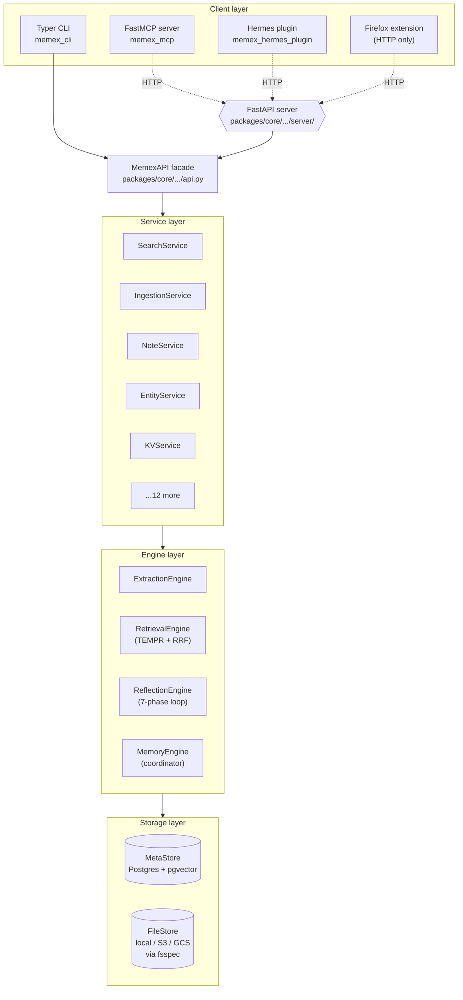

# High-level architecture

When you call `memex_memory_search("when did we ship the JWT rotation?")` from a Claude Code session, a lot of code runs between the call site and the answer. A short request travels across a process boundary, hits a web framework, lands on a Python class that pretends to be the whole system, gets routed through a service that owns the policy of *what* to search, and then through an engine that owns the policy of *how*. Two storage backends do the actual reading. You get a list of memory units back.

This page is about the shape of that journey. Once you can see the four layers — facade, services, engines, storage — sitting underneath whichever client called in, most of the codebase falls into place: you know where to look when something breaks, and you know where new code goes.

## Context

Memex stores notes as Markdown files in a FileStore and indexes their extracted facts in a PostgreSQL database with `pgvector`. Everything an agent or a human does with Memex — adding a note, searching for a fact, asking what an entity is connected to, deprioritising a stale memory — flows through the same architecture. That architecture sits inside a Python monorepo of eight packages, glued by `uv`, with the heavy work concentrated in one of them.

If you have read the [memory primitives explanation](memory-types.md), you already know what kind of thing Memex stores. This page is about *how the running system is put together to hold that storage model up*. The two pages compose: the first tells you what the data is, this one tells you which moving part owns which piece of behaviour.

## The four-layer model

You can think of Memex as four layers stacked between an agent and a Postgres database. Each layer has one job, and each layer only knows about the layer directly below.



What each layer owns:

- **Clients** translate one transport — keyboard, MCP tool call, Hermes adapter, browser POST — into a method call on a Python class. They never touch the database.
- **The facade** is one class, `MemexAPI`, that exposes every capability the system offers as a normal Python method <code-ref path="packages/core/src/memex_core/api.py" lines="156-250" />. You can use the same class from the CLI in-process, or you can stand up an HTTP server that calls it from FastAPI route handlers, and the calling code is the same shape. The facade owns dependency wiring and almost nothing else.
- **Services** own *what* and *when*. `SearchService` decides which vaults to scope a search to and how to build a `RetrievalRequest`; `IngestionService` decides when to call extraction; `NoteService` owns note lifecycle. Each service is a single class, narrow on purpose <code-ref path="packages/core/src/memex_core/services/" lines="1-100" />.
- **Engines** own *how*. The `RetrievalEngine` runs the five-strategy TEMPR pipeline, fuses results with Reciprocal Rank Fusion, applies the cross-encoder reranker, and diversifies with MMR <code-ref path="packages/core/src/memex_core/memory/retrieval/engine.py" lines="353-410" />. The `ExtractionEngine` chunks notes and calls DSPy. The `ReflectionEngine` runs the seven-phase Hindsight loop. The `MemoryEngine` is a thin coordinator that holds references to all three <code-ref path="packages/core/src/memex_core/memory/engine.py" lines="133-173" />.
- **Storage** is the only layer that talks to disk and to Postgres. `MetaStore` is the SQLModel async-session factory in front of `pgvector` <code-ref path="packages/core/src/memex_core/storage/metastore.py" lines="20-80" />. `FileStore` is an `fsspec`-backed Markdown store with local, S3, and GCS implementations behind a single abstract base <code-ref path="packages/core/src/memex_core/storage/filestore.py" lines="111-200" />.

The arrows in the diagram point one way. Engines don't call services, services don't call route handlers, and storage never calls anything above it. When you find yourself wanting to break that rule, you have probably picked the wrong layer for the change.

The four boxes are deliberately uneven in size. The facade has one class. The services package has roughly twenty. The engines package is the largest layer by line count, because the algorithms live there. The storage layer is two abstract base classes plus thin concrete implementations. The shape — a thin top, a wide middle, a thin bottom — is the shape of most systems where the work concentrates in one place but the seams stay clean.

### What "owning a decision" looks like in practice

A useful way to keep the boundaries clear is to ask, for a given decision, *which layer is wrong if the decision is wrong?*

- *"The search returned three results from the wrong vault."* Wrong layer: services. `SearchService` picks vaults; the engine has no idea what a vault is supposed to mean.
- *"The search returned the right vaults but in a strange order."* Wrong layer: engines. The retrieval engine owns the ranking.
- *"The HTTP call returned a 401."* Wrong layer: clients (the FastAPI dependency tree). `require_read` runs before any service is touched.
- *"The note's body on disk is half-written."* Wrong layer: storage. The filestore owns durability.
- *"The MCP call returned a schema-validation error."* Wrong layer: the MCP server's Pydantic annotation, before any of the above ran.

If the answer to "which layer is wrong" is "two of them at once", it usually means the wrong layer is the one that should have owned the decision cleanly but didn't. That is the case to fix.

## What happens during a `memex_memory_search` call

Walk through a single call. An agent in a Claude Code session asks:

```text
memex_memory_search(query="when did we ship JWT rotation?")
```

What happens, in order:

**1. The MCP server receives the call.** The FastMCP server registers `memex_memory_search` as a tool with explicit parameter types and a description that includes the layer-routing primer <code-ref path="packages/mcp/src/memex_mcp/server.py" lines="1434-1448" />. FastMCP validates the JSON the agent sent against the Pydantic schema and hands the validated kwargs to the tool function.

**2. The MCP server forwards to the running Memex server over HTTP.** This is the surprise: the MCP server does *not* import `MemexAPI` directly. During its lifespan, it constructs a `RemoteMemexAPI` — an HTTP client pointed at the Memex server URL — and stashes it in the request context <code-ref path="packages/mcp/src/memex_mcp/lifespan.py" lines="19-60" />. The tool body calls `api.search(...)` on that remote client, which serialises the request and POSTs it to `/api/v1/memories/search` <code-ref path="packages/common/src/memex_common/client.py" lines="398-450" />. This split keeps a fast-restarting MCP process separate from the heavyweight server process that owns the Postgres connection pool.

**3. FastAPI routes the request.** The `search_memories` handler receives the JSON, parses it into a `RetrievalRequest` model, runs the auth check, and calls `api.search(...)` on an *in-process* `MemexAPI` — this time the real one, constructed during server startup <code-ref path="packages/core/src/memex_core/server/retrieval.py" lines="28-65" />. The handler is small on purpose: deserialise, authorise, delegate, stream back as NDJSON.

**4. The facade delegates to the service.** `MemexAPI.search` is six lines that forward to `self._search.search(...)` <code-ref path="packages/core/src/memex_core/api.py" lines="1517-1570" />. No business logic lives here. The facade's job is to expose a stable, ergonomic surface; the real work belongs lower down.

**5. The service resolves vaults and builds a request.** `SearchService.search` decides which vaults to read from — the explicit `vault_ids` if supplied, every vault if the caller passed the wildcard, or the configured default reader vault — and packages the call into a `RetrievalRequest` <code-ref path="packages/core/src/memex_core/services/search.py" lines="58-120" />. Then it opens a session on the metastore and hands the request to `MemoryEngine.recall`.

**6. The memory engine calls the retrieval engine.** `MemoryEngine.recall` is a thin pass-through: it calls `self.retrieval.retrieve(...)` and, if entities were touched, schedules a background coroutine to update their resonance counters <code-ref path="packages/core/src/memex_core/memory/engine.py" lines="291-330" />. The coordinator does not run any retrieval logic itself; it owns the lifecycle and the background-task seam.

**7. The retrieval engine does the actual work.** `RetrievalEngine.retrieve` runs the TEMPR pipeline: expand the query if asked, compute embeddings, run the five strategies in a single SQL CTE, fuse them with RRF, hydrate the candidates, apply the cross-encoder reranker, diversify with MMR <code-ref path="packages/core/src/memex_core/memory/retrieval/engine.py" lines="479-540" />. This is the only layer that knows how retrieval is shaped. Swapping the reranker or changing the fusion math is a one-layer change.

**8. The storage layer answers the SQL.** Every database read happens through the async session that the metastore yields <code-ref path="packages/core/src/memex_core/storage/metastore.py" lines="59-80" />. The engine does not know whether the database is in a testcontainer, a managed Postgres, or running on the same host — only the metastore implementation knows.

The response unwinds back up the stack: storage returns rows, the engine returns ranked units, the service returns the tuple, the facade returns the tuple, the route handler serialises each unit to NDJSON, the MCP server receives the stream and rewraps it as the MCP response shape, the agent sees a list of facts.

The thing to notice is how thin most of the layers are. The MCP tool body is mostly schema. The facade method is six lines. The service is about thirty. The retrieval engine is where the algorithm lives. Each layer has one decision to own.

### The shape of the request at each layer

The same call carries a different object at each layer. Watching the object change is one of the clearest ways to see the layering.

- At the **MCP boundary**, the request is JSON, validated against the tool's Pydantic schema: `{"query": "...", "limit": 10, "vault_ids": null, ...}`.
- At the **HTTP boundary**, the request is a `RetrievalRequest` wire model from `memex_common.schemas` — same fields, but with `IntentClass` and `RiskClass` enums where the JSON had strings.
- At the **facade**, the request is keyword arguments on `MemexAPI.search`. There's no request object yet — the facade keeps the surface ergonomic for Python callers who don't want to build a model just to call a method.
- At the **service**, the keyword arguments collapse back into an internal `RetrievalRequest` — but this one is the SQLModel-flavoured `RetrievalRequest` from `memex_core.memory.retrieval.models`, which carries `str | None` for the class fields because they were already validated upstream <code-ref path="packages/core/src/memex_core/memory/retrieval/models.py" lines="21-60" />. The duplication is intentional and called out in the docstring: the wire model is enum-typed for the public boundary, the internal model is string-typed for SearchService callers that have already validated.
- At the **engine**, the request is the same internal `RetrievalRequest`, but now it sits inside a database session, and the engine reads its fields directly to drive the SQL.
- At the **storage** layer, there is no request — there are SQL statements and rows.

Two `RetrievalRequest` classes living side by side is the kind of thing that looks like an oversight on first read. It is the layering working. The wire-side model lives in `memex-common` so the HTTP client and the HTTP server can agree on it without either knowing about the engine; the engine-side model lives in `memex-core` so engine evolution doesn't pull the wire schema along with it.

### The other direction: an ingest call

Search reads. Ingestion writes. The same layering applies but the engine end of the call is a different shape.

When an agent calls `memex_add_note(title="JWT rotation cadence", body=...)`, the layers traverse the same way: MCP server validates schema, posts to the HTTP server, hits the FastAPI route at `/api/v1/notes`, the route calls `MemexAPI.ingest`, the facade delegates to `IngestionService`. So far, parallel to search.

Then the engine end differs. `IngestionService.ingest` writes the Markdown to the filestore, opens a metastore session, and calls `MemoryEngine.retain(...)` — which delegates to `ExtractionEngine`. The extraction engine chunks the note, runs DSPy fact-extraction over each chunk, resolves entities, deduplicates against existing memory units, and writes the new units back through the same session. The transaction commits, the filestore write is finalised, the route returns the new note's identifiers.

Two things to notice. First, the write path involves both storage backends in a coordinated way — the Markdown goes to the filestore, the structured facts go to the metastore, and the service is responsible for keeping them aligned. Second, the engine has its own session lifecycle: the service opens the session, the engine uses it, the service commits or rolls back. No layer owns the transaction by itself; the boundary is explicit.

This is also where the resemblance to the read path peters out. Reads are mostly idempotent and mostly pure functions of the index. Writes have side effects, contradiction detection running in the background, reflection queue updates, and audit-log entries — and most of that orchestration lives in services, not in engines. The engine extracts facts; what to do with the facts once extracted is a policy decision.

## Why a facade

`MemexAPI` is the seam between the system's two front doors: the in-process CLI and the HTTP server. Without a facade, the CLI would either reach past the service layer and break encapsulation, or duplicate the wiring that the HTTP layer already does. With a facade, both call the same methods and inherit the same composition logic.

The facade also makes the construction graph explicit. Look at `MemexAPI.__init__` and you can read off, in one place, every service the system needs to wire and every dependency each service holds <code-ref path="packages/core/src/memex_core/api.py" lines="490-620" />. New services land here; new wiring is visible in one diff.

A common alternative is dependency injection through a container framework. Memex doesn't use one. The facade is the container. The trade-off is mild: the constructor is long, but the cost of reading the system is paid once, not once per request, and the wiring is a single grep away.

The other alternative considered — and rejected — was letting each transport build its own wiring. The MCP server would compose its own engines; the CLI would compose its own; the HTTP server would compose its own. That works for small systems and falls apart for large ones, because the moment a new service lands you have three wire-up sites to update and three places drift can creep in. The facade pattern pays the cost of one extra layer for the benefit of one place to wire.

## Why the MCP server proxies over HTTP

The split between MCP server and Memex server is worth naming explicitly, because it surprises people on first read.

When Claude Code spawns the MCP server, the MCP process is short-lived, restartable, and isolated from the long-running Memex server. The MCP process holds no database connection of its own; it holds an HTTP client. Every tool call from the agent traverses an `httpx.AsyncClient` to the Memex server, which owns the Postgres connection pool, the embedding model, the reranker, and the disk.

The benefit is operational: you can restart the MCP server without disturbing the engine. You can run multiple MCP servers — one per agent harness — against the same Memex server. You can put the Memex server on a different machine. You can swap the MCP transport for an HTTP transport without changing the engine.

The cost is one extra hop per call. For a search that already does a cross-encoder rerank and an MMR diversification, the HTTP overhead is small. For high-volume telemetry you would notice it; for an agent-driven workload it does not register.

## Why eight packages

You could put every line of Python in one package, import everything from `memex`, and call it done. Memex is split eight ways for three reasons.

**Independent deployment.** The MCP server, the Hermes plugin, the Firefox extension, and the Memex server itself are four different runtime artifacts with four different release cadences. The package boundary lets you ship the MCP server without rebuilding the eval suite, or roll the Hermes plugin forward without touching the CLI.

**Optional dependencies.** `memex-core` pulls in heavy machine-learning libraries — embedders, rerankers, ONNX runtimes. A CLI user who only wants to type `memex note add` shouldn't pay that cost on install. `memex-cli` declares `memex-core` as an *extra*: `pip install memex-cli[server]` brings the engine in, plain `pip install memex-cli` does not.

**A boundary the type checker can enforce.** When `memex-mcp` imports a type from `memex-core`, mypy makes sure that import goes through the public surface — the schemas in `memex-common`, the facade, or the documented entry points. Imports that reach into private internals get flagged. A single-package layout has no such fence.

The cost is the usual cost of monorepo packaging: more `pyproject.toml` files, more publish steps, more careful handling of cyclic dependencies. The `uv` workspace soaks up most of that — `uv sync` resolves all eight in one go — and the dependency graph is intentionally tree-shaped, with `memex-common` at the root and no cycles allowed.

The graph is small enough to remember. `memex-common` carries the schemas everyone shares and depends on nothing. `memex-core` is the engine. `memex-mcp`, `memex-cli`, `memex-eval`, and `memex-hermes-plugin` each depend on `memex-common` (and on `memex-core` if they need the engine). The two non-Python packages — `claude-code-plugin` and `firefox-extension` — talk to the running Memex server over HTTP and don't import Python at all.

One specific cycle that the graph forbids: the engine cannot import from a client package. If `RetrievalEngine` ever wanted to know about the MCP context, that would be a cycle (`mcp → core` already exists, so `core → mcp` would close the loop). The fact that the dependency check fails the build before the cycle ships is exactly the kind of guardrail the package boundary buys you. Without it, the cycle would be invisible until somebody tried to package the engine alone.

### Where each kind of code lives

If you are new to the codebase, a useful map by intent:

- *I want to change how a retrieval strategy scores candidates.* `packages/core/src/memex_core/memory/retrieval/engine.py` — the engine owns the algorithm.
- *I want to add a new field to the search response that the agent sees.* Two places: the wire schema in `packages/common/src/memex_common/schemas.py`, and the response builder in the FastAPI route handler.
- *I want to add a new MCP tool.* `packages/mcp/src/memex_mcp/server.py` — a new `@mcp.tool` decorator on a function that calls the facade.
- *I want to change vault scoping logic.* `packages/core/src/memex_core/services/search.py` — the service owns the policy.
- *I want to change the storage path for note Markdown.* `packages/core/src/memex_core/storage/filestore.py` — but consider whether a config knob would do, before touching the storage class.

The map is reductive — many features cut across more than one of these — but it is a good first guess.

## What the layering means for you

When something breaks, the layer tells you where to look.

- **The MCP tool returns a 422 / 4xx.** Schema validation failed at the FastMCP boundary — start in `packages/mcp/src/memex_mcp/server.py`, look at the Pydantic `Annotated` definitions on the tool parameters. The MCP server never made it as far as the HTTP call, so the Memex server logs will show nothing for the request.
- **The HTTP call returns a 5xx.** The error came from the FastAPI handler or below. Start at the route in `packages/core/src/memex_core/server/`, follow the call to the facade, the service, and as far down as the traceback points. The exception class often tells you which layer raised it — `MemoryUnitNotFoundError` is a service error, `IntegrityError` is storage, plain `RuntimeError` from a model load is the engine.
- **The search results look wrong.** Ranking is the retrieval engine's job. Start at `RetrievalEngine.retrieve` and walk the strategies, the RRF fusion, the reranker, the MMR step. Pass `debug=True` on the call to get the engine's internal scoring laid out per-candidate.
- **The data on disk disagrees with the database.** Storage layer. Read the `FileStore` write path and the metastore transaction it pairs with — a partial write from one side without a commit on the other is the usual cause.
- **A vault scope is being ignored.** That's a service-layer policy. `SearchService` decides which vaults to read from; check there before suspecting the engine.
- **A new column on `MemoryUnit` is `NULL` after a fresh ingest.** That's an engine-to-storage path. The column belongs to the schema in `sql_models.py`, but it gets populated during extraction in `ExtractionEngine`. Check that the engine knows about the new field before you suspect the migration.
- **A capability works in the CLI but not from MCP.** The two paths share the facade but differ in transport. The CLI calls `MemexAPI` in-process; MCP calls it over HTTP. Either the route handler isn't forwarding a parameter, the wire model is missing a field, or the MCP tool body isn't passing it down. Walk the seam.

When you add a new feature, the layer tells you where the code goes.

- **A new MCP tool that wraps existing behaviour.** The tool body goes in `packages/mcp/src/memex_mcp/server.py`. It calls the facade. If the facade doesn't have the method, that's the next stop — and the discussion is about whether the capability deserves a facade method or whether it belongs entirely within a service.
- **A new way to scope or filter an existing search.** That is policy — it lives in the service layer. Add a parameter to `SearchService.search`, plumb it through the `RetrievalRequest`, and pass it down. Add a matching field to the wire-side `RetrievalRequest` in `memex_common.schemas` so HTTP callers can pass it too, and remember to thread it through the FastAPI route handler.
- **A new ranking signal.** That is mechanism — it lives in the engine. The service has no opinion on how the cross-encoder is configured; it just builds the request and reads the results.
- **A new storage backend.** Subclass `BaseAsyncFileStore` or `AsyncBaseMetaStoreEngine`. The layers above don't change. The fact that the engine never imports a concrete storage class is the whole point of the abstract base.
- **A whole new memory operation that doesn't fit any existing service.** Add a new service class to `memex_core.services`, wire it into `MemexAPI.__init__`, expose a facade method, then add the HTTP route, then add the MCP tool. The order matters: build inside-out so each layer is exercised by its tests before the next one lands on it.

The layering is not a moral preference. It is a tool for change. When a new feature touches one layer cleanly, it ships fast and rarely regresses. When a feature wants to touch three layers, that is the system asking you to sharpen the design before writing the code.

### A worked example of "where does this go"

Imagine you want to add a feature: when an agent searches with `apply_pre_filter=False` (the "show me everything, including stale stuff" path), the system should also emit a structured log line so an operator can audit how often that bypass is used.

Walk the layers in order:

- **Engine?** No. The engine doesn't know what is interesting to operators; it knows how to rank. A logging concern that depends on *which caller* is using the engine doesn't belong here.
- **Service?** Yes. `SearchService` is the layer that already inspects the `apply_pre_filter` flag and forwards it to the engine. Add the structured log there, where the call's intent is still visible.
- **Facade?** No. The facade is a delegator. Putting logging here would mean writing the same log line every time a new caller appears.
- **Route handler?** No, for the same reason — the handler is a thin wrapper. The fact that the call came over HTTP is incidental to the audit you care about.

One layer. One file. One commit. That is the test of a clean layering: the smallest change that does the job is the right change.

The opposite test is also useful. If the obvious place to add a new feature is "modify three layers at once", stop and ask whether you have the abstractions right. Sometimes you do — cross-cutting concerns like tracing and metrics legitimately reach across layers. Most of the time you have a layering bug in your head that the code is patiently waiting for you to notice.

## Storage in a little more detail

Two storage abstractions sit at the bottom of the stack, and they answer two different questions.

**MetaStore** answers *"what do we know about the data?"* — every fact, every entity, every memory link, every key-value entry, every reflection-queue row. It is a PostgreSQL database accessed through SQLModel async sessions. The base class is an abstract `AsyncBaseMetaStoreEngine` that defines `connect`, `close`, and `session()` <code-ref path="packages/core/src/memex_core/storage/metastore.py" lines="20-80" />. The concrete subclass `AsyncPostgresMetaStoreEngine` wires the connection pool, sets the session timezone to UTC, and applies a statement timeout. Tests can substitute a different subclass — testcontainers is the production-shaped one — and the engines and services above don't know the difference.

**FileStore** answers *"what is the source content?"* — the Markdown notes themselves, plus any assets the agent saved alongside them. The base class is `BaseAsyncFileStore` <code-ref path="packages/core/src/memex_core/storage/filestore.py" lines="111-200" />. Concrete subclasses are `LocalAsyncFileStore` for the developer laptop and `S3AsyncFileStore` for production-ish deployments. Both ride on `fsspec`, which means a third or fourth backend is a couple of dozen lines, not a refactor.

The two stores deliberately do not know about each other. A note's content lives in the filestore; its facts and metadata live in the metastore; the two are linked by ID. The agent never sees this split — the service layer presents notes as a single thing. The split exists because Markdown is a poor fit for a relational schema and a relational database is a poor fit for free-text source.

## How the engine layer wires itself

`MemoryEngine` is the only class in the engine layer that the service layer talks to. Inside, it composes three peers — `ExtractionEngine`, `RetrievalEngine`, and `ContradictionEngine` — and exposes three verbs that map to the Hindsight phases <code-ref path="packages/core/src/memex_core/memory/engine.py" lines="133-175" />:

- `retain(...)` runs the extraction pipeline on new content.
- `recall(...)` runs the retrieval pipeline against an existing index.
- `reflect(...)` runs the seven-phase reflection loop on an entity.

The coordinator's body is small. `recall` is a pass-through to `RetrievalEngine.retrieve` plus a background-task scaffold for resonance updates <code-ref path="packages/core/src/memex_core/memory/engine.py" lines="291-330" />. The interesting code is one layer down.

`RetrievalEngine` holds the embedder, the reranker, the NER model, the query expander, and the anisotropy corrector. Its `retrieve` method runs the pipeline in eight visible steps: query expansion, embedding, budget calculation, the five-strategy SQL CTE that does the heavy fusion, hydration, optional reranking, MMR diversification, and the resonance hook <code-ref path="packages/core/src/memex_core/memory/retrieval/engine.py" lines="479-540" />. Each step is a private method with a clear input and output, so swapping any one of them is a contained change.

That pattern — coordinator on top, specialised engines underneath, every step a method you can read in isolation — is how the engine layer holds up under churn. Retrieval changes constantly; the surface that the service sees doesn't.

## Putting it together

If you have read this far, you have a mental model that should hold up against most of the codebase. Restated as one paragraph:

A Memex installation is a long-running Python process serving HTTP from a FastAPI app, fronted by short-lived client processes that translate one transport into a method call on `MemexAPI`. The facade owns construction and delegation. Services own policy: which vaults, which filters, which lifecycle. Engines own algorithms: how extraction, retrieval, and reflection actually run. Storage owns durability: Postgres for structured data, an `fsspec`-backed filesystem for Markdown. The whole thing fits into eight packages so each artifact can ship on its own schedule, and the layering means most changes touch one file.

Two cross-cutting concerns deserve a closing note. First, the dual-`RetrievalRequest` pattern — one in `memex-common` for the wire, one in `memex-core` for the engine — generalises to other places where the public schema needs to evolve at a different speed than the internal call signature. When you see it, that is the layering working, not the layering bleeding. Second, the MCP-over-HTTP split looks like an extra hop until you operate a vault that two agents are reading at once; then it is a feature.

The four-layer model is not unique to Memex. It is roughly what you would draw on a whiteboard for any system whose front door is "a request" and whose back door is "a database". The reason it is worth naming explicitly is that the value is not in the picture; it is in the discipline of holding the lines once they are drawn.

### What this page deliberately leaves out

A high-level architecture page that tries to be exhaustive is a high-level architecture page that nobody finishes reading. A few neighbouring topics that touch this one but live elsewhere:

- **The Hindsight framework and the TEMPR retrieval pipeline.** The engine layer runs the algorithm; the algorithm itself — why five strategies, why RRF, why a cross-encoder reranker — is its own explanation. Start with the retrieval explanation page when you want that depth.
- **The reflection loop.** `MemoryEngine.reflect(...)` runs a seven-phase pipeline that synthesises mental models out of raw memory units. That is a substantial enough subsystem to deserve its own page, and it has one.
- **Contradiction detection.** Every ingest can spawn a background `ContradictionEngine` task that looks for facts that disagree with the new one. The wiring lives in the engine layer; the policy of what to do when contradictions appear lives in services and reflection.
- **The agent-surface tiers.** MCP tool descriptions, the `compose_universal()` body, the Hermes briefing — three tiers of agent-facing prose with token budgets enforced by tests. None of those are part of the runtime architecture in the sense this page uses; they are content shipped to LLMs.
- **The scheduler and leader election.** The reflection queue is drained by a background scheduler that uses Postgres advisory locks for leader election. That is a runtime-operations concern, not an architectural one.

Each of those would make this page twice as long without sharpening the four-layer story. They have their own homes, and crossing the page boundary is cheaper than crossing the boundary in your head halfway through reading.

### A note on testing across layers

The layering is not just an organising idea — it is also the structure that the test pyramid hangs off.

Engine-level tests run against in-memory fakes or a real testcontainer Postgres and exercise the retrieval algorithm without the service layer's vault scoping. Service-level tests build a service with mocked engines and check policy decisions: which vaults get queried, what happens when no results come back, how filters compose. HTTP-level tests spin up the FastAPI app and hit it with `httpx`, checking that the wire schema round-trips correctly. MCP-level tests use the FastMCP test harness and confirm the tool surface is what the agent will see.

Each tier of the test pyramid maps onto one layer of the architecture, and the boundary between tiers is exactly the boundary between layers. That is not a coincidence; it is the design paying back its other half. Layers that don't have clean boundaries are layers you can't test in isolation.

You will sometimes see a test that crosses two layers — for instance, the eval suite, which exercises real ingestion against a real engine against a testcontainer database. That is a deliberate trade: the eval suite is checking *behaviour* end-to-end, not *contracts* at the seam. Both kinds of test matter; they are not substitutes for each other.

### The deployable shape

Worth naming, briefly: when Memex runs in production-ish mode, you end up with a handful of processes, not one.

- The **Memex server** — the FastAPI app — is long-running, holds the Postgres connection pool, and owns the embedding model and reranker in memory.
- The **scheduler** runs as a separate worker process that drains the reflection queue. Multiple schedulers can run; one wins the Postgres advisory lock and acts as leader.
- The **MCP server** runs once per agent harness and proxies to the Memex server over HTTP.
- The **Firefox extension** runs in the browser and talks to the Memex server over HTTP.

The deployable shape mirrors the package shape, which mirrors the layering. That is the deepest payoff of getting the architecture right: a clean idea at the top of the stack pays you back at the bottom, where it determines what you can deploy, what you can restart without dropping state, and what you can scale independently.

That payoff is also the test you should hold any future Memex change to. A change that improves a layer without polluting its neighbours is a change that compounds. A change that smears responsibility across layers is a change that will cost you the next time someone — maybe you — has to extend it. The four-layer model is not the end of the story; it is the frame against which the rest of the story makes sense.

## See also

- [Tutorial: ingest your first note](../../tutorials/first-note.md)
- [How-to: configure a custom retrieval strategy](../../how-to/configure-retrieval.md)
- [Reference: MemexAPI methods](../../reference/memex-api.md)
- [Explanation: memory types](memory-types.md)

If you only remember one thing from this page: the layer that owns a decision is the layer you should change to fix it, and resisting the urge to fix it somewhere more convenient is the difference between a system that compounds and one that calcifies.
