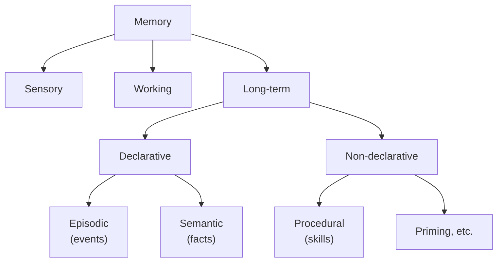

# Memory types

Imagine a Tuesday afternoon. You ask your agent: "what does deploy mean for this project — staging or production?" The agent has to find one fact. A different Tuesday, you ask: "how do I usually write a pull-request title in this repo?" Same agent, same vault, but a very different question — the first asks the agent to *know* something; the second asks it to *do* something the way you would.

A third Tuesday. You ask: "what did we decide about retry timeouts in April?" Same agent, same vault again. This time the answer hinges on *when* — a fact that was true last spring, anchored to a meeting on a date. Three questions, three answers, three different shapes of memory.

Memex stores each shape in a different place, and the rest of this page is about why.

## Context

A working memory system has to hold several different kinds of things at once. Time-stamped events from yesterday's stand-up. Stable facts that survived a hundred reads. Recipes the user prefers when the agent commits or deploys. The thread of the current conversation. None of these wants the same substrate: events want a timeline, facts want similarity search, recipes want fast key lookup, the conversation wants to disappear when you close the tab.

Cognitive science worked this out a long time before LLMs did. Endel Tulving's taxonomy splits human memory into substrates that match how the brain actually behaves: sensory buffers that decay in milliseconds, working memory that lives in attention, long-term stores that split into things-you-know and things-you-can-do. The result is a useful map of what kinds of memory exist at all.

Memex borrows the map without claiming to instantiate the underlying neuroscience. When this page says a note is "episodic", it means the substrate plays the operational role of episodic memory — time-stamped, source-attributed, retrievable by *when* — not that the substrate is literally an episodic-memory module in any cognitive sense. That distinction matters when you are deciding where to store something: pick the substrate by what behaviour you need, not by the label.

## Model

Two framings are useful. The first comes from cognitive science and shows you how memory in general decomposes. The second is the framing the agent surface uses every day — three questions you can ask of any storage decision.

### The cognitive-science taxonomy

Read left to right. *Sensory* memory is the briefest — raw perception. *Working* memory is what you hold in attention right now. *Long-term* memory splits into *declarative* (things you can name and report) and *non-declarative* (things you do without thinking). Declarative further splits into *episodic* (time-stamped events from your own past) and *semantic* (general facts about the world). Non-declarative is dominated by *procedural* memory — knowing how to ride a bike, how to type, how to write a pull request the way this team writes them.

### The pragmatic agent-facing split

The taxonomy is true but rarely helpful when you are at a keyboard deciding where a piece of information goes. A shorter test serves better:

- **"Do something"** → procedural memory. A recipe, a convention, a way of doing a task in a given context.
- **"Know something"** → semantic memory. A fact the agent should be able to recall and reason about.
- **"Need context"** → episodic memory. The thing that happened, with its date and source attached.

Three questions, three substrates. You can answer the questions in any order; whichever fires first picks the substrate.

## Mechanism

Each substrate maps to one part of Memex. The mapping is operational — the substrate plays the role, it does not claim to be the cognitive construct. Walk through them from shortest-lived to longest-lived.

### Sensory memory: not applicable

Memex is a text system; agents receive text, not raw perception. There is no sensory buffer because there is nothing for one to hold. The taxonomy box stays on the diagram for completeness, but the row in the substrate table is empty.

### Working memory: per-request context

When an HTTP request lands on the FastAPI server, Memex sets a process-local `ContextVar` to a session identifier and an actor identifier. Every downstream call — the service, the engine, the storage layer — reads the same `ContextVar` to know which session is talking and on whose behalf <code-ref path="packages/core/src/memex_core/context.py" lines="8-12" />. The session ID is a random UUID by default; a background task sets it explicitly to a labelled value through an `asynccontextmanager` so logs and traces can be joined <code-ref path="packages/core/src/memex_core/context.py" lines="44-56" />.

This is "working memory" in the operational sense: it scopes one request and disappears when the request ends. It is *not* a per-agent-session memory — a Claude Code session that spans an hour of conversation does not live in this `ContextVar`. Cross-turn state for an agent's working memory belongs to the agent harness; Memex's `ContextVar` only spans the lifetime of one HTTP call or one background job.

The split has a practical consequence. Features that look like they would need implicit attribution from a session — recording an outcome on the last retrieved unit, deprioritising the one you just decided was wrong — use explicit tool calls with the unit ID, never an inferred "what did the agent last see" lookup. The agent has to *name* the memory unit it is acting on. That is more verbose than letting the server guess, but it survives concurrent sessions, parallel tool calls, and replays without confusion.

### Episodic memory: notes

Each note in Memex is a timestamped, source-attributed document. The `Note` row carries the original text, an optional `publish_date` for the event the note describes, a `created_at` for when it was ingested, and a `doc_metadata` JSON blob for arbitrary source information (URL, author, file path) <code-ref path="packages/core/src/memex_core/memory/sql_models.py" lines="222-330" />. Notes are content-hashed so re-ingesting the same file twice does not create two rows.

A note plays the episodic role: it is *about* an event in time, and you can retrieve it by *when*. To make that work, both `memex_memory_search` and `memex_note_search` take a `reference_date` parameter — relative phrases in the query, like "last week", resolve against that timestamp instead of the wall clock <code-ref path="packages/mcp/src/memex_mcp/server.py" lines="1531-1540" />. The same date hooks live on `memex_survey` so a panoramic question can be scoped to a window <code-ref path="packages/mcp/src/memex_mcp/server.py" lines="3518-3537" />.

Concrete example. You drop the minutes of last Friday's design review into the vault. The ingest creates one `Note` row, breaks the body into `Chunk` rows, extracts facts into `MemoryUnit` rows. Six weeks later you ask "what did we decide about retry timeouts in April?" The query carries `reference_date="2026-04-30T00:00:00Z"`; the note retrieval filters by that window; the design-review note surfaces with the right facts attached. The note was the episodic anchor — without its timestamp the retrieval has no temporal handle.

A second example shows the same substrate doing different work. You ingest a daily journal entry from Monday and another from Wednesday. Each note carries its own `publish_date`. When you later ask "what was I working on on Tuesday?" the search returns no Monday or Wednesday hits — the temporal anchor cuts cleanly. When you ask "what was the energy of the week?" the same notes surface as a small batch, ordered by date, and the agent can summarise the arc without you having to name every note by hand. The episodic substrate is the same; the retrieval shape changed.

### Semantic memory: memory units, mental models, entities

Most of what Memex stores is semantic — facts that survive the moment they were captured in. Three substrates carry the load.

The atomic unit is the `MemoryUnit`: one extracted claim, with text, a 384-dimensional embedding, an `event_date`, a fact type (`world` / `event` / `observation`), success and failure outcome counters, and a deprioritisation flag <code-ref path="packages/core/src/memex_core/memory/sql_models.py" lines="556-654" />. A note becomes many memory units during extraction; each unit is independently retrievable, reranked, and outcome-weighted. The `event_date` lets a fact extracted today be filed under the date it actually describes.

The `Entity` row sits above the units. Entities are global — the same person, organisation, or concept is one row across every vault <code-ref path="packages/core/src/memex_core/memory/sql_models.py" lines="865-928" />. Entities have no Memory-Worth counters of their own; those live on vault-scoped joins. A vault-scoped `MentalModel` row aggregates observations about an entity over many units, carrying a JSONB list of observation objects, a centroid embedding, and per-entity outcome counters <code-ref path="packages/core/src/memex_core/memory/sql_models.py" lines="124-187" />. The reflection loop refreshes mental models on a cadence; agents read them through `memex_memory_search` and `memex_survey` as ordinary search hits.

Concrete example. You ingest three notes that mention `ruff`. Extraction emits memory units like "user prefers ruff over black for Python linting", "ruff is used in the memex repo's pre-commit hook", "ruff 0.4 dropped support for Python 3.8". The `ruff` entity gets one row, mentioned three times; the mental model accumulates the three observations with citations back to the source units. When you later ask "what do we use for Python linting?", the semantic search lands on the first unit by similarity, the entity graph confirms `ruff` is the answer, and the mental model's trend tells you whether the observation is recent or aging.

The semantic substrate is the bulk of what Memex stores, and three properties make it durable. First, units are *append-only* — a contradicting fact does not overwrite the older one; it lands as a new unit, and the contradiction engine links them so retrieval can show both. Second, units carry *outcome counters* — every time the user marks one helpful or not helpful, the counters increment, and the rerank step lets long-validated facts beat fresh-but-untested ones. Third, mental models *refresh asynchronously* — a reflection pass runs in the background, re-synthesises observations from the units that contributed, and writes the new version with citations preserved. The user never has to ask for the refresh.

### Procedural memory: KV under `<scope>:procedure:<verb>:<context-tag>`

A procedural memory is *how to do something the way this user wants it done*. The deploy verb the user wants. The pull-request title style the team uses. The way `write_pr` should be adapted in the `commit-style` context of this monorepo. These are not facts; they are recipes the agent applies.

Procedural memories live in the key-value store under keys shaped like `<scope>:procedure:<verb>:<context-tag>`, where `<scope>` is one of `global`, `user`, `project:<id>`, or `app:<id>`. The key format is enforced by a strict parser — the suffix `<verb>:<context-tag>` uses lowercase identifiers (`[a-z][a-z0-9_-]*`), and the scope prefix is the same one used by every other KV namespace <code-ref path="packages/core/src/memex_core/services/kv.py" lines="89-140" />. The agent owns the verb (`write_pr`, `run_tests`, `deploy`); Memex stores observations about how to *adapt* that verb to the named context. The default scope is `global:`; use `project:<id>:procedure:*` only on an explicit project cue. Bare `procedure:*` (no scope prefix) is rejected.

Writes to a procedure key are not plain upserts. The KV service wraps the value in a versioned JSON envelope, increments the version on every write, and pushes the previous value into a capped five-entry history kept inside the same row. Optimistic concurrency on the version field protects against lost updates <code-ref path="packages/core/src/memex_core/services/kv.py" lines="178-260" />. Last-writer-wins on the active value, but you can always read the recent history.

Concrete example. The user says: "when you write a PR title, lead with the package name in square brackets." The agent writes `global:procedure:write_pr:commit-style` with the recipe as the value (calling `memex_kv_put` on the MCP surface or `memex kv put` on the CLI <code-ref path="packages/mcp/src/memex_mcp/server.py" lines="3275-3306" />). Three weeks later the user revises the style. The agent writes the new value to the same key; the old value falls into the row's history list, the version bumps to 2, and the next session reads the new convention with the previous one preserved for context. If the same convention only applies to one repo, the agent writes it under `project:<repo-id>:procedure:write_pr:commit-style` instead.

The version-and-history shape is what distinguishes procedural KV writes from a plain upsert on, say, `user:editor`. A preference is a single fact; you change it, the old value is gone, and the new one stands alone. A procedure is a *negotiated recipe* — the user adjusts the wording over weeks of use, sometimes reverts, sometimes splits one verb into two contexts. Keeping a small history lets the agent show its working: "you used to want the package name in parentheses; here's the current version with square brackets, here's what it replaced." That diff is not free, but at five entries the JSON envelope stays small and the read path stays a single primary-key lookup.

### Cross-context memory: global entities and cross-vault KV

Memex is multi-tenant by design. A vault is a tenant boundary, and most rows carry a `vault_id`. Two substrates deliberately cross that boundary.

Entities are global. The same `Alice` is one entity in your personal vault and in your work vault; the same `ruff` is one entity in every Python project you track <code-ref path="packages/core/src/memex_core/memory/sql_models.py" lines="865-928" />. Cross-vault lineage queries follow this: `memex_get_lineage` walks from a mental model down through observations and memory units to the source note, crossing vault boundaries when the entity is shared <code-ref path="packages/mcp/src/memex_mcp/server.py" lines="2905-2926" />.

The KV store is also cross-vault. Keys carry a namespace prefix — `global:`, `user:`, `project:`, or `app:` — and the service enforces that prefix on every write <code-ref path="packages/core/src/memex_core/services/kv.py" lines="173-200" />. A `global:lang:python:min` key applies everywhere; a `project:github.com/user/repo:vault` key applies only to that project, regardless of which vault is active. Procedure keys are scoped under one of those four namespaces (`<scope>:procedure:<verb>:<context-tag>`), not under a top-level `procedure:` namespace. Pick the namespace by the scope of the rule, not by the vault you happen to be in.

A short worked example. You ingest a note in your `work` vault that says "Alice owns the auth service." Months later, in your `personal` vault, you write "Alice recommended *Designing Data-Intensive Applications*." Two notes, two vaults, but the same Alice — and the `Entity` row is shared. When you call `memex_get_lineage` on Alice's mental model, the upstream walk hits both notes; the downstream walk from either note hits the same entity row in the middle. Cross-context retrieval falls out of the schema, not out of a special-purpose join.

### Core memory: a writer-facing convention

Identity and preference facts — *the user's name, the user's editor, the user's pronouns* — sit under the `core:*` KV namespace by convention. They live with the same enforcement as every other KV key: namespace prefix, embedding for semantic search, no special protection in the schema. There is no `is_pinned` column on `MentalModel` and no linter rule that skips `core:` entries. The protection is a discipline you keep: organise identity and preference data under a recognisable prefix so a human reviewing maintenance proposals knows what they are looking at.

This is a deliberate trade. Promoting `core:` to a first-class schema flag would force every maintenance proposal to grow a special case; keeping it a naming convention lets the existing surfaces (`memex_kv_search`, `memex_get_lint_flags`) work uniformly. The cost is that you cannot rely on the database to refuse a delete; the benefit is one fewer concept to maintain.

## Trade-offs

A few choices in this mapping deserve a second look.

**The operational mapping is not Tulving's full model.** Tulving's framework includes mental time travel, autonoetic consciousness, and a long argument about the relationship between episodic and semantic memory that does not translate to a Postgres table. Memex uses the *labels* — episodic, semantic, procedural — for substrates that play those operational roles. The labels are an aid to thinking about *where to store something*, not a claim that Memex implements the cognitive constructs the labels originally named. If a paper you are reading argues that human episodic memory does some thing Memex's notes do not, that is fine — Memex is not trying to win that argument; it is trying to keep retrieval coherent.

**Procedural memory lives in KV, not in notes.** A recipe could be stored as a note — "here's how I write PR titles for this project" — and retrieved by semantic search. The reason it lives in KV instead is access pattern: a procedural memory has to be retrieved deterministically, by exact name, every time the verb fires. Semantic search over notes would sometimes miss, sometimes return three competing recipes, sometimes return a stale one. The KV path is a fast hash lookup with a guaranteed single active value and a small audit history. The trade is that you give up free-text discoverability — but discoverability is the wrong primitive when the agent already knows the verb it is performing.

The same logic explains why semantic memories do *not* live in KV. A fact like "ruff 0.4 dropped support for Python 3.8" has no natural key the agent will know to look up; it has to be discovered by similarity or by walking the entity graph. Putting it in KV would force the writer to invent a key the reader will never guess. The pairing of substrates is deliberate: facts go where similarity search is the entry point; recipes go where exact lookup is.

One caveat on "procedural memory lives in KV". That holds for a *stated* recipe — a rule the user expressed in words ("always lint before you commit"), keyed under `<scope>:procedure:<verb>:<context>`. Memex has a second, separate procedural surface: the **procedural plane**, where procedures and strategies are *distilled from real worked episodes* (cases) rather than stated. A case there is itself a note (`notes.role='case'`), so on the procedural plane, procedural knowledge does pass through notes on its way to a derived entry. The KV path and the plane are complementary — KV holds the instruction you were given; the plane holds the recipe the system learned by doing the task. See [the procedural memory plane](procedural-memory.md) for that model.

**Working memory is per-request, not per-session.** Memex's `ContextVar` lives for one HTTP request or one background task. Agent harnesses that want longer-lived working memory keep it in their own scratchpad — Claude Code's session, Hermes's adapter, your own client's process. That keeps Memex's storage backend free of per-agent state and lets several agents share one Memex without their working memories colliding.

**Entities are global; mental models are vault-scoped.** A single `ruff` entity is shared across vaults because the canonical name is the same fact everywhere. The *understanding* of ruff in a personal Python vault differs from the *understanding* of ruff in a work monorepo, so each vault gets its own mental model row keyed on the entity. This composition lets you trace lineage across vaults (entities transit) while keeping vault-specific observations isolated. The alternative — making entities vault-scoped too — would force a cross-vault question about Alice to fan out to a join across every vault and reconcile by name; the global entity row collapses that to a single key lookup.

**Core memory is a convention, not a schema flag.** The `core:*` namespace is policed by writer discipline, not by a `is_pinned` column. Promoting protection to a schema flag was considered and rejected: every maintenance surface (the linter, the reflection refresh, the deprio engine) would have to grow a special case for one row type, and the cost of getting any of them wrong is silently dropping identity data. Keeping `core:*` as a naming convention lets the existing surfaces work uniformly, and the human reviewing maintenance proposals can recognise an identity row at a glance.

## Implications

When you are deciding where to store something, run the three questions in order.

**Is the user asking the agent to do something a particular way?** That is procedural. Use the KV store under `<scope>:procedure:<verb>:<context-tag>` (default `global:`, switch to `project:<id>:` on explicit project cue). Do not write a note describing the procedure — semantic search will not reliably retrieve it at the moment the verb fires, and the recipe will drift away from the verb it adapts.

**Is the user telling the agent a fact?** That is semantic. Add a note; let extraction emit memory units; let reflection refresh the mental model on its own cadence. The fact will be retrievable by similarity, by entity, by graph traversal, and by date — four routing strategies, one substrate.

**Does the answer depend on when it happened?** That is episodic, and notes already carry the timestamp. The episodic and semantic substrates share the same physical rows (notes and the memory units that come from them); the difference is which retrieval strategy you reach for. Time-bounded queries flow through the same search tools, with `reference_date` set to the anchor you want.

**Is this a preference, a binding, or a setting?** That is KV-shaped, but probably not procedural. Use the namespace that matches the scope cue: `user:` for "I prefer", `project:<id>:` for "in this repo", `app:<app-id>:` for "when I use this tool", `global:` for "company-wide". The right namespace is the one whose name you would say out loud when explaining the rule to a colleague.

**Is the answer about the running session?** That is working memory, and it belongs to the agent harness, not to Memex. Memex's `ContextVar` is too short-lived to carry the conversation thread; the harness scratchpad is what survives across turns.

**Is this identity?** The user's name, pronouns, preferred editor, company affiliation — put it in `core:*` KV. Treat the namespace as a hint to your future self and to maintenance code: this is a row you should not casually delete.

The map is small. Three questions, five substrates, one writer-facing convention for identity. Most decisions take one breath. The hard ones — where a piece of information looks procedural but also semantic, or where the user's intent could be a preference or a procedure — are worth pausing on, because the substrate you pick shapes how the information will be retrieved a year from now. When in doubt, ask which retrieval pattern the agent will actually use to surface it: similarity, exact key, or time anchor. That answers the storage question.

### Walking the three Tuesdays

Bring the three opening questions back through the map.

**"What does deploy mean for this project — staging or production?"** The agent is about to *do* something — run a deploy verb — and it needs the user's adaptation of that verb to this project. That is procedural. The agent reads `project:<id>:procedure:deploy:<context>` directly, gets the active value, and proceeds. If the key is missing, the agent asks; if the key has a five-entry history showing a recent revision, the agent uses the active value and surfaces the change if the user seems unsure.

**"How do I usually write a pull-request title in this repo?"** Same shape — a verb (`write_pr`) adapted to a context (the repo). The agent reads `project:<repo-id>:procedure:write_pr:<context>`. The retrieval is one primary-key lookup; the recipe is right or it is absent, never almost-right.

**"What did we decide about retry timeouts in April?"** This one is episodic-flavoured semantic. The agent calls `memex_memory_search` with the query string and `reference_date="2026-04-30T00:00:00Z"`. The semantic strategy retrieves units about retry timeouts; the temporal filter narrows to April; the rerank step pushes outcome-validated facts up; the answer comes with citations to the design-review note that captured the decision. The note is the episodic anchor, the units are the semantic payload, and the entity graph provides the bridge if the user later asks "who owns retry policy?"

Three Tuesdays, three substrates, no ambiguity once you have the map.

## See also

- [Tutorial: Getting started](../../tutorials/getting-started.md)
- [How-to: Use the key-value store](../../how-to/key-value-store.md)
- [Reference: data model](../../reference/data-model.md)
- [Explanation: high-level architecture](high-level-architecture.md)
