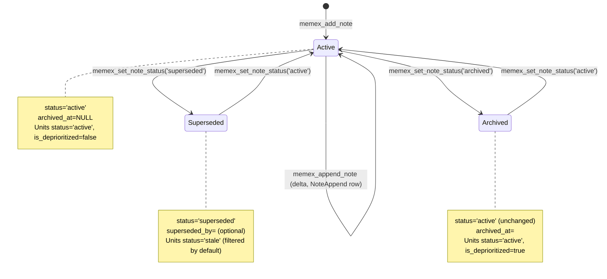

# About the note lifecycle

You write a meeting note on Tuesday. On Friday a follow-up meeting changes one of the decisions. Two months later, the file is closed and you want it out of search. Each of these is a change to the *same note*, but the change has a different shape — extend the body, mark the old decision wrong, take the note off the agent's default surface. Memex handles each with a different verb and writes the change as new history rather than overwriting what was there.

That choice — write a new row, never edit an old one — runs through every lifecycle operation. The rest of this page walks the four states a note can be in, the verbs that move it between them, and what those moves do to the memory units the note produced.

## Context

Imagine an operator a year from now, looking at a vault and asking: "we used to ship deploys on Fridays — when did that change?" If the note that originally captured the Friday-deploy convention was edited in place six months ago, the answer is gone; the row carries only the post-edit body. If the note was replaced by a newer one with no link between them, the answer is still gone — there is nothing in the schema to walk back from. The only way the operator gets a real answer is if the lifecycle of the note left a trail of rows the operator can read.

Memex is built on the principle that nothing about a memory should disappear without leaving an audit trail. The design document calls this **P6 (lineage)** — every memory unit must trace back to the source note that produced it, and every change to that note must leave a record a later reader can follow. If you "edit" a note in the colloquial sense, the system needs to know which old facts were retired, which new facts replaced them, and exactly when the swap happened.

The simplest way to deliver that guarantee is to forbid edits. Notes get a *status* (active, superseded), a *chronology marker* (`appended_to`), and an *archive timestamp* (`archived_at`). To change a note's content you either extend it through a dedicated append path or create a new note that supersedes the old one. Memory units are stricter still — they are append-only: never rewritten, never deleted, only flagged.

The shape took its current form when archive moved off `Note.status` and onto a dedicated `archived_at` column. Migration 041 carried that change — the comment in the migration calls it out by name, replacing the `_deactivate_note_units` cascade for the archive path with `_deprioritize_note_units` so units stay `status='active'` and the archive becomes individually reversible <code-ref path="packages/core/src/memex_core/alembic/versions/041_archived_fsfm.py" lines="1-10" />. The earlier shape (archive flipping units to stale, just like supersession) made the two intentions indistinguishable; the new shape separates them at the schema level so the audit trail can tell which one the operator meant.

This page is about the small set of state transitions those rules allow and the cascades each transition triggers on the units below.

Concretely, a "note" in Memex is a `Note` row in PostgreSQL paired with a markdown file on disk. The row carries the title, the description, a content hash, a status, an optional `superseded_by` pointer at a replacement note, an optional `appended_to` pointer at a parent, and a nullable `archived_at` timestamp <code-ref path="packages/core/src/memex_core/memory/sql_models.py" lines="220-321" />. The file carries the body the user wrote. The row and the file together are the note; everything else — chunks, memory units, entity links — is derived from the note by the extraction pipeline and stored elsewhere.

The lifecycle verbs in this page split along that boundary. Append and re-ingest rewrite both the row and the file together — the `AsyncTransaction` helper opens a DB transaction, stages the file write, commits the DB, and only then commits the file (with rollback on either side if anything fails) <code-ref path="packages/core/src/memex_core/storage/transaction.py" lines="10-17" />. Status changes (supersede, archive, reactivate) only mutate the DB — the markdown file on disk does not change when you flip a note's status, because the file is the historical record of what the note's body once was, and a status change does not change that body. The two surfaces matter for different reasons; the lifecycle verbs touch the surface that needs to change.

## Model

The state space is smaller than you might expect. Two enum values on `Note.status` (`active`, `superseded`), one foreign key for chronology (`appended_to`), one nullable timestamp for archive (`archived_at`). Together they describe four operationally distinct conditions.



A few things in the diagram are worth pointing out before the mechanism walkthrough below.

- *`status` is a two-value enum* — `active` and `superseded`, enforced by a CHECK constraint on the column <code-ref path="packages/core/src/memex_core/memory/sql_models.py" lines="290-346" />. There is no `status='archived'` value to look at. Archive intent rides on a separate column.
- *`archived_at` is the sole signal of archival* — a non-NULL timestamp means the note is archived; default-scope queries filter `WHERE archived_at IS NULL` <code-ref path="packages/core/src/memex_core/memory/sql_models.py" lines="315-321" />.
- *`appended_to` is a structural foreign key* set only by the append ingestion path — never by `set_note_status`. The relation is logical; the audit table `NoteAppend` carries the per-call detail <code-ref path="packages/core/src/memex_core/memory/sql_models.py" lines="309-313" />.
- *Archive and supersede are orthogonal*. An already-superseded note that is then archived keeps its `status='superseded'` provenance label and additionally gets an `archived_at` timestamp — both signals can coexist <code-ref path="packages/core/src/memex_core/services/notes.py" lines="273-282" />.

Memory units underneath the note carry their own two flags — `status` (`active` / `stale`) and `is_deprioritized` (a boolean). The note's lifecycle controls those flags through cascade routines covered next.

A small but useful schema detail: the `ck_notes_status` CHECK constraint refuses any value for `Note.status` other than the two it knows about. Try `set_note_status('appended')` (a legacy verb name some operators reach for) and the handler raises a `ValueError` before any DB write, with a message pointing the caller at the append verb instead — `appended_to` is not a status, it is a foreign-key relation set only by the append ingestion path <code-ref path="packages/core/src/memex_core/services/notes.py" lines="241-252" />. The CHECK constraint is the *second* line of defence; the validation in the handler is the first. Both refuse the same set of bad inputs.

The four-state vocabulary in the diagram above is also smaller than it looks. Active and superseded are the only persisted enum values. Archived is a logical state derived from `archived_at IS NOT NULL` on top of either active or superseded; it is not a third enum value. The orthogonality has consequences for query writers — every default-scope read of `notes` joins or filters on both columns, never just on `status`, because filtering on `status` alone would surface archived rows by mistake.

A concrete row helps. Picture an active note that was extended once and then archived:

```
id           = 73b2e1d4-...
title        = "Q4 deploy policy"
content_hash = "f4c2..."         (post-append hash)
status       = "active"          (unchanged by archive)
superseded_by = NULL
appended_to  = NULL              (this note is the parent, not the child)
archived_at  = 2026-05-15 09:14:00+00
created_at   = 2026-02-01 10:00:00+00
updated_at   = 2026-05-15 09:14:00+00
```

The `status='active'` plus the non-null `archived_at` carries the information: this note is *intentionally* on the archive shelf, not retracted. Its constituent units all carry `is_deprioritized=true` (set by the archive cascade) and `status='active'` (unchanged by the archive cascade). A `NoteAppend` row sits in `note_appends` joining back via `note_id` with the timestamp and byte count of the single append the note has seen. An `AuditLog` row carries the `note.status_changed` event with `status='archived'` and the actor that called it. The whole change-history of this note across three quarters is recoverable from those rows; the file on disk carries the post-append body and nothing else.

## Mechanism

Three workflows cover almost every change you will make to a note. Walk through each one as if you were doing it from an agent — what you call, what writes happen on disk, what surfaces afterward.

Before the walkthroughs, one shared invariant. Every write the lifecycle verbs make either commits in full or rolls back in full. The append handler wraps both the body rewrite and the audit-row insert in the same `AsyncTransaction`; the status handler wraps the row update and the unit-status cascade in a single DB transaction. The agent never sees a half-applied state, and a later reader of the audit trail never sees a row with no matching transition. The cost of the atomicity is one advisory lock per parent during append, plus a `SELECT ... FOR UPDATE` on the note row during status changes — both fast, both bounded by the configured `lock_timeout`.

### Updating a note: append, don't rewrite

You captured a session log this morning under `note_key="2026-05-21-design-review"`. At lunch you have three more bullet points to add. The wrong move is to call `memex_add_note` again with the same key and a longer body — the system would re-ingest the whole thing, re-running the LLM on every chunk you already paid for. The right move is to call `memex_append_note`.

```python
memex_append_note(
    note_key="2026-05-21-design-review",
    vault_id="design",
    delta="- Decision: defer the retry-timeout change to next sprint.\n",
)
```

The server takes a per-parent advisory lock plus a row lock on the note, reads `original_text`, concatenates `parent_body + sep + delta`, and re-ingests the result under the *same* `note_id` <code-ref path="packages/core/src/memex_core/services/ingestion.py" lines="675-829" />. The two-gate idempotency check sees the note exists but the content hash differs and routes to the incremental extraction path — only the new chunks reach the LLM. The note row is mutated in place (one `Note` row before, one `Note` row after), so `appended_to` on the *parent* stays NULL; it is set when an append produces a downstream child note, which the current ingestion path does not do by default.

What the append does write is a `NoteAppend` audit row, in the same transaction as the body mutation <code-ref path="packages/core/src/memex_core/memory/sql_models.py" lines="1773-1826" />. The row carries the caller-supplied `append_id` (an idempotency token), the SHA-256 of the delta bytes, the resulting content hash, and the list of memory units the new chunks produced. A retried call with the same `append_id` returns the cached outcome verbatim instead of mutating the body again <code-ref path="packages/core/src/memex_core/services/ingestion.py" lines="756-777" />. Reusing the same `append_id` with a different parent or delta is a 409 — the audit table catches the inconsistency before the second write lands.

After the transaction commits, contradiction detection runs on the new units against the older ones. If the lunchtime delta contradicts something the morning session said, the engine writes a `MemoryLink` of type `contradicts` between the units; the older claim stays in place, the newer claim sits beside it, and FSFM's curate pass later decides whether to deprioritize the loser. Nothing is deleted, nothing is overwritten — the append leaves both the old and the new versions of every contested fact in the graph.

The append path refuses to run if the parent is `superseded` or `archived`; both states return 409 with a message that points the caller at `set_note_status('active')` to reactivate first <code-ref path="packages/core/src/memex_core/services/ingestion.py" lines="743-754" />. The refusal is deliberate. A superseded note has been replaced by something else; appending to it would split the audit trail between an officially-retired version and a quietly-still-growing one. An archived note is off the agent's default surface; an append that the surface cannot see would be lost work. Reactivate first, then append, then re-archive if you still want the result hidden.

The append surface also has a kill-switch. `server.append_enabled` is a config-level boolean read inside the handler; when an operator sets it false the endpoint returns 503 without `Retry-After`, signalling that no amount of waiting will help and that an operator must re-enable the feature <code-ref path="packages/core/src/memex_core/services/ingestion.py" lines="640-641" />. The same handler returns 503 *with* `Retry-After` when the advisory lock could not be acquired in time — a transient state worth retrying. Two distinct 503s with different headers, distinguishable by the agent or by the calling script.

### Superseding a note: marking the old version stale

Three weeks pass. The decisions from the design-review note are out of date — a follow-up meeting rewrote them. You publish the new note under a fresh key, then mark the old one superseded:

```python
memex_set_note_status(
    note_id="<old_design_review_uuid>",
    status="superseded",
    linked_note_id="<new_design_review_uuid>",  # optional pointer
)
```

The handler takes a `SELECT ... FOR UPDATE` on the note row so concurrent appends serialise behind the status change, then flips two pieces of state <code-ref path="packages/core/src/memex_core/services/notes.py" lines="262-272" />. First, `Note.status` becomes `superseded` and `Note.superseded_by` records the replacement note's id (the link is metadata only — there is no schema-enforced cascade between the two notes). Second, a helper called `_deactivate_note_units` walks every memory unit attached to this note, sets `status = 'stale'`, and queues the unit's entities for re-reflection so any mental model that cited the unit re-evaluates with the unit gone <code-ref path="packages/core/src/memex_core/services/notes.py" lines="345-393" />.

The unit-level cascade has a deliberate omission. The supersession path does not touch `MemoryUnit.success_co_count` or `MemoryUnit.failure_co_count`. Those counters are the unit's outcome record — every time an agent calls `memex_record_outcome` with `verb="helpful"` or `verb="not_helpful"`, the matching counter increments. Discarding them on supersession would erase the unit's history. Memex keeps them instead, even on a stale unit, because the audit-trail principle is non-negotiable.

The downside of keeping the counters would be that a stale unit's outcomes still bias FSFM's deprioritization score against an already-stale row. FSFM solves that with a hard short-circuit: any unit whose `status == 'stale'` returns a score of `0.0` with `is_protected=True` before the composite formula reads its counters <code-ref path="packages/core/src/memex_core/services/deprioritize_score.py" lines="206-214" />. The counters survive on the row, but they are operationally inert while the unit is stale.

The cascade also reaches sideways into mental models. Each unit that goes stale has its evidence reference pruned from any mental-model row that cited it, and every affected entity is enqueued for urgent re-reflection so the entity's synthesized summary updates with the unit gone <code-ref path="packages/core/src/memex_core/services/notes.py" lines="371-393" />. This matters because mental models are the most-cited surface for "what do we know about X?" answers — if a fact retires, the summary that quoted it has to retire the quote, otherwise the agent keeps repeating a claim whose source no longer exists. The re-reflection is asynchronous; the supersede call returns as soon as the unit-status writes commit, and the queued entities process on the next reflection tick.

A second supersession path also exists, driven by the contradiction-resolution machinery. When two units contradict and the curate-time lint detects the conflict, an LLM lint pass nominates a winner; if the operator approves the proposal with `action='supersede_loser_note'`, the apply handler sets the loser's parent `Note.superseded_by` to the winner's parent and runs the same supersession cascade described above <code-ref path="packages/core/src/memex_core/services/contradiction_resolution.py" lines="7-13" />. The mechanism is the same — `_deactivate_note_units` walks the loser's units, flips them stale, prunes mental-model evidence, queues re-reflection. The only difference is who decided to call `set_note_status('superseded')` — a human via the MCP tool, or the lint-apply handler on the human's approval.

A short worked example shows the row-level effect. Before the supersede call, the old note's row reads `status='active', superseded_by=NULL` and its units carry `status='active', success_co_count=5, failure_co_count=1`. After the call, the same note's row reads `status='superseded', superseded_by=<new_note_id>` (unchanged at the file-on-disk level — the body is the same; only the row changed), and the same units carry `status='stale', success_co_count=5, failure_co_count=1` — counters identical, status flipped. The new note sits at a fresh row with `status='active'` and its own newly-extracted units. The five `helpful` votes the old unit earned are still there, ready to re-emerge if the operator later flips the old note back to active.

### Reactivating: the counters re-emerge

Two months later, the old decisions matter again — the new direction was tried and failed. You reactivate the original note:

```python
memex_set_note_status(note_id="<old_design_review_uuid>", status="active")
```

The reactivation handler clears `superseded_by`, `appended_to`, and `archived_at`, sets `Note.status` back to `active`, walks every unit and flips `status = 'active'` <code-ref path="packages/core/src/memex_core/services/notes.py" lines="283-301" />. The counters were never touched, so the unit re-enters search with exactly the outcome history it had at the moment of supersession. A unit that proved itself helpful five times before being superseded resurfaces with five helpful counts, not zero — the audit trail records that those outcomes happened, and they remain valid evidence of the unit's worth.

### Archiving: pulling a note off the default surface

A different situation. The design-review note is correct, current, and still useful — but the project ended last week and you do not want it cluttering daily search anymore. This is not supersession (the content is not wrong) and not deletion (you might want it back). It is archive.

```python
memex_set_note_status(note_id="<design_review_uuid>", status="archived")
```

The handler records `Note.archived_at = now()` and calls `_deprioritize_note_units`, which walks every unit of the note and flips `is_deprioritized = true` <code-ref path="packages/core/src/memex_core/services/notes.py" lines="273-282" /> <code-ref path="packages/core/src/memex_core/services/notes.py" lines="326-343" />. Importantly, the handler does **not** change `Note.status` — an already-superseded note that gets archived keeps its `superseded` label, and the two signals coexist. Default-scope reads then filter on both: `apply_generic_filters` in the retrieval engine excludes `is_deprioritized = true` rows unless the caller passes `include_deprioritized=True` <code-ref path="packages/core/src/memex_core/memory/retrieval/strategies.py" lines="99-118" />, and the note-search join filters `WHERE archived_at IS NULL` by default <code-ref path="packages/core/src/memex_core/memory/retrieval/document_search.py" lines="759-773" />.

Reactivation works the same way as the superseded path. `set_note_status('active')` clears `archived_at`, restores every unit to `is_deprioritized = false` (but only when the note was actually archived, so per-unit deprioritize signals on a non-archive path are preserved), and the note returns to the default surface <code-ref path="packages/core/src/memex_core/services/notes.py" lines="283-301" />.

The archive cascade and FSFM's lint-driven auto-band write to the same column on the unit. `is_deprioritized = true` means one of three things — the operator deprioritized this specific unit, the lint pass auto-banded it, or the parent note was archived. All three are reversible through the same `memex_memory_restore` call. The note-status path writes a `note.status_changed` audit event after commit so a later reader can attribute the flag to an archive rather than to a per-unit decision <code-ref path="packages/core/src/memex_core/services/notes.py" lines="319-323" />. The per-unit deprio paths write `memory_deprioritize` audit rows through the unit service <code-ref path="packages/core/src/memex_core/services/units.py" lines="80-85" />.

A second consequence falls out of the same column overload. If you archive a note whose units are already deprioritized for unrelated reasons (low Memory Worth, contradicted, etc.), then reactivate the note, the reactivation flips every unit back to `is_deprioritized = false` regardless. The pre-archive per-unit deprio state is lost. The handler guards against this for non-archive reactivations (`active` from `superseded` does not touch `is_deprioritized`) but cannot disentangle the two sources when both archive and per-unit deprio overlap — operationally, archive treats the note as a single unit of reversible suppression. If you need per-unit nuance preserved across archive, restore the unit you want kept-active before issuing the archive call, or accept that reactivation is a blanket reset.

### Contradiction-driven supersession: the lint-apply path

Most supersessions are operator-initiated. A second path exists for cases where the system itself detects that one note's facts contradict another's. When two memory units conflict, the contradiction engine records a `MemoryLink` of type `contradicts` between them. The curate-time lint pass (FSFM) reads those links and, for high-confidence cases, asks an LLM to propose a winner and an action.

The action `supersede_loser_note` is the one that flows through this lifecycle. When the operator approves the proposal — through `memex_lint_apply_winner` or the equivalent HTTP route — the apply handler reads the winner / loser unit pair, looks up their parent notes, and sets `Note.superseded_by` on the loser's parent to the winner's parent <code-ref path="packages/core/src/memex_core/services/contradiction_resolution.py" lines="7-13" />. The cascade runs the same way it does for an operator-initiated `set_note_status('superseded')` call: `_deactivate_note_units` flips the loser's units to stale, prunes mental-model evidence, and queues affected entities for re-reflection.

The handler also captures the pre-change state so the apply is reversible. A `memex_lint_reverse_winner` call reads the captured `prior_state`, restores the loser's note to its previous status, and walks the units back to active. The reverse path is bounded by a compare-and-swap check: if the current state has diverged from the captured `applied_state` (someone else changed the note in the meantime), the reverse refuses rather than blindly overwriting. This makes the lint-driven supersession safe to apply even when an operator is unsure — the worst case is a clean reversal, not a confused merge.

The lint path is mentioned here because it is the second-most-common reason a note is superseded in practice, and an operator reading the audit trail will see lint-driven supersessions interleaved with manual ones. The `AuditLog` rows look identical for both — same `note.status_changed` event, same fields — but the `actor` differs (the lint actor is the apply caller, not the original operator) and a sibling `lint_finding_resolved` audit row in the same timestamp window flags the lint-driven case.

### Updating a note's date

A fourth verb is worth a brief mention, even though it does not change lifecycle state. `memex note update-date` (and the equivalent HTTP `PATCH /api/v1/notes/{note_id}/date`) updates a note's `publish_date` and cascades the delta to every memory unit's `event_date` <code-ref path="packages/core/src/memex_core/server/notes.py" lines="329-346" />. The cascade is intentional: a unit's event-date should track the note it came from, otherwise temporal retrieval (the "last week", "in April" kind of query) starts returning incoherent results — half the units anchored to the new date, half stuck on the old one.

This verb does not flip `status`, `archived_at`, or `superseded_by`. It does not stale any units. It writes an `audit_event` and shifts the temporal anchor — nothing more. The reason it lands on this page at all is that operators often reach for it during the same workflows that drive supersession (corrections to historical notes), and conflating the two is a common error. Use `set_note_status('superseded')` when the *content* is wrong; use `update_note_date` when the *date* is wrong. They are different mistakes with different verbs.

### Reading the audit trail

A week after all of the above, you ask: "what happened to the original design-review note, and when?" The answer is recoverable from three tables.

The first is the `Note` row itself. `status`, `superseded_by`, `appended_to`, `archived_at`, `created_at`, and `updated_at` together carry the note's current state and the timestamps of the most recent transitions. `updated_at` moves on every write to the row — append, status change, rename — so an out-of-date `updated_at` tells you nothing has touched the row since.

The second is the `NoteAppend` audit table. One row per successful append, keyed on the caller-supplied `append_id`, carrying the delta hash, the resulting content hash, the appended-byte count, and the list of memory units the delta produced <code-ref path="packages/core/src/memex_core/memory/sql_models.py" lines="1773-1826" />. Filtering by `note_id` and ordering by `applied_at` reconstructs the append history: at this timestamp, this many bytes were added, and these unit IDs came out of the new chunks. The `delta_sha256` lets you confirm idempotent replays (same hash, replayed) versus real new content (different hash, new write).

The third is the `AuditLog` table. The status handler writes a `note.status_changed` event after every successful commit, carrying the new status as a field <code-ref path="packages/core/src/memex_core/services/notes.py" lines="319-323" />. The `AuditLog` row identifies the affected note via `resource_type='note'` and `resource_id=<note_id>` <code-ref path="packages/core/src/memex_core/memory/sql_models.py" lines="1533-1542" />; filter on that pair, order by `timestamp`, and you get the supersession and archive timeline for that note. Cross-reference with the unit-level `memory_deprioritize` and `memory_restore` events (which use `resource_type='memory_unit'`) to see which specific units were touched outside of the note-level cascades. The three tables together are the canonical answer to "what happened" — none of them lose information across the kinds of changes the lifecycle verbs make, because the verbs were designed around the audit needs first.

The audit trail is not a separate system that the lifecycle verbs *also* update — it is the lifecycle. Every state change writes the row that proves the change happened, in the same transaction as the change itself. A successful commit means an audit-trail entry exists; a rollback means it does not. There is no window in which the change has happened but the audit has not, because they are the same write.

## Trade-offs and alternatives

Three design choices in the lifecycle deserve a second look — why each one took the path it did rather than the obvious alternative.

**Append-only, not edit-in-place.** The simpler design would let `memex_add_note` with an existing `note_key` overwrite the prior version. Memex chose a different shape — the same body re-ingestion path runs, but the existing row is reused (gate-1 by note id, gate-2 by content hash), and the change history lives in the underlying append/extraction audit tables. This costs an extra write per change but delivers the P6 audit trail without exception: every version of every claim is reconstructible from the row history. The trade-off is database size for cognitive clarity later — when a later operator asks "what did this note say last month?", the answer exists.

**Archive routes through FSFM, not the stale cascade.** Both paths could in principle achieve "take this note off the default surface". Supersession is destructive enough that retrieval treats the units as gone (`status='stale'` excludes them from default-scope queries entirely). Archive needs to be reversible by a single tool call and to leave the units recoverable individually, so it borrows FSFM's existing deprioritization machinery rather than the stale cascade. The unit row stays `status='active'`, the boolean `is_deprioritized` flips, and the same `memex_memory_restore` call that handles operator-issued deprio reversals also handles archive reversal — one mechanism, two entry points.

**Counters retained across supersession.** Discarding `success_co_count` and `failure_co_count` on supersession would be simpler in the FSFM math (no need for the stale short-circuit). Memex keeps them anyway, again for audit. The non-obvious consequence is that a unit reactivated after years of supersession re-enters search with its pre-supersession Memory Worth intact — outcome evidence does not expire when the surrounding note went quiet.

The rejected alternative is "reset counters on supersession, replay outcome history from the audit log on reactivation". That works in principle, but it makes the cost of an audit-driven reactivation proportional to the unit's outcome history rather than constant — and outcome history can be long for a useful unit. Keeping the counters on the row and short-circuiting the score is constant-time at every read and write. The audit-log replay path stays available for cases where you need it, but it is not the default reactivation behaviour.

**Append-or-supersede, not edit-or-replace.** The lifecycle has no "edit" verb because the verbs that look like edits are actually two different operations under the surface. Extending a note is `append`. Replacing a note is `add a new note + supersede the old one`. The split forces the operator to declare intent — am I adding to what we know, or am I retracting it? — and stores that intent in the schema. A single "edit" verb would collapse the two and the audit log would lose information about which kind of change happened.

## Implications

A few downstream consequences fall out of the rules above.

When `memex_note_search` is called, a superseded note can still surface in the results — it carries a `note_status` field derived from the persisted `Note.status` plus a confidence-based heuristic on the constituent units, so the caller can decide whether to use it <code-ref path="packages/core/src/memex_core/memory/retrieval/document_search.py" lines="759-773" />. Archived notes are filtered out by default; when they do surface (under an explicit override), the same field reads `archived`. The agent gets enough context to know it is looking at a non-current note before it cites the content.

When you call `memex_memory_restore(unit_id)` on a unit, the handler flips just `is_deprioritized = false` on that single row and writes an audit entry <code-ref path="packages/core/src/memex_core/services/units.py" lines="181-203" />. If the unit was deprioritized as part of an archive cascade, restoring it surfaces just that unit — the parent note stays archived, the other units stay deprioritized. This lets you fish a single useful fact out of an archived note without un-archiving the whole thing. The opposite is also true: archive followed by full reactivation through `set_note_status('active')` restores every unit en masse and is the right verb when you want the whole note back.

When `memex_memory_search` runs with `apply_pre_filter=False`, the pre-reranker Memory Worth and FSFM filter at hydration is dropped — useful for audit and for tracing the history of a claim across supersessions, since otherwise behaviorally-failed or decayed candidates get cut before they reach the reranker <code-ref path="packages/core/src/memex_core/memory/retrieval/engine.py" lines="177-214" />. The orthogonal `include_stale=True` and `include_deprioritized=True` parameters control the default-scope filters one layer earlier — these are the knobs you need when you want stale (superseded) or deprioritized (archived) units back in the result set at all <code-ref path="packages/core/src/memex_core/memory/retrieval/strategies.py" lines="99-118" />. The three flags compose: an audit query that wants to see *everything* a vault ever stored sets `apply_pre_filter=False`, `include_stale=True`, and `include_deprioritized=True` together.

This is the retrieval-side hook into the audit trail. Nothing was ever deleted, so the audit query is the same shape as the search query, with the default filters dropped. The cost of full-audit reads is real — they bypass the very filters that keep the result set short and relevant — so the defaults stay tight and the override is explicit.

The HTTP surface mirrors the MCP surface one-to-one. `PATCH /api/v1/notes/{note_id}/status` runs the same `set_note_status` handler the MCP tool dispatches to <code-ref path="packages/core/src/memex_core/server/notes.py" lines="307-322" />, and `POST /api/v1/notes/append` runs the same atomic append the MCP tool calls <code-ref path="packages/core/src/memex_core/server/notes.py" lines="395-430" />. There is no `memex note status` or `memex note archive` CLI verb today — lifecycle changes go through the MCP tool or the HTTP route, with the agent or your own scripts driving the call. The CLI does carry `memex note append`, which delegates to the same HTTP endpoint.

Lineage queries (the ones you reach for when you need to know "where did this fact come from?") survive supersession intact. A memory unit's `note_id` foreign key points at the note that produced it; that pointer is set at extraction and never rewritten, regardless of subsequent status changes on the note. Even after the note is superseded and its units go stale, the unit row still names the source note and the source note row still exists — the `unit → note` link gives you the document, the document gives you the source URL or file path or template, and the link survives every lifecycle transition. Supersession changes the *visibility* of units to default-scope retrieval; it does not change the *provenance chain* that an audit traverses.

Re-ingesting the same file is not the same operation as appending. When you call `memex_add_note` with the *same* `note_key` and *different* content, the two-gate idempotency check matches gate-1 (note id derived from `note_key`) but fails gate-2 (content hash differs) and routes to the incremental extraction path: the same note row is reused, its body updates, chunks diff against the prior version, and only the new chunks reach the LLM. The note remains a single row across the change — no second row, no supersession. If you wanted the prior version retained as its own auditable artifact, the right verb was `memex_set_note_status('superseded')` on the old note before publishing the new one under a *different* key. Picking the right verb upfront preserves the history you might want later; picking the wrong one rewrites the row in place.

One more agent-surface implication. The retrieval routing rule for "give me everything about X" calls `memex_survey` or three targeted `memex_memory_search` calls; both consume mental models as a primary source. Because supersession triggers re-reflection on every affected entity (asynchronously, on the next reflection tick), there is a window between the supersede call returning and the mental models catching up. During that window, the mental-model surface may still cite the now-stale unit. The window is bounded by the reflection cadence rather than by the lifecycle call itself — if you need an immediate, consistent view across both the supersede and the mental-model layer, call `memex_memory_summarize_node(entity_id, scope='full')` against the affected entities to force the re-reflection synchronously.

A small UX observation worth knowing. When a note is superseded, the `note_search` derivation logic computes the displayed `note_status` from two sources: the persisted `Note.status` and a confidence-based heuristic over the constituent units (the share of units with `confidence < 0.3`) <code-ref path="packages/core/src/memex_core/memory/retrieval/document_search.py" lines="740-773" />. The two sources can drift in interesting ways. A note that was never explicitly marked superseded but accumulated enough low-confidence units (because every fact in it got contradicted) shows as `partially_superseded` even though its persisted status is still `active`. Conversely, a note that was explicitly superseded but whose units retain high confidence shows as `superseded` from the persisted value. Operators reading the field should treat it as a derived hint, not a primary signal — the canonical answer is always the persisted status plus the `archived_at` column.

And one more: there is no `memex note delete` path that also keeps the units. Deleting a note via `memex note delete` cascades down to chunks and memory units; the cascade is destructive and unauditable beyond what the application-level audit emits. If you want a note's content out of search but its memory units retained for downstream use, archive is the right verb. If you want it gone entirely, delete is the right verb. The lifecycle states cover the reversible-suppression cases; delete is the irreversible escape hatch and is documented separately in the delete how-to.

Back to the operator from the opening paragraph — the one a year from now, asking when Friday deploys stopped. The answer is recoverable if the people working in the vault used the right verbs along the way.

The original note carrying the Friday-deploy convention sits in the `notes` table with a persisted `status='superseded'` and a `superseded_by` UUID pointing at the replacement note that introduced Wednesday deploys. The replacement note carries the new convention, with its own units in the graph. The `AuditLog` row for `note.status_changed` carries the timestamp of the supersession to the second, the actor who made the call, and the new status value. The `_deactivate_note_units` cascade flipped the old units to `status='stale'`, but their `success_co_count` and `failure_co_count` survive, and the FSFM short-circuit keeps the stale units invisible to default-scope queries while leaving them retrievable with `include_stale=True` for exactly the kind of question the operator just asked.

Three tables, four rows, one clean answer: the change happened at this timestamp, by this actor, replacing this note with that one. Every verb in the lifecycle exists so that this answer exists.

### Picking the right verb

The four verbs in this page cover four distinct intentions. Mixing them up is the most common mistake operators make when they first work with the system, and the consequences are not always immediately visible — the wrong verb tends to fail by losing information you wanted to keep, not by raising an error you can see.

A short matrix helps:

- *Adding more to an existing note*, same topic, same context, no contradiction with what's there — append. The body grows, the row is reused, the LLM only runs on the new chunks.
- *Replacing the content of an existing note* because what it said is now wrong — supersede. Write a new note with the corrected content, then call `set_note_status('superseded')` on the old one with `linked_note_id` pointing at the new one. Both rows survive; default-scope retrieval sees only the new one; the audit trail records the swap.
- *Taking a still-correct note off the daily surface* because the project ended, the conversation moved on, or the content is too noisy to surface by default — archive. The note stays correct; the units are individually recoverable; reactivation is one tool call away.
- *Correcting a note's date* (you ingested it last Tuesday but it describes events from the Tuesday before) — `update-date`. This is not a lifecycle verb in the supersede/archive sense, but it cascades to unit `event_date` so temporal retrieval stays coherent.

The wrong choice usually shows up as a missing audit trail (delete instead of archive) or as a silently-extended note where you wanted a clean break (append instead of supersede). Both are recoverable if you catch them quickly, but the longer the operation sits, the more downstream extraction and reflection has run against the wrong state, and the harder the unpick. Pick the verb that matches the intent, not the verb that looks easiest to call.

## See also

- [Tutorial: Set up Memex and store your first memory](../../tutorials/getting-started.md)
- [How-to: Delete content](../../how-to/deprioritize-units.md)
- [Reference: MCP tools — `memex_set_note_status`, `memex_append_note`](../../reference/mcp-tools.md#memex_set_note_status)
- [Explanation: Memory types](memory-types.md)
