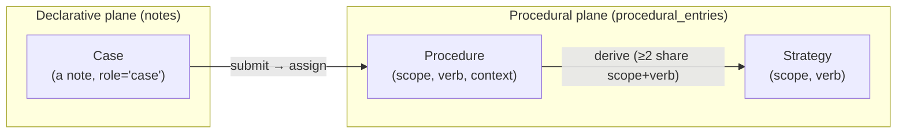

# About the procedural memory plane

You fix a flaky deploy on Tuesday. The trick was to drain the Nomad job first, wait for the allocations to clear, then re-submit. It worked. Three weeks later you hit the same wall and you have to rediscover the trick from scratch, because nothing wrote it down as *a way to do the thing* — only as scattered facts about that one Tuesday.

The procedural plane is the part of Memex that fixes this. You submit the worked episode as a **case**; the system distils a reusable **procedure** out of it; and the next time the same trigger fires, the procedure is there to recall. This page is about how those two pieces — the case and the procedure — relate, and why they live in different places.

## Context

Memex stores three kinds of memory: facts, preferences, and recipes. Facts ("the deploy target is staging") live as memory units extracted from notes. Preferences ("I like Neovim") live in the key-value store. Recipes — *how to do a task the way it actually worked last time* — are the procedural plane.

The plane has one input and two outputs. The input is a case: a record of one worked episode. The outputs are procedures (how to do a specific task in a specific context) and strategies (a play-book that generalises several procedures). The whole machine is a bridge: a case enters on one side, gets assigned to a procedure, and the procedure gets distilled and — once a human confirms it — published for recall.

The design names the parts after Tulving's procedural memory, the kind of memory that lets you ride a bike without narrating the steps. Memex does not claim the neuroscience; it borrows the label for the substrate that plays the role: knowledge of *how*, retrieved by *when to use it*, refined every time you do the task again.

## Model

The first thing to get right is that the procedural plane is not three tables of equal weight. It is **two planes joined by one bridge**.

A **case lives on the declarative plane**. It is a note — the same row type as every other note, with `notes.role='case'` set on it — filed into a hidden system vault named `procedural`. It is never a row on the procedural plane <code-ref path="packages/core/src/memex_core/services/case_service.py" lines="1-32" />.

A **procedure and a strategy live on the procedural plane**. They are rows in the `procedural_entries` table, with their own identity and their own lifecycle <code-ref path="packages/core/src/memex_core/memory/sql_models.py" lines="1995-2036" />.

The bridge is the submission path: a case is submitted, the case is *assigned* to a procedure, and the procedure is *derived* (its body distilled from the cases assigned to it). That sequence — submit, assign, derive — is the whole of the plane's behaviour.

### Notes versus cases: the load-bearing distinction

A case *is* a note. Same substrate, same storage, same extraction pipeline runs over it. What differs is the job it does.

An ordinary note says **what is true**. "The retry timeout is 30 seconds." A reader retrieves it to *know* something.

A case records **a worked episode** — a thing you did, and how it went. It is composed from a fixed five-part template: a **Trigger** (what kicked the episode off), a **Situation** (the state going in), a list of **Actions** (the ordered steps you took), and an **Outcome** with a **Lesson** (success, failure, or mixed, plus what to do differently next time) <code-ref path="packages/core/src/memex_core/services/case_service.py" lines="86-99" />. A reader — or rather, the distillation pass — consumes it to learn *how to do* something.

The template is not decoration. Free-form prose distils into mush; the fixed structure is the precondition that lets an LLM pass turn a pile of cases into a clean procedure <code-ref path="packages/core/src/memex_core/services/case_service.py" lines="1-13" />. When you submit a case, the server renders this template into the note body and files it; the note's `doc_metadata` carries the outcome, the project, and the submitter for provenance <code-ref path="packages/core/src/memex_core/services/case_service.py" lines="319-338" />.

So: notes and cases share the *what it is* (a note row) and differ in the *what it's for*. A note is a claim; a case is an episode that teaches a procedure.

## Mechanism

Walk a case through the plane from one side to the other.

### Submit and assign

You submit a case through `POST /api/v1/cases` (or `memex case submit`). The server composes the template, files the note into the `procedural` system vault, stamps `role='case'`, and then runs **assignment** — deciding which procedure this episode is an instance of <code-ref path="packages/core/src/memex_core/services/case_service.py" lines="117-172" />.

Assignment has five outcomes, and which one you get depends on whether you named a target and what the judge decided:

- **`explicit`** — you passed `case_of` (the UUID of a procedure). The agent that just enacted a procedure knows which one it was, so this is the primary path. The case attaches directly; no judge runs <code-ref path="packages/core/src/memex_core/services/case_service.py" lines="346-349" />.
- **`auto_assigned`** — you did not name a target, so a judge searched for candidate procedures by trigger and returned a verdict. The judge decided `instance_of` with clean separation (one candidate stood clearly apart from the rest), so the case auto-attaches to that procedure <code-ref path="packages/core/src/memex_core/services/case_service.py" lines="367-377" />.
- **`new_procedure_draft`** — the judge decided `new_procedure` with clean separation: this episode is not an instance of anything that exists. The server creates a fresh **draft** procedure as an anchor and attaches the case to it <code-ref path="packages/core/src/memex_core/services/case_service.py" lines="378-393" />.
- **`escalated`** — the verdict was contested (separation was not clean), or the judge was unavailable. Rather than asking you to disambiguate mid-session, the server files a `governance` finding in the lint queue with the candidates and the judge's lean as evidence, and moves on <code-ref path="packages/core/src/memex_core/services/case_service.py" lines="396-403" />.
- **`skipped`** — you re-submitted byte-identical case content. Ingest is content-idempotent, so the existing case note is returned untouched; nothing is re-stamped or re-assigned <code-ref path="packages/core/src/memex_core/services/case_service.py" lines="146-154" />.

The escalation path is deliberate. A contested assignment never blocks the submitting agent and never spawns a clarification round-trip; the case is always filed, and the ambiguity becomes a review item a human resolves later.

### Derive

Assignment attaches a case to a procedure but leaves the procedure's body empty — the anchor is a stub. **Derivation** is the pass that fills it. The case attachment enqueues a derivation task; a background worker (or a manual `memex procedure derive`) drains the queue, gathers the cases behind a procedure, and distils the steps, trigger, and summary onto the entry <code-ref path="packages/core/src/memex_core/services/procedural_derivation_service.py" lines="118-140" />.

Two thresholds govern derivation:

- **One case is enough to derive a procedure.** The constant `MIN_CASES_FOR_DISTILLATION` is `1` <code-ref path="packages/core/src/memex_core/memory/procedural_distillation.py" lines="42" />. A single worked episode distils into a usable procedure; you do not have to repeat a task three times before the system learns it <code-ref path="packages/core/src/memex_core/services/procedural_derivation_service.py" lines="123-134" />.
- **A strategy needs at least two procedures.** Once a `(scope, verb)` pair has two or more procedures, derivation can synthesise a strategy *above* them — the play-book that generalises the specific recipes. The constant `MIN_PROCEDURES_FOR_STRATEGY` is `2` <code-ref path="packages/core/src/memex_core/services/procedural_derivation_service.py" lines="50" />.

### Draft, then activate

Here is the safety valve. A freshly derived procedure or strategy is **not** immediately visible. It is written with `status='draft'`, and draft entries are excluded from search and from the session briefing <code-ref path="packages/core/src/memex_core/memory/sql_models.py" lines="2077-2081" />.

To become visible, a draft must be **published**. The system surfaces drafts for confirmation through the lint queue: when a draft is created, a `governance` maintenance proposal is filed against it with the `activate_procedural_entry` action pre-selected <code-ref path="packages/core/src/memex_core/services/case_service.py" lines="515-569" />. A reviewer working `memex lint review` accepts the proposal, the action flips the entry `draft → published`, and only then is it retrievable <code-ref path="packages/core/src/memex_core/services/proposal_actions/activate_procedural_entry.py" lines="56-96" />.

The transition is reversible: undoing the activation re-drafts the entry, pulling it back out of search <code-ref path="packages/core/src/memex_core/services/proposal_actions/activate_procedural_entry.py" lines="98-124" />. A draft is the system's proposal; a published entry is a human's confirmation.

### Worked example

You submit one case: trigger "Nomad deploy hangs on stuck allocations", outcome `success`, actions describing the drain-wait-resubmit fix. You name no target.

1. **Assign.** No procedure matches the trigger cleanly, so the judge returns `new_procedure` with clean separation. The server creates a draft procedure anchored on `(global, deploy, nomad)` and attaches the case. The response mode is `new_procedure_draft`, and it carries a `finding_id` for the activation proposal already filed.
2. **Derive.** You run `memex procedure derive`. The worker finds one case behind the anchor — enough, since the threshold is one — and distils the drain-wait-resubmit steps onto the entry's body. The entry stays `draft`.
3. **Activate.** You run `memex lint review`, see the "new procedure anchor, ready to activate" finding, and accept it. The entry flips to `published`.

The next time someone searches "deploy is stuck on Nomad", the procedure surfaces with the exact steps that worked.

## Procedural plane versus procedural KV

Memex has *two* things that call themselves procedural, and they are not the same.

**Procedural KV** is a key-value entry under a key shaped `<scope>:procedure:<verb>:<context>` — for example `global:procedure:commit:lint-first` <code-ref path="packages/core/src/memex_core/services/kv.py" lines="89-140" />. It holds a **stated** rule: a preference the user expressed in words. "Always lint before you commit." You write it once, by hand, and it is true because the user said so.

**The procedural plane** holds **distilled** recipes — procedures and strategies derived from real worked episodes. Nobody states a procedure directly; it emerges from cases. "Here is how the deploy actually got unstuck the three times we did it."

The split is about provenance. A KV procedure is an instruction. A plane procedure is evidence: it carries outcome counters, source edges back to the cases that produced it, and a version ledger of every edit <code-ref path="packages/core/src/memex_core/memory/sql_models.py" lines="2088-2118" />. When you want to record *what someone told you to do*, that is KV. When you want the system to *learn how a task is done* from doing it, that is the plane.

## Trade-offs

**A case is a note, not a new row type.** The plane could have stored cases as first-class procedural rows. Instead a case reuses the note substrate entirely — same ingestion, same extraction, same lifecycle. The benefit is that the entity bridge keeps working: extraction runs over a case note just like any other note, so the people and systems a case mentions still join the knowledge graph <code-ref path="packages/core/src/memex_core/services/case_service.py" lines="11-13" />. The cost is that cases sit in a hidden vault you do not browse directly; you reach them through the procedures they back.

**File-then-lint, not clarify-then-file.** A contested assignment could pause and ask the submitting agent which procedure it meant. The plane refuses to: it files the case and escalates to the lint queue instead <code-ref path="packages/core/src/memex_core/services/case_service.py" lines="18-27" />. The trade is latency for the human reviewer against never blocking the agent mid-task. An agent that just finished a task should be able to record it and move on; the disambiguation is a separate, asynchronous job.

**Draft-by-default, publish-by-confirmation.** Derived entries could publish immediately. They do not — every derived procedure waits behind a human-reviewed activation. The cost is that a useful recipe sits invisible until someone confirms it. The benefit is that the system never silently injects an LLM-distilled procedure into the recall surface; a person always stands between distillation and publication.

## Implications

A few consequences fall out of the model above.

**Outcomes ride the case, not a separate call.** Because a case carries its outcome (`success`, `failure`, `mixed`), assigning a case to a procedure bumps that procedure's outcome counters automatically. You do not record the outcome separately; submitting the case *is* the outcome report <code-ref path="packages/core/src/memex_core/services/case_service.py" lines="226-237" />. For the lighter "I enacted this but it is not case-worthy" signal, `POST /api/v1/procedural/{entry_id}/report` bumps the counters without a full case.

**Strategies have no context.** A procedure anchors on `(scope, verb, context)`; a strategy anchors on `(scope, verb)` with context forced to NULL, because a strategy is the projection over *all* procedures sharing that scope and verb. The schema enforces this with a check constraint, and the create path rejects a strategy that carries a context <code-ref path="packages/core/src/memex_core/memory/sql_models.py" lines="2183-2190" />.

**Drafts are the curation queue.** Because draft entries are invisible to search, `memex procedure list --status draft` is how you see what derivation has proposed but no one has confirmed. The draft list and the lint queue are two views of the same backlog: entries awaiting a human's `activate_procedural_entry`.

**The plane is vault-scoped, but cases share one system vault.** Every procedural entry carries a `vault_id`, and restricted API keys are fenced to their own vault. The case notes themselves, though, all land in the single hidden `procedural` vault — the input side is shared even though the derived entries are tenant-scoped.

## See also

- [How-to: Submit cases and derive procedures](../../how-to/submit-cases.md)
- [Reference: data model](../../reference/data-model.md)
- [Explanation: Memory types](memory-types.md)
