# About retrieval

A user asks Memex *"what did we decide about the rollback procedure last quarter?"* Memex needs to turn that one sentence into a ranked list of memories the agent can actually use — facts, observations, entity relationships — and it has to do it in well under a second so the agent stays responsive. This page is about how retrieval gets from one query to one ranked list.

## Context

Retrieval sits between two surfaces. **Above** it: the agent — `memex memory search` on the CLI, `memex_memory_search` on the MCP server, or `MemexAPI.search()` in Python. **Below** it: the storage layer — a Postgres table of memory units (`memory_units`), each row carrying a text body, an embedding, entity links, outcome counters, a confidence score, a stability score, and a status flag.

A naïve approach would index every memory by one signal — vector similarity, say — and return the top-K. That fails at the first awkward query. *"Last quarter"* is a time window, not a topic. *"The rollback procedure"* is a specific phrase that may have no semantic neighbour and no synonyms. *"We"* implies an entity the system has to identify from context. A useful retrieval engine has to handle all three signals at once and decide how to weigh them.

The constraints are tighter than the textbook problem suggests. The retrieval engine has to handle queries that mix all three signals in one sentence ("what did *we* decide about *the rollback procedure* *last quarter*"). It has to handle queries that lean entirely on one signal ("anything from yesterday"). It has to deal with a corpus that grows continuously, where new memories arrive with no outcome data and old memories have years of it. And it has to serve an agent rather than a human, which means the result list has to be machine-readable and dense enough for an LLM to find the right unit without scanning a long ranking.

Memex's answer is a multi-stage pipeline. Five retrieval strategies run **in parallel** against the same query, each scoring memories on a different signal. A rank-fusion step combines their rankings without trusting any single strategy's score magnitudes. A composition chain layers behavioural signals — how recent the memory is, how often the agent found it useful, how confident the system is in its accuracy — on top of the fused relevance score. A diversity filter trims the result to candidates that actually say different things. And an exploration step occasionally surfaces an under-tested memory so the system can learn whether it's any good.

The shape of the pipeline matters more than any single step. You can swap the cross-encoder for a different reranker; you can disable the diversity filter; you can tune the exploration rate. The shape — five strategies, then fusion, then composition, then diversity, then exploration — is what makes Memex's retrieval robust to the awkward queries that break single-signal systems.

## Model

Here is the full Recall pipeline. One query enters at the top; a ranked list exits at the bottom.

```mermaid
flowchart TD
    Q[QUERY INPUT]
    Pre["QUERY PREPROCESSING<br/>1. LLM expansion (1-2 variations; original weight 2.0, variations 1.0)<br/>2. Temporal extraction (regex + dateparser, 'last week' → date range)<br/>3. NER pre-extraction (thread-pool, async)<br/>4. Query embedding (SHA-256 cached, 5-min TTL)"]

    subgraph TEMPR ["5 PARALLEL TEMPR STRATEGIES"]
        T["TEMPORAL<br/>Recency by event_date DESC<br/>(0 LLM)"]
        E["ENTITY / GRAPH<br/>2-hop cooccurrence traversal<br/>NER seed + phonetic<br/>(0-1 LLM)"]
        MM["MENTAL MODEL<br/>Cosine on model embeddings<br/>Virtual-unit expansion to sources<br/>(0-1 LLM)"]
        K["KEYWORD<br/>BM25-like, ts_rank, OR tokens<br/>(0 LLM)"]
        SEM["SEMANTIC<br/>Dense cosine, pgvector HNSW<br/>(0 LLM)"]
    end

    Scope["Scope filter (apply_generic_filters)<br/>status · include_stale · include_deprioritized<br/>(default: hide deprioritized + stale)"]
    RRF["RECIPROCAL RANK FUSION<br/>score = Σᵢ wᵢ / (60 + rankᵢ)<br/>K_RRF=60, magnitude-invariant on ranks"]
    Hyd["Hydration + superseded threshold filter<br/>Lazy-load full units from row IDs"]
    Compose["Composition chain (_compose_boosts_logspace)<br/>ce_score × exp(clip(Σ log b_i, −L, +L))<br/>b₁=recency · b₂=temporal · b₃=mw · b₄=confidence · b₅=decay"]
    MMR["MMR diversity (greedy, λ=0.9)<br/>Hybrid sim: 0.6·cosine + 0.4·jaccard(entities)<br/>Temporal tiebreaker"]
    Explore["Exploration (post-MMR injection)<br/>epsilon-greedy | Thompson | off<br/>Annotates injected units; does NOT modify scores"]
    Budget["Token budgeting (tiktoken greedy packing)<br/>Caller-set budget; skips already-returned IDs"]
    Results[RESULTS]

    Q --> Pre --> TEMPR --> Scope --> RRF --> Hyd --> Compose --> MMR --> Explore --> Budget --> Results
```



Three things to notice. First, the five strategies run **in parallel and independently** — each builds its own SQL query, hits the same database, and returns its own ranked list. Second, **rank fusion comes before scoring** — the only thing the fusion step trusts is the position of a memory in each strategy's ranking, not the strategy's internal score, because the five strategies measure incomparable quantities. Third, **exploration is bolted on at the end**, after MMR diversity has already done its work — it doesn't tweak the composition chain's scores; it just injects extra candidates with an annotation. That separation is deliberate, and we come back to it below.

The pipeline has nine identifiable stages — preprocessing, the five parallel strategies, scope filter, RRF fusion, hydration, composition chain, MMR diversity, exploration injection, token budget. Each stage has one job and one contract with the next stage. Preprocessing produces queries-plus-filters; the strategies produce ranked ID lists; fusion produces a single ranked ID list; hydration produces `MemoryUnit` rows; composition produces a scored list; MMR produces a diversified list; exploration produces a list with optional extra units; budget produces a token-bounded list. A change to any one stage's internals leaves the contracts unchanged — and so leaves the rest of the pipeline unchanged.

## Mechanism

Walk one query through the pipeline. The query is *"how did we handle the SOC 2 audit findings last March?"* Assume the vault has been ingesting daily-standup notes, audit-meeting minutes, a long Notion export, and a handful of reflection-produced mental models for the past nine months.

### Query preprocessing

Four small jobs happen before any retrieval strategy runs. They prepare the query so the strategies have something useful to chase.

**Expansion.** If you opted in by passing `expand_query=true`, an LLM rephrases the query into one or two semantic variations. The original query keeps a weight of `2.0`; each variation keeps `1.0`, so later rank fusion can blend them without letting the variations dominate. <code-ref path="packages/core/src/memex_core/memory/retrieval/engine.py" lines="491-502" /> The expander itself is a small DSPy `QueryExpander` predictor with a graceful fallback — if the LLM call fails, the query continues with no variations and no error. <code-ref path="packages/core/src/memex_core/memory/retrieval/expansion.py" lines="75-104" />

**Temporal extraction.** Memex looks for phrases like *"last March"*, *"3 weeks ago"*, or *"during Q3 2025"* using a regex pre-filter plus `dateparser`. A successful extraction turns *"last March"* into a date range and injects it into the filter dictionary as `start_date` / `end_date`. <code-ref path="packages/core/src/memex_core/memory/retrieval/engine.py" lines="527-569" /> When the regex finds nothing but the query *sounds* temporal (an LLM-flagged ambiguous phrase like *"during onboarding"*), an LLM-driven concretizer takes a shot at it. Both extractors fail open: if neither resolves, the query runs without a temporal filter. A zero-result safety net then retries the whole pipeline without the temporal constraint if the filtered run came back empty. <code-ref path="packages/core/src/memex_core/memory/retrieval/engine.py" lines="660-693" />

**NER pre-extraction.** A small NER model identifies named entities in the query — *"SOC 2"*, in our example. The model runs in a thread pool with a timeout so it can't block the event loop. The extracted entities go into the filter dictionary as `_ner_entities`, where the entity-graph strategy picks them up as graph seeds. <code-ref path="packages/core/src/memex_core/memory/retrieval/engine.py" lines="591-604" />

**Embedding.** The query (and each variation) gets dense-embedded by an ONNX model. The result is cached by SHA-256 of the query string for five minutes, so re-running the same search inside a conversation doesn't repay the embedding cost. <code-ref path="packages/core/src/memex_core/memory/retrieval/engine.py" lines="504-507" />

By the end of preprocessing the engine has: a list of queries to run (original plus variations), their weights, their embeddings, an optional date range, and a list of seed entities. The strategies pick this up.

For our worked example, here is what each piece produced. The expansion produced *"SOC 2 audit response process March 2025"* and *"compliance findings remediation last March"*. Temporal extraction resolved *"last March"* to `start_date = 2025-03-01`, `end_date = 2025-03-31`. NER found `SOC 2` as an entity. Embedding ran three times — original plus two variations — and three 384-dimensional vectors landed in the cache.

### The five TEMPR strategies

TEMPR stands for **Temporal, Entity, Mental model, Keyword, Reranking** — though only the first four are independent retrieval strategies in the pipeline; the fifth letter is a nod to the reranker that comes later. The strategies live in `strategies.py`, all implementing a common `RetrievalStrategy` protocol that returns a SQL `Select`. <code-ref path="packages/core/src/memex_core/memory/retrieval/strategies.py" lines="182-188" />

**Semantic.** Dense cosine over `pgvector`'s HNSW index on the `memory_units.embedding` column. Score: cosine similarity (higher is better). This is the workhorse for paraphrased queries — *"audit findings"* will find a unit whose text says *"compliance issues"* even with zero token overlap. <code-ref path="packages/core/src/memex_core/memory/retrieval/strategies.py" lines="191-219" />

**Keyword.** Postgres full-text search with `ts_rank_cd`. Memex does *not* use strict `plainto_tsquery` (which AND-joins every token) because natural-language queries are too noisy for that. Instead it builds the parsed `tsquery` and rewrites the `&` operators to `|`, turning the query into an OR-of-stemmed-tokens — a bag-of-words match that survives missing terms. <code-ref path="packages/core/src/memex_core/memory/retrieval/strategies.py" lines="222-255" /> This is the strategy that will rescue *"rollback procedure"* when the semantic strategy doesn't see anything close — the literal token *rollback* hits a memory containing the literal token *rollback*, even if nothing else lines up.

**Temporal.** Filters by `event_date` and orders by recency. Plays best with the temporal extractor — when the query named *"last March"*, this strategy is the one that ranks the March memories at the top. With no temporal filter it returns the freshest units in the vault.

**Entity / graph.** Uses the entity-cooccurrence graph. Seeds come from two places: the NER extractor on the query, and a phonetic fallback for names the NER missed. The strategy then walks two hops out in the cooccurrence graph and returns memory units linked to any reached entity. The cooccurrence graph is built at extraction time from the units' linked entities, so this strategy implicitly knows that *"SOC 2"* and *"compliance audit"* often appear together even if the user typed only one of them.

**Mental model.** Searches `mental_models.embedding` by cosine, then expands each matched model into the memory units that are its evidence. Mental models are produced by reflection — they are higher-order summaries of what the system has learned about an entity. This strategy is how *"how did we handle X"* finds a reflection that explicitly answers *"X is handled by procedure Y"* rather than the raw memories the reflection was synthesized from.

For our SOC 2 query, the strategies returned heavily-overlapping but importantly different rankings.

- Semantic surfaced the daily-standup notes from March that mentioned *"audit"* and *"compliance"* — strong cosine but no SOC 2 token.
- Keyword surfaced two memory units containing the literal token *"SOC 2"* — one from a meeting minute, one from a Notion export — and ranked them first and second.
- Temporal collapsed the candidate pool to memories with `event_date` in March 2025 and ordered them by recency.
- Entity-graph used `SOC 2` as a seed and walked two hops, surfacing memories about *"ISO 27001"* (cooccurs with `SOC 2`) and about the auditor's name.
- Mental model returned a single high-scoring observation: *"The team treats SOC 2 findings as P1 incidents and resolves them inside the next sprint"* — a reflection synthesized from the underlying meeting minutes.

Each strategy applies a shared **scope filter** before returning. The filter excludes stale units (`status = 'stale'`) and deprioritized units (`is_deprioritized = true`) by default; callers can opt in to either via `include_stale` and `include_deprioritized`. The filter is centralized in one function called from every strategy's SQL build so a configuration change can't slip past one strategy. <code-ref path="packages/core/src/memex_core/memory/retrieval/strategies.py" lines="99-118" />

What you get out of this step is **five ranked lists of memory unit IDs** — typically up to 60 candidates per strategy, configured by `RetrievalConfig.candidate_pool_size`. The lists overlap heavily. None of the strategies' scores are comparable: cosine similarity is `[0, 1]`, `ts_rank_cd` is unbounded positive, the temporal strategy's score is a recency ordinal, the graph score is a weighted edge sum. So Memex doesn't try to compare them — it compares their **ranks**.

It's worth pausing on what the strategies *don't* know about each other. The keyword strategy doesn't see the semantic strategy's top result; it doesn't get a hint from the entity-graph strategy that *"SOC 2"* is a meaningful entity. The strategies are independent SQL queries against the same database. The only place their information meets is the fusion step. This decoupling has a useful property: a strategy that performs poorly on a query (the entity-graph strategy when the NER model returns nothing useful) doesn't drag down the strategies that are doing well — it just contributes a low-quality ranking to the fusion, and RRF treats that ranking the same as any other. The pipeline degrades gracefully under per-strategy failure.

### Reciprocal Rank Fusion

RRF is one of the simplest robust ways to combine ranked lists. The formula for a memory `m` is:

```
score(m) = Σᵢ wᵢ / (K_RRF + rankᵢ(m))
```

where the sum is over the strategies that returned `m`, `rankᵢ(m)` is `m`'s 1-based position in strategy `i`'s ranking, and `wᵢ` is the strategy's weight (Memex weights each strategy equally by default). `K_RRF = 60` is the standard value from the literature — it controls how aggressively top ranks dominate the score. <code-ref path="packages/core/src/memex_core/memory/retrieval/engine.py" lines="282-284" />

The shape matters. A memory ranked first by two strategies and not seen by the other three gets `2/(60+1) ≈ 0.033`. A memory ranked first by all five gets `5/61 ≈ 0.082`. A memory ranked thirtieth by all five gets `5/90 ≈ 0.056`. RRF mostly rewards consensus — but a long tail of agreement also adds up, so the single top-ranked memory under one strategy is *not* automatically the top result.

In our worked example, the meeting-minute unit that contained the literal *"SOC 2"* token ranked first under keyword, third under temporal (because two daily-standups were slightly more recent), eighth under semantic, fifth under entity, and was the evidence for the top mental-model observation. Its fused RRF score added up across all five — a strong consensus, not just one strategy's pick. The two daily-standups, by contrast, ranked first and second under temporal but didn't make it onto the keyword or semantic lists at all, so their fused scores were lower despite each having a single dominant rank.

Memex actually runs RRF twice: once **per query** (inside each variation) and once **across queries** (weighted by the variation weights). The cross-query fusion is `_fuse_multi_query_results`. <code-ref path="packages/core/src/memex_core/memory/retrieval/engine.py" lines="656-657" />

At this point we have a single ranked list of memory unit IDs. The pipeline hydrates them into full `MemoryUnit` rows — pulling the text, the embedding, the outcome counters, the confidence value, the FSFM stability score, and so on. A defensive filter then drops any unit whose confidence has dropped below the superseded threshold (default `0.3`) since extraction. <code-ref path="packages/core/src/memex_core/memory/retrieval/engine.py" lines="702-713" />

Hydration is lazy on purpose. The strategies return only row IDs because building a `Select(MemoryUnit)` per strategy would pull duplicate rows out of Postgres five times — once per strategy that returned the same unit. Fusing on IDs first and hydrating once is the right shape: each row is read at most once, and the hydration query can include the row's links and metadata in one round-trip rather than re-issuing per strategy.

### The composition chain

Now we have the right *candidates*. The composition chain decides their final *order*.

If a reranker is available — Memex ships an ONNX cross-encoder by default — the candidates first go through the cross-encoder, which produces a relevance score for each `(query, candidate)` pair. The raw scores are squashed through a sigmoid into `[0, 1]` so they live in the same range as the boost factors below. We call this normalized score `ce_score`. <code-ref path="packages/core/src/memex_core/memory/retrieval/engine.py" lines="1606-1607" />

The composition chain then layers five **boost factors** onto `ce_score`. The mechanism, in one line of math:

```
final_score = ce_score × exp(clip(Σ log bᵢ, −L, +L))
```

where the `bᵢ` are bounded multipliers each near 1.0 by default, and `L` is `RetrievalConfig.composite_boost_log_clip`. <code-ref path="packages/core/src/memex_core/memory/retrieval/engine.py" lines="85-146" /> At the ship default `L = math.inf` the clip is a no-op, and the chain is mathematically identical (within floating-point noise) to the plain product `ce_score × b₁ × b₂ × b₃ × b₄ × b₅`.

The five factors are:

**Recency boost (`b₁`).** A linear ramp on `event_date`: `recency = max(0.1, min(1.0, 1.0 - (days_ago / 365)))`, then `recency_boost = 1.0 + recency_alpha × (recency − 0.5)`. A memory from today gets a lift; a memory older than a year is floored at `0.1`. <code-ref path="packages/core/src/memex_core/memory/retrieval/engine.py" lines="1624-1631" />

**Temporal proximity boost (`b₂`).** Uses a per-unit `temporal_proximity` score that the retrieval engine attached during the temporal-extraction step (so a unit whose `event_date` lands inside the extracted date range gets a temporal-proximity bump). Defaults to a neutral `0.5` (boost = `1.0`) when no temporal proximity is set. <code-ref path="packages/core/src/memex_core/memory/retrieval/engine.py" lines="1633-1637" />

**Memory Worth boost (`b₃`).** The MW signal — `(success_co_count + 1) / (success_co_count + failure_co_count + 2)` — is a Beta-Bernoulli posterior mean over the unit's outcome counters. The boost is `1.0 + mw_alpha × (mw_score − 0.5)`. Cold-start units (no recorded outcomes) get a neutral `0.5 → boost = 1.0`. EMA mode decays old evidence with a 60-day half-life so a unit's posterior tracks recent retrieval performance rather than its lifetime sum. <code-ref path="packages/core/src/memex_core/memory/retrieval/engine.py" lines="1639-1649" />

**Confidence boost (`b₄`).** A contradiction-aware multiplier built from the unit's `confidence` and `confidence_evidence_count`. With `certainty_modulation_enabled = True`, the boost is dampened by a variance-derived certainty factor — cold-start units (zero evidence count) collapse to neutral so the system isn't punishing a new memory for not having a contradiction history yet. Default `confidence_alpha = 0.0` ships the boost as `1.0` until an operator opts in. <code-ref path="packages/core/src/memex_core/memory/retrieval/engine.py" lines="1651-1693" />

**FSFM decay boost (`b₅`).** The Ebbinghaus-flavoured term: `1.0 + decay_alpha × (importance × exp(−elapsed_days / stability) − 0.5)`. Permanent units (`stability = NULL`) get a lift instead of a decay, by design — an important reference memory should not erode just because nothing has happened. <code-ref path="packages/core/src/memex_core/memory/retrieval/decay.py" lines="33-45" />

The chain takes the **log** of each boost, sums them, clips the sum symmetrically to `[−L, +L]`, exponentiates, and multiplies onto `ce_score`. The clip is the only place where the chain is allowed to *strictly* override its multiplicative-product equivalent, and at the ship default `L = math.inf` it never fires. The log-space formulation is the change that gives operators bounded aggregate influence: set `L = 2` and no combination of boost factors can lift or sink a candidate by more than a factor of `e² ≈ 7.4` relative to its `ce_score`.

A defensive guard catches NaN and `±inf` inputs — if any boost is non-finite, the chain short-circuits and returns the bare `ce_score`, incrementing a Prometheus counter so the upstream misbehaviour surfaces. <code-ref path="packages/core/src/memex_core/memory/retrieval/engine.py" lines="128-135" />

For our SOC 2 query, the composition chain did three things to the top fused candidate (the meeting-minute unit). The `ce_score` from the cross-encoder landed at `0.72` — strong relevance, not pinned at the top. The recency boost gave it `1.18` because the `event_date` was inside the last six months. The temporal-proximity boost gave it `1.25` because its `event_date` was inside the extracted March-2025 window. The MW boost was `1.04` — the unit had been retrieved twice before and marked helpful both times. Confidence and decay boosts were `1.0` each (ship-default alphas). Composed: `0.72 × 1.18 × 1.25 × 1.04 × 1.0 × 1.0 ≈ 1.10`. The unit that had merely a strong keyword rank but no temporal match composed to `0.68 × 1.0 × 1.0 × 1.0 × 1.0 × 1.0 = 0.68`. So the composition chain widened the gap that temporal extraction had already opened.

### MMR diversity

After scoring, the candidates are still over-redundant. Three memories that all say *"we patched the SOC 2 issue on March 14"* shouldn't all surface — they're the same answer. Maximum Marginal Relevance (MMR) is a greedy algorithm that picks one candidate at a time, each time trading off **relevance** against **novelty** relative to what's already been picked:

```
mmr(c) = λ × relevance(c) − (1 − λ) × max-similarity(c, selected)
```

Memex sets `λ = 0.9` by default — conservative, so relevance still dominates. The similarity term is a **hybrid kernel** that combines two signals: pairwise embedding cosine (weight `0.6`) and Jaccard overlap on the units' linked entities (weight `0.4`). Two memories that talk about the same entity set but in different words are still flagged as similar — which is what you want, because the agent reading them won't learn anything from the second. A temporal tiebreaker (newer wins) cleans up the near-ties. <code-ref path="packages/core/src/memex_core/memory/retrieval/engine.py" lines="1805-1853" />

Virtual mental-model observations (the units synthesised from reflection) are split out before MMR runs and re-inserted at their original positions afterwards. They have no embedding, so a cosine of `0.0` would let them look spuriously diverse and the algorithm would over-pick them. <code-ref path="packages/core/src/memex_core/memory/retrieval/engine.py" lines="748-776" />

For our query, MMR's effect was small but real. The composition chain produced a top-five that included the meeting-minute unit, two daily-standup units, the Notion-export unit, and the mental-model observation. MMR kept the meeting-minute unit at rank 1, kept the mental-model observation at rank 2 (virtual unit, re-inserted), dropped one of the two daily-standups at rank 3 (high cosine to the kept standup), and surfaced an audit-meeting-minute unit at rank 4 that had been at rank 6 in the composed ranking — its entity set differed enough that the Jaccard kernel rewarded it.

### Exploration

By this point the result list is essentially what the user will see. But there's a problem the rest of the pipeline can't solve on its own: **a memory that never surfaces never accumulates outcome data**. The MW boost rewards memories that have been useful in the past, which over time concentrates retrieval on the units that already retrieved well — *rich-get-richer*. To break that loop, Memex injects a small number of under-tested candidates back into the result set after MMR, with an `exploration: True` annotation so the caller can route outcome signals appropriately.

Two algorithms ship; one is chosen by `RetrievalConfig.exploration_mode`:

- **Epsilon-greedy** (`epsilon_greedy`, the default) flips a coin on every retrieval. With probability `ε` (default `0.05`) it injects up to `exploration_max_injections` candidates from the low-MW tail.
- **Thompson sampling** (`thompson`) draws `θ ~ Beta(success+1, failure+1)` per eligible candidate and injects the top-θ units. Beta(1, 1) is uniform, so cold-start units (`0/0`) get a fair posterior draw rather than a static cutoff — they aren't penalised for being new. <code-ref path="packages/core/src/memex_core/memory/retrieval/engine.py" lines="779-866" />

The trade-off between the two:

| Property | ε-greedy | Thompson |
|---|---|---|
| Per-query cost | Pays the bypass-pool round-trip on the ~ε fraction of calls (≈5% at the default). | Pays the round-trip on *every* call, by design. |
| Cold-start fairness | Static low-MW threshold; new units pass only if they hit the tail. | `Beta(1, 1) = Uniform(0, 1)` gives 0/0 units a full posterior draw — naturally fair to cold-start. |
| Configuration | `exploration_epsilon` controls injection rate directly. | Rate is implicit in the Beta posterior; rate-control via `exploration_max_injections` only. |
| Best when | Most retrievals are fine and you want occasional re-validation. | A vault is in early bootstrap and cold-start units need a meaningful surface chance. |

The ship default is `epsilon_greedy` because most production vaults have enough outcome data that the static threshold works; flipping to `thompson` is the right move for a new vault or a vault that has changed shape recently (large bulk ingest, big content rotation).

Two things to notice. First, exploration is a **post-MMR injection** — it doesn't modify the composition chain or the diversity filter. The injected units get their normal scores; they're just allowed onto the result list as extra slots. An earlier draft of Memex's design had exploration as a sixth boost factor in the composition chain; we backed out because mixing exploration with scoring made calibration intractable. Second, when the pre-reranker filter is on, the exploration path re-hydrates the candidate pool *without* the pre-filter, so the strategies' filtered-out tail is still reachable for exploration — otherwise the very units exploration is meant to surface would be invisible.

In our worked example, the ε-greedy coin came up heads on the 0.05 outer roll and one cold-start unit got injected: a memory unit from January 2026 about a follow-up SOC 2 audit that the cross-encoder had ranked too low to make the top-five. The unit landed at the tail of the result list with `exploration: True` set in its `unit_metadata`. If the agent uses it and the user marks the answer helpful, the cold-start posterior will shift in its favour for next time. If the agent skips it, the `not_used` counter increments and the engagement metric notices.

### Token budgeting

The final step trims the list to a token budget if the caller passed one. The trimmer walks the ranked list, encoding each unit's text with `tiktoken` (the `cl100k_base` encoding), and stops the first time adding a unit would put the cumulative count over budget. It's a greedy packer, not an optimal one — keeping the top-ranked units intact at the cost of an occasional small unit being skipped behind a large one. <code-ref path="packages/core/src/memex_core/memory/retrieval/engine.py" lines="1965-1989" />

The greedy choice is the right one for retrieval. An optimal packer would solve a knapsack — pick the subset of units whose total tokens fit the budget and whose summed score is maximal. That's NP-hard and, more practically, would reorder the result list to fit the budget, which breaks the contract that rank order reflects relevance. Greedy packing preserves the order at the cost of leaving a small amount of unused budget when a top unit is large.

Per-session deduplication runs alongside — the MCP server stamps a per-session set of `seen_memory_ids` so a follow-up search in the same conversation won't re-deliver the same units. The caller can opt out by passing `include_seen = True`.

What comes out is **a ranked list of `MemoryUnit` objects**, each carrying its full text, metadata, citations, and exploration annotation if applicable. That's what the agent sees.

### Latency profile

The whole pipeline runs in well under a second on a realistic vault. A rough p50 breakdown for a query like the one above:

| Stage | Latency | LLM calls |
|---|---|---|
| Expansion (when enabled) | 200–800 ms | 1 |
| Embedding | 10–50 ms | 0 (ONNX) |
| Five strategies (in parallel) | 60–220 ms | 0 |
| RRF fusion (per-query + cross-query) | 10–30 ms | 0 |
| Hydration | 20–50 ms | 0 |
| Composition chain | 5–15 ms | 0 |
| Reranking | 50–200 ms | 0 (ONNX) or 1 (LiteLLM) |
| MMR + token budget | 20–60 ms | 0 |
| Post-MMR exploration injection | ≤ 10 ms | 0 |
| **Total** | **180–630 ms** | **0–1** |

Two things to notice. The expansion step is the slowest single contributor when it's enabled, because it round-trips to an LLM — and it's optional, so a caller that doesn't need it can shave 200–800 ms by passing `expand_query = false`. The strategies' SQL queries run in parallel, so the 60–220 ms figure is the *slowest* strategy's latency, not the sum.

## Trade-offs and alternatives

Several places in the pipeline reflect choices that look arbitrary until you walk through the alternatives.

### Why RRF over score-weighted fusion

A natural-feeling fix to *"five strategies with incomparable scores"* is to normalise each strategy's score to `[0, 1]` and take a weighted sum. The problem is that normalisation depends on the **distribution** of scores in the current batch, not on what those scores *mean*. A query that returns a thin set of weak semantic matches and a thick set of strong keyword matches will normalise the weak semantic top score to `1.0` even though it would have ranked low against the keyword set. The normalisation lies.

RRF sidesteps this entirely by **ignoring score magnitudes** and using only ranks. A rank-1 memory under any strategy contributes the same amount regardless of how the strategy felt about its top result in absolute terms. The cost: information is lost — a strategy that's extremely confident about its top result gets the same weight at rank 1 as a strategy that's only mildly confident. In practice that loss is more than offset by the immunity to score-scale drift, especially when new strategies are added over time. The constant `K_RRF = 60` is what trades off "reward consensus" against "give the top rank a meaningful edge"; lowering it makes the top rank dominate, raising it flattens.

### Why log-additive composition

The composition chain used to be a literal product: `ce_score × b₁ × b₂ × b₃ × b₄ × b₅`. The product form is fine when each boost is near 1.0 and the boosts are uncorrelated. But six factors multiplied together compound their noise — variance in any single boost shows up as variance in the final score, and the variance grows roughly geometrically with the number of factors.

Switching to **log-space addition** with a **symmetric clip** does three useful things at once. The math is identical when the clip is wide open (`L = math.inf`, the ship default) — so the change ships safely. The clip becomes a single dial an operator can turn down to bound the aggregate metadata influence on `ce_score` — set `L = 2` and no combination of boosts can move a candidate by more than a factor of `e² ≈ 7.4`. And the log-additive form makes per-factor histograms directly interpretable as *contributions to the log of the final multiplier*, which is the right surface for a future composition-variance diagnostic.

The change is a structural one. The five-factor chain is the canonical extension point for new ranking signals: a future signal lands here, in a deterministic order, with its own bounded factor and observability hook. It does not become a free-floating multiplier somewhere else in the engine. <code-ref path="packages/core/src/memex_core/memory/retrieval/engine.py" lines="1547-1576" />

Two alternatives the team considered and rejected. **Additive blending** (`ce_score + Σ αᵢ × signalᵢ`) is the form the MW source paper validates in its Experiment 5. The problem with additive blending in Memex's setting is that `ce_score` and the boost signals live on different scales — `ce_score ∈ [0, 1]` after sigmoid, but the boost signals are themselves multipliers near `1.0`. To make additive blending work you'd have to renormalise every signal to the same scale, which re-creates the calibration problem RRF was designed to dodge. **Weighted geometric mean** (`(ce_score × b₁ × … × b₅)^(1/6)`) is mathematically the same family as log-additive composition but loses the per-factor `αᵢ` knobs operators tune. The log-additive form keeps both the bounded-aggregate property and the per-factor controls.

### Why the rank-fusion comes before the cross-encoder

A reader new to the pipeline might wonder why Memex doesn't run the cross-encoder against the top-K of each strategy and skip the RRF step entirely. The answer is cost: the cross-encoder is `O(n)` per candidate (each `(query, candidate)` pair is a forward pass through an ONNX model), and the five strategies together produce a candidate pool too large to rerank wholesale. RRF is `O(n log n)` to sort the fused ranks and `O(n)` to compute the fused score per candidate — fast enough to run on the full pool. The pipeline then caps the reranker input at `min(effective_limit * 2, 75)` so the cross-encoder sees only the top fused candidates, not the full 300-row pool. <code-ref path="packages/core/src/memex_core/memory/retrieval/engine.py" lines="520-525" />

In effect, RRF is the cheap filter that decides which candidates are worth the cross-encoder's attention. The cross-encoder is the expensive arbiter that re-orders the top of that filtered list. Swap the order and the cross-encoder runs five times more often than it needs to; keep the order and the pipeline stays under its latency budget.

### Why exploration is post-MMR injection

Two earlier sketches put exploration inside the composition chain — a sixth factor `b₆` that lifted low-MW units by a small amount. That made calibration impossible. If the exploration signal is a multiplicative factor, then turning it up to surface more under-tested units *also* shifts the final ranking of *every* candidate, which makes "did exploration help?" untestable: you can't separate the rerank effect from the exploration effect.

Post-MMR injection severs the two. The composition chain decides what's *relevant*; the diversity filter decides what's *not redundant*; exploration decides what's *worth a try*. The injected units arrive with an annotation, the caller can record outcomes against them as exploration outcomes specifically, and an A/B over exploration modes (epsilon-greedy vs Thompson vs off) becomes a clean experiment. Calibration cost: zero — the chain is unchanged.

### Empirical caveat: MW calibration

The MW boost ships as a Bayesian-flavoured signal, not a probability-calibrated reweight. The Beta-Bernoulli posterior `mw_score = (success + 1) / (success + failure + 2)` has the right *ranking* properties under the assumptions of the source paper (Simsek 2026, *When to Forget*), but two of those assumptions — stationary outcome distribution, stationary retrieval distribution — are violated in any continuous-ingestion multi-tenant system. Memex therefore treats `mw_score = 0.7` as "ranked above `mw_score = 0.6`", not as "predicts a 70% credit rate on the next retrieval". A calibration evaluation (reliability diagram, ECE, optional isotonic-regression layer) is on the roadmap; the empirical interpretation will be tightened when those numbers land.

### Why hybrid similarity in MMR

A pure-cosine MMR kernel would call two memory units redundant whenever they say the same thing in similar words. That's nearly always what you want, except when it isn't: two units written by different teams about the *same incident* will have low cosine and high entity overlap. Pure cosine would treat them as diverse and surface both; you would read each one and notice they say the same thing.

The hybrid kernel — `0.6 × cosine + 0.4 × jaccard(entities)` — folds the entity-set overlap back in. The 60/40 split is a default; an operator who has many short, entity-dense memory units can lean more on Jaccard, and one who has long, entity-sparse units can lean more on cosine. The weights live on `RetrievalConfig` (`mmr_embedding_weight`, `mmr_entity_weight`) and can be tuned per vault.

### Where this differs from textbook retrieval

A textbook information-retrieval pipeline looks like: index, retrieve top-K by one scoring function, optionally rerank. Memex departs from that shape in four places.

First, Memex retrieves through **five strategies in parallel rather than one indexer**. The motivation is that no single indexer answers all four query shapes (paraphrased / exact-token / temporal / relational), so concentrating retrieval in one indexer leaves a class of query under-served. The cost is that five strategies hit the database five times per query; the benefit is that any one strategy can carry a query the other four would miss.

Second, Memex fuses on **ranks rather than scores**. Textbook ensembles weight model outputs by score; Memex weights by rank position. The textbook approach assumes the models' scores are calibrated against each other; Memex's strategies don't even produce the same score *type*, so calibration would be a research project on its own.

Third, Memex layers a **behavioural composition chain** on top of relevance. Textbook reranking takes a relevance signal and outputs a relevance score; Memex's reranker outputs a relevance score, and then the composition chain layers behavioural signals (how recent, how often-used, how confident, how decay-eligible). A textbook result list is "what matches"; a Memex result list is "what matches and is worth surfacing right now".

Fourth, Memex injects **exploration units after diversity filtering**. A textbook pipeline doesn't have exploration; it returns top-K and stops. Memex adds exploration because the behavioural signals create a feedback loop — a unit that retrieves well accumulates `success_co_count` which lifts its `mw_boost`, which makes it retrieve better. Without exploration the loop concentrates retrieval on already-tested units, and untested units never get a chance to demonstrate value. The injection isn't free (it costs an extra row in the result and an outcome signal the caller has to attribute), but the alternative is worse: a system that converges to the most-retrieved units regardless of whether they remain accurate.

## Implications

Several behaviours fall out of the pipeline shape, and they're useful to internalise.

### A single keyword can surface the right memory even with no semantic match

The five strategies are independent — the keyword strategy doesn't know about the semantic strategy and vice versa. So *"rollback"* in a query and *"rollback"* in a memory are enough for the keyword strategy to surface the memory at rank 1, regardless of whether the surrounding context shares any semantic similarity. RRF then carries that high keyword rank into the final fused list. The corollary: paraphrased queries still benefit from the semantic strategy, and queries with no semantic neighbour still benefit from the keyword strategy. You don't have to pick a side.

This is why the keyword strategy uses an OR-of-stemmed-tokens rather than the stricter `plainto_tsquery`. A strict AND would refuse to match any unit that didn't carry every query token; an OR lets one strong keyword pull a memory in even when the rest of the query overlaps poorly. Memex pays for that permissive match at the rank-fusion step — a unit that matches on only one token will tend to rank low under keyword, and RRF won't lift it unless another strategy also surfaces it.

### A memory ingested years ago can still rank first today

The decay boost is the only factor in the composition chain that could systematically punish old memories — and by default `decay_alpha = 0.0`, so it doesn't. The recency boost has a 365-day floor and a `0.1` minimum, so the worst case for an old memory is a `recency = 0.1 → boost ≈ 0.55` lift — not zero. The MW boost actively *rewards* old memories that have retrieved well in the past, and the EMA mode caps the lookback at a 60-day half-life so a memory's posterior is responsive to recent retrieval performance.

The net effect: a memory ingested two years ago that has been retrieved and marked helpful three times in the past month will out-rank a freshly-ingested but untested memory on the MW-driven half of the chain, even though the freshly-ingested memory dominates the recency-driven half. The retrieval engine is not biased toward "newest" — it's biased toward "useful, weighted by recent usefulness".

### When retrieval underperforms, look at the right layer

The pipeline gives you a clean trouble-shooting decomposition. The diagnosis runs from the bottom of the pipeline up:

- *Right memory is missing entirely from the result set.* The candidate pool is too small or the scope filter is too tight. Raise `candidate_pool_size`, or pass `include_stale = True` / `include_deprioritized = True` to relax the default scope filter. Check whether the unit was deprioritized by the FSFM auto-band — if so, `memex memory restore <unit-id>` will bring it back. Confirm the unit isn't in `status = 'stale'` (superseded by a newer contradicting note); stale units are invisible by default.
- *Right memory is in the candidate pool but ranks low.* The composition chain isn't surfacing it. Inspect the per-factor boosts — a high `confidence_alpha` plus a contradicted unit will sink an otherwise-relevant memory; a low `mw_alpha` plus a fresh unit will lose to a stale-but-once-useful one. The `MW_BOOST_OBSERVED`, `CONFIDENCE_BOOST_OBSERVED`, and `DECAY_BOOST_OBSERVED` histograms are the metrics to look at. The `memex_composite_boost_clipped` histogram tells you whether the aggregate clip is firing — at the ship default `L = math.inf` it should be a no-op, and a non-trivial clip rate means an operator has set a finite `L` that's actively biting.
- *Right memory is at rank 1 but adjacent memories are duplicative.* MMR isn't diversifying enough. Lower `mmr_lambda` from the default `0.9` toward `0.7` — more diversity, less raw relevance. If the duplicates share an entity set, the Jaccard kernel is doing its job; if they don't, raise `mmr_entity_weight` so the entity-overlap signal carries more of the diversity term.
- *Retrieval works but never surfaces new candidates.* Exploration is off, or the ε is too low. Bump `exploration_epsilon` from `0.05` toward `0.10`, or switch to `thompson` mode for cold-start fairness. Watch the `EXPLORATION_INJECTED_TOTAL{mode}` counter to confirm injection is firing at the rate you expect.
- *Retrieval is too slow.* The expansion step is the largest single contributor (200–800 ms) and is optional — pass `expand_query = false` to skip it. The reranker is the next-largest (50–200 ms); disabling it via the config falls back to RRF-fused-plus-composition results without the cross-encoder reweight, at the cost of some calibration. The five strategies run in parallel, so the slowest one sets the floor for the strategy stage.

Each lever sits in its own layer of the pipeline. You can change one at a time, watch the metrics, and reason about the effect without worrying about a knock-on in a different layer. That separation is the point of the shape.

### The shape extends without rewrites

Memex has added ranking signals over time — Memory Worth, then the contradiction-derived confidence boost, then the FSFM decay — and each one landed in the same place: a new bounded factor in the composition chain. The reason the chain accepts new signals cleanly is that every factor has the same contract — a bounded multiplier near `1.0`, configured by its own `…_alpha` knob, with its own observability histogram. A new signal that respects the contract slots in without touching the rest of the pipeline.

The five strategies are a similar extension point. Adding a sixth strategy is a matter of writing a new `RetrievalStrategy` implementation that returns a `Select`, registering it with the engine, and giving it a weight. Because RRF operates on ranks, the new strategy doesn't have to produce scores comparable to any existing strategy — only a ranked list. The fusion takes care of the rest. This is what makes the pipeline durable across model swaps, scoring changes, and new ranking signals: the contracts at each layer are narrow enough that contributors can change one layer without breaking the others.

### Why each strategy exists, in one line

The five strategies are not interchangeable; each one rescues a class of query the others can't.

- **Semantic** rescues paraphrased queries. *"audit findings"* finds *"compliance issues"*.
- **Keyword** rescues queries with rare or technical tokens. *"SOC 2"*, *"rollback"*, a specific filename — exact-match wins.
- **Temporal** rescues queries scoped by time. *"last March"*, *"before the migration"* — the strategy turns a vague topic into a tight date filter.
- **Entity / graph** rescues queries about relationships. *"who works with Alice on compliance?"* — the graph hops out from the seed entity rather than depending on lexical overlap.
- **Mental model** rescues queries that ask for synthesis. *"how does the team handle X"* — the reflection-produced observation answers a question the raw memories don't explicitly state.

A retrieval engine with only the first two strategies (semantic + keyword) is what most systems ship. Adding temporal is what makes "last March" work. Adding entity-graph is what makes "who" and "what cooccurs" work. Adding mental model is what makes "how does the team" return a synthesised answer rather than a pile of raw evidence. Each addition rescues queries the previous strategies couldn't handle, without changing the fusion or composition layers.

### What RRF doesn't fix

Rank fusion is robust against score-scale drift but it has one well-known failure mode: **the long tail of agreement can outweigh a single dominant rank**. If twenty strategies all rank a given memory at position 30, RRF aggregates that into a score (`20/90 ≈ 0.22`) that can beat a memory ranked first by only two strategies (`2/61 ≈ 0.033`). Memex mitigates this by capping the candidate pool at 60 per strategy and only fusing across five strategies — both of which keep the tail short — and by the cross-encoder reranker, which runs *after* RRF and can re-order the top candidates on a relevance signal that doesn't suffer the long-tail effect.

The cross-encoder is what makes the composition chain's `ce_score` factor meaningful. Without it, the top-of-RRF result is the consensus pick, which is often right but not always — especially when the consensus is "this memory is roughly in the right neighbourhood" rather than "this memory specifically answers the query". The reranker reads the query and each candidate together and outputs a scalar that captures pairwise relevance directly. The composition chain then layers behavioural signals on top of *that* score, not on top of the raw RRF score. This is why the reranker is enabled by default; disabling it leaves the result at "consensus across strategies" instead of "consensus refined by direct relevance".

### Default-safe, not default-aggressive

The ship defaults are deliberately conservative. `mw_alpha = 0.3` (modest MW lift). `confidence_alpha = 0.0` and `decay_alpha = 0.0` (boosts off until an operator opts in). `mmr_lambda = 0.9` (relevance dominates diversity). `exploration_epsilon = 0.05` (95% of queries see no injected exploration unit). `composite_boost_log_clip = math.inf` (clip is a no-op).

The reason for the conservative defaults is that **aggressive tuning hurts unmeasured workloads**. A vault that retrieves five times a day has too few outcomes for MW to be informative; a high `mw_alpha` on that vault would amplify noise. A vault of long-lived reference documents shouldn't be penalised for not having recent retrieval — `decay_alpha = 0.0` is the safe ship. An operator who knows their workload can dial the alphas up; an operator who hasn't measured anything is better off with the defaults than with eager tuning.

The exception is `mmr_lambda = 0.9`, which is *conservative* in the sense that it favours raw relevance over diversity. The MMR algorithm is well-known to over-diversify when `λ` is too low — surfacing semantically-distant units at the cost of relevance — and the failure mode (irrelevant results at rank 3) is more painful than the alternative (occasional adjacent duplicates). `λ = 0.9` is the right shape to ship; `λ = 0.7` is what you tune to once you have an evaluation suite that catches duplicate-heavy results.

### The result list is a contract, not a UI

The agent that calls `memex_memory_search` doesn't render the result list directly to a user. It reads the list, picks the units it actually needs to answer the user's question, and discards the rest. That changes what the retrieval engine has to optimise for: not "the user will see all ten of these units in order", but "the agent will find what it needs near the top of this list, and the units it doesn't need shouldn't waste tokens or mislead".

Two properties matter for that contract. First, **recall at the top of the list** must be high — the agent reads from the top, so the right answer needs to surface in the first three to five results. The whole composition chain plus cross-encoder reranker exists to push this number up. Second, **the tail must be cheap to ignore** — units that didn't make the top three should not actively distract the agent. The token-budget filter trims the tail; the MMR diversity step makes sure adjacent units aren't paraphrases of each other; the per-session deduplication stops the same unit appearing across multiple searches in one conversation.

This is why the pipeline doesn't bother with optimisations like "show units with low scores in a faded UI" or "group similar units under a parent". The downstream consumer is an LLM, not a human; the right surface is a ranked list of independent units with clear identifiers. The agent then composes whatever surface the user actually sees.

### Pipeline failure modes are bounded

Several layers can fail; each has a fallback that keeps retrieval working.

- *Expansion LLM call fails.* The query continues with no variations. The original query still runs through all five strategies. <code-ref path="packages/core/src/memex_core/memory/retrieval/expansion.py" lines="100-104" />
- *Temporal extraction returns nothing.* The query runs without a date filter. If the regex extracted a date range but the filtered query returned zero results, the engine retries without the temporal constraint. <code-ref path="packages/core/src/memex_core/memory/retrieval/engine.py" lines="660-693" />
- *NER model unavailable.* The entity-graph strategy still runs — it just won't have NER-derived seed entities, falling back to its own phonetic-match seed extraction.
- *Reranker unavailable.* The pipeline returns the RRF-fused, composition-chained results without the cross-encoder reweight. Quality degrades but the pipeline doesn't crash. <code-ref path="packages/core/src/memex_core/memory/retrieval/engine.py" lines="1577-1582" />
- *A boost factor produces a non-finite value.* The composition chain's defensive guard short-circuits to bare `ce_score` for that unit and increments a Prometheus counter so the upstream bug surfaces. <code-ref path="packages/core/src/memex_core/memory/retrieval/engine.py" lines="128-135" />

The pattern is consistent: each optional component fails open, with the failure surfaced as a metric rather than an exception that crashes the request. A retrieval that returns degraded results is more useful than one that returns nothing — and the metrics make the degradation visible to operators before users notice.

### What the agent actually sees

For the SOC 2 query, after the full pipeline ran, the agent received a result list shaped like this (abbreviated):

```
1. [unit_id=abc...] "We resolved the SOC 2 finding #14 by patching the
   logging pipeline on March 18. Root cause was a missing audit-trail
   field on the user-deletion path."  event_date=2025-03-18
   citations=[meeting_minutes:soc2-march-review]
2. [unit_id=xyz...] (virtual observation, mental_model)
   "The team treats SOC 2 findings as P1 incidents and resolves them
   inside the next sprint."  evidence=[abc..., def..., ghi...]
3. [unit_id=def...] "Daily standup 2025-03-19: SOC 2 patch deployed,
   no rollback needed. Audit-trail field present in prod logs."
   event_date=2025-03-19
4. [unit_id=jkl...] "Audit meeting minutes 2025-03-20: All four
   findings closed. ISO 27001 prep starts next week."
   event_date=2025-03-20
5. [unit_id=mno...] "Compliance retrospective: the SOC 2 process
   went smoothly because we used the runbook from the 2024 audit."
   event_date=2025-04-02   exploration=true
```

Five units, ranked. Unit 1 is the consensus pick from RRF, lifted by the temporal match and modest MW boost. Unit 2 is a virtual mental-model observation, re-inserted at its composition-chain position. Unit 3 is a daily standup that MMR kept (and that ranked above its sibling because of the entity-set difference). Unit 4 is the audit-meeting-minute unit MMR lifted from rank 6. Unit 5 is the exploration injection — note the `exploration=true` annotation that lets the caller record an outcome against it appropriately.

The agent reads the list, picks the units it needs, composes an answer, and (if the user signals success) records outcomes on the units it used. The next retrieval against the same vault will see those outcomes through `success_co_count` and the EMA-decayed `mw_score`, which feed into the next composition chain. That's the feedback loop the exploration step exists to protect against runaway-self-confirmation.

### One more layer: per-session deduplication

The MCP server wraps the retrieval engine with a small but useful piece of state: a per-session set of `seen_memory_ids`, kept for thirty minutes. When the agent calls `memex_memory_search` repeatedly during a conversation — a common pattern when the agent is exploring or refining — the wrapper skips any unit that's already been returned in the session and compresses repeat hits into a `{id, previously_returned: true}` shape rather than re-sending the full unit body.

The motivation is twofold. First, agents that follow up on a search ("give me more on this topic") shouldn't waste tokens re-reading units the previous call already delivered; the wrapper short-circuits that re-delivery. Second, the agent gets a positive signal that a unit it's about to ignore has already been seen, which prevents the LLM from spending attention re-evaluating the same memory twice. Both effects compress the search surface from "the same ten units, three times in a row" to "ten units, then three new units, then two new units" — which is what the user expected when they kept asking.

The thirty-minute TTL is the same shape Memex uses for the embedding cache. It's long enough to cover a productive conversation, short enough that a returning user a few hours later sees a fresh surface.

A caller that wants to bypass the deduplication can pass `include_seen = True` on the search call — useful when the agent is intentionally re-inspecting a previously-seen unit (for example, to confirm an answer after the user pushed back). The default-off behaviour keeps the agent honest on follow-up searches; the opt-in flag keeps the system flexible for the cases where re-reading is the right move.

The session set is keyed by the MCP session ID, so different sessions (different agents, different conversations, parallel users) each have their own deduplication window. The set lives in memory on the MCP server process — losing the process loses the dedup history, which is benign degradation: the next request just sees the same units again. A more durable store would be over-engineering for the thirty-minute window the contract describes.

### Where to read next

The pipeline described here is the **memory-unit** retrieval path — the one you reach via `memex memory search` or `memex_memory_search`. Memex has a parallel **note-search** path that retrieves at the chunk/document level rather than the fact level. The two paths share the same five strategies and the same RRF fusion mechanism, but they index different objects: note search hits the `Node` table (document structure), and memory search hits the `MemoryUnit` table (extracted facts). When you're answering *"find me that passage about the audit"* the right tool is note search; when you're answering *"what did we decide about the audit?"* the right tool is memory search.

Reflection is the upstream feeder for the mental-model strategy — the observations the strategy returns are produced by the seven-phase reflection loop. Extraction is the upstream feeder for everything: the chunks that become memory units, the entities that wire up the graph, the embeddings that drive semantic search, the contradiction links that surface in the composition chain's confidence boost. Reading those pages alongside this one fills in the parts of the system that *make* the retrieval surface meaningful — without extraction, there's nothing to retrieve; without reflection, the mental-model strategy returns nothing.

## See also

- [Tutorial: AI agent memory](../../tutorials/ai-agent-memory.md)
- [How-to: Choose between document search and memory search](../../how-to/../tutorial/note-search-vs-memory-search.md)
- [Reference: MCP tools](../../reference/mcp-tools.md)
- [Explanation: About extraction](extraction.md)
