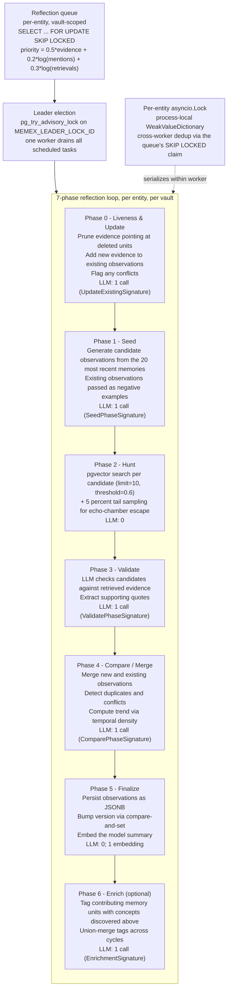
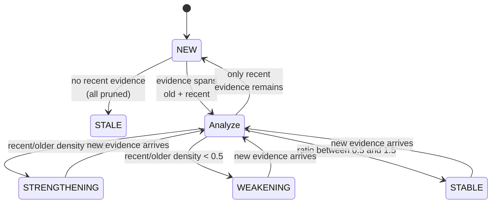

# About synthesis and reflection

Imagine you have ingested two years of meeting transcripts about a colleague named Alice. By the end, your vault holds a few thousand atomic facts: she joined the platform team in March, she shipped a migration in July, she said in October she wanted to move into research, she gave a tech talk in December about pgvector. Useful, but inert. None of it answers the question a teammate is actually asking when they ask about Alice: *what should I expect of her, right now, on this project?*

Memex's synthesis pass exists to answer that question. It reads the facts and produces something different in kind — a small set of **observations**, each one a sentence about Alice that carries a trend and the evidence that supports it. The collection of those observations, for one person, in one vault, is a **mental model**. It is what Memex has come to understand, not what Memex has read.

This page is about how that synthesis runs. By the end you should know which job runs where, why each phase exists, what it costs in LLM calls, how the system protects itself from racing with itself, and what the words `STRENGTHENING` and `STALE` actually mean when you see them in a retrieved observation.

If you read only one section, skip down to the *Mechanism* walkthrough — the seven phases are where the work lives. The earlier sections set up vocabulary; the later sections give you the trade-offs and the operator-facing consequences.

## Context

A retrieval system on its own can only return things it has seen. Ask "what does the team think about Postgres", and you get the ten chunks where Postgres came up. Ask the same question of a colleague, and you get a sentence — "we are committed to Postgres for the transactional store, but we keep looking at SQLite for embedded uses". The colleague has done synthesis you did not see. Their answer is not in any transcript; it is a compression of dozens of transcripts.

A retrieval system that never does that compression cannot answer questions of that shape. It can return the raw material, but the reader is left to compress for themselves on every read. Memex tries to do the compression once, at write time (or close to it), and store the result so retrieval can return it like any other fact. That is what reflection is.

Memex runs reflection at two scopes:

- **Per entity.** The 7-phase reflection loop builds one mental model for one entity, in one vault. It runs whenever the entity has accumulated enough new evidence to be worth re-examining. The output is a small JSONB blob of observations attached to a `mental_models` row, plus an embedding so retrieval can find the model by topic.
- **Per vault.** A separate summary pass produces one row in `vault_summaries`: a narrative of the vault's themes, recent activity, and pending maintenance work. It runs on a faster cadence and feeds the session briefings agents read at the start of every turn.

An observation, the unit reflection produces, is a small structured record. Stripped to its essentials it looks like this <code-ref path="packages/core/src/memex_core/memory/sql_models.py" lines="93-121" />:

```json
{
  "id": "0c6a...",
  "title": "Transitioning toward research work",
  "content": "Alice has mentioned wanting to move into research several times this quarter; her recent contributions still focus on platform work but the framing is shifting.",
  "trend": "strengthening",
  "evidence": [
    {"memory_id": "1f4...", "quote": "I'm thinking about asking for a rotation.", "timestamp": "2026-04-12T..."},
    {"memory_id": "8b9...", "quote": "Looking at the research roadmap.", "timestamp": "2026-04-29T..."}
  ]
}
```

Title, content, trend, evidence list. Every observation in every mental model has this shape. Retrieval surfaces them through `memex_survey` and through the entity-graph tools; reflection rewrites them on each cycle.

Each `EvidenceItem` carries its own `relevance` score and an optional `explanation` field for the LLM's reasoning about why a quote supports the observation. The `timestamp` on an evidence item is what `compute_trend` reads when it later classifies the observation's trajectory — without timestamps, the trend would be guesswork.

A mental-model row also carries fields the observation list does not: `version` (incremented by Phase 5), `last_refreshed` (set by Phase 5), `embedding` (a single vector covering the joined observation text), and per-entity Memory-Worth counters (`success_co_count`, `failure_co_count`) that record how the entity's mental model has fared with the agent across queries. The counters are vault-scoped — Alice's mental-model success rate in the work vault is independent of her success rate in the personal vault.

Both passes are reflection in the same sense — facts in, synthesis out, persisted as a versioned snapshot, surfaced through retrieval and through session briefings. The rest of this page focuses on the per-entity loop, which is where the cognitive work lives; the vault summary is a thin variant of the same idea, and the nightly orchestrator stitches them together.

Reflection is **not** retrieval. Retrieval reads what is already there. Reflection produces new things and writes them down. A user query for "Alice's recent interest in research" hits a mental-model observation; that observation only exists because reflection earlier read the raw notes and decided it was true.

## Model

Reflection is a queue-driven pipeline. New evidence enters the queue when extraction finishes; a leader-elected scheduler claims batches off the queue and runs each entity through seven phases:



The boxes on the left handle scheduling and concurrency; the boxes inside the subgraph do the cognitive work. Liveness checks first, then a generative pass (seed), then a retrieval pass (hunt), then a critical pass (validate), then a merge, then a write, then an optional retrofit (enrich). The structure mirrors how a human researcher would synthesise: clean up what you already know, draft hypotheses, find supporting evidence, vet that evidence, reconcile with prior knowledge, commit, then go back and label what you used.

Each observation in a mental model carries a **trend** — Memex's read on whether evidence for that observation is intensifying, weakening, or holding steady. The trend is computed once per cycle from the timestamps on the evidence list:



Five trends — `NEW`, `STABLE`, `STRENGTHENING`, `WEAKENING`, `STALE` — are the only values the `Trend` enum allows in `MemoryUnit.observations[].trend` <code-ref path="packages/core/src/memex_core/memory/sql_models.py" lines="83-90" />. `Analyze` in the diagram is a transient computation state inside `compute_trend`, not a stored value. An observation is in exactly one of the five at any moment, and the transition happens during Phase 4 of each cycle.

## Mechanism

Walk through one reflection cycle for one entity. Pretend Alice is the entity and you have just ingested three new notes that mention her — a sprint demo, a one-on-one transcript, and a slack export. Each note has gone through extraction; each has produced one or two memory units that link back to Alice's entity row.

### How Alice ends up in the queue

Each time extraction creates a new memory unit that mentions Alice, the ingestion service updates Alice's row in `reflection_queue`. It bumps `accumulated_evidence`, recomputes the priority score, and flips the status back to `PENDING`. The priority formula weights accumulated evidence most heavily (`weight_urgency = 0.5`), with smaller pulls from how often Alice is mentioned globally (`weight_importance = 0.2`, log-scaled to dampen hub entities) and how often she gets retrieved (`weight_resonance = 0.3`, also log-scaled) <code-ref path="packages/core/src/memex_core/memory/reflect/queue_service.py" lines="27-47" />.

Concretely, Alice's three new notes might produce six new memory units. Her queue row's `accumulated_evidence` jumps from 0 to 6; assuming she has 80 lifetime mentions and 12 retrievals, the new priority score is `0.5 * 6 + 0.2 * log10(80) + 0.3 * log10(12) = 3.0 + 0.38 + 0.32 = 3.70`. That sits comfortably above the default `min_priority = 0.3` threshold. The row floats to the top of the queue.

The choice of weights matters. Urgency dominates because reflection is most useful immediately after new evidence arrives — that is when the model is most out of date. Importance is dampened because without log scaling, a few hub entities (yourself, the project name, the company) would always be at the top, starving everyone else. Resonance closes a feedback loop: an entity you query a lot gets reflected on more often, so its mental model stays fresher than an entity nobody asks about. The defaults are tunable per vault.

There is also a priority *lane*. Most rows sit on the default lane and are claimed in priority order. A second, faster-tracked lane is reserved for entities whose surrounding evidence has changed in a way that demands immediate attention — for instance, the user just restored a previously-deprioritized memory unit on this entity, so the model should re-examine it without waiting <code-ref path="packages/core/src/memex_core/memory/reflect/queue_service.py" lines="360-430" />. `claim_next_batch` orders by `priority_lane DESC` before `priority_score DESC`, so a priority-lane row always wins against a default-lane row of any score.

The queue lives in Postgres. That matters because anyone who reads it has to coordinate with anyone else who might be reading it.

### Leader election and queue claiming

Memex runs scheduled work — reflection drain, vault summary refresh, lint pass, KV TTL sweep, the nightly consolidation orchestrator — under one global advisory lock, `MEMEX_LEADER_LOCK_ID`. Each worker process tries to grab the lock at startup; the one that wins runs every periodic task, every other worker sits as a follower until leadership changes hands <code-ref path="packages/core/src/memex_core/scheduler.py" lines="604-645" />. The constant itself is just an integer agreed by the codebase <code-ref path="packages/core/src/memex_core/scheduler.py" lines="20" />. The choice of one leader for *all* scheduled tasks (rather than separate leaders per task) is intentional: it keeps the locking story simple and prevents a network partition from producing two workers that each think they own the reflection drain.

When the reflection-drain task fires, the leader calls `claim_next_batch`, which issues a `SELECT ... FOR UPDATE SKIP LOCKED` against `reflection_queue` ordered by priority lane and priority score <code-ref path="packages/core/src/memex_core/memory/reflect/queue_service.py" lines="249-309" />. `SKIP LOCKED` is what makes the queue safe across workers: if a second worker ever does become leader briefly during a fail-over, it skips rows the first one already locked rather than blocking on them. Each claimed row is flipped from `PENDING` to `PROCESSING` in the same transaction, then handed to the reflection engine. The drain runs every 600 seconds by default, so Alice's row will get picked up within ten minutes of her last new note.

The claim path also enforces a backoff. Rows whose `last_queued_at` is in the future are skipped — that is how the system avoids hammering a row that has been re-enqueued repeatedly. The default minimum priority is `0.3`; rows below that threshold are not claimed at all <code-ref path="packages/common/src/memex_common/config.py" lines="566-571" />. An entity with one new note and no global prominence will not reflect; that is by design, because reflection is expensive and the marginal value of synthesising over a single fact is low.

### The per-entity asyncio lock

Within one worker process, two coroutines could conceivably ask to reflect on Alice at the same time — for example, an HTTP request fires `memex_memory_reconsolidate` for Alice just as the scheduled drain picks her up. To serialize within a single process, reflection acquires a per-entity `asyncio.Lock` from a `WeakValueDictionary` registry keyed by `entity_id` <code-ref path="packages/core/src/memex_core/memory/reflect/entity_locks.py" lines="29-49" />.

The implementation is small but worth a closer look:

```python
_entity_locks: weakref.WeakValueDictionary[UUID, asyncio.Lock] = weakref.WeakValueDictionary()
_registry_lock = asyncio.Lock()

async def get_entity_lock(entity_id: UUID) -> asyncio.Lock:
    lock = _entity_locks.get(entity_id)
    if lock is not None:
        return lock
    async with _registry_lock:
        lock = _entity_locks.get(entity_id)
        if lock is None:
            lock = asyncio.Lock()
            _entity_locks[entity_id] = lock
        return lock
```

The weak registry means locks for entities nobody is currently reflecting on get garbage-collected — the registry does not grow forever. The double-checked-locking pattern inside `_registry_lock` prevents two concurrent first-callers on the same entity from each creating their own lock object.

This lock is deliberately *not* a Postgres advisory lock. Older versions of Memex used `pg_try_advisory_xact_lock(hashtext('reflect:<id>'))`, but that lock lived at transaction scope, and the transaction spanned every LLM call in the reflection batch — 30 to 60 seconds per entity. A held transaction that long pins an MVCC snapshot and starves `VACUUM`. The asyncio lock has no database footprint at all. Cross-worker correctness comes from two cheaper mechanisms: the queue's `SKIP LOCKED` claim ensures two workers almost never pick up the same entity in the first place, and if one does slip through, Phase 5's compare-and-set on `mental_models.version` ensures exactly one write wins.

The Postgres advisory locks did not disappear entirely. `memex_memory_reconsolidate`, the operator-driven full-rebuild path, still acquires one through `services/locks.py` — that path is a deliberate human gesture, runs rarely, and benefits from cross-process exclusion at the cost of holding a connection longer. The scheduled drain does not need it.

### The seven phases

Once reflection has Alice's row locked, the engine runs `reflect_batch`, which loads the existing mental model (creating one with `version=1` if Alice has never been reflected before <code-ref path="packages/core/src/memex_core/memory/sql_models.py" lines="158-160" />), loads the 20 most recent memory units that mention her, and dispatches her through the seven phases <code-ref path="packages/core/src/memex_core/memory/reflect/reflection.py" lines="274-372" />. Each phase opens its own short database session via `async with self._entity_session()` so that no transaction spans an LLM call. A held transaction across an LLM call is the failure mode that the advisory-lock predecessor suffered from; the per-entity session pattern is the architectural fix.

The 20-memory window is the default for the *incremental* scope (`limit_recent_memories=20`) <code-ref path="packages/core/src/memex_core/memory/reflect/models.py" lines="12-18" />. The `full` scope passed by `memex_memory_reconsolidate` lifts that limit (up to a hard engine cap) so a full rebuild sees every unit on the entity.

**Phase 0 — Liveness and Update.** Memex first checks which evidence already cited by Alice's existing observations is still alive. Any evidence pointing at a memory unit that has since been deprioritized or is outside the active vault is pruned. If an observation loses *all* of its evidence it gets dropped; if it loses some, the observation survives with a smaller citation list. The phase then asks the LLM, given the surviving observations and the 20 new memories, what should be added — new evidence for an existing observation, or a contradiction flag if a new memory disputes a prior claim <code-ref path="packages/core/src/memex_core/memory/reflect/reflection.py" lines="1478-1593" />. One LLM call.

For Alice this might mean an existing observation ("Alice has been focused on the platform team's migration work") gains a new piece of evidence (the sprint demo where she walked through the migration's results) and possibly a contradiction marker if a new note says she has stopped working on it.

**Phase 1 — Seed.** From the 20 recent memories, the LLM proposes *candidate* observations. The existing observations are passed in as negative examples so the model is steered toward genuinely new claims rather than restating what is already there <code-ref path="packages/core/src/memex_core/memory/reflect/reflection.py" lines="1595-1635" />. Candidates at this stage are unvetted — the LLM produces a short list of "things I would write if I had to write about Alice from these notes". One LLM call.

A candidate Phase 1 might produce for Alice: "Alice is exploring a transition into research work" — drawn from the one-on-one transcript where she said so.

Why pass the existing observations as negative examples and not as priors? Because reflection is a *re-examination*, not an extension. The model's job in Phase 1 is to see what it would notice if it were reading Alice's recent activity fresh. Anchoring on the prior observations would have the LLM rephrase what already exists rather than spot what is new. The merge step in Phase 4 reconciles the new candidates with the prior observations; Phase 1's job is to surface them without bias.

**Phase 2 — Hunt.** For each candidate, Memex embeds the candidate text and runs a pgvector similarity search against every memory unit in the vault — up to ten hits per candidate above a 0.6 cosine threshold by default <code-ref path="packages/core/src/memex_core/memory/reflect/reflection.py" lines="1644-1707" /> <code-ref path="packages/common/src/memex_common/config.py" lines="532-565" />. Memex also samples a small slice of random units — 5 percent by default — so the model occasionally sees evidence outside the immediate semantic neighbourhood.

The hunt scope is the vault, not the entity. A candidate observation about Alice will pull evidence from anywhere in the vault that semantically matches the candidate's text, whether or not those units were originally extracted from a note that mentioned Alice. That sounds wrong at first — why would a unit that does not mention Alice support an observation about her? — but it is the right trade. Reflection is about what Memex understands of a topic; the topic is not strictly the entity. A candidate that says "Alice is exploring a transition into research work" can legitimately be supported by a unit that says "the team has been adding research rotation slots" even if Alice is never named in it. The validator's job, in the next phase, is to decide whether the evidence really does support the claim.

This is the **echo-chamber escape**. Without it, candidate observations would only ever pull supporting evidence from clusters that already agree with them, and contrary signals living elsewhere in the vault would be invisible to the validator. The candidate "Alice is exploring research" would only find evidence that says exactly that, never the older slack message from May where Alice argued she wanted to stay on platform indefinitely. Tail sampling makes the validator's life harder, which is the point. Zero LLM calls; just embeddings.

**Phase 3 — Validate.** Each candidate, plus its evidence pool, goes to the LLM with a single question: is this claim actually supported by these memories, and if so, which quotes prove it? Candidates without sufficient evidence are dropped. Validated candidates carry the exact quotes the LLM extracted <code-ref path="packages/core/src/memex_core/memory/reflect/reflection.py" lines="1737-1791" />. One LLM call.

The quotes matter for two reasons. First, downstream readers (the user, an agent calling `memex_survey`) can audit the claim against the original notes. Second, an observation's evidence list is what later cycles use to compute the trend — without timestamped quotes, the trend would be guesswork.

**Phase 4 — Compare and merge.** The new validated observations are merged against the existing ones: duplicates collapse, contradictions surface, surviving observations get their trend recomputed from the timestamp density of their evidence. One LLM call.

Trend computation deserves a closer look. `compute_trend` partitions an observation's evidence by timestamp into three bins: items inside the last 30 days (`recent`), items between 30 and 90 days old (`middle` and `older`), and items older than 90 days <code-ref path="packages/core/src/memex_core/memory/reflect/trends.py" lines="11-89" />. It divides each bin's count by the number of days in the bin to get a per-day density, then compares the recent density to the older density:

- No recent evidence at all? `STALE`.
- Only recent evidence, nothing in the older window? `NEW`.
- Recent density at least 1.5 times older density? `STRENGTHENING`.
- Recent density at most half of older density? `WEAKENING`.
- Anywhere in between? `STABLE`.

Concretely, suppose Alice's research-transition observation has four evidence items in the last 30 days and two in the 30-to-90-day window. Recent density: 4/30 ≈ 0.133. Older density: 2/60 ≈ 0.033. Ratio: 4.0. That clears the `> 1.5` cutoff, so the observation flips to `STRENGTHENING`. If the same observation later goes a quarter without new evidence, the recent bin empties, density goes to zero, and the trend slides to `STALE`.

For Alice's research-transition claim, the older slack message complicates things. The new evidence pool has four recent items pointing toward the transition, the older slack message points the other way. The merge step has to decide whether to call the observation a contradiction or a strengthening trajectory. The model's own confidence and the timestamps inform the call; in this case, the older message is far enough back and the recent density high enough that the observation lands as `STRENGTHENING` with a contradiction flag attached to the older evidence item.

**Phase 5 — Finalize.** This is where the work becomes durable.

Memex computes one embedding for the joined observation text, then issues a single SQL statement that bumps the row and the version atomically <code-ref path="packages/core/src/memex_core/memory/reflect/reflection.py" lines="630-727" />:

```sql
UPDATE mental_models
   SET observations = :new_observations,
       entity_metadata = :new_entity_metadata,
       version = version + 1,
       last_refreshed = :now,
       embedding = :new_embedding
 WHERE id = :id
   AND version = :claimed_version;
```

This is **compare-and-set**. If another worker has refreshed Alice's row since this batch read its version, the `WHERE` clause matches zero rows and the update is silently abandoned. The engine returns the abandon, the service layer marks the queue row as abandoned (no retry-count increment, because contention is benign), and the next scheduler tick picks Alice up again on the now-fresher state.

Real exceptions — an LLM circuit-breaker open, a connection dropped — flow through a different path that does increment the retry count and eventually moves the row to `DEAD_LETTER` for an operator to look at. The two outcomes are kept distinct because conflating them would either carousel a broken entity forever (failure mis-classified as abandon) or eventually dead-letter a perfectly healthy contended entity (abandon mis-classified as failure). Zero LLM calls; one embedding.

The version bump in Phase 5 is what makes mental models traceable over time. A retrieval that pulls Alice's mental model knows it is reading version 8; the lineage tools can show how observations changed between versions; the next reflection cycle will start from version 8 and try to land at version 9. A user who watches Alice's `version` field climb knows the system has continued to reason about her; a flat version says reflection has not had reason to touch the row.

**Phase 6 — Enrich.** Reflection has now produced a set of observations supported by specific memory units. Phase 6 walks back into those units and tags them with concepts the LLM discovered during synthesis <code-ref path="packages/core/src/memex_core/memory/reflect/reflection.py" lines="1130-1235" />.

For example, if an observation about Alice says "transitioning into research", the units that supported it get the tag `career-transition` added to their `unit_metadata.enriched_tags`. Tags from successive cycles union together rather than overwrite, so a unit accumulates a richer set of concepts over time. One LLM call. This phase is optional and gated by `server.memory.reflection.enrichment_enabled` (default `True`) <code-ref path="packages/common/src/memex_common/config.py" lines="546-549" />.

The downstream consequence of Phase 6 is concrete. A keyword search for `career-transition` will now hit Alice's sprint demo unit, the one-on-one transcript unit, and the slack-export unit — even though none of those units originally contained the words "career transition". The tag is enriched into the unit's metadata, which the keyword index covers. TEMPR's keyword channel will surface those units. The retrieval boundary that used to require the agent to know exactly which entity's mental model to ask about — "tell me about Alice" — now widens to concept-level queries that span entities — "tell me about career transitions across the team".

The trade-off is that Phase 6 is the most "creative" step in the loop. The LLM is not just validating against evidence; it is inventing concept tags. A bad tag does not corrupt the underlying units (the original text is untouched), but it pollutes the retrieval index until the next cycle prunes it. Phase 6's pruning behaviour — union-merge across cycles, with stale tags dropped when their originating observation is gone — is what keeps the noise bounded.

End-to-end, one cycle for one entity costs four LLM calls if Phase 6 is disabled, five if it is enabled, with one Phase-5 embedding on top. The hunt phase's pgvector queries cost embedding calls but no chat completions. The hunt phase's tail-sample step also touches the database; everything else is bounded by the LLM round-trip.

### Retry counters and dead-lettering

A row can fail rather than abandon. If the LLM circuit-breaker is open, or if the underlying network drops mid-call, the engine catches the exception and returns the entity in the `failed_entity_ids` list instead of `abandoned_entity_ids`. The service layer routes failures through `mark_failed`, which increments `retry_count` <code-ref path="packages/core/src/memex_core/services/reflection.py" lines="118-165" />. When `retry_count` exceeds the configured `max_retries`, the row moves to `DEAD_LETTER` and stops being claimed by the drain. An operator can inspect dead-lettered rows through the lint dashboard, fix whatever broke the engine path, and reset the row to `PENDING` to retry.

Concretely: suppose Alice's reflection cycle is in Phase 4 when the LLM provider returns a 500. The engine catches the exception, the cycle returns Alice in `failed_entity_ids`, and the service layer flips her queue row to `FAILED` with `retry_count = 1`. The next drain tick re-claims her; if the provider has recovered, the cycle completes and `complete_reflection` deletes the queue rows. If the provider is still down on the third or fourth attempt, the row dead-letters and stops bothering the scheduler.

This is why CAS abandons must *not* increment `retry_count`: an entity that happens to be contended (because, say, an operator-driven reconsolidate races with the scheduled drain) could otherwise dead-letter within a handful of drain ticks even though nothing about it is broken. Keeping the counters separate keeps the operator's dead-letter inbox actionable.

### The per-vault summary pass

A second reflection scope produces one row per vault in `vault_summaries`. The mechanism is much simpler: a SQL aggregate over `Note` / `MemoryUnit` / `Entity` for the inventory and recency block, then one LLM call (`VaultSummaryUpdateSignature` or its full-rewrite sibling) to produce a narrative <code-ref path="packages/core/src/memex_core/services/vault_summary.py" lines="41-49" />. The vault summary is what powers the briefing an agent sees at the start of every session — the themes, the top entities, the recent activity, the pending maintenance work — and it runs on its own faster cadence (default `interval_seconds = 3600`, an hour) so the briefing does not go stale between nightly orchestrator runs <code-ref path="packages/common/src/memex_common/config.py" lines="2054-2058" />.

The vault summary is cheap because the LLM never sees raw evidence — it sees pre-aggregated counts (how many notes, how many memory units, top entities by mention) and a small sample of recent units. The LLM's job is to turn those numbers into prose. One call per cadence tick, regardless of vault size.

The summary also surfaces operational state the agent needs to know about: how many lint findings are pending, how many memory units are sitting close to the auto-band threshold, what activity the vault has seen in the last seven days. That metadata block is computed deterministically from SQL aggregates; only the narrative prose comes from the LLM. The cost is therefore one LLM call per vault per cadence tick — a few cents at typical model prices, even for vaults with tens of thousands of units.

The two scopes meet in the **nightly consolidation orchestrator**. Once a day (default `cadence_seconds = 86400`) <code-ref path="packages/common/src/memex_common/config.py" lines="1249-1253" />, the leader runs `ConsolidationService.tick` per vault. The tick selects memory units that have changed since the previous tick, groups them by entity, and for each entity:

1. Acquires the per-entity advisory lock from `services/locks.py` <code-ref path="packages/core/src/memex_core/services/consolidation.py" lines="168-216" />.
2. Runs contradiction detection across the affected units.
3. Triggers a reflection cycle on the entity (the same seven phases described above, scoped to the changed units).
4. Prunes evidence in mental-model observations whose underlying units have been moved to `stale` status.

The vault-level steps — vault summary refresh and the lint pass — run separately around the per-entity loop. The whole tick is checkpointed: if it crashes after processing five entities, the next tick resumes at the sixth rather than redoing the first five.

Concurrent `memex_memory_reconsolidate` calls compete with the tick for the same per-entity advisory lock. Entities whose lock cannot be acquired within `entity_lock_timeout_seconds` (default 5 seconds) are deferred to the next tick rather than blocking the whole vault <code-ref path="packages/common/src/memex_common/config.py" lines="1259-1268" />. A deferred entity is not lost — it simply waits 24 hours for the next nightly batch. Operators who notice an entity being deferred repeatedly can resolve it by inspecting the lock holder, since the only thing that holds the advisory lock long enough to block the tick is another reconsolidate call.

### Reconsolidate vs the scheduled drain

Two ways to trigger reflection on Alice. They are not interchangeable.

The **scheduled drain** is the routine path. It runs every 600 seconds under the leader, claims the highest-priority pending rows in batches of ten, and runs each entity in *incremental* scope — the 20 most recent memory units. It is what fires automatically after every ingestion event. Cost is bounded per cycle; throughput is bounded by drain interval and `max_concurrency`. Whatever Alice's queue priority happens to be, the drain will eventually pick her up.

The **reconsolidate path** is the surgical-repair path. `memex memory reconsolidate <entity-id>` on the CLI or `memex_memory_reconsolidate(entity_id, vault_id)` over MCP runs in *full* scope — every memory unit on Alice, not just the recent 20 — and runs a fresh contradiction sweep across all of them before triggering reflection on the cleaned evidence. The path also acquires a Postgres advisory lock for that entity, so the scheduled drain and the consolidation orchestrator both block on it for the duration. The CLI surface itself documents the cost and use cases at length <code-ref path="packages/cli/src/memex_cli/memory.py" lines="240-266" />.

When to use each:

- New ingestion arrived, you want the model to reflect the new evidence: do nothing. The drain handles it.
- The model's observations look wrong, or two entities were just merged and the survivor's model is stale, or `memex diagnose lint` flagged the entity: reconsolidate.
- You are batch-importing a thousand notes and want the models to be fresh by morning: do nothing. The nightly consolidation orchestrator handles it.
- You are about to demo Alice's mental model to a stakeholder and want it freshly rebuilt from scratch: reconsolidate.

The rate limit on reconsolidate is per `(entity_id, vault_id)` (default settings live in `summarize_node_rate_limit` <code-ref path="packages/common/src/memex_common/config.py" lines="580-583" />), which means an attacker — or a confused agent — cannot pin the LLM by hammering reconsolidate on one entity. The rate-limit window is also the value returned in the `retry_after_seconds` of the 503-equivalent envelope, so the caller knows exactly how long to wait.

### What an operator sees

Reflection emits Prometheus metrics and OpenTelemetry traces for every meaningful step. The relevant signals an operator watches:

- Queue depth and processing rate — how many entities sit in `PENDING`, how many drain per minute. A queue that grows unbounded means the drain interval is too long for the ingestion rate, or `max_concurrency` is too low.
- CAS-abandon rate on `mental_models.version` — a count of Phase 5 races. Low single-digit numbers per hour is benign contention; high rates suggest the drain is picking up overlapping batches and the lock-claim window is mis-tuned.
- LLM call counts and token usage per phase — extraction, classifier, reflection update / seed / validate / compare / enrich, vault summary, lint. Each surface emits its own counter so a cost spike can be traced to a specific phase rather than to "reflection" as a black box.
- Dead-letter row count — should be near zero. A non-zero count is a real incident; the operator inspects the row's last error and either fixes the cause or resets the row to retry.
- Per-entity reflection-lock wait — how long coroutines spent waiting on the asyncio lock. High wait times within a worker process suggest concurrent reconsolidate calls are racing the drain.

A separate diagnostics surface — UMAP projection of memory-unit embeddings, FSFM-score heatmap, lint dashboard — turns those metrics into pictures. The metrics are the truth; the dashboards are the way humans actually consume them.

### When reflection looks stuck

A common operational worry is "I ingested a note an hour ago and the mental model still does not reflect it". The diagnosis path:

1. Check the entity's `reflection_queue` row. If `status = 'PROCESSING'` and `last_queued_at` is more than `stale_processing_timeout_seconds` (default 1800s) ago, a worker died mid-cycle and the row will be reset to `PENDING` automatically on the next drain <code-ref path="packages/common/src/memex_common/config.py" lines="572-579" />.
2. If `status = 'PENDING'` but `priority_score < min_priority` (default 0.3), the entity does not have enough new evidence to clear the threshold. Lower `min_priority` for the vault, or wait for more notes to accumulate.
3. If `status = 'FAILED'` with a non-zero `retry_count`, look at the last error string. An LLM circuit-breaker open or a connection drop will retry automatically; a structural error (schema mismatch, bad signature) needs human intervention.
4. If `status = 'DEAD_LETTER'`, the row has exhausted retries. Inspect the error, fix the underlying issue, and reset the row to `PENDING`.

Most "stuck" complaints turn out to be case 2 — the system is working correctly, the entity simply has not accumulated enough new evidence to be worth reflecting on yet. A reconsolidate forces the issue if it really matters.

## Trade-offs and alternatives

A few of the choices above were not obvious. They are worth naming so you understand what Memex is buying with them and what it is paying.

**Phase 6 is original to Memex.** The Hindsight Framework paper, which the rest of the loop is based on, stops at Phase 5. Memex adds the retrospective enrichment pass because of a specific retrieval problem: an entity-anchored search ("everything about Alice") works on units tagged with that entity, but a concept-anchored search ("career transitions in the team") only works if the concept appears in the unit's text or metadata. Without Phase 6, the concepts the synthesis pass discovers stay locked inside the mental model — useful for `memex_survey` but invisible to keyword search and TEMPR.

Phase 6 pushes those concepts back down onto the units that taught Memex about them, so the same concept becomes a retrievable signal at the unit level. The cost is one extra LLM call per cycle and a small risk of mistagging. The audit trail in the unit's `unit_metadata.enriched_tags` is a recoverable list, and reflection prunes tags as observations evolve — so a mistag self-corrects over a few cycles rather than compounding. The trade favours enrichment for vaults where cross-concept retrieval matters; the toggle is there if you have a workload where it does not.

**The per-entity lock is asyncio, not Postgres advisory.** The advisory-lock approach is the obvious one — it would protect across workers, not just within one — but it had a fatal property: the lock was held at transaction scope, and the transaction had to stay open across every DSPy call in the reflection batch. A reflection cycle's LLM calls can run 30 to 60 seconds; multiply that by ten entities in a batch and the lock pins a Postgres snapshot open for ten minutes, which starves `VACUUM` and inflates table bloat.

The asyncio lock has no database footprint at all. Cross-worker correctness comes from two cheaper mechanisms: the queue's `SKIP LOCKED` claim ensures two workers almost never pick up the same entity in the first place, and if one does slip through, Phase 5's compare-and-set on `mental_models.version` ensures exactly one write wins. The trade is real — an advisory lock would have made the race impossible, the CAS approach merely makes it benign — but it is the right trade for a system where each reflection step is LLM-bounded. A benign race that re-enqueues a row costs one extra scheduler tick; a held advisory lock for ten minutes costs ongoing bloat.

**The orchestrator is nightly, not continuous.** You might expect reflection to fire as soon as evidence arrives, like a stream processor. It does, but only at the per-entity level: every ingestion event bumps the queue, and the leader's drain task picks the queue up every 600 seconds by default. What does *not* fire continuously is the heavier batch — contradiction sweep across the vault, mental-model cleanup, vault summary refresh, lint pass. Those run once a day under the consolidation orchestrator.

The reason is cost and the human review surface. Contradiction detection across the vault is `O(n^2)` in newly-ingested units. Vault summary is a vault-wide aggregate. Lint emits maintenance proposals an operator has to actually look at. Running them continuously would multiply LLM cost without giving the operator a sane review surface; an operator who gets a fresh batch of proposals every hour stops reading them. The nightly batch concentrates the work, checkpoints it so a partial failure resumes rather than redoes, and produces one digest the human can engage with each morning.

**The 20-memory window for incremental reflection.** The choice of 20 recent memories as the default window is empirical, not theoretical. Too small and the LLM does not see enough context to generalise; too large and the cost climbs and the model gets noisier. Twenty memories is roughly one to two weeks of typical-vault evidence per entity; it is enough for an observation to be supported by multiple sources without straying into evidence the entity has already been reflected on. `memex_memory_reconsolidate` is the way to override this — it triggers a full-scope cycle that sees every unit on the entity, at the corresponding LLM cost.

**The validator runs after the hunt step, not inline.** A simpler design would have one LLM call generate candidates and immediately decide which are supported. Memex splits the two: Phase 1 generates without evidence, Phase 2 retrieves evidence, Phase 3 validates against it. The split exists because generation and validation are different cognitive tasks. A model in generation mode produces plausible-sounding claims; a model in validation mode is more conservative about whether evidence actually supports a claim. Asking the same call to do both biases the validation step in the generator's favour. The cost is one extra LLM call per cycle (and the embedding round trip for Phase 2); the win is that observations Memex keeps almost always have direct, quotable evidence behind them.

## Implications

Three practical consequences of the model worth knowing.

**A `trend = STRENGTHENING` is a claim about evidence density, not about correctness.** When a retrieval surfaces an observation marked `STRENGTHENING`, what the system is telling you is "more recent evidence per day supports this claim than older evidence per day, by at least a factor of 1.5". The trend says nothing about whether the claim is *right* — only that whatever you have been writing about Alice lately keeps reinforcing this particular observation. `WEAKENING` is the symmetric statement: a claim that used to have steady support is losing it. `STABLE` means the rate has held steady; `NEW` means there is not enough old evidence to compare; `STALE` means recent evidence has dried up entirely (every supporting unit is now older than the recency window).

If you want a correctness signal, look at Memory Worth and the contradiction graph, not at the trend. A `STRENGTHENING` observation with a low Memory Worth is one the system keeps writing about and keeps getting marked unhelpful — the trend is a popularity reading, not a quality reading. The opposite case — a `STABLE` observation with high Memory Worth — is often more trustworthy than a flashy `STRENGTHENING` one.

**You can force a reflection when the model goes wrong.** The scheduler reflects on Alice when her queue priority floats high enough; ordinarily you should not have to think about it. But the model can drift — two entities collapsed into one, a contradicting note ingested late, an extraction error that polluted the evidence. The escape hatch is `memex memory reconsolidate <entity-id>` (CLI <code-ref path="packages/cli/src/memex_cli/memory.py" lines="230-275" />) or `memex_memory_reconsolidate(entity_id, vault_id)` (MCP <code-ref path="packages/mcp/src/memex_mcp/server.py" lines="4103-4142" />).

Both paths acquire the Postgres advisory lock for that entity, run a full contradiction sweep across every unit that mentions her, and then trigger reflection on the freshly-cleaned evidence. The call is LLM-intensive and rate-limited per entity-and-vault, so reach for it deliberately — when `memex diagnose lint` flags an entity, after a manual entity merge, or when you have concrete reason to believe the model is wrong. The scheduled drain is the right tool for routine churn; reconsolidate is the right tool for surgical repair.

A reconsolidate that returns a `lock_contention` envelope (HTTP 409 surfaced through the MCP tool) means the consolidation orchestrator is currently working on this entity. Wait a moment and retry; the orchestrator's per-entity hold is bounded.

**Observations are read-only projections of memory units.** When an observation cites three memory units as evidence, those three units are the source of truth. The observation itself is a derived view; the next reflection cycle may rewrite it, drop it, merge it with another, or flip its trend.

If you want to suppress a claim Memex keeps making, you do not deprioritize the *observation* — you deprioritize one or more of the underlying *memory units*, and the next reflection cycle will produce an observation without them (or no observation at all, if the remaining evidence is too thin). The MCP path warns about this directly: a deprioritize call against an observation UUID returns HTTP 400 with the list of source memory units, asking you to re-issue against one of those.

The same applies to the vault summary: the summary is a derived view of the vault, not a place to edit. To change what the summary says, change what the vault contains.

**A new entity does not get a mental model until reflection has run on it.** When extraction creates the first memory unit that mentions a new person — say Alice's first appearance — the entity row is created and queued for reflection, but no `mental_models` row exists yet. Retrieval against the entity will return raw units; `memex_survey` will return raw units; the entity graph will know who is mentioned alongside her, but nothing higher-order yet. Only after the drain picks Alice up and the first cycle completes does she get a `mental_models` row at `version = 1`. If you have just ingested a batch and are surprised that `memex_survey("Alice")` returns no synthesised observations, the answer is usually "give the drain ten minutes".

**Reflection's input window is bounded.** The drain looks at the 20 most recent memory units per entity by default, not the entity's entire history. This keeps each cycle cheap and lets the queue throughput stay high. The flip side is that an observation supported by evidence outside that window is invisible to Phase 1's seed step — though Phase 2's hunt step can still pull older units back in as supporting evidence for a new candidate. If you suspect the model is missing a chunk of older context, `memex_memory_reconsolidate` runs in `full` scope and lifts the window.

### How reflection talks to the rest of Memex

Reflection does not act alone. It sits inside a larger curation pipeline whose other components feed it and consume it.

*Upstream:* extraction puts the raw memory units in place, the entity resolver decides which entity each unit mentions, the contradiction engine writes `MemoryLink(contradicts)` rows when a new unit disputes an old one. Reflection reads all three: it uses the entity-unit join to find Alice's memories, it relies on extraction's `intent_class` / `risk_class` / `importance` columns to weight evidence, and it surfaces contradictions through the Phase 0 conflict-flag step.

*Downstream:* the FSFM curator reads `mental_models.observations` to decide which units belong to a "weakening" cluster worth proposing for deprioritization. The session-briefing pass reads `vault_summaries` and pulls top-entity mental models into the agent's initial context. Retrieval (TEMPR) reads mental-model embeddings on its mental-model strategy lane and reads enriched tags on its keyword lane.

A change in one component visibly affects the next. A new contradiction link arriving from the engine raises the entity's queue priority via the resonance signal, which floats Alice up the queue, which means Phase 4 of her next cycle sees the contradiction flag and the merge step decides whether to mark the older observation `WEAKENING`. The FSFM curator then sees the weakened observation, looks at its evidence units, and may propose them for auto-band. The whole pipeline self-reinforces; reflection is one stage of it.

A final concrete scenario closes the loop. Suppose you ingest a note this afternoon that explicitly says "Alice has decided to stay on platform". Extraction creates a unit, the contradiction engine notices it contradicts the older "Alice is transitioning into research" observation's evidence, and writes a `contradicts` link. Alice's queue row gets a priority bump.

The next drain tick — within ten minutes by default — picks her up. Phase 0 sees the contradiction flag on the existing observation. Phase 1 generates a candidate around her decision to stay. Phase 4 merges, recomputes trends, and finds the old observation now `WEAKENING` (newer evidence directly disputes it). Phase 5 commits version 9.

By the time you ask `memex_survey("Alice")` an hour later, the model already says "Alice considered a research transition earlier this year but has since committed to platform work", with the older claim cited as historical evidence and the trend flipped. You did not have to do anything; the curation pipeline took care of it.

That is the shape of the system at its best: ingestion writes raw, reflection synthesises, contradiction wires connections, curation surfaces decay, retrieval reads. Reflection is one stage among five, but it is the stage that turns a pile of facts into something the system can be said to *understand*. The next time you ask Memex about Alice and it gives you a synthesised sentence instead of ten transcript chunks, the seven phases above are why.

## See also

- [Tutorial: Memory Worth and deprioritization](../../tutorial/memory-worth-and-deprioritization.md)
- [How-to: Reconsolidate an entity's mental model](../../how-to/reconsolidate.md)
- [Reference: MCP tools](../../reference/mcp-tools.md)
- [Explanation: Mental-model observations](../mental-model-observations.md)
