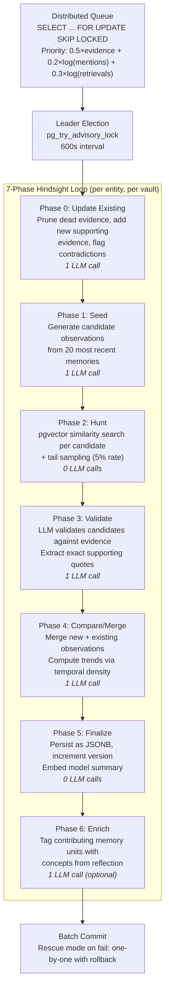
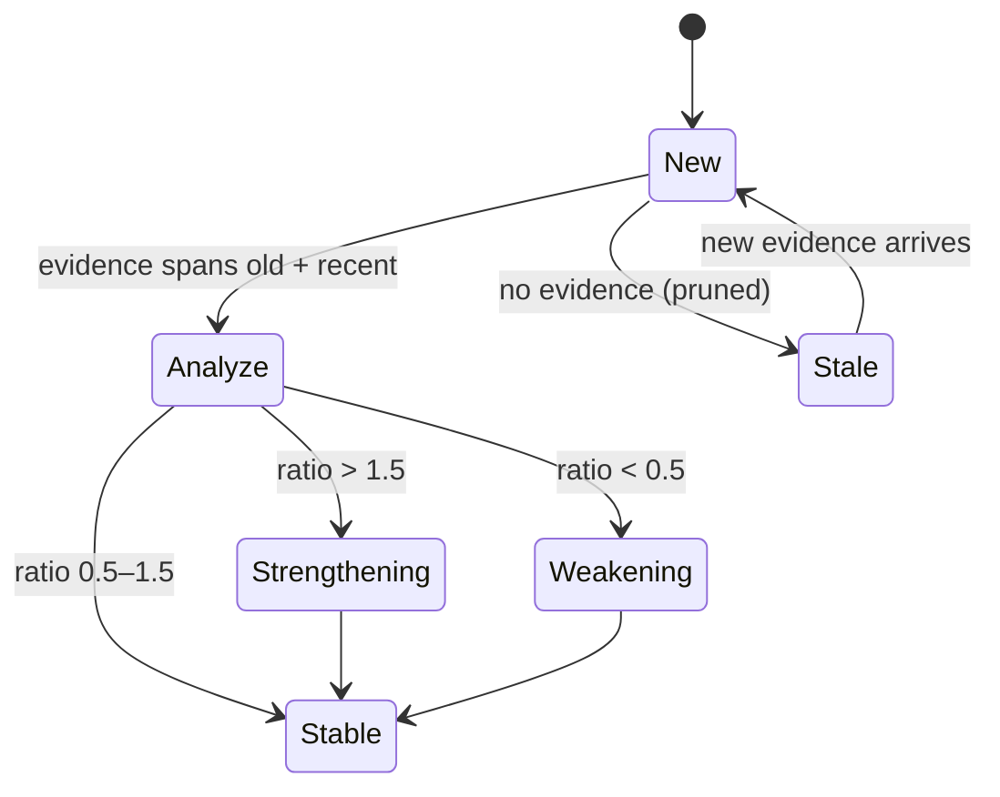

# About Reflection and Mental Models

Reflection is the process by which Memex transforms raw facts into higher-level understanding. Individual memory units are the "what happened" — mental models are the "what does it mean."

## Context

A knowledge base with thousands of atomic facts is useful for retrieval but overwhelming for comprehension. If you ask "What is our approach to testing?", returning 50 individual facts about specific tests is less helpful than a single synthesized observation: "The team follows a testing pyramid with unit tests as the foundation, integration tests for service boundaries, and E2E tests for critical user flows."

Reflection is the mechanism that produces these synthesized observations. It runs periodically in the background, reviewing entities that have accumulated new evidence and updating their mental models.

## Mental Models

A mental model is a versioned, per-entity, per-vault summary of what Memex understands about a topic. Each mental model contains:

- **Entity reference**: The entity this model describes (e.g., "PostgreSQL", "Authentication System")
- **Observations**: A list of synthesized insights, each with a title, content, evidence citations, and trend indicator
- **Version number**: Incremented each time the model is updated
- **Embedding**: A vector representation of the combined observations, used by the Mental Model retrieval strategy
- **Last refreshed timestamp**: When reflection last ran for this entity

Mental models are scoped to vaults. The mental model for "PostgreSQL" in the "Project A" vault reflects only evidence from that vault, not from other projects. This prevents cross-contamination between unrelated projects.

## The Reflection Queue

Reflection is driven by a priority queue implemented in PostgreSQL. Entities enter the queue when they are "touched" during extraction — meaning new facts were created or linked to them.

### Priority Scoring

The queue assigns each entity a priority score using the **Salience Formula**:

```
Priority = (weight_urgency * accumulated_evidence)
         + (weight_importance * log10(mention_count))
         + (weight_resonance * log10(retrieval_count))
```

Three factors determine which entities reflect first:

- **Urgency** (default weight: 0.5): How much new evidence has accumulated since the last reflection. An entity with 10 new facts is more urgent than one with 2.
- **Importance** (default weight: 0.2): How globally prominent the entity is, measured by total mention count across all notes. Logarithmic scaling prevents "hub" entities from dominating.
- **Resonance** (default weight: 0.3): How often users query about the entity. Entities that users actively search for are prioritized. This creates a feedback loop — the more you ask about something, the more Memex invests in understanding it.

Entities below `min_priority` (default: 0.3) are skipped entirely, conserving LLM resources for topics that matter.

### Distributed Processing

The reflection queue uses PostgreSQL's `SELECT ... FOR UPDATE SKIP LOCKED` for atomic task claiming. This allows multiple workers to process reflection tasks concurrently without conflicts or double-processing. A worker claims a batch of entities, processes them, and marks them complete — all within a single transaction.

Additionally, each entity reflection acquires a PostgreSQL advisory lock (`pg_try_advisory_xact_lock`) to prevent concurrent reflection on the same entity from different workers.

## Reflection Pipeline Overview



### Trend Tracking State Machine

Observations track trend state based on evidence temporal density:



The ratio is `recent_evidence_density / older_evidence_density`, where the split point is 30 days.

## The Phases of Reflection

When an entity is selected for reflection, it passes through the following phases:

### Phase 0: Update Existing

Before generating new observations, Memex re-evaluates existing ones. Each observation's **trend** is recomputed based on its evidence timestamps:

| Trend | Meaning | Condition |
| :--- | :--- | :--- |
| **New** | All evidence is recent | No evidence older than 30 days |
| **Strengthening** | Gaining more evidence recently | Recent evidence density > 1.5x older density |
| **Stable** | Consistent evidence over time | Recent density within 0.5x-1.5x of older density |
| **Weakening** | Less evidence recently | Recent evidence density < 0.5x older density |
| **Stale** | No recent evidence at all | No evidence in the last 30 days |

Trend detection helps Memex surface what is currently relevant and flag observations that may be outdated.

### Phase 1: Seed (LLM)

The LLM reads the entity's recent memories and existing observations, then proposes **candidate observations** — new insights that synthesize patterns across multiple facts.

The LLM is given context about what observations already exist to avoid generating duplicates. It is instructed to focus on patterns, trends, and connections that individual facts do not capture.

### Phase 2: Hunt (Vector Search)

For each candidate observation, Memex performs a vector similarity search to find supporting and contradicting evidence in the knowledge graph. This is the "evidence gathering" phase.

The search uses the reflection configuration's `search_limit` (default: 10 candidates) and `similarity_threshold` (default: 0.6) to filter results.

### Phase 3: Validate (LLM)

The LLM evaluates each candidate observation against the gathered evidence:

- Generates **citations** linking the observation to specific memory units
- Rejects candidates with insufficient or contradictory evidence

This phase ensures that observations are grounded in actual evidence, not hallucinated by the seed phase.

### Phase 4: Compare (LLM)

The LLM merges the validated new observations with the existing set:

- **Merge duplicates**: If a new observation covers the same ground as an existing one, they are combined.
- **Resolve contradictions**: If new evidence contradicts an existing observation, the LLM decides which to keep based on evidence strength.
- **Preserve history**: Existing observations that are still valid are retained with their updated trends.

### Phase 5: Finalize

The final set of observations is:

1. Serialized and stored in the mental model's `observations` field
2. Combined into a text representation and embedded for the Mental Model retrieval strategy
3. The model's version number is incremented and `last_refreshed` is updated

### Phase 6: Enrich (Memory Evolution)

After the mental model is finalized, Phase 6 pushes enriched tags back into the individual memory units that contributed as evidence. This closes a feedback loop: reflection builds understanding that connects old memories to new concepts, and enrichment makes those memories discoverable for queries they previously could not match.

**How it works:**

1. **Collect evidence IDs** — iterate over all observations and gather the IDs of memory units cited as evidence
2. **Load units** — use units already loaded in the session; fetch any missing evidence units from the database
3. **Build LLM context** — include existing enriched tags to prevent duplicates
4. **Generate tags** — the LLM produces enriched tags and keywords for each memory unit based on the mental model's understanding
5. **Write overlay** — under a database lock, set-union the new tags with existing ones and record `enriched_at` timestamp and `enriched_by_entity`

**Example:** A 3-month-old memory "Project Alpha is rewriting its auth middleware" (original tags: `auth, middleware`) is invisible to "compliance work" queries. After enrichment, that memory gains `enriched_tags: ["compliance", "eu-regulation"]` and becomes findable via the keyword strategy.

**Safety guarantees:**

- **Append-only**: All enrichment keys are prefixed with `enriched_` — original metadata is never modified
- **Accumulative**: Tags are set-unioned across reflection cycles, never overwritten
- **Auditable**: Each enrichment records the entity name and timestamp for traceability

Enrichment can be disabled by setting `enrichment_enabled: false` in the reflection configuration.

## Batch Processing

Reflection processes entities in batches to minimize database round-trips:

1. **Batch load**: All entities, mental models, and recent memories for the batch are fetched in bulk.
2. **Concurrent processing**: Each entity is reflected upon concurrently, up to `max_concurrency` (default: 3) simultaneous LLM operations.
3. **Optimistic commit**: All updated mental models are committed in a single transaction. If the batch commit fails, a "rescue mode" saves models one by one.

The `background_reflection_batch_size` (default: 10) controls how many entities are processed per cycle, and `background_reflection_interval_seconds` (default: 600) controls how often the cycle runs.

## Evidence and Citations

Every observation in a mental model includes evidence items — references to specific memory units with quoted text. This makes mental models traceable: you can always ask "why does Memex believe X?" and get a list of source facts.

Evidence quotes are verified against the original memory content. If a quote cannot be found (e.g., the referenced memory was deleted), the evidence item is flagged.

## Configuration

Key reflection settings in `config.yaml`:

```yaml
server:
  memory:
    reflection:
      background_reflection_enabled: true
      enrichment_enabled: true
      background_reflection_interval_seconds: 600
      background_reflection_batch_size: 10
      max_concurrency: 3
      min_priority: 0.3
      weight_urgency: 0.5
      weight_importance: 0.2
      weight_resonance: 0.3
      search_limit: 10
      similarity_threshold: 0.6
      model:
        model: "openai/gpt-4o"  # Use a stronger model for reflection
```

A common pattern is to use a cheaper model for extraction and a stronger model for reflection, since reflection requires more sophisticated reasoning.

## Vault Summaries

Vault summaries are auto-generated natural language descriptions of a vault's contents — topics, themes, note count, entity count, and key patterns. They complement mental models by providing a high-level orientation for agents encountering a vault for the first time.

### Regeneration Strategy

Summaries use a 3-tier regeneration strategy:

1. **Ingestion-triggered**: After a note is ingested, the summary is marked stale. If the cooldown period has elapsed, regeneration runs in the background.
2. **Periodic background**: A scheduled task checks for stale summaries and regenerates them.
3. **On-demand**: Users or agents can trigger regeneration via `memex vault summary --regenerate` or the REST API.

Regeneration uses the full set of notes and entities in the vault to produce a fresh summary via an LLM call. Summaries are versioned — each regeneration increments the version number.

### Session Briefing

Vault summaries feed into the token-budgeted **session briefing** (`memex briefing`), which composes a curated knowledge index for LLM agents at session start. The briefing includes the vault summary, top entities with mental model trend indicators (new/stable/strengthening/weakening/stale), KV facts, and available vaults — all within a configurable token budget (default 2000 tokens).

## See Also

* [About the Hindsight Framework](hindsight-framework.md) — the overall architecture
* [About Retrieval Strategies](retrieval-strategies.md) — how mental models are searched
* [How to Configure Memex](../how-to/configure-memex.md) — reflection configuration options
