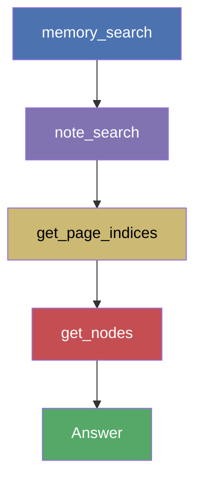
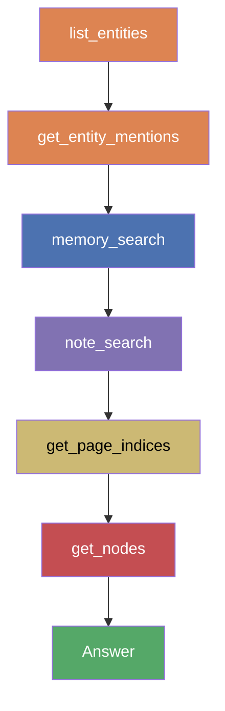
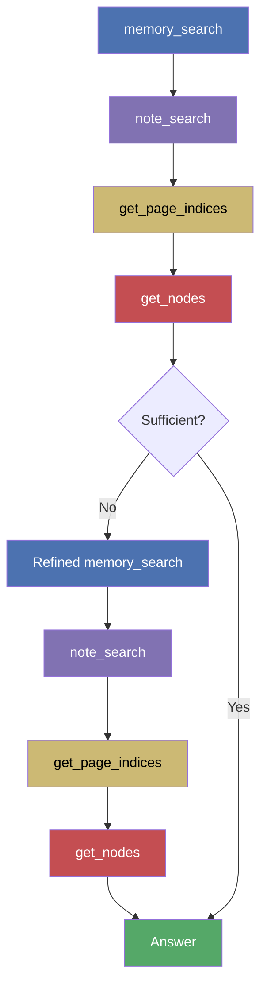

# LoCoMo Evaluation Report

> Model: Claude Opus 4 via Claude Code CLI | Judge: Gemini 3 Flash
> Date: 2026-03-22

## Summary

| Metric | Value |
|---|---|
| Questions (scored) | 36 (excl. 3 image-dependent, 11 adversarial) |
| Overall Score (non-adversarial) | **0.986** |
| Perfect answers | 35 (97.2%) |
| Wrong answers | 0 (0.0%) |
| Total cost | $9.14 |
| Total duration | 37.4 min |

## Scores by Category

| Category | Count | Mean Score | Perfect | Wrong |
|---|---|---|---|---|
| Single-Hop | 9 | **0.944** | 8 | 0 |
| Multi-Hop | 9 | **1.000** | 9 | 0 |
| Open Domain | 3 | **1.000** | 3 | 0 |
| Temporal | 15 | **1.000** | 15 | 0 |
| Adversarial (unweighted) | 11 | 0.727 | 8 | 3 |
| **Non-adversarial** | **36** | **0.986** | **35** | **0** |

### A note on adversarial scoring

Adversarial questions in the LoCoMo dataset deliberately swap the subject — asking about person A when the ground-truth answer actually pertains to person B. The expected "correct" behavior is for the model to detect this swap.

However, Memex is a search-and-answer tool. When asked "What instrument does Caroline play?", it correctly searches for Caroline's instruments, finds "acoustic guitar", and returns that answer. The fact that the benchmark expects "clarinet and violin" (Melanie's instruments) tests something outside the system's scope: the model would need to know the question is deliberately misleading.

In the failed adversarial cases, the retrieval system found correct, relevant facts for the queried person. These are not retrieval failures — they are a fundamental mismatch between a search tool's behavior and the adversarial benchmark's expectations. Adversarial scores are therefore reported separately and excluded from the weighted overall score.

## Retrieval Efficiency

### Token breakdown

| Metric | Value |
|---|---|
| Total tokens (all) | 5,024,120 |
| Retrieval tokens (Memex) | 386,035 (**7.7%** of total) |
| Agent overhead tokens | 4,638,085 (92.3%) |
| Retrieval tokens/question (mean) | 7,804 |
| Retrieval tokens/question (median) | 4,910 |

### Retrieval by tool

| Tool | Tokens | Share | Calls | Calls/q |
|---|---|---|---|---|
| `memory_search` | 208,433 | 54.0% | 78 | 1.6 |
| `note_search` | 92,776 | 24.0% | 54 | 1.1 |
| `get_nodes` | 46,258 | 12.0% | 29 | 0.6 |
| `get_entity_mentions` | 15,829 | 4.1% | 5 | 0.1 |
| `get_page_indices` | 13,670 | 3.5% | 28 | 0.6 |
| `list_entities` | 7,775 | 2.0% | 28 | 0.6 |
| `get_entity_cooccurrences` | 1,260 | 0.3% | 2 | 0.0 |
| `read_note` | 34 | 0.0% | 1 | 0.0 |

### Efficiency by category

| Category | Duration | Turns | Total Tokens | Retr Tokens | Retr % | Memex Calls |
|---|---|---|---|---|---|---|
| Single-Hop | 43.7s | 5.6 | 55,805 | 5,703 | 10.0% | 3.6 |
| Multi-Hop | 35.1s | 5.4 | 68,089 | 6,387 | 11.0% | 3.4 |
| Open Domain | 39.6s | 5.7 | 46,745 | 4,827 | 10.6% | 3.7 |
| Temporal | 31.1s | 5 | 54,156 | 5,115 | 10.1% | 3 |
| Adversarial | 74.3s | 10.5 | 251,671 | 15,163 | 8.1% | 8.5 |

### Distribution plots

## Tool Usage Patterns

| Metric | Value |
|---|---|
| ToolSearch calls/question | 1.0 (50 total, 0 questions with >1) |
| Entity exploration | 21/50 questions (42%) |
| Citations (inline refs) | 50/50 (100%) |
| Citations (reference list) | 50/50 (100%) |
| `read_note` (discouraged) | 1 total (0.0/q) |

### Memex tool call distribution

| Tool | Total Calls | Calls/q |
|---|---|---|
| `memory_search` | 78 | 1.6 |
| `note_search` | 54 | 1.1 |
| `get_nodes` | 29 | 0.6 |
| `list_entities` | 28 | 0.6 |
| `get_page_indices` | 28 | 0.6 |
| `get_entity_mentions` | 5 | 0.1 |
| `get_entity_cooccurrences` | 2 | 0.0 |
| `read_note` | 1 | 0.0 |

## Retrieval Paths

The agent autonomously selects a retrieval path based on question complexity. Entity exploration (`list_entities`, `get_entity_mentions`) is used as a supplementary step in any path — it was triggered in 42% of questions.

| Pattern | Count | Share | Avg Score | Avg Tools | Avg Duration | Avg Cost |
|---|---|---|---|---|---|---|
| Two-stage | 19 | 38% | 1.00 | 2.0 | 27s | $0.10 |
| Two-stage + entity | 9 | 18% | 0.83 | 3.8 | 40s | $0.13 |
| Deep verification | 7 | 14% | 0.93 | 4.4 | 41s | $0.17 |
| Deep + entity | 7 | 14% | 0.79 | 6.1 | 54s | $0.23 |
| Simple + entity | 5 | 10% | 0.80 | 2.8 | 31s | $0.11 |
| Exhaustive | 3 | 6% | 0.67 | 21.7 | 181s | $0.87 |

### Two-stage path (19 questions, 38%)

Memory search and note search provide sufficient context to answer directly. The most efficient path — highest volume with perfect score (1.00) at lowest cost ($0.10/q). Dominates multi-hop (7) and temporal (6) questions where facts are directly retrievable.

**Typical questions**: straightforward fact lookups — "When did Caroline go to the adoption meeting?" (q-002), "When did Melanie go to the park?" (q-006), "When did Melanie go camping in July?" (q-008).

### Deep verification path (7 questions, 14%)

Full two-speed reading: search finds candidate notes, then `get_page_indices` → `get_nodes` drills into specific sections for precise evidence. Primarily used for temporal and adversarial questions that need exact details from longer conversation sessions.

**Typical questions**: questions requiring verification from source text — "What did Melanie do after the road trip to relax?" (q-014), "What does Caroline do to keep herself busy during her pottery break?" (q-004).

### Deep + entity path (7 questions, 14%)

Adds entity exploration to deep verification. The agent queries `list_entities` and/or `get_entity_mentions` to discover relationships before or after searching. Used for questions involving person-to-person connections and adversarial questions where the agent tries to verify subject attribution.

### Two-stage + entity path (9 questions, 18%)

Memory and note search augmented with entity exploration. The second most common path — used for single-hop and adversarial questions where entity relationships help contextualize the answer.

### Simple + entity path (5 questions, 10%)

A single search round with entity exploration. No deep reading needed — memory search alone returns enough. The 0.80 average score is influenced by adversarial subject swaps rather than retrieval failures.

### Exhaustive path (3 questions, 6%)

Multiple rounds of searching and reading across different notes and queries. The agent iterates when initial results are insufficient — refining queries, searching additional sessions, or reading more note sections. Most expensive ($0.87/q) but necessary for complex questions. Includes adversarial questions where the agent tries harder to find contradicting information.

**Typical questions**: complex multi-evidence questions — "When did Melanie read 'Nothing is Impossible'?" (q-010, 15 tools, $0.44), "What activity did Melanie used to do with her dad?" (q-039, 26 tools, $1.10).

## Resource Usage

| Metric | Value |
|---|---|
| Total tokens | 5,024,120 |
| Input tokens | 4,946,901 |
| Output tokens | 77,219 |
| Retrieval tokens (Memex) | 386,035 (7.7%) |
| Total duration | 2,244s (37.4 min) |
| Avg duration/question | 44.9s |
| Median duration/question | 34.5s |
| Total cost | $9.14 |
| Avg cost/question | $0.183 |

## Per-Question Detail

| ID | Category | Score | Dur | Turns | Total Tok | Retr Tok | Retr % | Memex# | Cost |
|---|---|---|---|---|---|---|---|---|---|
| q-001 | adversarial | 1.0 | 57.6s | 7 | 86,884 | 8,442 | 9.7% | 5 | $0.25 |
| q-002 | multi-hop | 1.0 | 21.9s | 4 | 40,991 | 4,700 | 11.5% | 2 | $0.10 |
| q-003 | multi-hop | 1.0 | 29.4s | 4 | 41,676 | 4,860 | 11.7% | 2 | $0.11 |
| q-004 | adversarial | 1.0 | 40.5s | 6 | 81,065 | 6,158 | 7.6% | 4 | $0.16 |
| q-005 | single-hop | 1.0 | 36.8s | 5 | 42,275 | 4,867 | 11.5% | 3 | $0.12 |
| q-006 | multi-hop | 1.0 | 23.4s | 4 | 41,293 | 4,628 | 11.2% | 2 | $0.10 |
| q-007 | multi-hop | 1.0 | 28.4s | 4 | 41,454 | 4,648 | 11.2% | 2 | $0.11 |
| q-008 | multi-hop | 1.0 | 21.1s | 4 | 41,211 | 4,823 | 11.7% | 2 | $0.10 |
| q-009 | adversarial | 0.0 | 63.6s | 11 | 158,591 | 15,720 | 9.9% | 9 | $0.29 |
| q-010 | multi-hop | 1.0 | 119.1s | 17 | 282,051 | 19,417 | 6.9% | 15 | $0.44 |
| q-011 | adversarial | 1.0 | 57.7s | 9 | 142,560 | 11,501 | 8.1% | 7 | $0.25 |
| q-012 | temporal | 1.0 | 24.7s | 4 | 41,223 | 4,705 | 11.4% | 2 | $0.10 |
| q-013 | open domain | 1.0 | 38.9s | 5 | 43,071 | 5,836 | 13.5% | 3 | $0.13 |
| q-014 | temporal | 1.0 | 40.4s | 6 | 79,919 | 5,667 | 7.1% | 4 | $0.15 |
| q-015 | temporal | 1.0 | 30.3s | 4 | 41,779 | 4,899 | 11.7% | 2 | $0.11 |
| q-016 | multi-hop | 1.0 | 23.1s | 4 | 41,294 | 4,750 | 11.5% | 2 | $0.10 |
| q-017 | single-hop | 1.0 | 38.7s | 6 | 59,682 | 6,151 | 10.3% | 4 | $0.14 |
| q-018 | single-hop | — | 51.5s | 7 | 65,519 | 8,289 | 12.7% | 5 | $0.17 |
| q-019 | single-hop | 1.0 | 25.0s | 5 | 40,015 | 3,401 | 8.5% | 3 | $0.10 |
| q-020 | open domain | 1.0 | 41.1s | 7 | 54,810 | 3,807 | 6.9% | 5 | $0.13 |
| q-021 | temporal | 1.0 | 24.1s | 4 | 40,822 | 4,466 | 10.9% | 2 | $0.10 |
| q-022 | adversarial | 1.0 | 43.9s | 6 | 81,507 | 5,896 | 7.2% | 4 | $0.16 |
| q-023 | adversarial | 1.0 | 26.9s | 6 | 79,599 | 5,797 | 7.3% | 4 | $0.16 |
| q-024 | temporal | 1.0 | 35.4s | 7 | 82,081 | 6,281 | 7.7% | 5 | $0.16 |
| q-025 | open domain | 1.0 | 38.8s | 5 | 42,354 | 4,839 | 11.4% | 3 | $0.12 |
| q-026 | adversarial | 1.0 | 203.1s | 26 | 939,543 | 48,390 | 5.2% | 24 | $1.07 |
| q-027 | adversarial | — | 47.7s | 6 | 80,607 | 6,004 | 7.4% | 4 | $0.17 |
| q-028 | temporal | 1.0 | 38.8s | 4 | 41,971 | 4,948 | 11.8% | 2 | $0.11 |
| q-029 | single-hop | 1.0 | 44.2s | 5 | 42,294 | 4,917 | 11.6% | 3 | $0.12 |
| q-030 | temporal | 1.0 | 26.9s | 4 | 41,341 | 4,847 | 11.7% | 2 | $0.10 |
| q-031 | temporal | 1.0 | 43.2s | 7 | 82,045 | 7,021 | 8.6% | 5 | $0.19 |
| q-032 | single-hop | 1.0 | 31.4s | 4 | 41,116 | 4,504 | 11.0% | 2 | $0.10 |
| q-033 | multi-hop | 1.0 | 25.4s | 4 | 41,618 | 5,006 | 12.0% | 2 | $0.10 |
| q-034 | single-hop | 0.5 | 100.4s | 9 | 140,273 | 15,902 | 11.3% | 7 | $0.37 |
| q-035 | adversarial | 0.0 | 23.6s | 4 | 39,506 | 3,227 | 8.2% | 2 | $0.09 |
| q-036 | temporal | 1.0 | 33.4s | 7 | 79,890 | 5,693 | 7.1% | 5 | $0.15 |
| q-037 | adversarial | — | 33.5s | 5 | 41,984 | 4,931 | 11.7% | 3 | $0.11 |
| q-038 | single-hop | 1.0 | 50.2s | 8 | 55,046 | 3,668 | 6.7% | 6 | $0.14 |
| q-039 | adversarial | 0.5 | 220.5s | 28 | 1,001,915 | 45,736 | 4.6% | 26 | $1.10 |
| q-040 | temporal | 1.0 | 24.8s | 4 | 40,929 | 4,470 | 10.9% | 2 | $0.10 |
| q-041 | adversarial | 1.0 | 47.4s | 9 | 115,067 | 10,877 | 9.5% | 7 | $0.22 |
| q-042 | adversarial | 1.0 | 31.9s | 4 | 42,148 | 5,045 | 12.0% | 2 | $0.12 |
| q-043 | temporal | 1.0 | 22.1s | 4 | 41,049 | 4,759 | 11.6% | 2 | $0.10 |
| q-044 | single-hop | 1.0 | 36.2s | 4 | 42,334 | 5,171 | 12.2% | 2 | $0.12 |
| q-045 | temporal | 1.0 | 28.5s | 4 | 41,320 | 4,680 | 11.3% | 2 | $0.10 |
| q-046 | temporal | 1.0 | 37.7s | 5 | 42,275 | 4,910 | 11.6% | 3 | $0.12 |
| q-047 | multi-hop | 1.0 | 24.3s | 4 | 41,213 | 4,651 | 11.3% | 2 | $0.10 |
| q-048 | single-hop | 1.0 | 30.3s | 4 | 39,208 | 2,750 | 7.0% | 2 | $0.10 |
| q-049 | temporal | 1.0 | 28.8s | 5 | 42,694 | 5,413 | 12.7% | 3 | $0.12 |
| q-050 | temporal | 1.0 | 27.8s | 6 | 73,008 | 3,967 | 5.4% | 4 | $0.15 |

## Excluded Questions

| ID | Reason |
|---|---|
| q-018 | Book title only visible in shared image (book cover) |
| q-027 | Precautionary sign content only visible in shared photo |
| q-037 | References a photo not available to the memory system |

## Remaining Errors

### Non-adversarial (1)

| ID | Category | Question | Issue |
|---|---|---|---|
| q-034 | Single-Hop | How many times has Melanie gone to the beach in 2023? | The model found both beach references (Session 6 and Session 10) but incorrectly concluded they describe the same trip due to close timing. Reasoning error, not retrieval failure. |

### Adversarial (3, unweighted)

| ID | Question | Issue |
|---|---|---|
| q-009 | What setback did Caroline face recently? | The model identifies a different event (a negative encounter while hiking) than what the benchmark expects. The benchmark swaps subject — the expected answer is about Melanie's setback. |
| q-035 | What type of instrument does Caroline play? | The model finds acoustic guitar and piano (correct for Caroline), but the benchmark expects clarinet and violin (Melanie's instruments — subject swap). |
| q-039 | What activity did Melanie used to do with her dad? | The model correctly identifies that horseback riding was Caroline's activity with her dad, not Melanie's. The benchmark swaps subject. |

In all adversarial failures, the retrieval system found correct facts for the queried person. The failures are inherent to the adversarial format: a search tool cannot detect that a question deliberately swaps subjects.
