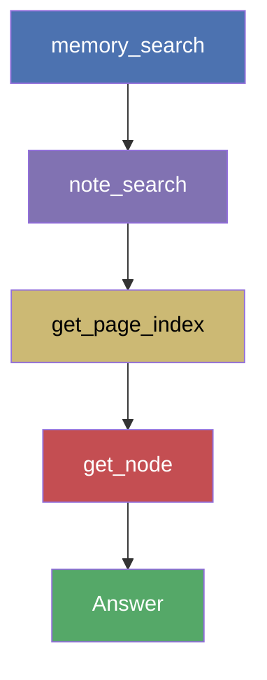
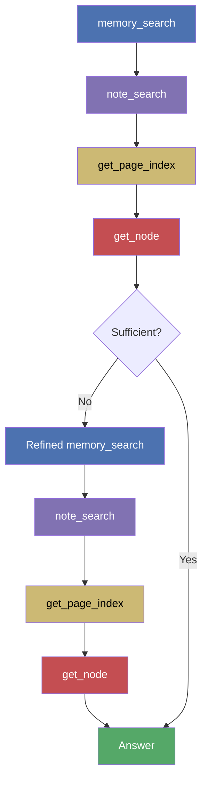

# LoCoMo Evaluation Report

> Run date: 2026-03-08 | Branch: `feat/retrieval` | Model: Claude Opus 4 via Claude Code CLI | Judge: Gemini 3 Flash

## Summary

| Metric | Value |
|---|---|
| Questions (scored) | 45 (excl. 3 image-dependent, 12 adversarial) |
| Overall Score (non-adversarial) | **0.978** |
| Perfect answers | 44 (97.8%) |
| Wrong answers | 1 (2.2%) |
| Total cost | $8.29 |
| Total duration | 37.6 min |

## Scores by Category

| Category | Count | Mean Score | Perfect | Wrong |
|---|---|---|---|---|
| Multi-Hop | 14 | **1.000** | 14 | 0 |
| Open Domain | 3 | **1.000** | 3 | 0 |
| Temporal | 18 | **1.000** | 18 | 0 |
| Single-Hop | 10 | 0.900 | 9 | 1 |
| **Non-adversarial** | **45** | **0.978** | **44** | **1** |
| Adversarial (unweighted) | 12 | 0.667 | 8 | 4 |

### A note on adversarial scoring

Adversarial questions in the LoCoMo dataset deliberately swap the subject — asking about person A when the ground-truth answer actually pertains to person B. The expected "correct" behavior is for the model to detect this swap.

However, Memex is a search-and-answer tool. When asked "What instrument does Caroline play?", it correctly searches for Caroline's instruments, finds "acoustic guitar", and returns that answer. The fact that the benchmark expects "clarinet and violin" (Melanie's instruments) tests something outside the system's scope: the model would need to know the question is deliberately misleading.

In the 4 failed adversarial cases, the retrieval system found correct, relevant facts for the queried person. The model gave a truthful answer based on what it found. These are not retrieval failures — they are a fundamental mismatch between a search tool's behavior and the adversarial benchmark's expectations. Adversarial scores are therefore reported separately and excluded from the weighted overall score.

## Retrieval Efficiency

### Token breakdown

| Metric | Value |
|---|---|
| Total tokens (all) | 7,178,675 |
| Retrieval tokens (Memex) | 329,702 (**4.6%** of total) |
| Agent overhead tokens | 6,848,973 (95.4%) |
| Retrieval tokens/question (mean) | 5,495 |
| Retrieval tokens/question (median) | 3,440 |

95% of token usage is Claude Code overhead (system prompt, tool definitions, conversation history). Memex retrieval context itself is compact — ~3.4K tokens median per question.

### Retrieval by tool

| Tool | Tokens | Share | Calls | Calls/q |
|---|---|---|---|---|
| `memory_search` | 221,386 | 67.1% | 90 | 1.5 |
| `note_search` | 46,581 | 14.1% | 50 | 0.8 |
| `get_node` | 31,886 | 9.7% | 32 | 0.5 |
| `read_note` | 18,004 | 5.5% | 19 | 0.3 |
| `get_page_index` | 10,312 | 3.1% | 51 | 0.8 |
| Other | 1,533 | 0.5% | 5 | 0.1 |

`memory_search` is the primary retrieval tool (67% of retrieval tokens, 1.5 calls/question). `get_page_index` is called frequently (0.8/q) but returns compact TOC data (3.1% of tokens).

> **Note on `read_note`:** All 19 `read_note` calls come from a single question (q-010), which asks about a book title that only appears in a shared image — effectively an unanswerable question. The agent exhausted `memory_search`, `note_search`, and `get_page_index` without finding the title, then fell back to reading every session note in full as a last resort. No answerable question required `read_note`; the `get_page_index` + `get_node` two-speed pattern was sufficient in all other cases.

### Efficiency by category

| Category | Duration | Turns | Total Tokens | Retr Tokens | Retr % | Memex Calls |
|---|---|---|---|---|---|---|
| Open Domain | 30.6s | 4.0 | 53,446 | 4,045 | 7.6% | 2.0 |
| Temporal | 28.0s | 4.8 | 72,857 | 3,467 | 4.8% | 2.4 |
| Single-Hop | 34.2s | 6.3 | 107,090 | 5,662 | 5.3% | 3.9 |
| Multi-Hop | 35.2s | 7.2 | 129,829 | 5,628 | 4.3% | 4.8 |
| Adversarial | 60.4s | 9.7 | 209,407 | 8,952 | 4.3% | 6.8 |

Adversarial questions require ~3x more Memex calls than temporal/open-domain — the agent does additional verification to check person attributions.

### Distribution plots

## Retrieval Paths

Three distinct patterns observed across 60 questions:

### Simple path (22 questions, 37%)

A single `memory_search` returns sufficient facts to answer directly.

**Turns:** 3 | **Memex calls:** 1 | **Retrieval:** ~2.4K tokens | **Duration:** ~19s
**Typical for:** temporal, simple single-hop, simple multi-hop

### Two-stage path (19 questions, 32%)

Memory search provides initial context, then note search finds source documents for verification.

**Turns:** 4 | **Memex calls:** 2 | **Retrieval:** ~3.4K tokens | **Duration:** ~27s
**Typical for:** multi-hop, open-domain, simple adversarial

### Deep verification path (14 questions, 23%)

Full two-speed reading: search, then drill into specific note sections for precise evidence.

**Turns:** 8–11 | **Memex calls:** 5–7 | **Retrieval:** ~6K tokens | **Duration:** ~45s
**Typical for:** adversarial verification, counting, complex multi-hop

### Exhaustive path (5 questions, 8%)

Multiple rounds of searching and reading across different notes and queries.

**Turns:** 17–37 | **Memex calls:** 14–31 | **Retrieval:** ~16–37K tokens | **Duration:** 75–206s
**Typical for:** ambiguous adversarial, exhaustive counting (q-010, q-026, q-032, q-039, q-058)

## Resource Usage

| Metric | Value |
|---|---|
| Total tokens | 7,178,675 |
| Input tokens | 7,120,562 |
| Output tokens | 58,113 |
| Retrieval tokens (Memex) | 329,702 (4.6%) |
| Total duration | 2,254s (37.6 min) |
| Avg duration/question | 37.6s |
| Median duration/question | 27.8s |
| Per-turn latency | 6.2s (median) |
| Total cost | $8.29 |
| Avg cost/question | $0.138 |

## Per-Question Detail

| ID | Category | Score | Dur | Turns | Total Tok | Retr Tok | Retr % | Memex# | Cost |
|---|---|---|---|---|---|---|---|---|---|
| q-001 | adversarial | 1.0* | 38.5s | 4 | 53,251 | 3,329 | 6.3% | 2 | $0.14 |
| q-002 | multi_hop | 1.0 | 24.6s | 4 | 52,382 | 3,309 | 6.3% | 2 | $0.08 |
| q-003 | multi_hop | 1.0 | 28.4s | 4 | 53,022 | 3,586 | 6.8% | 2 | $0.08 |
| q-004 | adversarial | 1.0 | 58.4s | 8 | 153,104 | 7,526 | 4.9% | 5 | $0.18 |
| q-005 | single_hop | 1.0 | 25.1s | 4 | 52,649 | 3,294 | 6.3% | 2 | $0.08 |
| q-006 | multi_hop | 1.0 | 19.5s | 3 | 49,998 | 2,213 | 4.4% | 1 | $0.06 |
| q-007 | multi_hop | 1.0 | 38.7s | 8 | 118,879 | 4,651 | 3.9% | 5 | $0.14 |
| q-008 | multi_hop | 1.0 | 18.6s | 3 | 50,484 | 2,634 | 5.2% | 1 | $0.06 |
| q-009 | adversarial | 0.0 | 30.8s | 4 | 52,503 | 3,190 | 6.1% | 2 | $0.08 |
| q-010 | multi_hop | 1.0 | 145.9s | 37 | 830,828 | 32,381 | 3.9% | 31 | $0.80 |
| q-011 | adversarial | 1.0 | 47.8s | 8 | 150,415 | 7,008 | 4.7% | 5 | $0.17 |
| q-012 | temporal | 1.0 | 18.2s | 3 | 49,944 | 2,213 | 4.4% | 1 | $0.06 |
| q-013 | open_domain | 1.0 | 30.8s | 4 | 54,354 | 5,141 | 9.5% | 2 | $0.09 |
| q-014 | temporal | 1.0 | 21.7s | 4 | 52,509 | 3,203 | 6.1% | 2 | $0.08 |
| q-015 | temporal | 1.0 | 23.7s | 3 | 50,422 | 2,570 | 5.1% | 1 | $0.06 |
| q-016 | multi_hop | 1.0 | 21.1s | 4 | 52,338 | 3,219 | 6.2% | 2 | $0.07 |
| q-017 | single_hop | 1.0 | 36.1s | 8 | 124,998 | 6,904 | 5.5% | 5 | $0.16 |
| q-018 | single_hop | — | 31.2s | 7 | 117,246 | 4,283 | 3.7% | 4 | $0.13 |
| q-019 | single_hop | 1.0 | 20.7s | 3 | 50,459 | 2,446 | 4.8% | 1 | $0.07 |
| q-020 | open_domain | 1.0 | 33.5s | 4 | 53,149 | 3,513 | 6.6% | 2 | $0.09 |
| q-021 | temporal | 1.0 | 23.0s | 3 | 50,097 | 2,366 | 4.7% | 1 | $0.06 |
| q-022 | adversarial | 1.0 | 39.7s | 4 | 72,518 | 5,035 | 6.9% | 2 | $0.10 |
| q-023 | adversarial | 1.0 | 44.6s | 9 | 146,845 | 6,626 | 4.5% | 5 | $0.17 |
| q-024 | temporal | 1.0 | 37.1s | 8 | 138,766 | 4,439 | 3.2% | 4 | $0.14 |
| q-025 | open_domain | 1.0 | 27.5s | 4 | 52,836 | 3,482 | 6.6% | 2 | $0.08 |
| q-026 | adversarial | 1.0 | 205.9s | 35 | 989,018 | 37,273 | 3.8% | 31 | $0.94 |
| q-027 | adversarial | — | 41.6s | 7 | 135,549 | 4,603 | 3.4% | 4 | $0.14 |
| q-028 | temporal | 1.0 | 17.5s | 3 | 51,204 | 2,196 | 4.3% | 1 | $0.07 |
| q-029 | single_hop | 1.0 | 27.6s | 4 | 52,665 | 3,395 | 6.4% | 2 | $0.08 |
| q-030 | temporal | 1.0 | 18.0s | 3 | 50,479 | 2,740 | 5.4% | 1 | $0.06 |
| q-031 | temporal | 1.0 | 36.5s | 4 | 53,114 | 3,441 | 6.5% | 2 | $0.09 |
| q-032 | single_hop | 1.0 | 89.2s | 17 | 392,459 | 15,727 | 4.0% | 14 | $0.38 |
| q-033 | multi_hop | 1.0 | 17.6s | 3 | 50,237 | 2,507 | 5.0% | 1 | $0.06 |
| q-034 | single_hop | **0.0** | 31.2s | 8 | 97,202 | 4,614 | 4.7% | 5 | $0.13 |
| q-035 | adversarial | 0.0 | 19.2s | 3 | 50,355 | 2,694 | 5.4% | 1 | $0.06 |
| q-036 | temporal | 1.0 | 39.9s | 10 | 143,062 | 5,596 | 3.9% | 7 | $0.16 |
| q-037 | adversarial | — | 24.7s | 4 | 52,735 | 3,440 | 6.5% | 2 | $0.08 |
| q-038 | single_hop | 1.0 | 28.1s | 4 | 58,481 | 8,471 | 14.5% | 2 | $0.12 |
| q-039 | adversarial | 1.0 | 107.6s | 19 | 496,477 | 16,637 | 3.4% | 14 | $0.45 |
| q-040 | temporal | 1.0 | 24.9s | 3 | 50,208 | 2,437 | 4.9% | 1 | $0.06 |
| q-041 | adversarial | 0.0 | 55.6s | 11 | 128,585 | 8,310 | 6.5% | 8 | $0.18 |
| q-042 | adversarial | 1.0* | 21.9s | 3 | 50,360 | 2,431 | 4.8% | 1 | $0.06 |
| q-043 | temporal | 1.0 | 24.3s | 3 | 51,045 | 2,215 | 4.3% | 1 | $0.07 |
| q-044 | single_hop | 1.0 | 24.3s | 3 | 50,786 | 2,744 | 5.4% | 1 | $0.07 |
| q-045 | temporal | 1.0 | 24.4s | 4 | 52,834 | 3,598 | 6.8% | 2 | $0.08 |
| q-046 | temporal | 1.0 | 31.1s | 4 | 52,774 | 3,271 | 6.2% | 2 | $0.08 |
| q-047 | multi_hop | 1.0 | 17.0s | 3 | 49,949 | 2,290 | 4.6% | 1 | $0.06 |
| q-048 | single_hop | 1.0 | 20.7s | 3 | 50,172 | 2,409 | 4.8% | 1 | $0.06 |
| q-049 | temporal | 1.0 | 35.6s | 9 | 119,934 | 5,535 | 4.6% | 6 | $0.15 |
| q-050 | temporal | 1.0 | 49.6s | 11 | 188,454 | 7,085 | 3.8% | 7 | $0.20 |
| q-051 | multi_hop | 1.0 | 22.2s | 3 | 50,680 | 2,634 | 5.2% | 1 | $0.07 |
| q-052 | temporal | 1.0 | 27.6s | 4 | 53,131 | 3,520 | 6.6% | 2 | $0.09 |
| q-053 | multi_hop | 1.0 | 17.0s | 3 | 50,005 | 2,252 | 4.5% | 1 | $0.06 |
| q-054 | temporal | 1.0 | 30.7s | 4 | 53,248 | 3,565 | 6.7% | 2 | $0.09 |
| q-055 | single_hop | 1.0 | 39.3s | 9 | 141,025 | 6,617 | 4.7% | 6 | $0.16 |
| q-056 | temporal | 1.0 | 20.8s | 3 | 50,197 | 2,419 | 4.8% | 1 | $0.06 |
| q-057 | multi_hop | 1.0 | 25.3s | 4 | 52,293 | 3,128 | 6.0% | 2 | $0.07 |
| q-058 | multi_hop | 1.0 | 75.2s | 19 | 305,994 | 11,222 | 3.7% | 16 | $0.32 |
| q-059 | adversarial | 0.0 | 54.6s | 8 | 169,456 | 7,363 | 4.3% | 5 | $0.18 |
| q-060 | multi_hop | 1.0 | 21.9s | 3 | 50,512 | 2,762 | 5.5% | 1 | $0.06 |

\* Judge score revised upward (adversarial person-swap correctly detected)
— = excluded (image-dependent)

## Excluded Questions

| ID | Reason |
|---|---|
| q-018 | Book title "Nothing is Impossible" only visible in shared image (book cover) |
| q-027 | Precautionary sign content only visible in shared photo of cafe sign |
| q-037 | "the photo" references an image not available to the memory system |

## Remaining Errors

### Non-adversarial (1)

| ID | Category | Question | Expected | Model Answer | Issue |
|---|---|---|---|---|---|
| q-034 | single_hop | How many times has Melanie gone to the beach in 2023? | 2 | 0 found | Count recall failure — beach visits not extracted as distinct memories |

### Adversarial (4, unweighted)

| ID | Question | Expected (swapped) | Model Answer | What happened |
|---|---|---|---|---|
| q-009 | What setback did Caroline face recently? | Pottery injury (Melanie's) | Hiking encounter | Found a real Caroline setback; no reason to suspect swap |
| q-035 | What instrument does Caroline play? | Clarinet, violin (Melanie's) | Guitar | Found Caroline's actual instrument; correct retrieval |
| q-041 | How did Caroline feel after the accident? | Grateful for family (Melanie's son's accident) | Found different incident | Searched for Caroline's accidents, found one |
| q-059 | Classical musicians Caroline enjoys? | Bach, Mozart (Melanie's) | None found for Caroline | Found they belong to Melanie, concluded no data for Caroline |

In all 4 cases, the retrieval system found correct facts for the queried person. The failures are inherent to the adversarial format: a search tool cannot detect that a question deliberately swaps subjects.

## Judge Corrections

| ID | Original | Revised | Reason |
|---|---|---|---|
| q-001 | 0.75 | 1.00 | Correctly detected Melanie→Caroline person-swap |
| q-042 | 0.75 | 1.00 | Correctly identified stained glass window + person-swap |
