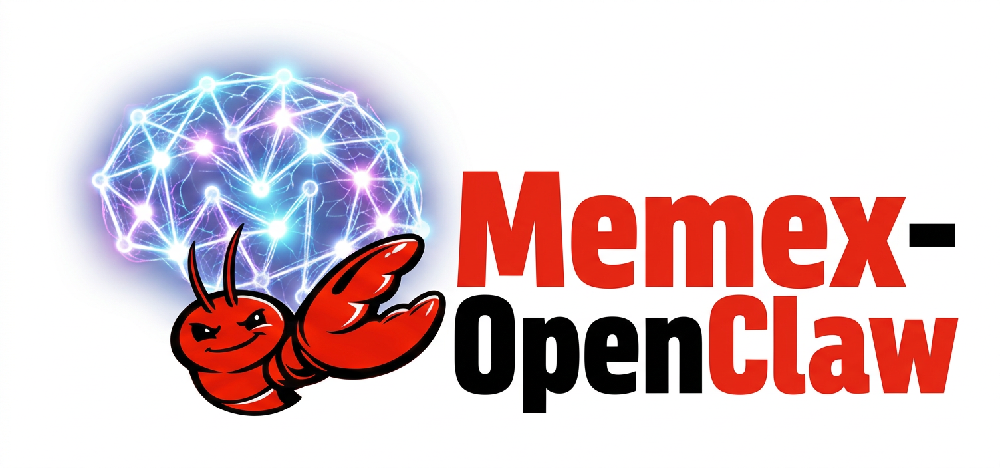

# Memex Memory Plugin for OpenClaw (`memory-memex`)



A memory plugin for [OpenClaw](https://openclaw.ai) that gives your agent long-term memory powered by [Memex](https://github.com/JasperHG90/memex). Memories are automatically recalled before each agent turn and conversations are captured after each turn — all via the Memex REST API.

## How It Works

The plugin occupies OpenClaw's exclusive `memory` slot (replacing the default `memory-core` or `memory-lancedb`). It registers two lifecycle hooks, nine agent tools, two slash commands, and a CLI subcommand.

### Lifecycle Hooks

| Hook | Phase | Behaviour |
|------|-------|-----------|
| `before_agent_start` | **Auto-recall + profile injection** | Searches Memex for memories relevant to the user's prompt. Results are escaped, wrapped in `<relevant-memories>` tags, and injected via `prependContext` so the LLM sees them as context — not instructions. Every Nth turn (controlled by `profileFrequency`), entity context from the knowledge graph is also injected. |
| `agent_end` | **Auto-capture** | Extracts conversation text (user-only in `'filtered'` mode, or user + assistant in `'full'` mode), formats it as a Markdown note with YAML frontmatter, Base64-encodes the content, and sends it to `POST /api/v1/ingestions?background=true`. When `sessionGrouping` is enabled, turns are grouped into a single session document (updated each turn via `note_key`). The request is **fire-and-forget**: the `fetch` promise is `void`-ed so the agent is never blocked. |

Both hooks are guarded by a **circuit breaker** (3 consecutive failures open the breaker for 60 seconds, then a single probe is allowed through).

### Agent Tools

| Tool | Description |
|------|-------------|
| `memex_memory_search` | Search Memex memories by natural-language query. Accepts optional `limit` parameter. Returns ranked memory units (facts, observations, experiences). |
| `memex_store` | Store a note in Memex. Accepts `text`, optional `name`, and optional `tags`. Ingestion runs in the background — the tool returns immediately. |
| `memex_note_search` | Search source notes with optional synthesis. Accepts `query`, `limit`, `summarize`, `reason`, and `expand_query`. Returns ranked notes with snippets. |
| `memex_read_note` | Retrieve the full content and metadata of a note by its UUID. |
| `memex_get_page_index` | Get the hierarchical table of contents for a note. Returns section titles, summaries, and node IDs for drilling into specific sections. |
| `memex_get_node` | Retrieve the full text content of a specific note section by its node ID. Use after `memex_get_page_index` to read individual sections. |
| `memex_get_lineage` | Trace the provenance chain of a memory unit, observation, note, or mental model back to its source. Accepts `unit_id` and optional `entity_type`. |
| `memex_list_entities` | List or search entities in the knowledge graph. Without a query, returns top entities by relevance. Accepts optional `query` and `limit`. |
| `memex_get_entity` | Get details for a specific entity including its type, mention count, and recent mentions from the knowledge graph. |

### Slash Commands

| Command | Auth required | Description |
|---------|---------------|-------------|
| `/recall <query>` | No | Search Memex and display results inline. |
| `/remember <text>` | Yes | Store text as a note in Memex. Background ingestion. |

### CLI

```bash
openclaw memex status          # Check Memex server connectivity
openclaw memex search <query>  # Search memories from the terminal
openclaw memex search <query> --limit 20
```

## Prerequisites

- **Node.js >= 22** (required by OpenClaw)
- **OpenClaw** installed globally (`npm install -g openclaw@latest`)
- **Memex server** running and reachable (default: `http://localhost:8000`)
- **PostgreSQL with pgvector** (backing the Memex server)

## Installation

### Quick install (link for development)

```bash
# From the repository root
openclaw plugins install -l packages/openclaw
```

This symlinks the plugin directory into OpenClaw's plugin registry. The plugin is loaded via [jiti](https://github.com/unjs/jiti) directly from TypeScript — no build step required.

### Install from a path (production)

```bash
openclaw plugins install /path/to/packages/openclaw
```

### Verify

```bash
openclaw plugins list          # Should show "Memory (Memex)" as "loaded"
openclaw memex status          # Should print "Memex server OK at ..."
```

## Configuration

The plugin reads configuration from two sources (plugin config takes precedence over environment variables):

### Plugin config (`~/.openclaw/openclaw.json`)

```json
{
  "plugins": {
    "slots": {
      "memory": "memory-memex"
    },
    "entries": {
      "memory-memex": {
        "enabled": true,
        "config": {
          "serverUrl": "http://localhost:8000",
          "searchLimit": 8,
          "defaultTags": "agent,openclaw",
          "vaultId": null,
          "timeoutMs": 5000,
          "minCaptureLength": 50,
          "autoRecall": true,
          "autoCapture": true,
          "profileFrequency": 20,
          "captureMode": "filtered",
          "sessionGrouping": true
        }
      }
    }
  }
}
```

### Environment variables (fallback)

| Variable | Default | Description |
|----------|---------|-------------|
| `MEMEX_SERVER_URL` | `http://localhost:8000` | Base URL of the Memex REST API |
| `MEMEX_SEARCH_LIMIT` | `8` | Max memory results per recall query |
| `MEMEX_DEFAULT_TAGS` | `agent,openclaw` | Comma-separated tags applied to captured notes |
| `MEMEX_VAULT_ID` | *(none)* | Restrict search/capture to a specific vault |
| `MEMEX_BEFORE_TURN_TIMEOUT_MS` | `5000` | Timeout (ms) for the recall search step |
| `MEMEX_MIN_CAPTURE_LENGTH` | `50` | Minimum user message length to trigger capture |
| `MEMEX_PROFILE_FREQUENCY` | `20` | Inject entity context every N turns (1-500) |
| `MEMEX_CAPTURE_MODE` | `filtered` | Capture mode: 'filtered' (user only) or 'full' (user + assistant) |
| `MEMEX_SESSION_GROUPING` | `true` | Group turns into a single session document |

### Config reference

| Field | Type | Default | Description |
|-------|------|---------|-------------|
| `serverUrl` | `string` | `http://localhost:8000` | Memex REST API base URL. Trailing slashes are stripped. |
| `searchLimit` | `number` | `8` | Maximum number of memory results returned per search. Range: 1--50. |
| `defaultTags` | `string` | `agent,openclaw` | Comma-separated tags attached to every captured note. |
| `vaultId` | `string\|null` | `null` | When set, all searches and captures are scoped to this vault. |
| `timeoutMs` | `number` | `5000` | `AbortSignal.timeout()` value for the `before_agent_start` search. If the search takes longer, it is aborted and the circuit breaker records a failure. Range: 500--30000. |
| `minCaptureLength` | `number` | `50` | User messages shorter than this are not captured. Prevents storing trivial exchanges like "hi" or "ok". Range: 1--1000. |
| `autoRecall` | `boolean` | `true` | Enable/disable the `before_agent_start` hook. |
| `autoCapture` | `boolean` | `true` | Enable/disable the `agent_end` hook. |
| `profileFrequency` | `number` | `20` | Inject entity/knowledge-graph context every N turns. Lower values give more context but use more tokens. Range: 1-500. |
| `captureMode` | `string` | `filtered` | `'filtered'` captures only user messages. `'full'` captures both user and assistant messages. |
| `sessionGrouping` | `boolean` | `true` | When enabled, groups conversation turns into a single session document (updated each turn via `note_key`). When disabled, creates one note per turn. |

## Setup Guide

### 1. Start the infrastructure

```bash
# Start PostgreSQL with pgvector
docker-compose up -d

# Start the Memex server
memex server start -d
```

### 2. Install the plugin

```bash
openclaw plugins install -l packages/openclaw
```

The installer automatically:
- Switches the `memory` slot from `memory-core` to `memory-memex`
- Disables `memory-core` and `memory-lancedb`
- Adds the plugin path to `plugins.load.paths`

### 3. Verify

```bash
# Check the plugin loaded
openclaw plugins list | grep memex

# Check Memex connectivity
openclaw memex status

# Test a search
openclaw memex search "recent events"
```

### 4. (Optional) Configure

Edit `~/.openclaw/openclaw.json` to customise behaviour:

```json
{
  "plugins": {
    "entries": {
      "memory-memex": {
        "enabled": true,
        "config": {
          "serverUrl": "http://my-memex-server:8000",
          "searchLimit": 12,
          "autoRecall": true,
          "autoCapture": true
        }
      }
    }
  }
}
```

Restart the OpenClaw gateway after config changes.

## Testing with a Live Agent

Once the plugin is installed and Memex is running, you can see the memory system in action by
running agent turns through the OpenClaw gateway.

### 1. Start the Gateway

```bash
openclaw gateway --allow-unconfigured --auth none --log-level info
```

### 2. Set the model

The agent needs a model provider. Set one via config (uses the corresponding API key from your
shell environment, e.g. `GEMINI_API_KEY`, `OPENAI_API_KEY`, `ANTHROPIC_API_KEY`):

```bash
openclaw config set agents.defaults.model google/gemini-2.5-flash
```

### 3. Run an agent turn

```bash
# Basic turn — auto-recall injects memories, agent responds, auto-capture stores the turn
openclaw agent --agent main -m "What do you know about Andrew?"

# With JSON output to inspect tools, token usage, and memory injection
openclaw agent --agent main -m "What do you know about Andrew?" --json

# Ask the agent to use tools explicitly
openclaw agent --agent main -m "Use your memex_memory_search tool to find information about recent events"

# With a timeout (seconds)
openclaw agent --agent main -m "Summarize what you remember" --timeout 120
```

### What to look for

In `--json` output:
- `tools.entries` should list all 9 `memex_*` tools
- `usage.input` will be large (>10k tokens) if auto-recall injected memories
- `result.payloads[0].text` should reference information only available in Memex

In gateway logs (`/tmp/openclaw/openclaw-*.log` or the gateway terminal):
```
memory-memex: injecting 8 memories into context
memory-memex: conversation captured
```

### `openclaw memory` vs `openclaw memex`

These are two different systems:

| Command | System | Description |
|---------|--------|-------------|
| `openclaw memory status` | Built-in workspace memory | Indexes local files into SQLite. Always present. |
| `openclaw memory search <q>` | Built-in workspace memory | Searches the local file index. |
| `openclaw memex status` | This plugin | Checks connectivity to the Memex REST API. |
| `openclaw memex search <q>` | This plugin | Searches Memex long-term memory via the REST API. |

The built-in `openclaw memory` is a core feature that indexes your project files locally.
This plugin works through the **agent lifecycle hooks** and **agent tools** during conversations.

## Architecture

### Data flow

```
User message arrives
        │
        ▼
┌──────────────────┐
│ before_agent_start│  Memex POST /api/v1/memories/search (NDJSON)
│                  │  → parse results → escape → prependContext()
│                  │  Every Nth turn: inject entity profile context
└────────┬─────────┘
         │
         ▼
    LLM generates response
         │
         ▼
┌──────────────────┐
│    agent_end     │  Format turn as Markdown + YAML frontmatter
│                  │  → Base64-encode → POST /api/v1/ingestions?background=true
│                  │  (fire-and-forget, never blocks)
│                  │  Session grouping: updates a single doc via note_key
└──────────────────┘

Agent tool invocation (any of 9 tools)
         │
         ▼
┌──────────────────┐
│   MemexClient    │  HTTP request → Memex REST API
│                  │  (searchMemories, searchNotes, getNote, getPageIndex,
│                  │   getNode, getLineage, listEntities, getEntity, ...)
└────────┬─────────┘
         │
         ▼
┌──────────────────┐
│  CircuitBreaker  │  Track failures, trip after 3, cooldown 60s
└──────────────────┘
```

### Memex API endpoints used

| Endpoint | Method | Purpose |
|----------|--------|---------|
| `/api/v1/memories/search` | POST | Retrieve relevant memories (NDJSON stream) |
| `/api/v1/memories/summary` | POST | Summarize retrieved memories |
| `/api/v1/notes/search` | POST | Search notes with hybrid retrieval and optional synthesis |
| `/api/v1/notes/{id}` | GET | Read a specific note by UUID |
| `/api/v1/notes/{id}/page-index` | GET | Get hierarchical table of contents for a note |
| `/api/v1/nodes/{id}` | GET | Get full text of a specific note section |
| `/api/v1/lineage/{type}/{id}` | GET | Trace provenance from memory to source note |
| `/api/v1/entities` | GET | List or search entities in the knowledge graph |
| `/api/v1/entities/{id}` | GET | Get entity details |
| `/api/v1/entities/{id}/mentions` | GET | Get recent mentions of an entity |
| `/api/v1/ingestions?background=true` | POST | Capture conversation turns (fire-and-forget) |

### Circuit breaker

The circuit breaker protects the agent from a degraded Memex server:

```
CLOSED ──[3 failures]──► OPEN ──[60s elapsed]──► HALF-OPEN
  ▲                                                  │
  └──────────────────[success]───────────────────────┘
```

- **Closed**: All requests pass through. Failures increment a counter.
- **Open**: All requests are skipped. The agent runs without memory.
- **Half-open**: After 60 seconds, one probe request is allowed. Success resets the breaker; failure re-opens it.

Both `before_agent_start` and `agent_end` share the same breaker instance.

### Prompt injection protection

Recalled memories are treated as **untrusted data**:

1. All HTML/XML special characters are escaped (`<`, `>`, `&`, `"`, `'`)
2. Memories are wrapped in `<relevant-memories>` tags with a preamble instructing the LLM to treat them as historical context only
3. In `'filtered'` capture mode (default), only user messages are captured. In `'full'` mode, both user and assistant text are captured with `<relevant-memories>` blocks stripped.

### Background ingestion

All writes to Memex (auto-capture, `/remember`, `memex_store`) use background ingestion:

- **Server side**: The `?background=true` query parameter makes the Memex server return `202 Accepted` immediately and process the note asynchronously.
- **Client side**: The `fetch()` promise is `void`-ed (`void fetch(...)`) so the caller never awaits it. Failures are logged but never propagated.

This means the agent is never blocked waiting for a write to complete.

### File structure

```
packages/openclaw/
├── src/
│   ├── index.ts                  # Barrel re-export of all modules
│   ├── types.ts                  # TypeScript interfaces (Memex DTOs, config, tool schemas)
│   ├── config.ts                 # Typed config with plugin-config-first + env var fallback
│   ├── memex-client.ts           # HTTP client for the Memex REST API (12 methods)
│   ├── formatting.ts             # Escape, format, and extract utilities for recall/capture
│   ├── plugin.ts                 # OpenClaw plugin definition (tools, commands, hooks, service)
│   ├── circuit-breaker.ts        # Circuit breaker (3 failures → 60s cooldown)
│   └── openclaw-plugin-sdk.d.ts  # Type declarations for the OpenClaw plugin SDK
├── tests/
│   ├── helpers.ts                # Test factories (makeConfig, makeMemoryUnit, makeOpenClawPluginApi)
│   ├── circuit-breaker.test.ts
│   ├── config.test.ts
│   ├── formatting.test.ts
│   ├── memex-client.test.ts
│   └── plugin.test.ts
├── openclaw.plugin.json          # Plugin manifest (id, kind, configSchema, uiHints)
├── package.json                  # npm metadata + openclaw.extensions declaration
├── tsconfig.json                 # TypeScript config (ESNext modules)
└── vitest.config.ts              # Test runner configuration
```

### Plugin manifest (`openclaw.plugin.json`)

| Field | Value | Purpose |
|-------|-------|---------|
| `id` | `memory-memex` | Unique plugin identifier used in config and CLI |
| `kind` | `memory` | Declares this as a memory-slot plugin (exclusive — only one active) |
| `configSchema` | JSON Schema | Validated by OpenClaw before `register()` is called |
| `uiHints` | Object | Labels, placeholders, and help text for the OpenClaw Control UI |

## Development

```bash
cd packages/openclaw

# Install dependencies
npm install

# Run tests (single run)
npm test

# Run tests in watch mode
npm run test:watch

# Compile TypeScript (ESNext modules) → dist/
npm run build

# Watch mode (recompiles on save)
npm run build:watch

# Remove compiled output
npm run clean
```

The build produces ES module output, type declarations (`.d.ts`), declaration maps, and source maps under `dist/`.

## Switching Back

To revert to the default memory plugin:

```bash
openclaw plugins disable memory-memex
openclaw plugins enable memory-core
```

Or edit `~/.openclaw/openclaw.json`:

```json
{
  "plugins": {
    "slots": {
      "memory": "memory-core"
    }
  }
}
```

## Troubleshooting

| Symptom | Cause | Fix |
|---------|-------|-----|
| `memory-memex: recall failed: TimeoutError` | Memex search exceeds `timeoutMs` | Increase `timeoutMs` or reduce `searchLimit` |
| `circuit breaker open — skipping recall` | 3+ consecutive failures | Check Memex server: `openclaw memex status` |
| No memories injected | Empty database or prompt too short (<5 chars) | Ingest content first: `openclaw memex search "test"` |
| `Cannot find module '@sinclair/typebox'` | Missing dependency | Run `npm install` inside the plugin directory |
| Plugin not listed | Not in `plugins.load.paths` | Re-run `openclaw plugins install -l <path>` |

## Related

- [Memex MCP Server](../mcp/README.md) — MCP integration for Claude and other LLM clients
- [Memex Core](../core/README.md) — Storage engines, memory system, and API reference
- [OpenClaw Plugin Docs](https://docs.openclaw.ai/tools/plugin) — Official plugin system documentation
